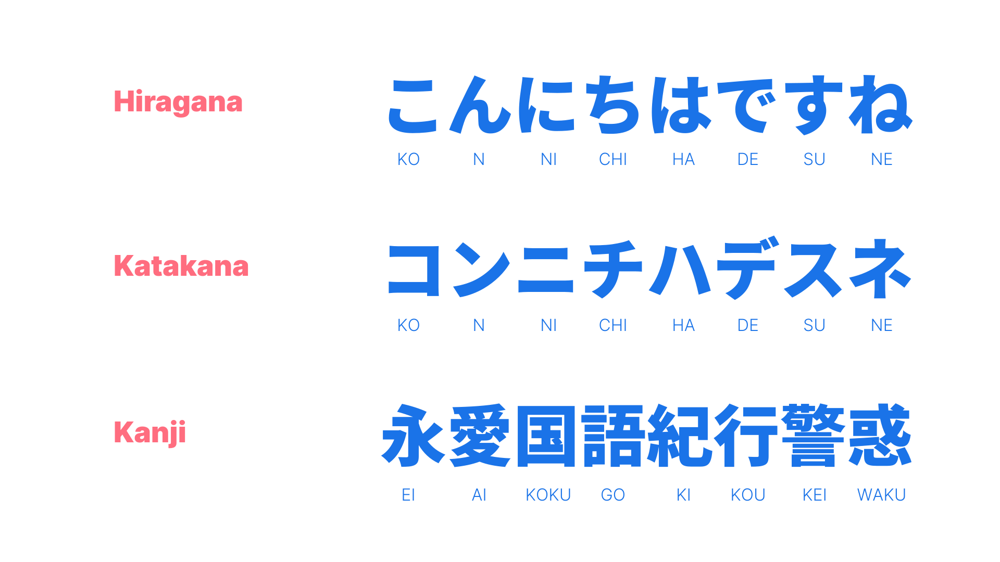
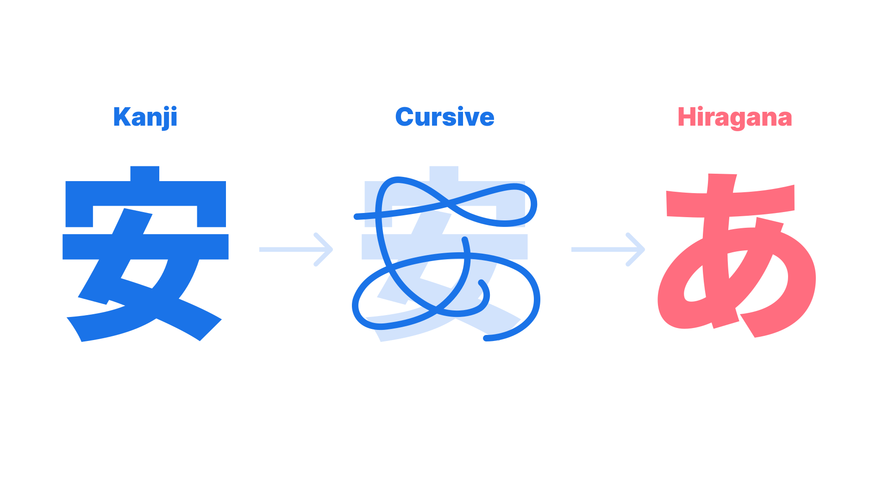
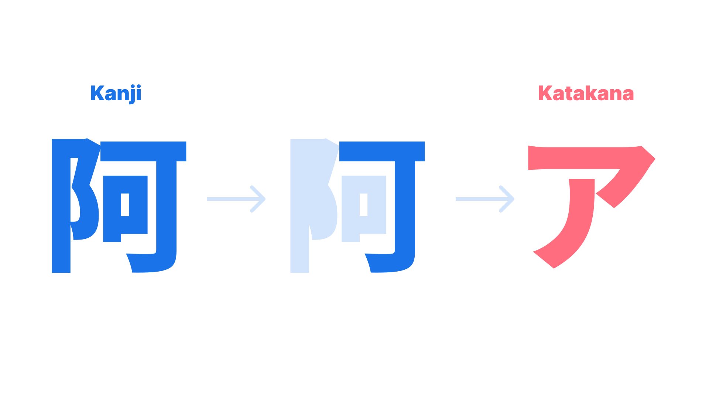
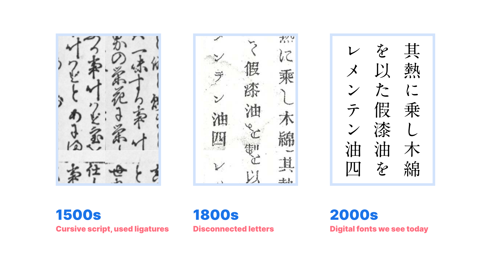
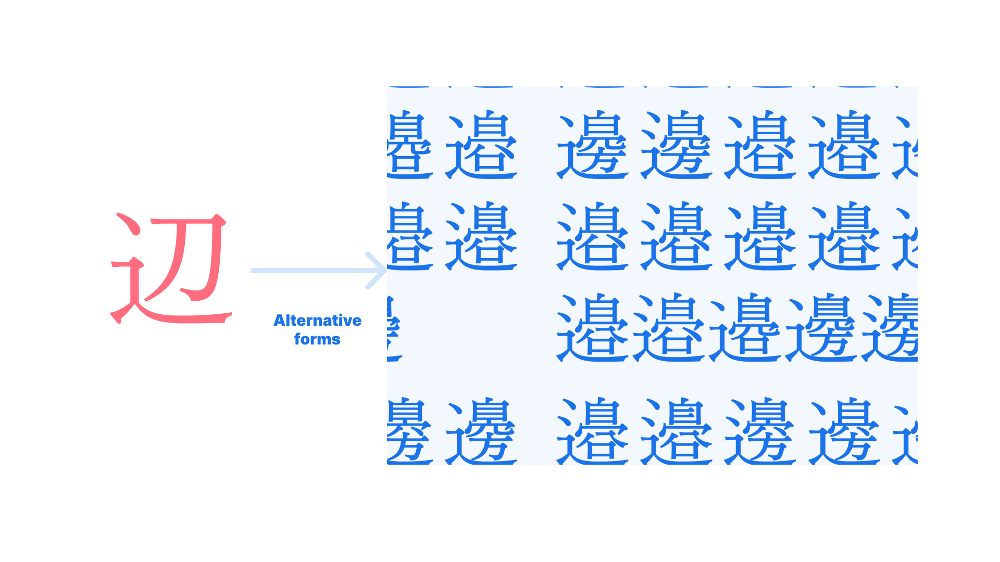
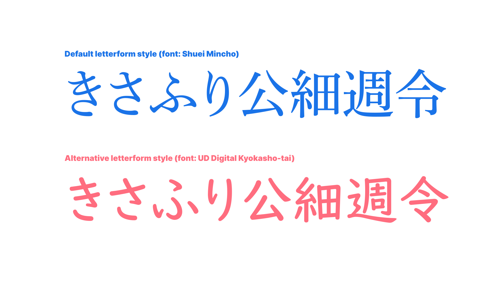
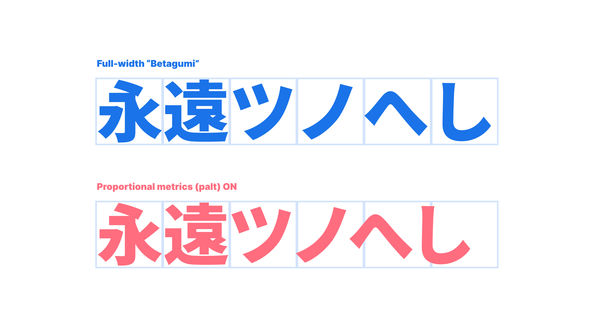

A lot of [writing systems](/glossary/script_writing_system) in the world use one script per language. But that’s not the case in Japan: When you write a sentence in Japanese, three different scripts can be used: _Hiragana,_ _Katakana,_ and _Kanji,_ a Japanified version of Chinese characters. And if you’re trying to develop a Japanese [typeface](/glossary/typeface), you also need to include the [Latin](/glossary/latin) alphabet and [figures](/glossary/numerals_figures), too. Japanese is the only script among [CJK](/glossary/cjk) that uses multiple scripts to form its language. 

So how did it become such a melting pot of scripts? And what kind of unique aspects does Japanese have?

<figure>

</figure>

## Development of Kana

Hundreds of years ago, Japan used Chinese characters to communicate in written form, as did many other Asian countries. Some time around the 8th century, Japan started to use a Japanified version of Chinese characters, which is now called _Kanji._ In some cases, Chinese characters were converted into a Japanese sound, and in others, Kanji was used as an ideogram to communicate the context. Around the 9th century, _Hiragana_ and _Katakana_ were invented. Together, they are called _Kana._

_Hiragana_ is a simplified version of _Kanji_—it uses simple curvy lines to write Kanji easier. It started as a cursive script of Kanji, and later became the Hiragana letterform we use now. It was developed among women at first, because many women didn’t have opportunities for education, and were not allowed to work in official positions, which required the use of Kanji-based writing. Hiragana was such a huge creative development, and later it became more popular, regardless of gender and social status. It is now a main script for Japanese.

<figure>

</figure>

_Katakana,_ on the other hand, was developed in a different way. It’s an alternative form of _Hiragana,_ and in modern times it’s often used to write foreign words. Katakana is also a simpler form of Kanji, but the difference from Hiragana is that while Hiragana simplifies the whole Kanji, Katakana takes only a part of Kanji and makes it into a new character. 

Katakana was created by monks—they needed an easier and less packed form of letters for their scriptures to write Ruby (small text written above Kanji or foreign letters to indicate phonetics or pronunciations in Japanese) next to Kanji. 

<figure>

</figure>

## Why use Chinese characters, or “Kanji”, in Japan?

In Korea, the usage of Chinese characters are fading away, with most people only using Hangeul. So why does Japan still use Kanji?

The important thing we must not forget is that Hiragana and Katakana are phonograms, and Kanji is an ideogram. Japanese words have many homonyms—words that sounds the same but mean completely different things—so, by using Kanji, it helps a lot in avoiding miscommunication. Also, Japanese doesn’t have a word spacing system, so without Kanji, it would be very hard to figure out where to cut the sentence. Also, by using Kanji in between, the sentence will be much shorter, too. 

## Development of the letterform

Before metal typesetting, Japanese was written in a script style due to the use of pointed brushes. This meant that Hiragana was written in unbroken forms—in other words, every character was written connected, much like Latin calligraphy. When Japanese printers first started using the metal type in the 1500s, their Hiragana types had two or more characters together in a single block of type—much like Latin ligatures. In the 1800s, after the seclusion policy in Japan was lifted, they imported Chinese metal type, which had one letter on each block, and Japan adapted to this by developing disconnected Hiragana and Katakana that fit in the em square. 

<figure>

</figure>

And there’s more: an _alternative Kanji_. Some of the Kanji characters have several slightly different forms for the same meaning, but different usage. Alternative Kanjis have many names—“old forms” and “new forms,” “Gakusan” (meaning for educational purpose), or systematic names given by JIS (Japanese Industrial Standards).

There are a couple of reasons for using alternative Kanji. As written above, Kanji and Kana had a long journey of transformation over centuries, and as we transfered from analog manuscript to incunable to phototypesetting to digital fonts, some Kanji characters were accidentally drawn wrong, or developed in a few different forms, which ended up with alternative Kanji. In this case, it’s mainly used for names of people or place, or on some publications they prefer the old letterform alternative Kanji on purpose. The Kanji 辺 has 23 alternative forms! (When using a font with Adobe-Japan 1-6 character set.)

<figure>

</figure>

Kanji letterforms in typefaces are not the same as how we hand-write; letterforms were optimized to make them fit metal type designs. However, its simpler structures and elements are not the best to learn the anatomy of Kanji—especially for beginners. To resolve this, the Japanese ministry of education provides guidelines to follow an alternative letterform, and this also includes very few Kana. These alternative letterforms, sometimes called as _Gakusan style,_ are designed with brush-like elements and expressions, known as a [humanist](/glossary/humanist_old_style) style in Latin. These design details allow readers to see more familiar Kanji forms and may enable children to learn Kanji more easily. 

<figure>

</figure>

## Tsume and Proportional Metrics (palt) 

Although Japanese fonts are designed full-width, some characters inevitably end up having more whitespace on both sides of the letter. This is because Japanese Kana used to be written vertically, so both the letter width and height varied. Therefore, when typesetting, especially in the narrow textbox, the line would appear jagged due to the inconsistent whitespace. To resolve this problem, Japanese typography uses its own setting called _Tsume,_ or _Proportional Metrics_ (`palt` in [OpenType](/glossary/open_type)), instead of tracking or kerning.

<figure>

</figure>

Tsume enables the font to tighten its typesetting. The difference between Tsume and kerning is that Tsume shrinks the whitespace on both sides of the letter, while kerning goes in between two letters. Tsume values are defined by the type designer when designing the font, and users can’t set their own value. Some Japanese type foundries are updating their flagship fonts with Japanese kerning values in addition to the Tsume. Tracking is rarely used. “Betagumi” typesetting is also very popular—it means block typesetting, with no Tsume or kerning.
