Typefaces have various classification categories—from sans serif, serif,rounded, to old-style, humanistic, geometric, and so on. Do these classification all equally apply to other scripts too? We must expect no, because each script has its own culture and these classifications were made based on Latin typefaces. 

Then, what is it like in CJK?

In Japan and Korea, they use the same word—but different phonetics—for serif and sans serif. Mincho (J) and Myeongjo (K) for serif, and Gothic for both J and K. For the past couple of decades there have been few trials in Korea to create Korean-original words for serif and sans serif, such as Batang and Buri for serif and Dotum and Minburi for sans, but still Myeongjo and Gothic remains the popular choice. 

In China, the situation is a little different. They call the serif Song Ti (宋体), or sometimes Mingchao Ti or Ming Ti (明朝体 or 明体) to go together with the Japanese and Korean names, and sans Hei Ti (黑体). 

In terms of type classifications, Japanese and Korean have more similarities than with Chinese. All CJK fonts also have display style as one of the classifications, but in Japan and Korea they call the display fonts “design fonts”, and in China “decorative fonts.” 

## Chinese type classification

The categories in Chinese type classification can be seen as a set of names from the most popular styles that appeared throughout Chinese type history all the way to our contemporary times. Even with the digital technologies, and the multiple mechanical printing techniques that came a bit earlier, there is (and has been) always a strong connection to hand written calligraphy. Thus, Chinese typeface categories with styles related to calligraphy are still popular even today, due to the very nature of the characters (more organic than mechanical). Styles that are less linked to calligraphy appeared very late in history (first with woodblock printing with Songti and Mingti), as ways to respond to the needs of their time and follow the contemporary trends (Yuanti and Heiti).

Note: As Chinese type evolved for most of its history independently from that of Latin, the groups or styles are different, as isthe impression given to users of the few that may look alike. 

Chinese (digital) type classification can be presented in seven categories, from the most “traditional” style to the most “modern”, here are the major categories:

### Kaiti (楷体), also called “Regular style”

Kaiti style is related to the calligraphic Regular Script (楷书), with “regular” denoting “official” or “formal”. Regular Script is the last calligraphic style that appeared in the history of Chinese calligraphy (around the 7th century). Other than carrying the movements of the brush (traditionality, warmth, liveliness), it is a separate category to the Handwritten one because Kaiti styles obey a number of proportions and details that make it more “standardized”.

<figure>

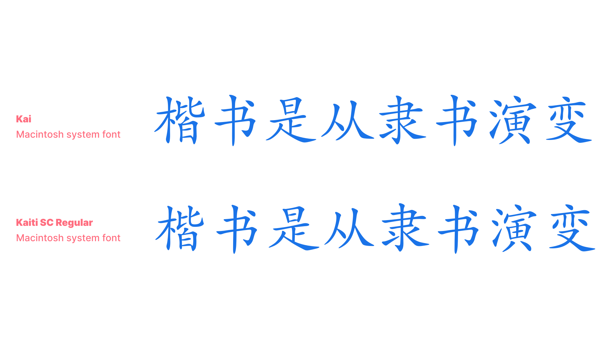

</figure>

Handwritten style or Cursive style (手写体, 行书)

Typefaces with a handwritten style in Chinese can vary significantly depending on the tool influencing the shapes or the speed of the movements. 

<figure>

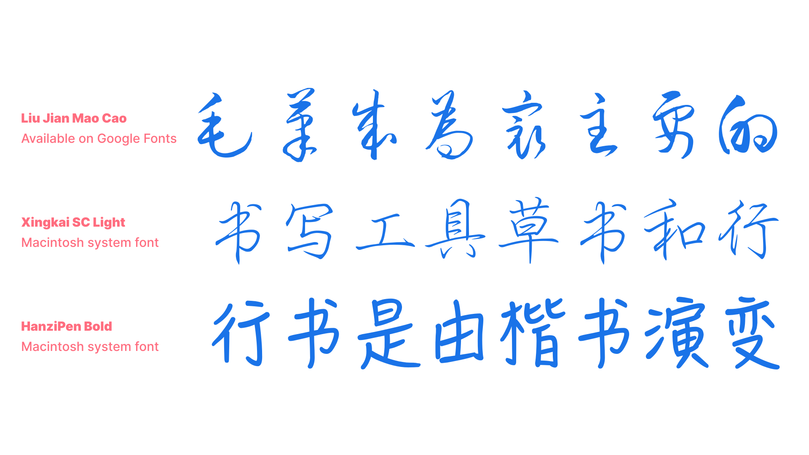

</figure>

### Songti (宋体)

Songti style typefaces have design features made to be fit for woodblock carving (straight lines, diamond shaped serifs, accentuated contrast). It was the dominant style used for woodblock printing, which was the main technique used for Chinese printing since the Song dynasty (960–1279) all the way until the Ming dynasty (1368–1644). As it is the style used for the biggest part of Chinese typography history, it is the most familiar and popular one for texts, even today. 

<figure>

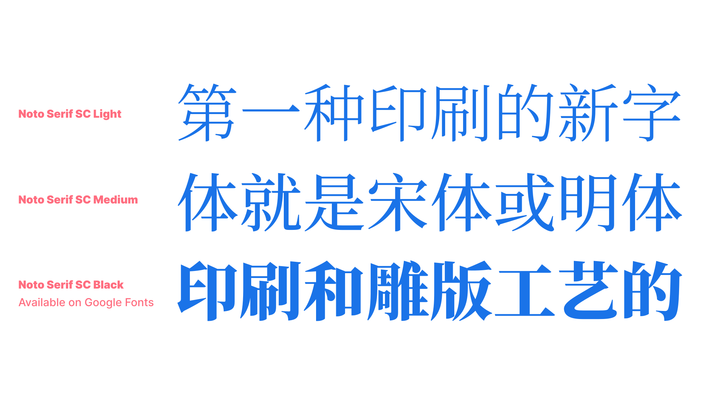

</figure>

### FangSongti (仿宋体)

FangSongti means “pseudo-Songti”. It is a style derived from Songti, but with slightly more movement than its precursor (subtle slant of horizontal strokes, sharper serifs and endings, stiffer curves), and is most often usedfor classical editorial usage as of the last couple of decades.

<figure>

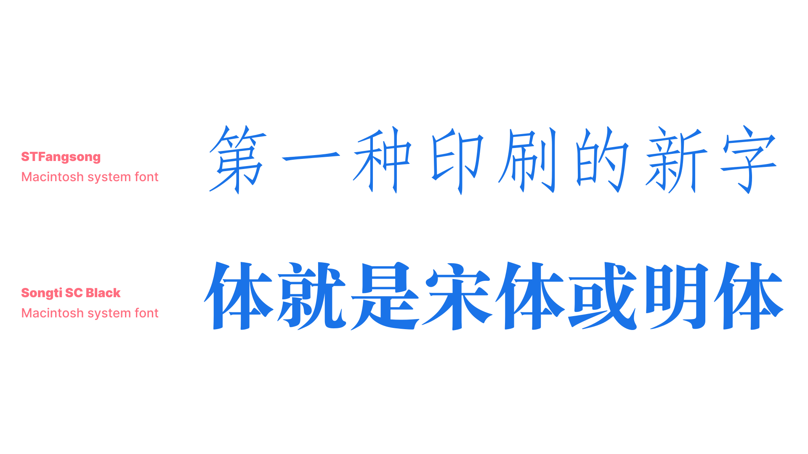

</figure>

### Heiti (黑体)

With 黑 [hei] meaning “black” or “dark”, and 体 [ti] meaning “style”, this is the equivalent of the Sans Serif in Latin script. The first Heiti typefaces appeared recently in Chinese type history (very early 20th century), with the influence of typefaces imported from Europe. Contemporary digital designs made Heiti one of the most popular styles in the digital realm.

<figure>

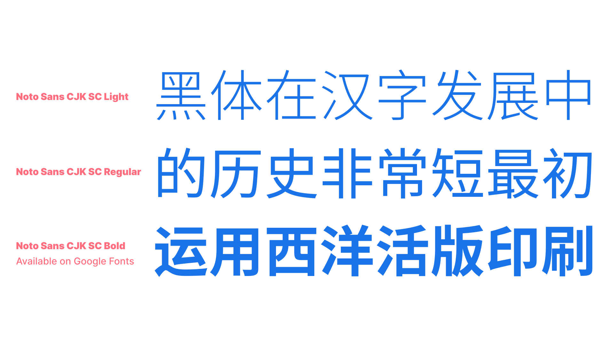

</figure>

Yuanti (圆体) is a sub-group of Heiti, because even though it is a rounded style (rounded tips and corners), it is the only other style without any serifs.

<figure>

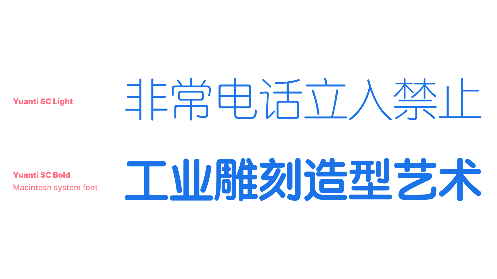

</figure>

### Decorative or Artistic (展示体, 美术体)

This category can be related as “Display” or “Titling” styles in Latin, with all kinds of playfulness, personality, and quirkiness allowed by the versatility of Chinese characters (remember that it is an organic writing system first!).

<figure>

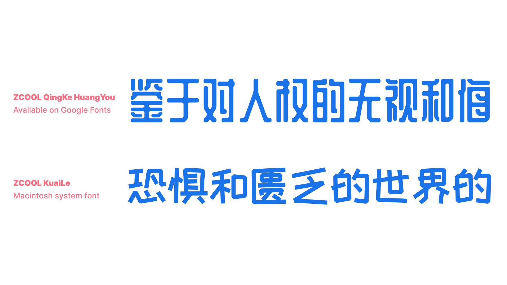

</figure>

### About the names: 

You might have noticed how some names start the same but end up with either “-ti” or “-shu”. In Chinese, 书 [shu] means “calligraphic style” in the context of 书法 [shufa] for calligraphy. And 体 [ti] means “typographic style” in the context of 字体 [ziti] for typography. A typographic style is very often named after its calligraphic style, or contains a reference to its style directly in the name. 

## Japanese type classification

When you learn Latin typography, there’s a basic history of the classification development: old-style serif, transitional serif, didone, slab serif, grotesque sans serif, humanist sans serif…and so on. 

Usually the word “modern serif” in latin typography refers to a classification called _didone_, such as Bodoni and Didot. However, in Japanese typography, the definition of modern serif is a little different. Let me explain from an old-style serif, which is a core and starting point of type classification development.

<figure>

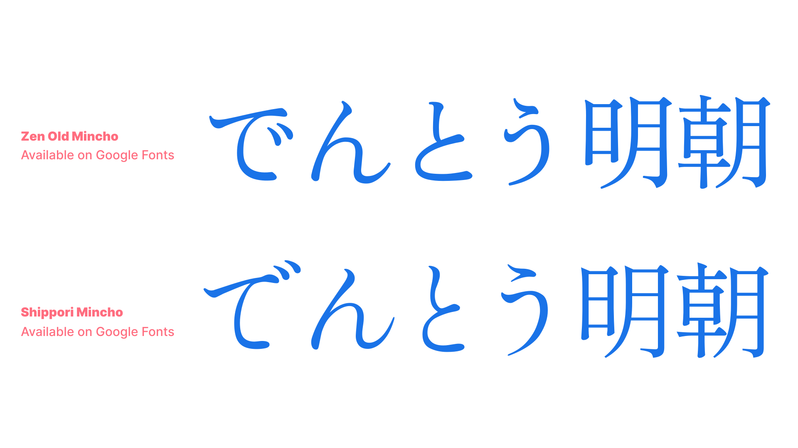

</figure>

The very first Japanese metal type was designed as old-style serif, and this makes very much sense because they used traditional east Asian brush for writing until then, and the letterforms were easy to apply to serif designs. 

The characteristics of traditional Japanese old-style serif has a lot in common with old-style serif in Latin. Small delicate counter and letter size, elegantly lingering brush strokes—but not too much that it becomes script design than serif—, and organic natural curves.

<figure>

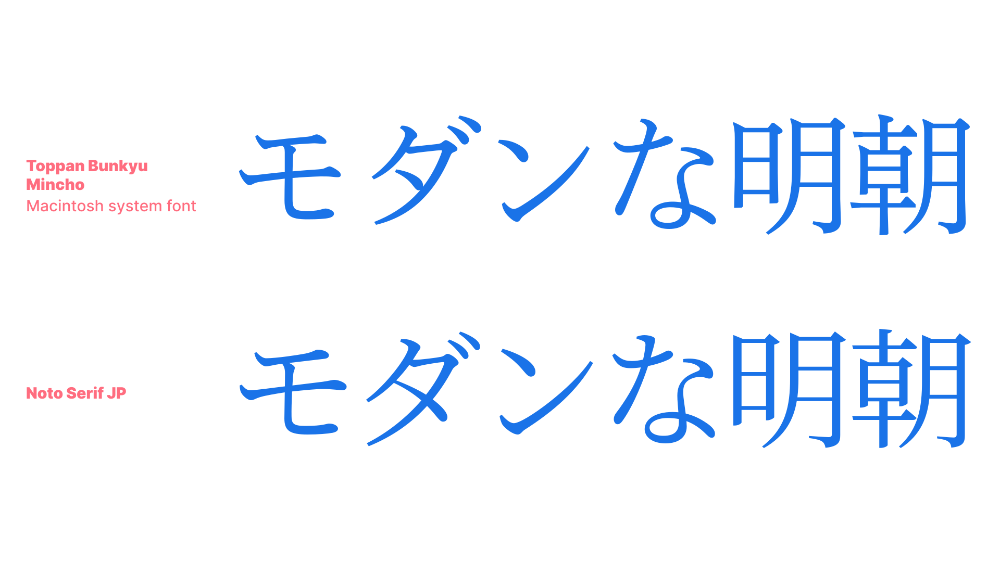

</figure>

Modern serif classification in Japanese typography is on the opposite side from the old-style serif. It has relatively large and dynamic counter and letter size, simpler strokes, clean elements, and sometimes low contrast between vertical and horizontal strokes. For example, Noto Serif JP, while it respects the traditional letterform, is designed with low contrast and distinctive elements with wider counters to have better readability on screen devices.

<figure>

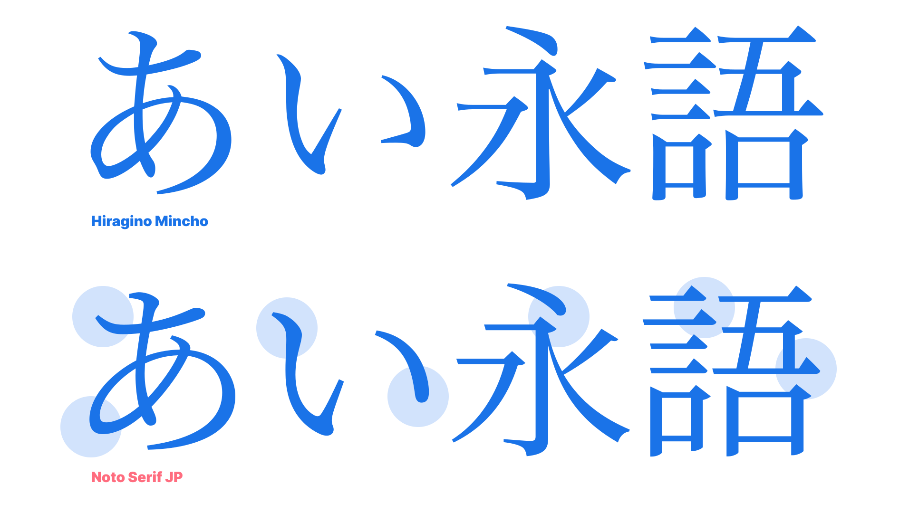

</figure>

Definition of old-style and modern for sans serif goes the same as serif, but for modern style, there are two kinds of interpretation. Humanistic modern san serif, which is a popular style for Latin and other scripts too, and the other is more systematic and geometric sans serif. Let’s see the difference.

<figure>

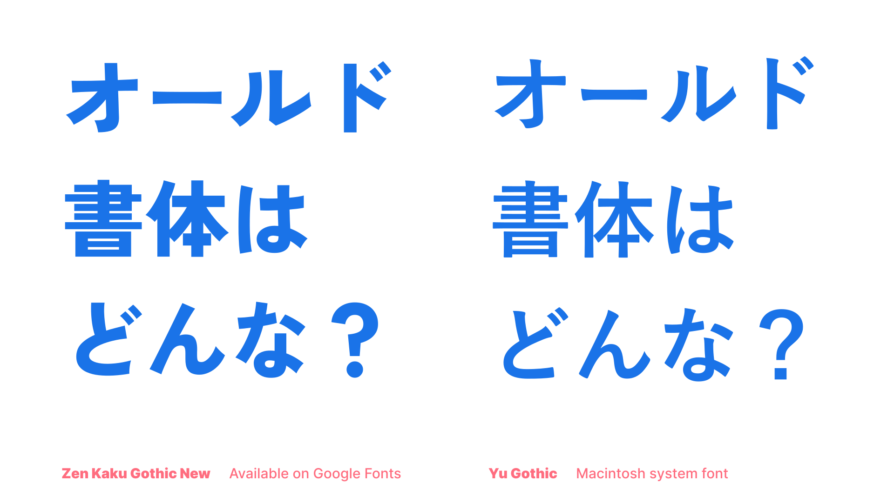

</figure>

<figure>

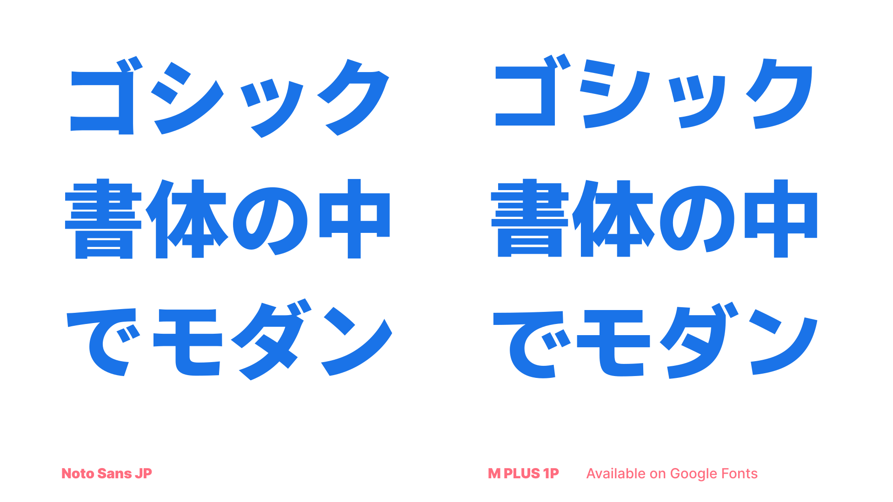

</figure>

As we covered earlier, Noto JP pursues modern elements and strokes while honoring the traditional letterform, which in sans serif is applied as humanistic design. If you look at M Plus 1p on the other hand, the counter is prominently larger and the movement of strokes are more systematic. It is not strictly geometric all the way in terms of the circles and curves, but has a nuance of systematic structure.

## Korean type classification

The basic type classification of serif and sans for Korean has a lot in common with Japanese, but since Korean letterforms are fundamentally geometric and has less variety of circular curves than Japanese, the characteristics to look when understanding the classification is a little different.

Korean old-style serif also has small counter, but not always the small letter size. However, the strokes could be more brush-like and lingering, rather than systematic modules. The unique part is, although usually old-style serifs in Latin and Japanese would have humanistic brush strokes, because it is developed from the brush writing, Korean old-style serif is the other way around—it follows the original geometric letterform of the Hangeul from Hunminjeongum. (_For more story, go to **The Design of Hangeul** by Darrell Penta)_

<figure>

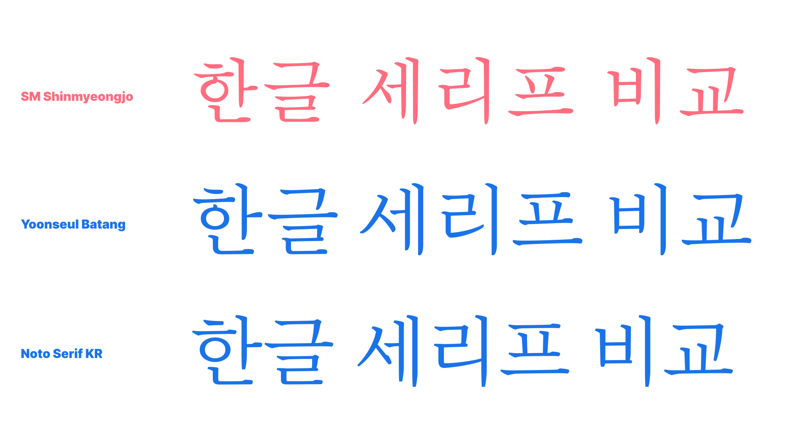

</figure>

Modern serif in Korean could have several different characteristics. Noto Serif KR is a classic modern serif, with humanistic letterforms and distinctive elements. Nanum Myeongjo is a more unusual modern serif with stiff and large elements than Noto Serif KR. Even though the typeface has strong uniqueness, as long as the typeface remains text usage, it is considered as a modern serif, not a display.

The sans serif classification of the Korean is more of a development of the design rather than a classification category.

Typical old-style Korean sans serif will have full-width square letterform and each component has a wider range of different sizing to forcibly fit to the square form. 

<figure>

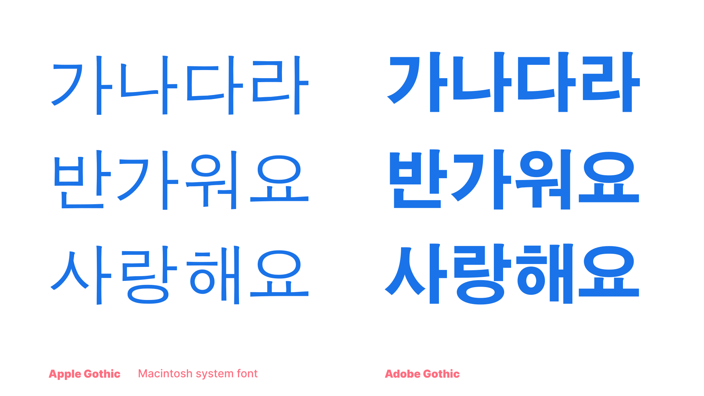

</figure>

Modern sans serif, or any sans serifs designed and released in the past couple of decades, has narrow letter width between 850–970 units (85–97%), for smoother reading experience and solid typography. The components are not forcibly stretched too much or stuffed in; instead the sizing of components change within a sensible range to respect the original form of the Hangeul component, while keeping monospaced letterform. 

<figure>

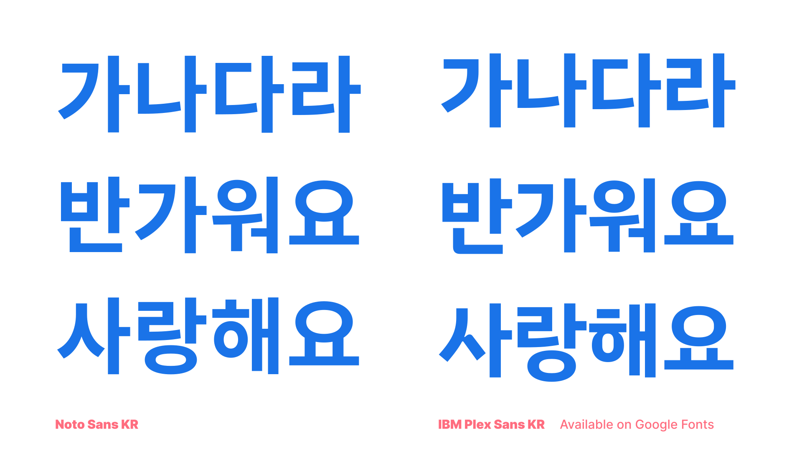

</figure>

Most Korean fonts are monospaced by default, but very rarely there are also proportional and kerned sans serif. Also, there are Korean-only classification called “Talnemo,” meaning out-of-the-box or non-square, and is also a proportional and kerned Korean type classification. (_**Type Development of Hangeul **_for more detail)

<figure>

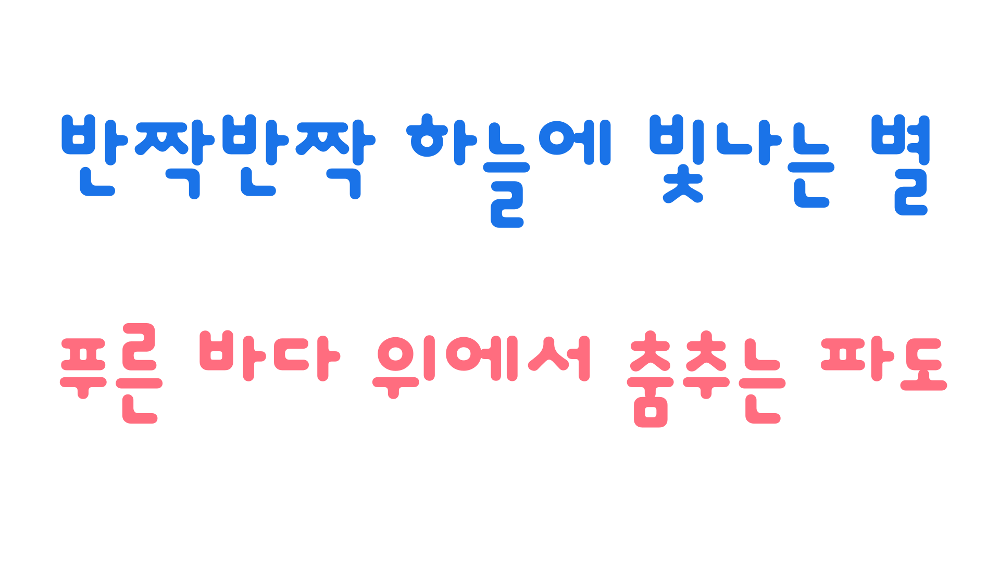

</figure>
