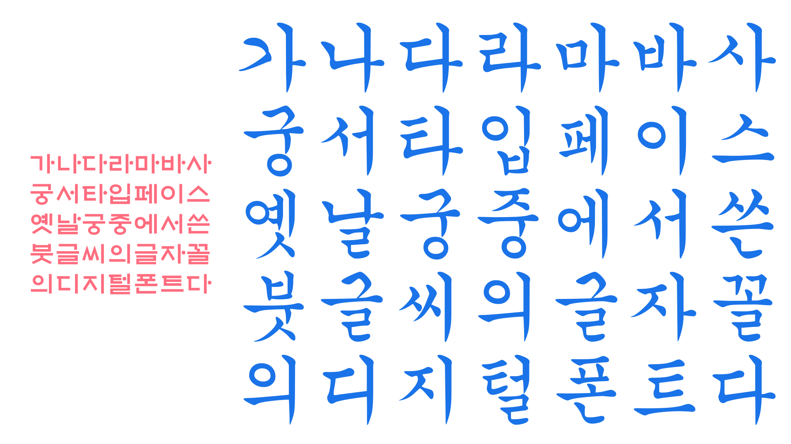
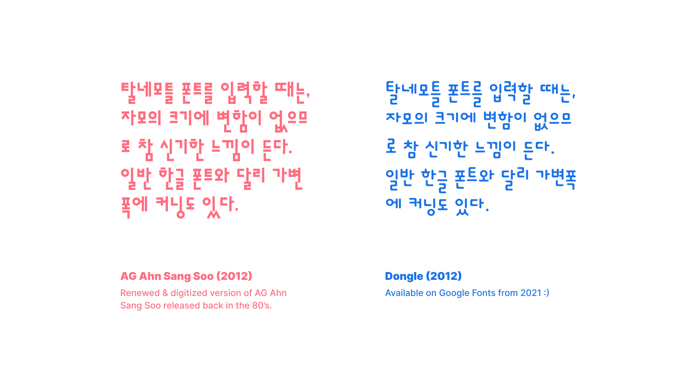
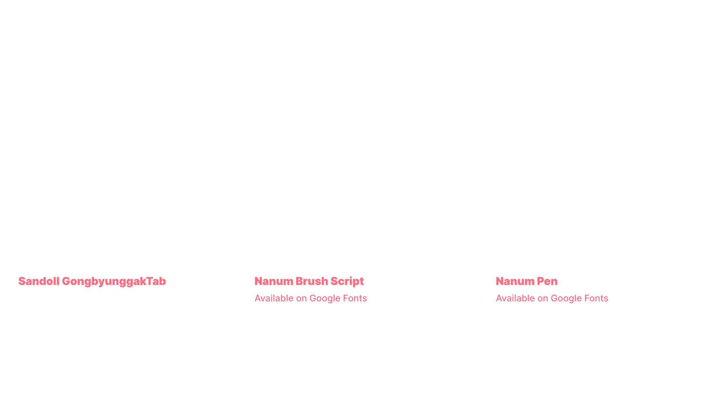

Hangeul, the Korean script, was created in 1443 and published in 1446. Until then Korea borrowed Chinese characters to apply them on Korean sounds, same as Japan did (**_Japanese Type Anatomy for more stories on Japanese_**). 

## Sans serif from the beginning

<figure>

</figure>

While Latin and Japanese developed its type design from brush and pen based letterforms, Korean was developed completely the other way around.

The design of the first Hangeul published in 1446 is already in a sans serif style with rounded elements. This is where the type development of the Hangeul starts. King Sejong, the director of the Hangeul creation, intended this design for citizens to be able to learn the new script easily by drawing on the ground with a stick. (_For more story, go to **The Design of Hangeul** by Darrell Penta)_

However, after Hangeul was widely spread in the country, the letterforms naturally developed into script style with a use of pointed brush, and this style is called “Gung” in Korean. The name Goong-chae means “the typeface for the palace,” because the style was popular among the people in the palace. And this script type goes on for a long time before the Korean serif style was designed by the type designer Kyungseo Park and Jeongho Choi in the 1900s.

<figure>

</figure>

Gungseo font in Mac system, designed to express the Gung style back in the 16th century

Although Jeongho Choi defined the Korean serif style that is now, Kyungseo Park built the important structure of the Korean serif. Jeongho Choi also designed a lot of Korean serif typefaces for the type foundries in Japan, and his designs are still a huge inspiration for many type designers in Korea.

<figure>

</figure>

<figure>

</figure>

## Non-square style

In the 80s, type designers started to experiment with the font. Sangcheol Lee and Sang-soo Ahn designed a “non-square” Hangeul font called _Saemmulchae_ and _Ahn Sang Soo chae_, and Ahn received the Gutenberg Prize later in the 2000s for his work. Most Hangeul fonts back then were only designed to fit in the embox, or “square,” and monospaced, but these non-square typefaces were fully proportional and “out of the box,” and it broke the stereotype that the Korean type design had until then. The non-square structure also gives efficiency on type designing, since it doesn’t have to be fit in the box, components could be reused instead of adjusting and squishing. It soon became the new unique classification that is Korean-only, and various designers also started to design non-square fonts.

(**_CJK typesetting rules _**for more detail about CJK monospaced and full-width fonts)

<figure>

</figure>

## Fast trend and various type design trials

In the 90s and early 2000s, the first generation of social media and blogs were in a big trend, and Korean type foundries found a new business opportunity in it. Several social media services back then in Korea started to sell fonts that you can apply on your blogs or phones. Some fonts called Action Font had GIF-ish movements which made them more special for web usage. The social media trend back then didn’t survive till today, but the culture of choosing fonts just for your phone remains, even globally.

Another Korean trend in the early 2000s is the handwriting fonts. Most of movie posters and book covers had handwritten style letterings, and the trend went on long for several years. Because people were fond of handwritten style so much, type foundries started to commissioned professional calligraphers to design handwritten style fonts that are casual and pop. 

<figure>

</figure>

From the late 2000s, the trend of retro type movement kicked in, and took over the movie posters and book covers instead of handwritten fonts. The definition of retro type is brief—something that feels old but stylish, nostalgic but new somehow, looks rough but also executed gently. Retro types gave a familiar and friendly atmosphere and these fonts were used in various scenes everywhere from restaurants to pickets.

<figure>

</figure>

In this past decade, the biggest change in Hangeul type design is letter width. Hangeul fonts are designed to fit in the embox and monospaced by default, except for the “non-square” fonts, which meant that Hangeul glyphs had 1000 units for the letter width. However, because Hangeul is a composition letter of syllable blocks, when the block has as many components as possible, the letter is likely to pile up. Inevitably, some characters would look squished down. By slimming the letter width, the letters would look slightly narrower, resulting in a smoother and smarter reading experience. Most Hangeul fonts designed and released now have narrow letter width around 850~950 units, including Noto Sans KR.

## And next

Hangeul was created in 1400s, and the first Korean serif was designed in 1900s, which are both fairly later than other scripts. Both the Hangeul type design and typography are still growing, and there are so many potentials and possibilities that are waiting to be tested. In the near future, we might have to revisit and redefine the type development of Hangeul with new history written.
