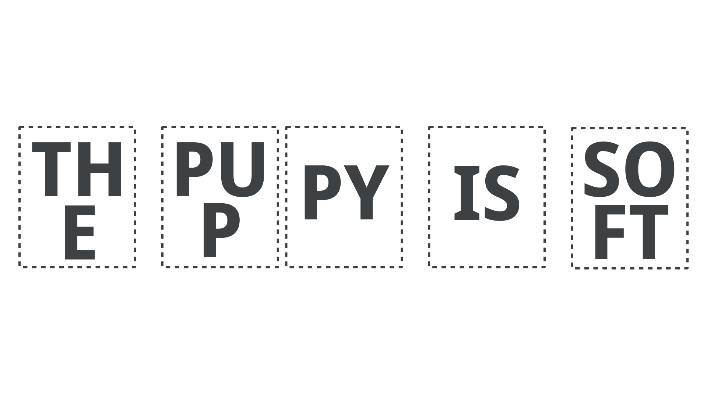
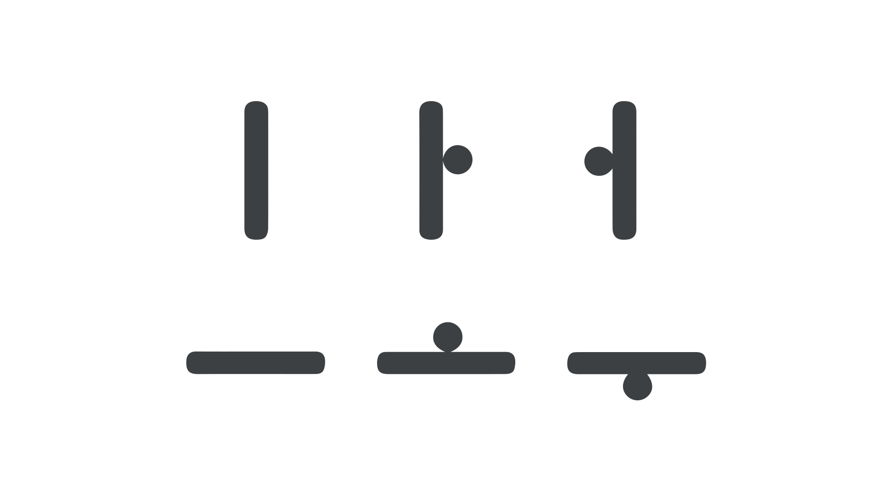

Korea during the reign of King Sejong (1418—1450 CE) was similar to nearly all other literate societies throughout history in that learning and using an [alphabet](/glossary/alphabet) was a privilege reserved for relatively few people.

As a consequence, alphabets have rarely been designed or optimized to make reading and writing easier.

In designing Hangeul, however, King Sejong found several opportunities to improve the user experience for both of these activities, reflecting his intention to make the Korean alphabet as user-friendly as possible.

## Syllable blocks for readers

Alphabets can differ not only in terms of the designs and functions of individual [letters](/glossary/letters), but also in terms of how the letters are combined to capture human speech.

For example, as you’re reading this sentence in English, you’ll recognize that the letters are placed one after another, with [spaces](/glossary/spaces) and punctuation used to demarcate word boundaries.

While these [orthographic](/glossary/script_writing_system) conventions may seem intuitive for those who are literate in English, other alphabets use a variety of approaches when combining letters into larger units.

When considering how the letters of Hangeul should be combined, King Sejong ultimately decided that they should be assembled into syllable blocks, with one block equal to one syllable for any word.

To offer an oversimplified explanation: A typical syllable block contains a consonant letter placed at the top-left of the block, followed by a vowel letter placed directly to the right or below it, which is followed (where needed) by another consonant letter placed at the bottom of the block.

<figure>

</figure>
<figcaption>An example of the English sentence, “The puppy is soft,” using a syllable-block approach.</figcaption>

The use of syllable blocks has several benefits for the reader.

In one reading experiment, for example, researchers found that American university students enrolled in Korean language courses, from beginner to advanced levels, had faster reading times when Hangeul phrases were presented with letters in block format versus a linear format (i.e., one letter after another, as in English) (Kim & Sohn, 1986).

More generally, syllable blocks may help facilitate a readers’ word processing abilities by making a word’s syllable count more obvious.

The reason why this matters for reading is because, as users of language, we mentally keep track of everything we know about a word, including its syllable count, and we rely on this kind of information to help us recognize words during reading.

For users of the English alphabet, syllable information is hardly obvious (except, perhaps, for short, one-syllable words), and the number of letters in a word is not a reliable indicator of syllable count.

For example, *technology* is a 10-letter word with four syllables; *compassion* is a 10-letter word with three syllables; and *blacksmith* is a 10-letter word with two syllables.

Among other potential advantages, Hangeul’s syllable blocks therefore provide readers with a simple yet effective way of gathering syllable information during reading, which reduces the cognitive demands on the user.

For writers, King Sejong was no less innovative in incorporating usability into his designs.

<figure>

</figure>
<figcaption>Three Korean words of 2, 3, and 4 syllables shown with their corresponding English translations, each with 10 letters but with varying syllable lengths.</figcaption>

## Efficiency for writers

Given the convenience of technology, many of us are likely to spend more time writing with a keyboard or keypad than with a pen and paper.

Throughout history, available technologies have directly influenced how alphabets are written—from a stylus pressed into clay for writing Sumerian in the 4th century BCE, to the brush, ink, and paper used for writing Chinese (by 100 BCE).

During King Sejong’s lifetime, writers followed in the Chinese tradition of using brush, ink, and paper. With the use of these tools as a natural constraint, King Sejong appears to have considered the relationship between the effort required to produce a brush stroke, and the frequency of the letter being written.

Specifically, he designed Hangeul so that the most frequent vowel sounds are produced using a vertical stroke, while less frequent vowel sounds are produced using a horizontal stroke.

<figure>

</figure>
<figcaption>Three high-frequency Korean vowels constructed from vertical lines are contrasted with three low-frequency vowels constructed from horizontal lines.</figcaption>

According to some scholars (e.g., Lee, q997), because it’s easier to move our fingers vertically than horizontally (whether using a brush or other similar instrument), less effort is required when producing vertical versus horizontal strokes.

By reserving easier strokes for the most frequent vowels, King Sejong found a thoughtful way of addressing the needs of the writer.

Such insight may seem inconsequential in the grand scheme of things, but taken together with the many other innovations of Hangeul, it provides additional evidence that the Korean alphabet was designed with a genuine focus on meeting the needs of the people who would use it.

### References

- Kim, C. W., & Sohn, H. (1986). *A phonetic model for reading: Evidence from Korean.* Studies in the Linguistic Sciences, 16(2), 95--105.
- Lee, S.-O. (1997). Graphical ingenuity in the Korean writing system: With new reference to calligraphy. In Kim-Renaud, Y.-K. (Ed.),*The Korean alphabet: Its history and structure* (pp. 107-116). University of Hawaii Press.
