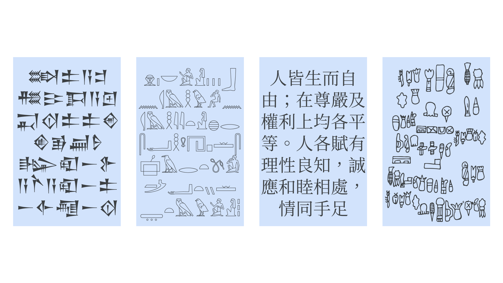

In most societies throughout history, the ability to read and write was an exclusive privilege of the elite, who wielded literacy as an “instrument of social control” over the non-literate population of common people (Coulmas, 1989).

In the mid-15th century, King Sejong the Great of Korea publicly expressed his distress with this imbalance of power, recognizing that, without literacy, the majority of his country’s citizens had no way to advocate for themselves.

Despite being at the top of the power structure in Korea, King Sejong was determined to solve this problem by designing a revolutionary [alphabet](/glossary/alphabet), called Hangeul (See [A Note About Terminology]).

By modern User Experience (UX) standards, Hangeul might be the most user-friendly alphabet ever created, and it’s surely the only one to have been purposefully designed with a systematic focus on usability.

As we’ll see throughout the course of several articles, Hangeul reflects King Sejong’s profound desire to overcome the design flaws that are inherent to most other alphabets, making him one of the first genuine UX practitioners in history.

## Where do alphabets come from?

Scholars have long recognized King Sejong’s alphabet for its technological innovations—it’s even been called ”one of the great intellectual achievements of [humankind]” (Sampson, 2015).

It’s not simply the number of innovations or the degree of innovativeness reflected in Hangeul that makes it so remarkable; rather, it’s that it is innovative at all.

In fact, as a species, we’ve been surprisingly unimaginative when it comes to our alphabets.

Since the invention of writing in Mesopotamia more than 5000 years ago, there have only been maybe three other occasions in which a culture independently invented an alphabet on its own.

<figure>

</figure>
<figcaption>A montage of texts written in Sumerian, Egyptian, Chinese, and Meso-American [scripts](/glossary/script_writing_system), intended to show the our species’ creativity and ingenuity in devising alphabets.</figcaption>

All the world’s subsequent alphabets have, at a minimum, been informed by these early examples, and nearly all have been direct adaptations.

From a sociocultural standpoint, the adaptation approach has enormous benefits: For any pre-literate society, adopting an existing alphabet from another society means gaining access to a transformative technology, more or less for free.

However, because no two languages are identical, adaptation isn’t a plug-and-play process. To account for linguistic differences, our ancestors have routinely found it necessary to make changes to the form and function of their adapted alphabets.

In most cases, these changes make the modified alphabet functional, but still imperfect. King Sejong acknowledged as much in *Hunminjeongeum*, the document in which he formally describes Hangeul, explaining that the modified Chinese writing system traditionally used in Korea was not well-suited for representing the Korean language. (Korean and Chinese belong to different language families and bear little structural resemblance to each other.)

Of course, history tells us that the inconveniences of using an imperfect alphabet don’t ordinarily result in a total redesign. So what was different about King Sejong?

## The need for a new alphabet

In essence, King Sejong recognized that legacy writing systems, no matter how modified they are, have a critical usability issue: They take a long time to learn.

This wasn’t an issue that negatively affected the aristocracy, who had all the resources to become functionally literate. Rather, to those in power in Korea and in other literate societies, this actually worked to their benefit, which is why they had little incentive to make alphabets easier to learn.

But King Sejong knew that his intended audience of common people had little time and leisure for learning.

Thus, to realize his grand and radical vision of bringing literacy to the masses, he knew that he would need to devise an alphabet unlike any other—one that put the needs of the user first.

In the next article, we’ll explore how rose to meet this challenge.

## A note about terminology

For the sake of simplicity, I refer to all [writing systems](/glossary/script_writing_system) as [alphabets](/glossary/alphabet), and to the graphic symbols of writing systems as [*letters*](/glossary/letters), even in cases where these terms are technically incorrect.

My goal in doing so is to illustrate the story of Hangeul without having introduce too much linguistic terminology, especially because the main ideas I’d like to share do not depend critically on making distinctions that might otherwise be important to scholars.

For thoroughness, however, I’ll note here that Hangeul is commonly called an alphabet, but it could more accurately be described as a *featural* writing system (and, in fact, may be considered the first such writing system of its kind!).

### References

- Coulmas, F. (1989). *The writing systems of the world*. Blackwell Publishing.
- Sampson, G. (2015). *Writing systems* (2nd ed.). Equinox Publishing.
