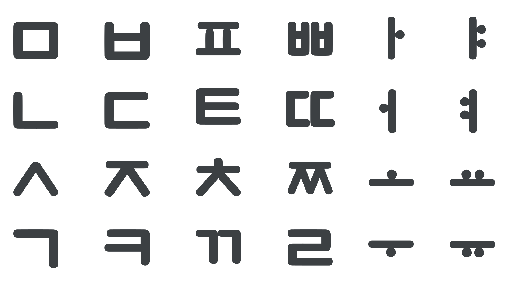
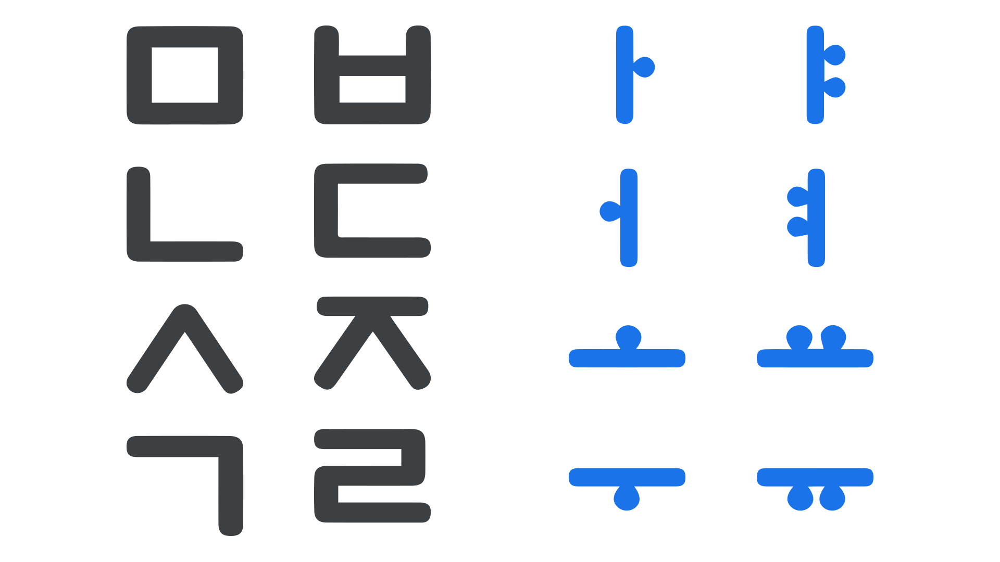

Nearly 600 years ago, King Sejong the Great of Korea undertook a design challenge for which there was little precedent in human history: He set out to create a new [alphabet](/glossary/alphabet) for the common people of his nation.

Working against King Sejong was the reality that alphabets take significant time and effort to learn, even under the best conditions. While the privileged members of society had ample time and opportunity to become literate, the vast majority of citizens had no such advantages.

Therefore, rather than simply creating a new alphabet, King Sejong understood that realizing his vision of mass literacy would depend on creating an alphabet that could be learned quickly and with minimal effort.

## Making information helpful

Learning any alphabet is difficult, in part, because it requires learners to memorize the associations between the alphabet’s [letters](/glossary/letters) and the sounds or other parts of language that they represent.

Contributing to difficulty is that these associations, along with other design features of alphabets, tend to be rather arbitrary.

Learners of the English alphabet, for example, come to understand that the letter *S* corresponds to the sound “S,” but there’s nothing special about this particular letter that makes this relationship obvious, nor is there any obvious relationship between this letter and other letters of the alphabet.

Stated simply, alphabets include a lot of information, but most of the time, that information isn’t helpful to a learner.

What distinguishes King Sejong from the alphabet creators that came before him was that he made helpfulness a central part of his design approach.

## Relying on geometry

One of the first things a person might notice about Hangeul is how [geometrically](/glossary/geometric) patterned the letters are. In fact, by comparison to most of the world’s alphabets, Hangeul may be the most geometric in nature.

In crafting the 28 basic letters of the alphabet (many of which are preserved in the 24 letters of today’s Korean alphabet), King Sejong made extensive use of consistent-weight, straight lines, parallel lines, right angles, and circles, emphasizing a natural box-like uniformity that anticipates modern-day [monospacing](/glossary/monospaced) principles.

<figure>

</figure>
<figcaption>An example of 28 different Hangeul letters, similar in appearance to what they would have looked like when originally created.</figcaption>

Geometry certainly isn’t a requirement for letter design, and it’s fair to say that humankind has produced alphabets that are aesthetically marvelous.

Yet this design decision exemplifies an important insight on the part of King Sejong: Because people are likely to encounter geometric shapes in their daily lives, the characters of Hangeul might feel at least partially familiar to new learners, for whom “writing was a mystery, a secret code in the literal sense of the word” (Coulmas, 1989).

Modern professionals know that incorporating familiarity into the design of technologies supports usability.

Almost six centuries ago, King Sejong seems to have arrived at this insight on his own, and in sacrificing ornate beauty for geometric simplicity, King Sejong likely lowered a barrier of entry for the people his alphabet was intended to serve.

## Emphasizing distinction

A second feature of Hangeul related to the letter shapes was used to signal a key distinction between consonants and vowels, which are the two primary classes of speech sounds.

In essence, the majority of the alphabet’s consonant letters are complex, consisting of multiple lines that meet at right angles or lines that converge in triangular configurations.

The vowel letters, on the other hand, are simpler, consisting of a single vertical or horizontal line, complemented with one or two dots placed together on either side of the line (not [diacritics](/glossary/diacritic_accent_marks), but somewhat similar in concept).

<figure>

</figure>
<figcaption>Examples of Korean Consonant and Vowel letters illustrating visual distinction.</figcaption>

This visual treatment has the effect of signaling differences between the groups of vowel and consonant letters.

Like many other alphabets, English doesn’t rely on different visual cues to call out such groupings, and without explicit training, learners would likely find it impossible to infer that *A*, *E*, *I*, *O*, and *U* are functionally different from the other letters.

Again, King Sejong appears to have known that this design decision could serve as a useful affordance to the learner of Hangeul, who could rely solely on basic visual cues to differentiate consonants and vowels.

## Reducing confusability

While focusing on simplistic geometric letter designs for Hangeul, King Sejong was also aware that the letters should be easily distinguishable from each other.

According to some scholars, he seems to have rejected several candidates that would have otherwise fit perfectly well into the geometric aesthetic of Hangeul, but that could have been easily confused by learners (Lee, 2021).

In particular, he avoided letters that were vertical or horizontal mirror images of each other.

<figure>

</figure>
<figcaption>Top row showing existing Hangeul letters; bottom row showing mirrored versions that were rejected.</figcaption>

People who have learned the English alphabet might not be surprised to discover that among the most commonly confused letters are those that seem to be mirrored copies, including the [lowercase](/glossary/uppercase_lowercase) letters *d*, *b*, *p*, and *q* (Ehri & Roberts, 2006).

Once again, King Sejong’s design decision to emphasize letter distinguishability reflects his intentions of making Hangeul as user-friendly as possible.

Today, designers understand that presenting people with clear and relevant information is critically important for learnability and usability. In many respects, King Sejong was remarkably ahead of his time in creating Hangeul with this principle in mind.

In the next article, we’ll examine several more design features of Hangeul that brilliantly solve problems for the people who use it.

### References

- Coulmas, F. (1989). *The writing systems of the world*. Blackwell Publishing.
- Ehri, L. C. & Roberts, T. (2006). *The roots of learning to read and write: Acquisition of letters and phonemic awareness*. In D.K. Dickinson & S. B. Neuman (Eds.) *Handbook of early literacy research* (Vol. 2, pp. 113–34). Guilford Publications.
- Lee, S.-O. (1997). Graphical ingenuity in the Korean writing system: With new reference to calligraphy. In Kim-Renaud, Y.-K. (Ed.),*The Korean alphabet: Its history and structure* (pp. 107-116). University of Hawaii Press.
