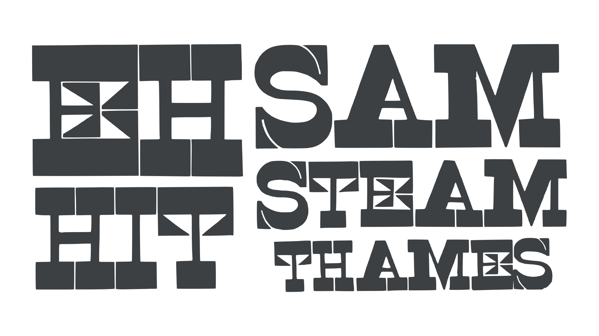
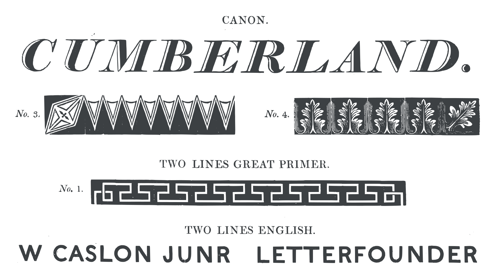

The nineteenth century witnessed rapid changes in society and industry, which led to an explosive proliferation of new [typefaces](/glossary/typeface). The Modern types designed by Bodoni and Didot in the previous century had continued the trend toward increased contrast and finer details, influenced, in part, by new calligraphic styles. Similarly, some of the typefaces of the early 19th century took existing designs and exaggerated some of their features. An early example, and one of the first [display](/glossary/display) typefaces, was the Fat Face, a style that in some respects is a parody of the Modern style, with [contrast](/glossary/contrast) taken to new extremes.

<figure>

</figure>
<figcaption><a href="https://fonts.google.com/specimen/Abril+Fatface">Abril Fatface</a>, a modern interpretation of the Fat Face style that first appeared in the early 19th century.</figcaption>

Another early example of the new display type was the [slab serif](/glossary/slab_serif_egyptian_clarendon). Modern types had reduced serifs to hairline strokes, but in the slab serif we see the opposite extreme—very heavy serifs attached to low-contrast, robust, and [bold](/glossary/bold) [letterforms](/glossary/letterform). By the mid-1800s, out of these forms evolved a sub-genre called Clarendon, a style of slab serif more suited to text settings—lighter, with more contrast, and larger [x-heights](/glossary/x_height). The "slab serif," a term coined much later, was at first known as Egyptian. Discoveries in Egypt, at the turn of the 19th century, had led to a period of Egyptomania, and it appears that type founders simply exploited this fashion, borrowing “Egyptian” to convey exotic and different, and also to convey a feeling of incised or inscriptional forms.

## Revolution

But what prompted the sudden appearance of so many new typefaces and styles? The Industrial Revolution shifted production from handmade to machine made—toward industrial production and machine manufacturing. In time it came to affect every aspect of printing and type making: typecasting, [typesetting](/glossary/typesetting), paper production, book binding, and even the printing press. By the end of the century, all had been mechanized. One of the products of the Industrial Revolution, and subsequent economic expansion, was a proliferation of ephemera and display advertising—billboards, posters, and flyers of larger and larger size.

Type on a poster or billboard needs to be readable from across the street, and so must be considerably larger and bolder. And if they were to stand out among the growing number of competing billboards, then bold and atypical styles and experimental types were more likely to stop people in their tracks. The result was a kind of type explosion, with decorated, floral, chromatic, shadowed, inline, outline, Tuscan, [condensed](/glossary/condensed_narrow_compressed)—all emerging to meet the new demands of display advertising on billboards, flyers and in the thousands of new periodicals and newspapers being published. Display type was not an innovation of the 19th century, but the new designs, bolder in weight, more striking in their letterforms and often used in much larger sizes, were far more widespread and earned their own typographical [classification](/glossary/classification). 

However, casting very large letters in lead is impossible. Large volumes of molten type metal cool at different rates resulting in deformed, cracked, or uneven type. The solution to manufacturing big type was wood. It was ideally suited to larger sizes of letter as it was light, durable, and typically only half the cost  of metal type. Although wood type was not entirely new, its use really took off when in 1827, Darius Wells, in New York, invented a router—a mechanized wood-cutting tool—which enabled mass production. The rapid adoption of wood type was also helped by the ease with which it could be copied. If the  router was attached to a pantograph, any wood type could easily be traced around and reproduced at a variety of sizes—often by wily competitors.

<figure>

</figure>
<figcaption>Early 19th-century reverse contrast typeface in wood.</figcaption>

When designing typefaces for reading, one works within fairly narrow parameters. Altering the structure and proportions of letterforms or adding novel or unusual accouterments interrupts the rhythm of the text. Even if the individual letters are [legible](/glossary/legibility), readers will be distracted by unfamiliar details, and [readability](/glossary/readability)  suffers. But when it comes to typefaces for advertising, where the whole purpose is to stand out , then there is much more room for innovation with both the structure and detail of letterforms. 

Unhindered by the exigencies of readability, typefounders (both metal and wood type) experimented with every aspect of letter design. One experiment by William Caslon IV even turned type inside out, producing the Reverse Contrast" typeface, perhaps one of the most unusual designs of the early 19th century. These typefaces suffered from poor legibility, so a less extreme variant of reverse-contrast design based on the Clarendons was created and named French Clarendon. [Serifs](/glossary/serif) too were experimented with—from slabs of different lengths and thicknesses, to wedged, curved, and other highly ornamental forms like the bifurcated Tuscans.

<figure>

</figure>
<figcaption>The 19th century witnessed the invention of many new styles of typefaces—and serif designs.</figcaption>

The arrival of the modern advertising poster roughly coincided with the invention of new color printing technologies, like chromolithography, which for the first time ever made color printing practical and affordable. The use of several colors became another way to stand out from the crowd, and the first chromatic wood type appeared in the 1840s, printed or overprinted from several blocks.

<figure>

</figure>
<figcaption>Bottom line: William Caslon’s sans serif, c. 1816.</figcaption>

## The arrival of the sans serif style

The most consequential type style introduced in the 19th century was the [sans serif](/glossary/sans_serif). The style first appeared in type when William Caslon IV (1780–1869) designed a large all-caps sans serif that he called English Egyptian, and which first appeared in a specimen book published in about 1816. At the time, it was hardly remarked on, and it would be some time before the sans serif was more widely adopted. In 1832, British typefounder Vincent Figgins produced a sans serif typeface in three weights, followed by another ten the following year. Figgins coined the term "sans serif" to describe this "serifless" typeface. In 1834, the British [typefounder](/glossary/type_foundry) William Thorowgood was the first to design a sans serif with both [uppercase and lowercase](/glossary/uppercase_lowercase) alphabets, and used the term [Grotesque](/glossary/grotesque_neo_grotesque) to describe them. Although sans serifs began to grow in popularity, their use in the 19th century was typically limited to small sizes in commercial printing. Their broader popularity would begin in the next century.
