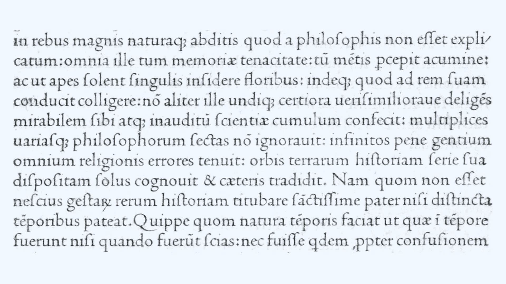

Type designers have long created complex typeface families of various weights and widths that allow a word of almost any length to fit on the same text line (i.e.; to “fit the line”). But only recently have we also had the benefit of variable fonts to make the task easier. Read on to learn how we got to fonts of various widths and how variable fonts make fitting the line easier, even when you don’t yet have final text.

## The standard outline: “normal” type width

The letterforms we use today have taken on particular proportions over the centuries. Display type—and to a lesser extent, text type—can be “condensed” or “extended.” But in text typefaces, there’s a certain rhythm in the alternation of the black downstrokes (stems) of the letters. And the white spaces between them, to our eyes, looks “normal,” or what Adrian Frutiger calls a “standard outline” in “Signs and Symbols: Their Design and Meaning.” This standard letter model can be traced back to the work of [Nicolas Jenson](https://en.wikipedia.org/wiki/Nicolas_Jenson), a French printer active in Venice in the fifteenth century:

<figure>

<figcaption>Jenson’s roman, from Eusebius’s De evangelica praeparatione (1470).</figcaption>

</figure>

We’re so accustomed to these letterforms, in fact, that it’s easy to underrate Jenson’s achievement. The roman type Jenson created for his 1470 edition of Eusebius’s “De Evangelica Praeparatione” exerted a strong influence on the roman type [Francesco Griffo](https://en.wikipedia.org/wiki/Francesco_Griffo) cut for [Aldus Manutius](https://en.wikipedia.org/wiki/Aldus_Manutius)’s edition of De Aetna (particularly the lowercase letters), and—through this Aldine roman—on the work of [Claude Garamond](https://en.wikipedia.org/wiki/Claude_Garamond) and other sixteenth-century French punch cutters, which [established a standard for roman type](https://articles.c-a-s-t.com/the-influence-of-jenson-on-the-design-of-romans-e86afdbf9b94) that went more or less unchallenged until the “transitional” types of the eighteenth century. There were minor departures from this enduring letter model; the romans of [Hendrik van den Keere](https://en.wikipedia.org/wiki/Hendrik_van_den_Keere) (a punchcutter active in sixteenth-century Ghent), for example, are slightly heavier and more compressed, setting the stage for what would later be called the “Dutch taste” in type, but they’re not what we would call condensed type today.

## The first condensed type?

It’s been suggested that the first italic, also cut by Francesco Griffo for Aldus Manutius, was—in effect—the first condensed type. Aldus adopted it as a space-saving measure in his series of octavo classics, which were relatively narrow in format:

<figure>

<figcaption>Griffo’s italic, from Pietro Bembo’s Gli asolani (1505).</figcaption>

</figure>

But as Peter Burnhill points out in “Type Spaces: In-House Norms in the Typography of Aldus Manutius,” Griffo’s italic is not particularly condensed. If it’s more economical on the page, it’s as a result of its small [x-height](/glossary/x_height) relative to its body size. In “A View of Early Typography up to about 1600,” Harry Carter disagrees even with the premise that the Aldine italic is more compact: “If Aldus hoped, as it is commonly said that he did, but he never said, that cursive letterforms would save space, he must have been disappointed by the results: a roman type on the same body gets in just as much.”

In his “Manuel typographique,” the prolific French punchcutter, typefounder, and printer [Pierre Simon Fournier](https://en.wikipedia.org/wiki/Pierre_Simon_Fournier) exhibited different gradations of letters designed for different effects, including one “dans le goût Hollandois (“after the Dutch taste”).” These variants differed mostly in their x-height, but Fournier also introduced two type styles that were undoubtedly meant to be “condensed” in our sense of the term: his “Serré (condensed face)” and “Poétique (poetry face).”

<figure>

<figcaption>Fournier’s regular, condensed, and poetry faces, from his Manuel typographique (1764).</figcaption>

</figure>

In “Fournier on Typefounding; the Text of the Manuel Typographique,” he said the Serré “gives a face near the ordinary and with open counters, [but] nevertheless gets in more to the line.”  The Poétique, with its elongated ascenders and descenders, was cut for “works to which it is desired to give an air of lightness,” especially poetry, “which, to gain elegance, needs a greater interval between the lines than usual.” Like the Serré, the Poétique was laterally compressed, so that ten- or twelve-syllable lines of verse wouldn’t be too long for the page width. Fournier wanted to avoid “turning in” lines (splitting a line of verse into two lines), which tended to produce blocks of white on the page that he considered eyesores: “When three or four lines on a page are thus turned in or made into two, blocks of white are caused which are all the more offensive to the eye in that many of the lines do not extend the full width of the page.”

## Type families

Today, it’s not unusual for typefaces to be released in “families'' comprising multiple weights (light, semibold, bold, black, etc.) and widths (condensed, compressed, or narrow on one end of the width spectrum; wide, expanded, or extended on the other). A single type family can provide a designer with a full palette of typographic effects. [Fira Sans](https://fonts.google.com/specimen/Fira+Sans#glyphs), for example, includes normal, condensed, and extra condensed widths.

<figure>

<figcaption>Three widths of Fira Sans.</figcaption>

</figure>

The extended type family is so much a part of the typographic landscape that we can forget how recent a development it is. [Univers](https://en.wikipedia.org/wiki/Univers), designed for Deberny & Peignot in 1953 by [Adrian Frutiger](https://en.wikipedia.org/wiki/Adrian_Frutiger) and his former student Lucette Girard, is usually credited as the first type family to be systematically planned in this way.

Frutiger had been working for Deberny & Peignot, redrawing classic types for the Lumitype, an early phototypesetting system. When the time came for a sans serif, Charles Peignot was dead set on Futura, but Frutiger asked if he could propose an alternative. Within ten days, he came up with a draft of Univers. In designing Univers, Frutiger looked back at drawings he’d made as a student under Walter Käch at the Kunstgewerbeschule in Zurich. Käch had taught him to model sans serif shapes on classical inscriptions, with modulated stroke weights, making Univers very different from the geometrical [Futura](https://en.wikipedia.org/wiki/Futura_(typeface)).

The Univers family included twenty-one numbered variants, which were arrayed in a now-famous diagram that recalls the periodic table of elements:

<figure>

<figcaption>Univers diagram from ATF type specimen (1965).</figcaption>

</figure>

The numbering system was adapted from the one Frutiger devised for the other Lumitype faces: A two­-digit number indicates width, weight and slant. The first digit is for weight, from 3 (extra-light) to 8 (black), and the second digit denotes width and slant, from 3 (extended) to 9 (extra-condensed), with odd numbers reserved for roman, and even numbers for italics. At the center of the system is Univers 55, the regular weight/width, and 56, its corresponding italic.

The result was a coherent system: “For the first time in the history of letterpress printing,” writes Emil Ruder in Frutiger’s “Type, sign, symbol,” a foundry had “built up an extensive family of typefaces, not as a consequence of the first successful font but in accordance with a plan from the beginning.” (Rudefr advised Frutiger on the design of Univers.)

While not planned out with the rigor of Univers, [Cheltenham](https://en.wikipedia.org/wiki/Cheltenham_(typeface)) was perhaps the first extensive family of metal types. By the turn of the twentieth century, typefaces like De Vinne and Philadelphia Lining Gothic had demonstrated the viability of the “type family” idea, but it was with Cheltenham, according to Alexander Lawson in “Anatomy of a Typeface,” that it “really blossomed.”

<figure>

<figcaption>Cheltenham promotional copy, from ATF specimen book (1923).</figcaption>

</figure>

Designed by architect [Bertram Grosvenor Goodhue](https://en.wikipedia.org/wiki/Bertram_Goodhue), Cheltenham was first advertised by the [American Type Founders](https://en.wikipedia.org/wiki/American_Type_Founders) company in 1903. Originally designed as a book typeface and engineered for legibility, Cheltenham (“Chelt,” as it was known in the trade) became ubiquitous as a display face in advertising and job printing, largely because of the enormous range of weights, widths, and styles available. ATF produced some two dozen Cheltenham variants; their 1912 specimen book devoted eighty-six pages to showing the full range of designs, including extended, condensed, and extra-condensed widths in different weights.

<figure>

<figcaption>Five widths of Cheltenham, from ATF specimen book (1923).</figcaption>

</figure>

Called “The Helvetica of its time” by type designer Charles Bigelow, Cheltenham fell victim to its own ubiquity. It came to be seen as overused and out-of-date. But Cheltenham remains with us, and has been revived many times—notably in 1975 for ITC by Tony Stan, who made major changes in the design. “Upper and Lower Case, the International Journal of Typographics” said that he approached the project “with the eyes of a 70’s designer, and with the freedom of modern film typesetting at his disposal.” A custom version of Cheltenham [continues to be used](https://www.nytimes.com/2003/10/21/business/the-media-business-a-face-lift-for-the-times-typographically-that-is.html) for headlines by the New York Times.

Decades before Cheltenham, though, manufacturers of wood display type were cutting their antiques, romans, and gothics in a whole series of additional weights and widths. They even had standardized naming conventions: Condensed, Extra Condensed, Double Extra Condensed, Treble Extra Condensed, as well as Extended and Expanded.

<figure>

<figcaption>A modern approximation of an illustration from Rob Roy Kelly’s American Wood Type (1969), using the variable widths of <a href="https://fonts.google.com/specimen/Roboto+Flex">Roboto Flex</a> (top) and <a href="https://github.com/TypeNetwork/fb-Amstelvar">Amstelvar</a> (bottom).</figcaption>

</figure>

“In most wood type specimens after the middle of the [nineteenth] century,” wrote Rob Roy Kelly in “American Wood Type,” “all of the primary, and several of the secondary faces, were cut in a series of six to eight weights or styles.” Nothing comparable was being done by metal type foundries.

## The pantograph

This profusion of design variations was made possible by the [pantograph](https://en.wikipedia.org/wiki/Pantograph). A device based on the geometry of parallelograms, the pantograph is, in its basic form, a jointed framework connecting a fixed point, a pointer, and a drawing implement. Tracing over an image with the pointer produces parallel movements in the drawing implement, reproducing the original image; by adjusting the mechanism, the scale of the reproduction can be changed.

<figure>

<figcaption>Drafting pantograph, from F.W. Devoe & C.T. Raynolds Co. catalog (1914).</figcaption>

</figure>

Pantographs had already been used to transfer patterns to wood for cutting, but in 1834, George Leavenworth adapted the principle to the lateral router, originating an process for mass-producing wood type that lasted well into the twentieth century: The worker [follows the outline of a raised pattern](https://www.youtube.com/watch?v=WDrD6eDpxpw) with a guiding rod or feeler, and the pantograph communicates every motion (in a reduced form) to the router, which carves the letterform out of the wood block.

<figure>

<figcaption>Leavenworth’s pantograph for wood type, from De Vinne’s Plain Printing Types (1900).</figcaption>

</figure>

The pantograph didn’t really catch on in the world of metal type until [Linn Boyd Benton](https://en.wikipedia.org/wiki/Linn_Boyd_Benton) invented his [vertical pantographs](https://www.circuitousroot.com/artifice/letters/pantocut/benton/vertical/index.html) for cutting steel punches (patented 1884) and matrices (patented 1899).

But the pantograph’s utility wasn’t limited to reproduction at a fixed scale. Various mechanisms could be incorporated into the pantograph to allow for systematic distortion of the image. For example, in “The Building of a Book: A Series of Practical Articles Written by Experts in the Various Departments of Book Making and Distributing,” Benton describes a “delineating machine” (another pantograph) in use at the foundry that could “change the form of the pencil tracing in such a manner that it becomes proportionally more condensed or extended, and even italicized or back-sloped,” so that endless variations could be derived from a single design.

Miller and Lupton see this as a turning point in typography, saying in “Looking Closer: Critical Writings on Graphic Design:” “The programmatic shifts in scale enabled by the pantograph encouraged an understanding of the alphabet as a flexible system, susceptible to systematic variations divorced from a calligraphic origin. The swelling population in the nineteenth century of typographic mutants—compressed, expanded, [etc.] signals a shift. The notion of letterforms as essential, archetypal structures gave way to a recognition of letters as units within a larger system of formal features…

## Torturing Letterforms

In the phototypesetting era, when metal type was replaced by designs stored as photographic negatives, control over the width of characters was put for the first time into the hands of the typesetter, furthering the dissolution of letterforms as “essential, archetypal structures.” Existing type designs could be manipulated with distortion lenses, altering the type image to create the effect of a “condensed” or “extended” design:

<figure>

<figcaption>The effects possible with two Phototypositor distortion lenses.</figcaption>

</figure>

In the computer age, of course, changing the width of letters is a snap. For decades, page layout programs have allowed people to adjust the width of characters. In 1990, for example, [Aldus Pagemaker](https://en.wikipedia.org/wiki/Adobe_PageMaker) 4.0 introduced a “set width” feature that allowed people to alter the width of characters in predefined increments, or to enter any percentage between 0.1% and 250%.

<figure>

<figcaption>Monotype Plantin. Above: horizontally scaled 250% Below: vertically scaled 250%.</figcaption>

</figure>

The problem with this sort of photographic or digital manipulation is that it deforms the letters, redistributing weight in an awkward way, and at its worst, makes text truly unreadable. But that hasn’t stopped users of page layout programs from availing themselves of this feature. Horizontal and vertical scaling was abused so frequently in the era of desktop publishing that Ellen Lupton included it among the “type crimes” in her textbook “Thinking with Type:” “Instead of torturing a letterform,” she advised her readers, “choose a typeface that has the proportions you are looking for, such as condensed, compressed, wide, or extended.”

## Fitting the line today

Today, designers still use spacing and width to fit the line. But variable fonts make this task easier by allowing us to select a different value on the [wght axis](/glossary/weight_axis) for each line of type. This enables different text lengths to always fit the same measure. [explanation of how this works]

A couple tools that help make it even easier are [Wakamai Fondue](https://wakamaifondue.com/) and [Fitty](https://rikschennink.github.io/fitty/#examples). Wakamai Fondu is an online tool that makes it easy to find out the attributes of any variable font (e.g. whether it has weight and width axes) just by dragging a file from your drive onto the page. And Fitty is a Javascript library that automatically scales text up (or down) so it fits its parent container perfectly. If we combine Fitty and a variable font with weight and width axes, we can fit text to a line automatically, no matter the word length—like magic!

<figure>

</figure>

If you’re new to variable fonts but are interested in using them to help you fit the line, a good place to start is [“Introducing variable fonts”](/lesson/introducing_variable_fonts) on Google Fonts Knowledge.
