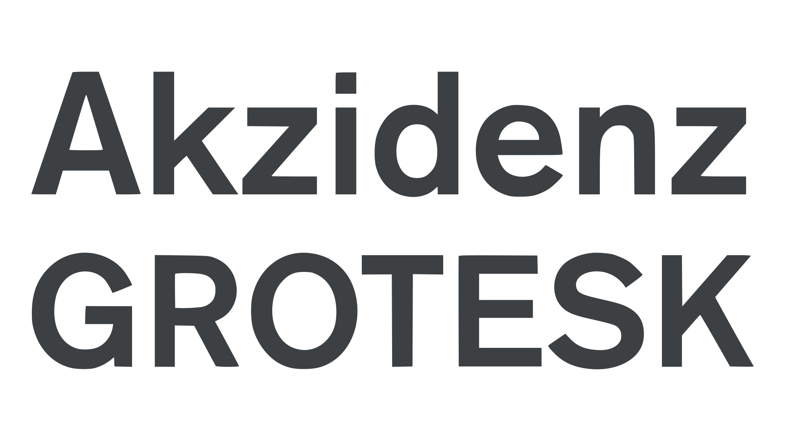
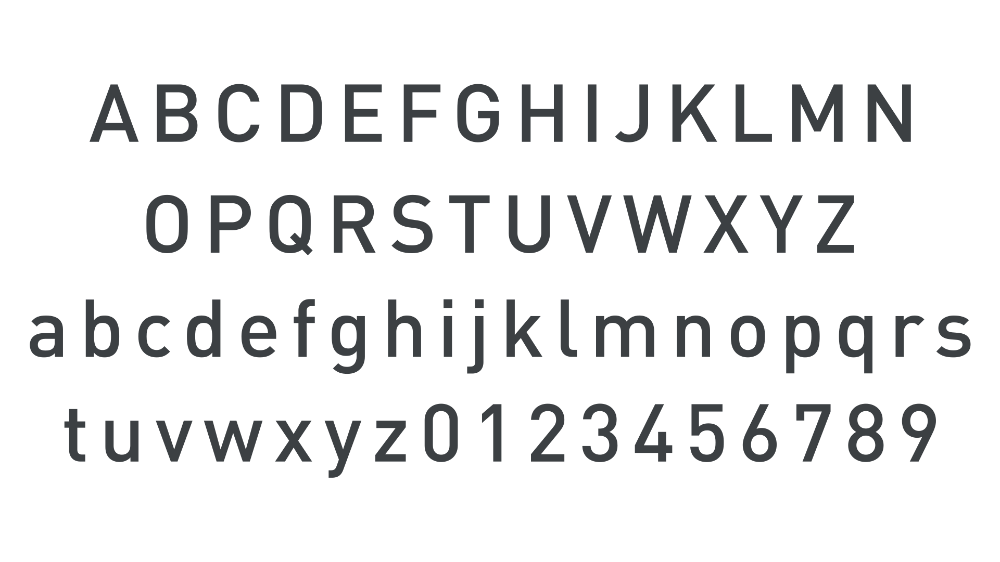
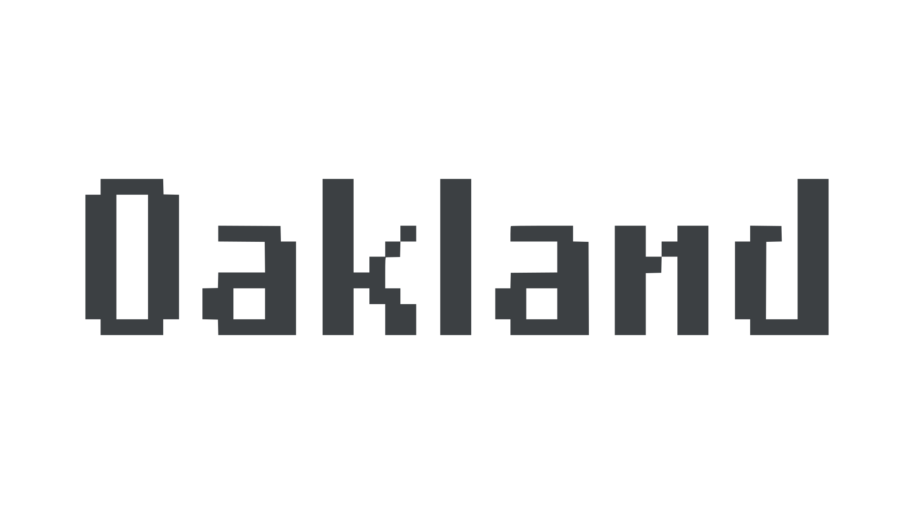
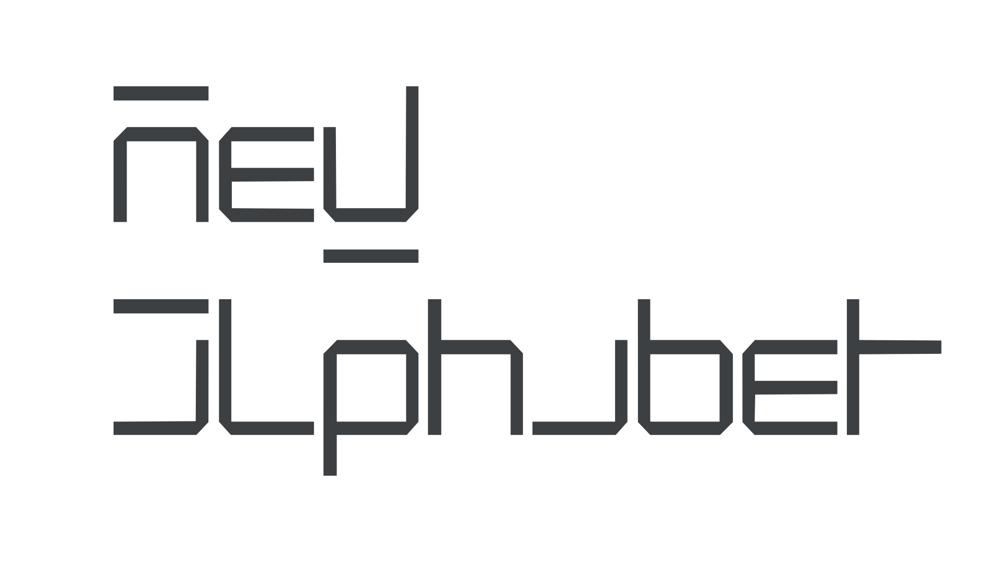

In Europe, from the 1440s when Johannes Gutenberg began printing up until the Industrial Revolution, very little changed in terms of the technologies employed to manufacture type and to print. For three and a half centuries, printing and its allied trades were very much hand trades, with metal type cast in a hand-held mold, set by human compositors, and printed on a hand-operated printing press. The 19th century witnessed a revolution with the widespread mechanization of every aspect of type production and printing. However, for the next revolution in type, we wouldn't have to wait another 350 years. In the 20th century, the acceleration of change was phenomenal. Within the space of several decades, type had been transformed from hot metal to phototype and then into digital fonts. Free of physical constraints, the design of type could change more profoundly than ever before.

## Rise of the sans serif

Although the [sans serif](/glossary/sans_serif) [typeface](/glossary/typeface) first appeared at the start of the 19th century, they were not popularized until the 20th century. What started out as a rather clumsy all-caps alphabet would evolve into a genre that would quickly eclipse serif types. The evolution from grotesque to neo-grotesque was really part of the sans serif letting go of its serif roots. The quirky irregularities and fussy details of the grotesques were reigned in or erased in favor of uniformity. This can be seen in the reduction of contrast in the letterforms and the design of sans serif [italics](/glossary/italic) based not on cursive exemplars, but as slanted or [oblique](/glossary/oblique) versions of [uprights](/glossary/regular_upright) or romans. Helvetica, designed by Max Miedinger & Eduard Hoffmann in 1957, is a prime example of this evolution of the sans serif. Initially released as Neue Haas Grotesk, and based on Akzidenz-Grotesk released by the Berthold type foundry in Germany in 1898, Helvetica is one of the world’s most ubiquitous digital fonts. It became especially popular when it began to be bundled with popular software and operating systems.

<figure>

</figure>
<figcaption>Akzidenz-Grotesk released by the Berthold type foundry in 1898, inspired the popular Neo-grotesque style.</figcaption>

The trend toward simplified or industrial letters, or letters that appear machine-made or constructed, can be seen in typefaces like Paul Renner’s Futura, a [Geometric](/glossary/geometric) sans designed in 1927. But this concept was more fully realized in the typeface DIN 1451, released by Deutsches Institut für Normung (German Institute for Standardization). Just as the [Transitional](/glossary/transitional_neo_classical) typefaces of the 18th century had rationalized their Old Style predecessors, so too, in DIN was an attempt to design a modern standard or template alphabet—a rationalization of the sans serif style. DIN appeared on road signage throughout Germany and even on vehicle license plates. It is the precursor to countless modern sans serif designs.

<figure>

</figure>
<figcaption>DIN 1451, produced by Deutsches Institut für Normung (German Institute for Standardization) in 1931.</figcaption>

## Light, digital, and postmodern type

Metal type used in the twentieth century looked and worked in the same way as that used in the fifteenth. Typefounding had undergone a transformation in its method of production, from  pieces of metal type laboriously cast one by one in a hand mold, to mechanized typecasting with machines like the Monotype caster and Linotype machine. The next transformation would move the embodiment of type from pieces of lead alloy to silhouettes on photographic film. Phototypesetting, a technology invented in the 1890s, and used at first mostly for illustrations and headings, was more widely adopted in the 1960s. Phototypesetting machines like the Diatype worked on the same principle as the mechanical metal type casting machines, but with the three-dimensional letter mold replaced with a negative image of each letter on film. Later, those letters, on a strip of film or a disc, were exposed to photosensitive material that was then printed with photolithography. Phototypesetting sped up composition, but it also meant that printers no longer needed to store tons (literally) of metal type. However, the technology of phototype was short lived, with photographed exposed alphabets making way for digital ones.

From the mid 1980s, the personal computer and low-resolution printers put typography into the hands of the public. For hundreds of years, designing type had been the domain of skilled punchcutters who served long apprenticeships. But the personal computer and the widespread adoption of the graphical user interface in everyday software opened up graphic design and type design to anyone with an imagination. 

For the first generations of digital graphic designers, low resolution screens, despite their limitations (and perhaps they only appear as limitations in hindsight), inspired new ways of approaching [type design](/glossary/type_designer). Designers also began to consider how this new technology might be used to revive and reimagine hundreds of years of metal type as digital fonts. Software engineers asked how they were to reproduce, say, the fine serifs of a Baskerville or Bodoni typeface on a low resolution display or printer. And graphic designers asked why the appearance was so unfaithful to professional imagesetting.

<figure>

</figure>
<figcaption>Zuzana Licko’s Oakland (1985) designed on the first Apple Macintosh 128K computer.</figcaption>

In 1984, the Macintosh computer went on sale and it was quickly exploited by a new generation of talented and enthusiastic digital designers. Among them was Zuzana Licko, who—rather than being put off by the inherent limitations imposed by low resolution—experimented with bitmap typefaces that embraced it. Licko‘s Emperor, Oakland, and Universal font families, designed in 1985 on the Apple Macintosh 128K computer (and re-released in 2011 as Lo-Res), celebrated these limitations. Later she went on to produce popular digital revivals of Baskerville (Mrs Eaves) and Bodoni (Filosofia), among others.

<figure>

</figure>
<figcaption>Wim Crouwel’s New Alphabet, 1967.</figcaption>

Wim Crouwel’s ‘new alphabet’ of 1967 was one of the  most reductionist experiments, constructing the alphabet from combinations of horizontal and vertical [strokes](/glossary/stroke) only. Although it was not particularly [legible](/glossary/legibility), it inspired new and novel ways of approaching type design.

The personal computer, and later the internet in the 1990s, made type design accessible to a much larger audience—one not always equipped with formal design training, and not afraid to experiment with new technologies and designs. With higher resolution displays and outline fonts came thousands of new designs, with everything from everyday informal handwriting and formal [calligraphy](/glossary/calligraphy) to weathered and grunge-style lettering reimagined as fonts. Even the chromatic types of the mid-19th-century have been reproduced as layer fonts, and more recently as [color fonts](/glossary/color_fonts) that permit embedding additional bitmapped and vector (SVG) textures and elements stored alongside the font outlines. More recently, the growth in support for [variable fonts](/glossary/variable_fonts), where multiple instances are combined into a single font file and controlled by [axes](/glossary/axis_in_variable_fonts) like weight, slant, and width, has led to their wider use both in print and as web fonts.
