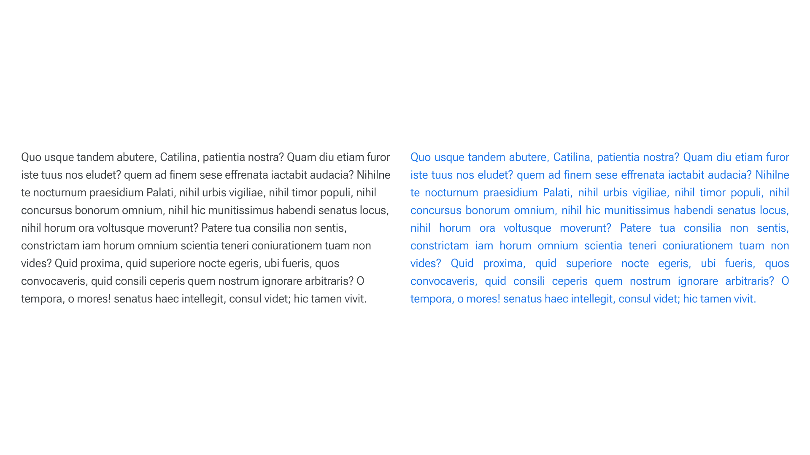
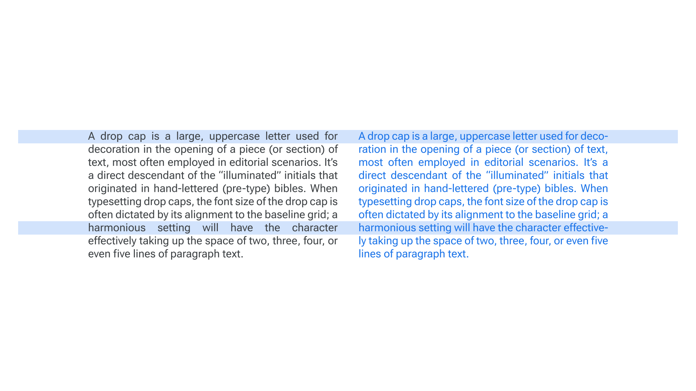
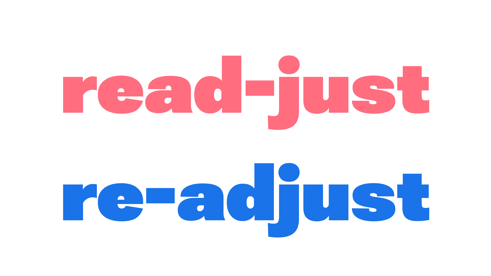
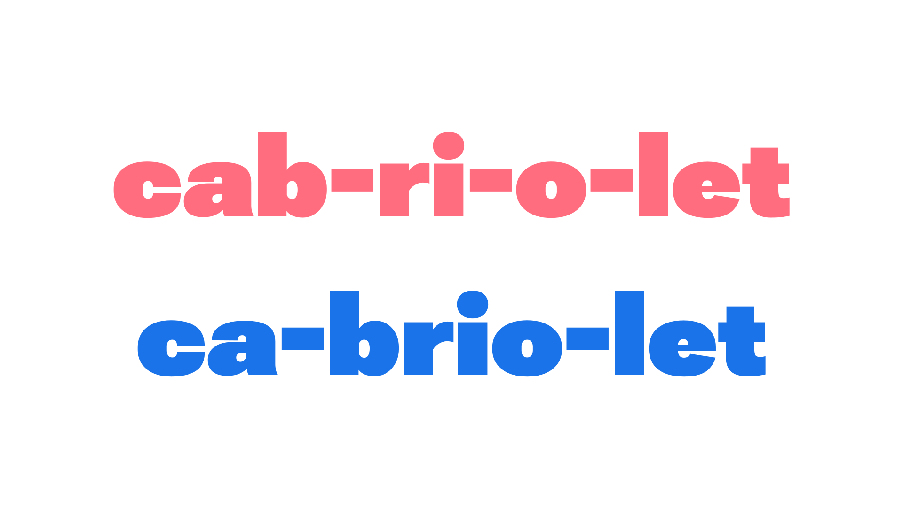
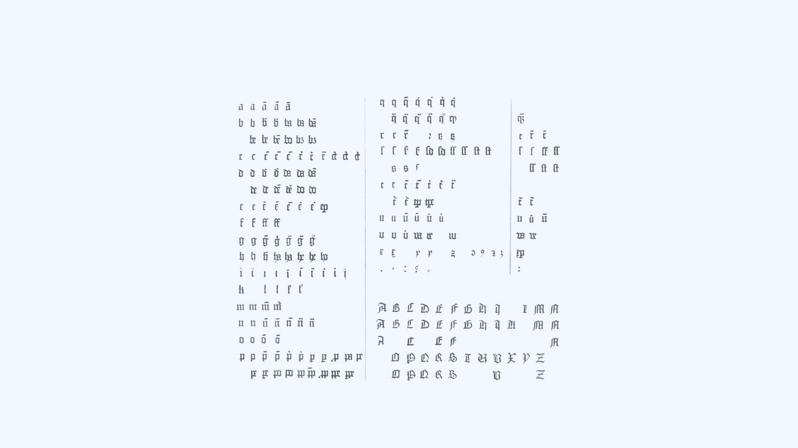
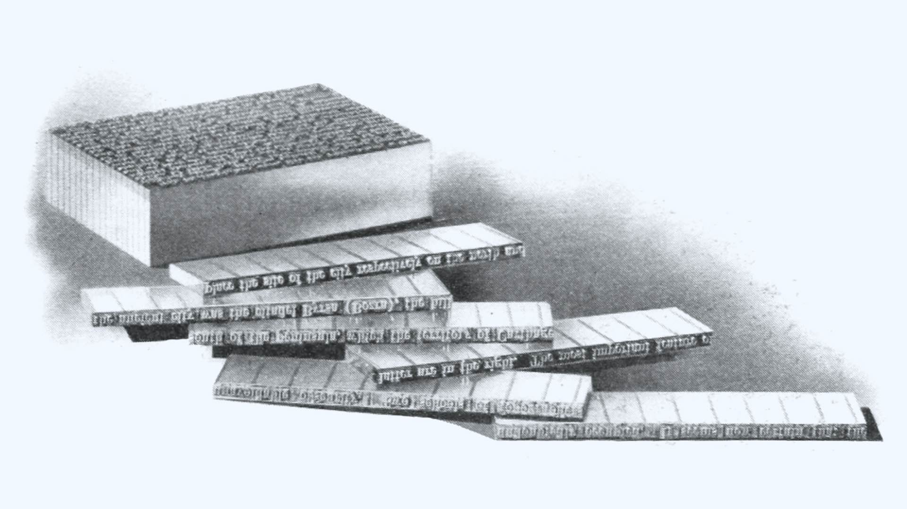
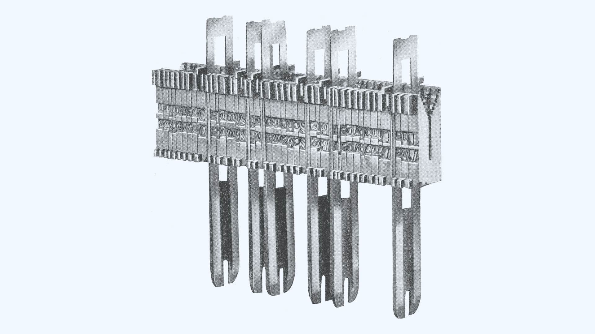
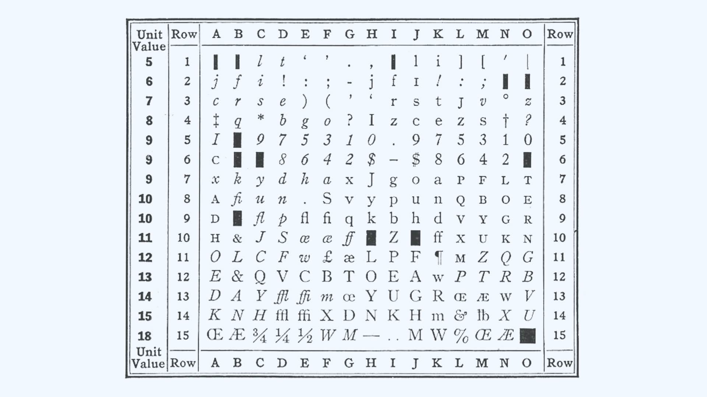
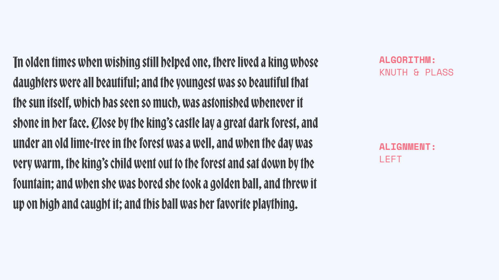

In western text, which reads left to right, [justification](/glossary/alignment_justification) and [hyphenation](/glossary/hyphenation) are basic considerations for readability and clarity. But have you ever thought about how you can use them to create a look/feel that alludes to the literary culture of the past? Read on to learn about the history of justification and hyphenation, and see how [variable fonts](/glossary/variable_fonts) can help you evoke the past, whether that past is Medieval Germany, Renaissance Italy, or even... [1990](https://fontsinuse.com/uses/22951/html-t-shirt)?

## Justified text

A block of text is justified if all its lines are exactly the same length, producing a clean edge on the left and the right. In English and other languages that read from left to right, text is unjustified if it lines up on the left, but is uneven on the right:

<figure>

<figcaption>Left-aligned text vs. justified text, set in Roboto Flex.</figcaption>

</figure>

Unjustified text is also sometimes referred to as left-aligned, ranged-left, flush-left, ragged, or (somewhat confusingly) ragged-right.

There have been experiments with other paradigms, but the four basic options for text alignment are those you might find in a word processor like Google Docs or Microsoft Word: left, center, right, and justified. In a language that reads from left to right, it’s hard to endure more than a few lines of centered or right-aligned text, so the choice is usually between justified and unjustified (left-aligned).

Of the two, which is more readable? There are a handful of relevant empirical studies, but the results are inconclusive. In fact, it’s hard to imagine an experiment that would generate conclusive results. The practice of typography involves juggling a number of variables—font size, spacing, line length, etc.—all of which interact. But systematic research tends to isolate one or two variables at a time, sidestepping this complexity. What the research often reveals instead is the resilience of the reader and what Ellen Lupton calls “the elasticity of the typographic system” in her book “Thinking with Type.” In other words, people can read pretty much anything!

Still, whether a designer chooses justified or unjustified text shouldn’t rely only on their personal preference. Readers have expectations based on other texts they’ve seen. For example, justification is a convention in books, newspapers, and magazines. So, justified setting in these contexts translates as normal, neutral, and invisible, while unjustified setting in these contexts can register as a choice to not justify. For those like Beatrice Warde or Stanley Morison who believe that good typography is invisible—that anything that comes between author and reader is wrong—an argument could be made that the designers are best off justifying when it’s expected and vice versa.

## Hyphenation

In addition to connecting words, hyphenation is used to divide words between two lines of text. Hyphenation and justification tend to go hand in hand. While text can be justified without resorting to hyphenation and unjustified text can be hyphenated for a better “rag” (to improve the appearance of the irregular, “ragged” right edge), effective justification generally requires hyphenation:

<figure>

<figcaption>Hyphenated text vs. unhyphenated text, set in Roboto Flex.</figcaption>

</figure>

But hyphenation is not as simple as breaking a word wherever it’s convenient. Without a system for hyphenating words, bad word breaks will lead to misreadings, stopping readers in their tracks:

<figure>

<figcaption>Example of a bad word break vs. a good word break</figcaption>

</figure>

There are two schools of thought on hyphenation. One approach is etymological—to break up words according to their derivation (e.g. omni-po-tent), and the other is phonetic—to break up words into syllables (e.g. om-nip-o-tent). While the etymological method is in some ways more logically consistent, it probably assumes too much knowledge on the part of the reader. Readers are conscious of the sounds words make as they’re reading them, but how many of us are aware of the origin of every word we read?

The rules for hyphenation do depend on the language of the text, though. In English, for example, one-syllable words are not broken (raised, not rais-ed), but in French, unsounded vowels still “count” as syllables, so words like fuite and guerre, which look like one-syllable words to an English speaker, can be broken (fui-te, guer-re). Even a word that exists in both English and French might be broken differently:

<figure>

<figcaption>Example of how word break conventions depend on the language</figcaption>

</figure>

## Before Print

Hyphenation and justification were used in handwritten books long before the advent of print. But while the rectangular text area has been the norm in books since late antiquity, readers in earlier centuries seem to have been comfortable, in certain contexts, with an irregular right margin (what we’d call unjustified text today). By the late Middle Ages, though, there was less tolerance for that kind of irregularity, and scribes endeavored to produce solid rectangles of text.

Before starting to write, scribes carefully ruled out a rectangular text area on parchment with a sharp tool, lead, or ink. They justified as they wrote, fitting text to the line by hyphenating, abbreviating, overlapping letters, using [ligatures](/glossary/ligature), and making slight alterations to the widths of letters. Scribes might allow a letter or two to [protrude into the right margin](/lesson/breaking_the_rules), but on the whole, they went to great lengths to preserve the solid rectangle of the text area, sometimes filling the empty space at the end of a final line with decoration, or even with arbitrary letters.

## Handset Type

[Bi Sheng](https://en.wikipedia.org/wiki/Bi_Sheng) invented a method for printing with movable type in China, four centuries before [Johann Gutenberg](https://en.wikipedia.org/wiki/Johannes_Gutenberg)’s printing press, but it was Gutenberg who introduced the technology to Europe. For the first major work he printed, his [42-line Bible](https://en.wikipedia.org/wiki/Gutenberg_Bible) (so called because most of the text is set in two columns of 42 lines each), Gutenberg took contemporary handwritten books as his model, reproducing the justified text and the condensed, [angular textura script used in liturgical books at the time](https://www.researchgate.net/figure/Biblia-latina-The-42-Line-Bible-Mainz-Johannes-Gutenberg-for-Johann-Fust-ca_fig3_317915502).

To set justified type, the compositor picked up individual letters from the case and deposited them one by one in a handheld composing stick, inserting non-printing metal spaces between the words. If more room was needed for the last letter or two of a word, the spaces were exchanged for thinner ones until the word could be accommodated. On the other hand, if there was space left after the last word or hyphenated syllable, the interword spaces were increased until the line was full.

Gutenberg adapted many of the scribes’ means of justification to print: He made frequent use of abbreviations and ligatures. He cast narrow and wide letters that could be used to fill out or compress a line of type (no fewer than 290 characters in all, even though Latin only calls for a basic character set of forty letters, plus a few punctuation marks). He also frequently set hyphens, punctuation marks, and a few other characters (the short s, for example) just outside the type area, in the margin.

<figure>

<figcaption>Type used in Gutenberg’s 42-line Bible.</figcaption>

</figure>

While Gutenberg’s trick of hanging punctuation in the margin was used by some later printers, his practice of casting variant characters of different widths wasn’t widely adopted. And although some early printers used large numbers of ligatures (the italic cut by [Griffo](https://en.wikipedia.org/wiki/Francesco_Griffo) for [Aldus](https://en.wikipedia.org/wiki/Aldus_Manutius), for example, had at least sixty-five), the use of ligatures in Latin type steadily declined; only a few are commonly used today. (In English, fi, fl, ffl, and a few others.)

As standards changed in the centuries after Gutenberg, fewer and fewer of these methods for justification remained. Scribal abbreviations became less prevalent and spelling was standardized. Norms around hyphenation changed, too: As late as the sixteenth century, it wasn’t unheard of to have ten consecutive hyphenated lines, but eventually it was considered bad form to hyphenate more than twice or three times in a row. And until the seventeenth century, multiple forms or widths of hyphen were used on the same page, alongside word divisions with no hyphen at all.

## The Linotype

Although standards changed, the procedure for setting type barely changed from the time of Gutenberg until the late nineteenth century, when [Ottmar Mergenthaler](https://en.wikipedia.org/wiki/Ottmar_Mergenthaler) introduced his Linotype machine. The Linotype was an automated linecaster; instead of type, it composed with matrices—individual brass letter molds which it assembled into a justified line, casting from it a solid metal slug, or line, of type:

<figure>

<figcaption>Finished Linotype slugs.</figcaption>

</figure>

The Linotype was several times faster than a human compositor, mostly because it greatly simplified the process of justification. The trial-and-error substitution of larger or smaller spaces between words until the line was tight enough was entirely eliminated; as the Linotype operator punched in each letter at a keyboard, the letter molds (matrices) lined up. Between words, the operator hit a key, and a variable-width spaceband dropped into place:

<figure>

<figcaption>Composed line of matrices with spacebands in a Linotype machine.</figcaption>

</figure>

When the line was close to full, the operator pushed a lever, “sending in” the line of matrices to the type-casting machine. The wedge-shaped, steel spacebands were driven up into the line, automatically justifying it, and the entire line of type was cast as a single slug.

When handsetting type, it was possible for a skilled compositor to look a line or two ahead or behind. This meant they could reset previous lines to improve spacing. On the Linotype, justification was handled automatically, line by line. While a previous line could be recast, this was unlikely unless an error was found; the increased pace of work created by the Linotype machine itself made this impractical.

## The Monotype

In 1887, a year after the first Linotype was put into service at the New York Tribune, [Tolbert Lanston](https://en.wikipedia.org/wiki/Tolbert_Lanston) demonstrated a prototype of a new typesetting system. The Monotype system consisted of two machines: a keyboard unit that punched combinations of holes in a strip of paper tape, and a type-casting machine that read the perforated paper tape and cast each character (and space) encoded on the tape as an [individual piece of type](https://www.prepressure.com/images/Monotype-system-keyboard-caster.jpg).

<figure>

<figcaption>Monotype matrix case arrangement, showing the width of every character in the font.</figcaption>

</figure>

A Linotype operator could watch the matrices drop into place, filling the line. But because the Monotype keyboard and the casting machine were separate, and the only output from the keyboard was a series of punched holes in paper tape, there had to be a system to keep track of how much space was left before the end of the line. The solution, according to John W. Seybold in “The World of Digital Typesetting,” represented “the first application of counting logic to the typesetting industry.”

Typefaces for the Monotype system were designed with 1/18 the width of the capital “M” as their basic unit and the width of all the other characters was based on that unit. The capital “M” or “W" (18-unit characters), for example, would be twice as wide as the “a”, “o,” or “g” (nine-unit characters), and three times as wide as the “j” or “f” (six-unit characters).

As the keyboard operator typed, a counting mechanism added up the width units of the letters. Every time the spacebar was tapped, a justifying space counter incremented. Near the end of a line, the keyboard signaled the operator, who read two numbers off the justifying scale, representing the number of interword spaces entered and the extra space remaining in the line. The operator entered these two numbers, then moved on to the next line. When the spool of perforated tape was brought to the casting machine, it was fed in backwards, so these two numbers were read before each line; a system of wedges adjusted the interword spaces to distribute the extra space evenly throughout the line.

## Phototypesetting

Whether set by hand, by Linotype, or by Monotype, type was printed the same way: The raised type was inked, then pressed directly into paper, which transferred the ink from the type and created a printed impression. By the middle of the twentieth century, however, letterpress was being replaced by [offset lithography](https://en.wikipedia.org/wiki/Offset_printing), which transferred an inked image from a smooth plate to a rubber blanket and then onto paper. This process required that the plate be exposed to a photographic positive or negative. For a while, type was set in metal; inked or rubbed with carbon black; printed; then photographed. But inevitably, typesetting systems were devised to cut out this intermediate step and produce “camera ready” type photographically.

The earliest phototypesetters were essentially retrofitted Linotype or Monotype systems. They worked just like their hot-metal counterparts, but rather than casting type or slugs in hot metal, they exposed film or paper to images of type. Most of these early phototypesetters couldn’t do the work of justification themselves; they had to be told how wide to make the interword spaces. So computations were made at the keyboard, as they had been in the hot metal Monotype system. But later phototypesetters had “hard-wired” justification logic built in, and eventually incorporated small computers to handle justification and other tasks.

At this point, decisions about where to end a line and when to hyphenate were still made by the human operator, as they had been since the days of Gutenberg. It wasn’t long, however, before phototypesetters could make their own line-ending decisions, and the paper tape generated by the keyboard and fed into the typesetter became an endless string of text (called “idiot tape” in the trade), with only paragraph endings indicated.

## TeX

[TeX](https://en.wikipedia.org/wiki/TeX) is a language designed by computer scientist and mathematician [Donald Knuth](https://en.wikipedia.org/wiki/Donald_Knuth) for use in typesetting. The first edition of Knuth’s The Art of Computer Programming had been typeset on a Monotype machine in 1968–73. While preparing a second edition in 1976, he found that the whole book had to be typeset again because the Monotype system had been replaced by phototypesetting. Disappointed with the results of the new process, he soon realized—as he explained in his book, “Digital Typography”—that new digital typesetting technology meant that “the problem of printing beautiful books” could now be framed as a computer science problem, so he “couldn’t resist tackling the typography” himself. In “Breaking Paragraphs into Lines,” he framed  the problem as one of automated line-breaking, rather than justification “The job of adjusting spaces so that left and right margins are uniformly straight is comparatively laborious when one must work with metal type, so the task of typesetting a paragraph with last century’s technology was conceptually a task of justification; nowadays, however, it is no trick at all for computers to adjust the spacing as desired, so the line-breaking task dominates the work.”

Knuth’s system was based on three essential concepts: boxes, glue, and penalties. A “box” is something to be typeset, whether a single character or something more complex like a mathematical formula; the important thing about a box is its width. A word is represented by a series of boxes. “Glue” is the blank space between boxes; glue is elastic, with an ideal width, and a degree of “stretchability” or “shrinkability.” A “penalty” is the “aesthetic cost” of breaking a line in a particular place. Existing typesetting systems made line-breaking decisions on a line-by-line basis; they couldn't look forward or back to see the effect of a line break on the rest of the paragraph. TeX determines optimum break points by considering the paragraph as a whole.

## hz-program

The hz-program was a suite of software modules for typesetting developed by calligrapher and type designer [Hermann Zapf](https://en.wikipedia.org/wiki/Hermann_Zapf) in conjunction with [URW](https://en.wikipedia.org/wiki/URW_Type_Foundry). He looked back to Gutenberg’s 42-line Bible in “About Micro-Typography and the hz-Program” and concluded that “the master achieved this perfection by using several characters with different widths, combined with ligatures and abbreviations, in his lines.” Gutenberg’s extensive use of ligatures and scribal abbreviations wouldn’t be tolerated by modern readers, but a number of his other devices for justification could be revived, Zapf thought.

hz-program modules included kf, which could calculate kerning values on the fly instead of relying on a font’s kerning table. This allowed it to adjust interletter-spacing and create optically-straight margins by changing the sidebearings of the first and last character in a line (Gutenberg’s trick of setting punctuation in the margin); εk, which could vary the width of individual characters “without visible distortion.” (URW stipulated that expansion “should be approached very carefully” and condensing “should be done sparingly,” and that neither should be applied across the board, but only to certain characters); and jp, a composition engine based on an algorithm similar to TeX’s for line breaking—except that it could interact with the other hz modules, multiplying the variables that could be manipulated for better justification.

## Adobe InDesign

[InDesign](https://en.wikipedia.org/wiki/Adobe_InDesign) is a desktop publishing application developed by Adobe Systems. At the core of its typesetting capabilities is the Adobe Paragraph Composer, a composition engine that, like TeX, “considers a network of breakpoints for an entire paragraph... evaluating them, and assigning a weighted penalty to them,” as quoted in Michael M. Stone’s “An Investigation into Justification and Hyphenation Methodologies in QuarkXPress and Adobe InDesign InDesign,” “and also offers a complement of micro-typographic features along the lines of hz-program (letter-spacing, glyph scaling, and optical margins)—although Adobe is “not using any code directly from either project.”

Of these micro-typographic features, glyph scaling is perhaps the most controversial. Torbjørn Eng [takes issue](http://www.typografi.org/justering/gut_hz/gutenberghzenglish.html) with the origin story for InDesign’s glyph scaling that reaches back, through Hermann Zapf, to Gutenberg’s 42-line Bible, objecting that Gutenberg’s method for narrowing blackletter type (which involved, essentially, knocking a few corners off the letterforms) can’t be replicated today. In any case, he continues, InDesign’s glyph scaling is inferior to the hz-program’s, which preserved the weight of vertical strokes. InDesign scales not only the counters (interior spaces) of characters, but also their vertical strokes, making them bolder or lighter.

On the other hand, in “The Elements of Typographic Style, 4th ed,” Robert Bringhurst wrote that “microscopic adjustments to all the spaces in the line, including those inside the letters...go a long way toward creating even color and texture.” In reference to  typesetting the same book, he says, “the justification engine has been permitted to vary the intercharacter spacing by ±3% and to adjust the counters [emphasis added] of individual glyphs by the same amount.” (It’s curious that he would characterize the adjustments this way, given Eng’s observations on the nature of InDesign’s glyph scaling.)

## Justification today, with variable fonts

Web typography expert Bram Stein spoke at [Robothon 2018](https://vimeo.com/330954099) about bringing the complex justification process we know from InDesign to the web. He demonstrated how variable fonts, combined with balanced word and character spacing, could produce results comparable to InDesign’s justification engine. You can see Bram’s repo [here](https://github.com/bramstein/hyphenation-justification-vf). When you pair Bram’s work with, say, a blackletter variable font like David Jonathan Ross’s [Bradley DJR](https://djr.com/notes/bradley-djr-font-of-the-month), you can recreate on the web the same delightfully timeworn feeling that’s long been possible in print, but with all the advantages of CSS’s flexible typesetting.

<figure>

<figcaption>Demo of justification with variable width with the variable font Bradley by DJR.</figcaption>

</figure>

Variable fonts can aid with typographic refinement in many—and sometimes very subtle—ways. With the grade axis (GRAD), for example, we can adjust the thickness of the letterform’s strokes and reduce contrast. However, unlike when using the Weight axis (wght), grade will leave the glyphs’ widths intact. This allows us to maintain the same justification and hyphenation settings we‘ve already established, since letter spacing and word spaces will not change—and therefore no text will reflow.
