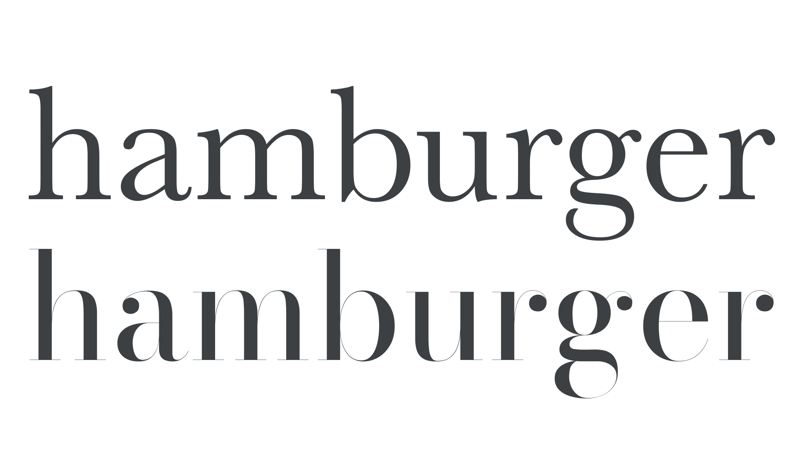
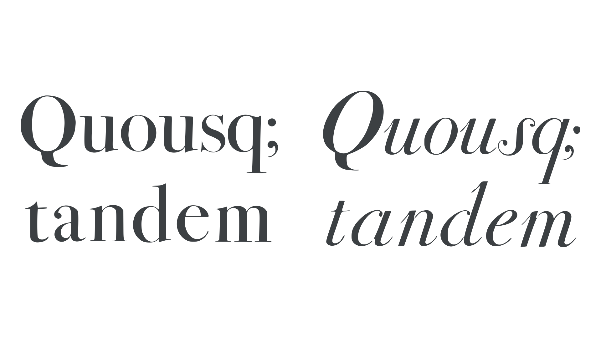

When John Baskerville introduced his roman [typefaces](/glossary/typeface) in the 1750s, some complained that their [contrast](/glossary/contrast) was so high that reading them could damage your eyes. During Baskerville’s lifetime, his types were more popular abroad than in England, particularly in France and Italy. And it was there that his typefaces proved most influential. But the persistent trend towards higher-contrast typefaces, which had begun long before Baskerville, was by no means over. By the 1780s, contrast would be taken to greater extremes with a new style of typeface now termed Modern—in contrast to what we now call Old Style typefaces and their various descendants. They are also known as Didone, a term coined in 1954 as part of the Vox-ATypI typeface [classification](/lesson/making_sense_of_typographic_classifications) system—a fusion of the names of the style’s most famous proponents, Didot and Bodoni.

<figure>

</figure>
<figcaption>Comparing transitional (Baskerville, top) and Modern  (Bodoni, below) style. They share similar proportions and an upright axis, but the Modern has a much simplified serif structure and considerably higher contrast.</figcaption>

## The first Moderns

Firmin Didot (1764–1836), son of François-Ambroise Didot, from the storied Parisian printing dynasty,  cut Modern style typefaces that his brother Pierre printed with. However, by far the most prolific producer of Modern style typefaces, and the most influential for this new style, was the Italian Giambattista Bodoni (1740–1813). He was from a family of printers from Saluzzo in the Piedmont region in Northwest Italy, close to Italy’s western border with France.

In 1768, Bodoni was invited to run the newly established Stamperia Reale, or Royal Press of Duke Ferdinand in Parma. When Bodoni arrived in Parma, he immediately got to work stocking up on type by the famed French punchcutter Pierre Simon Fournier (1712–68). When Bodoni began to make his own typefaces, he credited Fournier as his primary influence. But from the 1770s, we begin to see a change in Bodoni’s style. Initially, his typography imitated that of Fournier with its rococo decoration and [transitional](/glossary/transitional_neo_classical) style typefaces, but he gradually moved toward a new and distinctive style of his own. He rejected all forms of typographic ornamentation and borders, preferring instead vast expanses of white space, and generous margins. In his typefaces, he increased contrast and introduced very fine—almost unbracketed—serifs, longer ascenders and descenders, and more generous line-spacing. Now, line-spacing we would usually associate with typography rather than the design of typefaces. For centuries, type had typically been set solid; that is with no additional spacers inserted between lines of type. But Bodoni incorporated extra line-space into the type itself. He did this by casting his type on a larger body, thus imitating the appearance of additional line spacing.

Reproduction of the fine details in Bodoni’s type was made possible by exceptionally smooth paper, new inks, and improved type casting methods. Under magnification, Bodoni’s typefaces reveal remarkably crisp outlines and even fill. Bodoni became a celebrity during his own lifetime for his Modern typefaces and his meticulous typography. And the Modern style took Europe by storm, even reaching America and winning the praise of a printer named Benjamin Franklin, one of the Founding Fathers of the United States, who wrote to Bodoni in 1787 praising his printing and type: “It is one of the most beautiful that Art has hitherto produced.” Bodoni also counted the Pope and Napoleon as admirers of his work.

As an interesting historical aside, Bodoni and the Didots did not get along. Unable to fault Bodoni’s typefaces and typography, the brothers Didot, Firmin and his older brother Pierre, chose to attack the textual accuracy of Bodoni’s editions, jumping on even the smallest typos. In 1799 Firmin Didot wrote, “As a literary man, I condemn his editions, as a typographer I admire them.” The snub was fueled by national rivalry, snobbery, and no doubt a good amount of jealousy, too.

## Modern features

In Modern typefaces, the extreme contrast between thick and thin strokes was also carried through to the serifs, which were typically very thin (sometimes called hairline) and unbracketed, or very nearly so. Those features, plus their slightly condensed forms and upright axis, all contribute to their verticality or upright stance and has led to them being described as cold and rigid. Nowadays, it is suggested that this characteristic coldness and verticality disqualifies them for use in setting extended texts; however, during the 19th century they were very much book faces.

<figure>

</figure>

In the earliest Modern style, capital letters one would be hard-pressed to find any explicit calligraphic influence, except perhaps in the modulation of the strokes—that is, the speed with which thick strokes turn into thin strokes—a modulation characterized by the steel pointed pen calligraphy. However, in the lowercase italics, there are more explicit references to calligraphy; for example, the hairline entry and exit strokes and ball- or teardrop-shaped terminals. Again, these are features already present in contemporary writing manuals.

<figure>

</figure>
<figcaption>Bodoni roman and italic. Note, in the italic, the calligraphic influence in the hairline in-strokes.</figcaption>

Comparing the Moderns of Didot and Bodoni is difficult because there are so many of them, especially from Bodoni, who produced hundreds. Although typically, there is a little more symmetry or geometry in the letters of Bodoni than in Didot’s Moderns; for example, some of Didot’s romans tend to have asymmetrical or slightly lopsided [counters](/glossary/counter).

The types of Didot and Bodoni were widely copied. The latter were more so, owing to Bodoni’s skill for self promotion and his attendant international fame.

## Modern-day Moderns

During the early nineteenth century, Modern typefaces were hugely popular. They often replaced Old Style and Transitional typefaces for setting extended texts. Nowadays, Modern or Didone typefaces are seldom used for extended texts, but they are often associated with luxury brands and fashion—a trend begun in the 1920s by the likes of Mehemed Fehmy Agha and Alexey Brodovitch, and later popularized through their use in fashion magazines like Harper’s Bazaar and Vogue.
