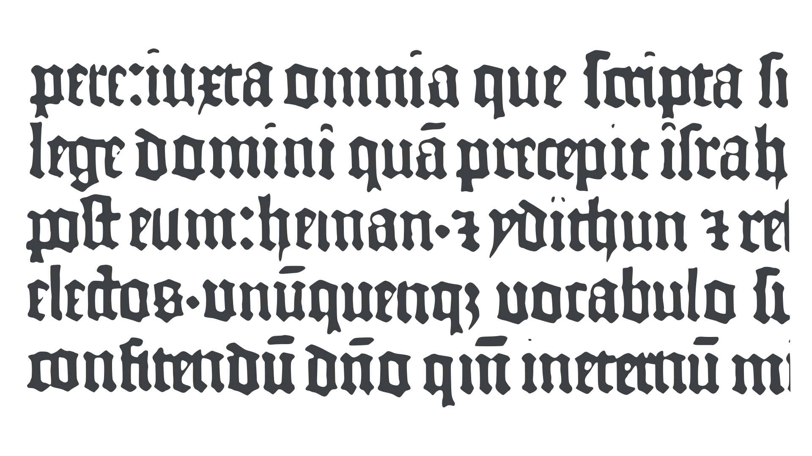
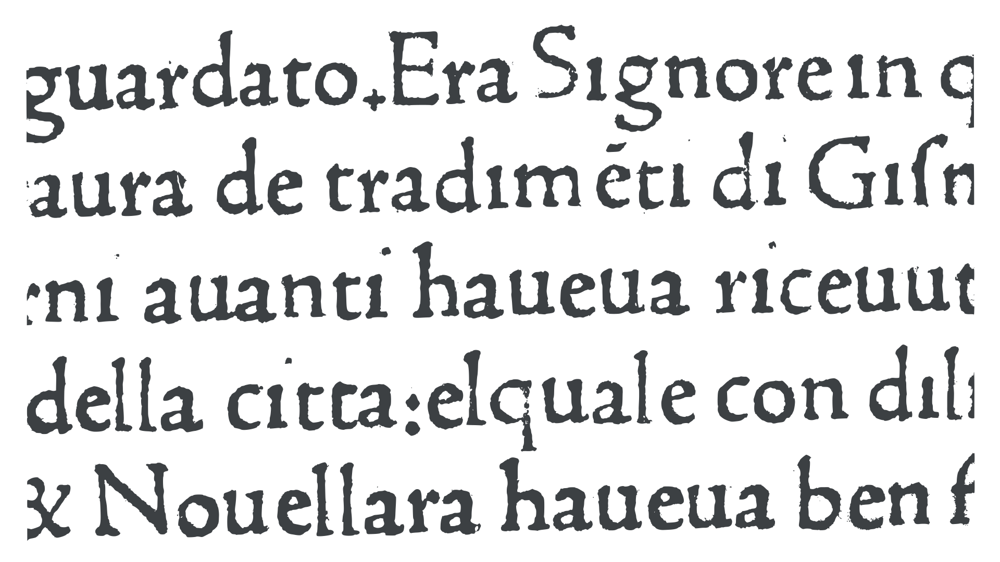
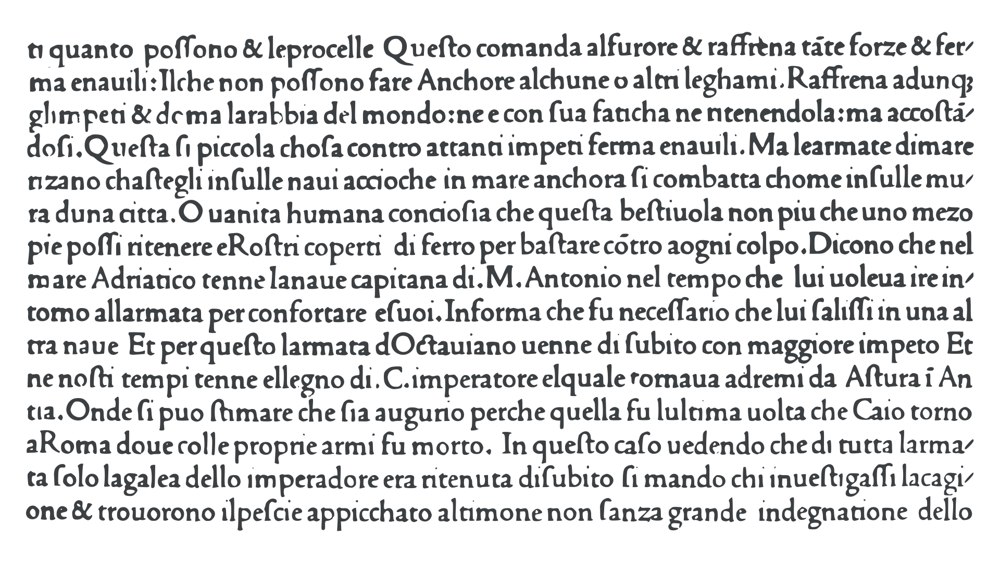

Imagine copying an entire book, letter by letter, word by word over hundreds of pages—by hand! Sometimes your hands and back would be sore—something that became a popular refrain for medieval copyists or scribes who, upon completion, often wrote, “three fingers write, but the whole body aches.” And, many centuries before electricity, when the sun set each day, you’d continue writing by candlelight. When you made a mistake, you’d take a small penknife and scratch away the offending ‘typo’, and try again. For more than a thousand years, that’s pretty much how books were reproduced. They were typically copied on-demand. So you’d first have to borrow a copy, then usually pay a professional scribe to copy it. Weeks, months, or even years later, your new book would be ready. This painfully slow and laborious process was costly, and was reflected in the price of books, which for centuries remained scarce and expensive.

In East Asia, that situation would change with the introduction of woodblock printing. By the ninth century, and likely even earlier, the Chinese were printing whole books with woodcuts. Entire pages were cut in relief in wood, inked, then printed by rubbing the back of the paper. The Chinese also invented printing with individual [characters](/glossary/character) that could be reused. In the mid-eleventh century, during the early Song Dynasty, Bi Sheng invented movable (or rearrangeable) type made from baked clay—although his invention, unlike woodblock printing, was not widely adopted. By the early thirteenth century, metal movable [type](/glossary/type) was being used in Korea. Movable type would not be adopted in Europe until the mid-fifteenth century. Its European inventor, or reinventor, was an ingenious German goldsmith and entrepreneur living in the city of Mainz.

Johannes Gutenberg, some time in the 1440s, found a way, using an ingenious handheld mold, to cast individual letters from an alloy mostly of lead and tin. This alloy has a low melting point and cools quickly, enabling Gutenberg and his team to rapidly produce hundreds of thousands of pieces of metal type. Another great thing about Gutenberg’s fonts was that they were recyclable. When the type became damaged or worn, then it could simply be melted down and recast into crisp new letters.

<figure>

</figure>

<figcaption>Movable type reproduces individual characters or glyphs as discrete pieces of metal type (also called sorts), printed in relief.</figcaption>

## The first European fonts

The very first fonts in Europe were modeled on contemporary gothic calligraphy—the kind used for formal documents and books. Gutenberg wasn’t trying to revolutionize the alphabet—his aim was to mass produce books. So it made complete sense to make his fonts resemble the [calligraphy](/glossary/calligraphy) that scribes used in manuscript or handwritten books—letters that readers were familiar with.

<figure>

</figure>

<figcaption>Typeface of the Gutenberg Bible, c. 1454</figcaption>

## The first roman fonts

Printing soon spread from Germany to neighboring countries, even crossing the Alps to the south and establishing itself in the Italian Peninsula by the early 1460s, where the combination of active trade routes and a vibrant financial environment supported new endeavors. Throughout Europe, for writing, various regional forms of gothic script were used. In Italy and the Iberian peninsula, a rounder and more open form of gothic called Rotunda was popular. It was used for most kinds of documents and books, but when it came to producing works by classical authors, the likes of Cicero, Seneca, and Lucretius, for example, then an entirely different kind of script was sometimes used. As a [typeface](/glossary/typeface), it eventually came to be called roman.

<figure>

</figure>

<figcaption>A typical 15th-century roman typeface</figcaption>

This new typeface was based on contemporary humanist script which was a hybrid that modeled its lowercase alphabet on the Carolingian minuscule, first developed in the eighth and ninth centuries under the rule of Charlemagne, but that really came of age during the twelfth-century. This particular late style of Carolingian minuscule was to prove incredibly influential as it was the style copied, developed, and promoted by the founder of the Italian Renaissance, Petrarch. From the 1450s, this lowercase alphabet was increasingly paired with Roman capitals based on those used in first-century Roman inscriptions. By the next decade, the two alphabets had evolved into a unified script, with the lowercase alphabet even taking on some of the characteristics of the Roman capitals, like [serifs](/glossary/serif), for example.

So, when the very first printers in Italy, German immigrants Arnold Pannartz and Conrad Sweynheym, set up their printing press in Subiaco in the hills outside of Rome, they began by printing the classical Roman authors. And they modeled their new typeface on contemporary humanist scripts. However, it’s important to note that the early roman typefaces, whether they be that of Sweynheym and Pannartz or the roman by Johannes da Spira in Venice (1469) appear not to have slavishly reproduced any single manuscript exemplar. Creating a typeface modeled on [handwriting](/glossary/handwriting) demands many compromises, and so it is better to think of the earliest roman types as ‘inspired’ by contemporary humanist scripts.

## Nicholas Jenson and the archetypal roman

The very earliest roman typefaces still displayed some Gothic characteristics, but a watershed in the design of roman typefaces came in 1470, when Frenchman Nicholas Jenson established a print shop in Venice. His new roman typeface pretty much erased any hint of Gothic script from its design, and the Jenson roman quickly became the model for scores of subsequent roman typefaces. As humanism and its enthusiasm for classical culture spread across Europe, the antique letters—roman fonts—went with them. For the humanists, Gothic represented the dark past, roman the bright new future!

<figure>

</figure>

<figcaption>Roman typeface by Nicholas Jenson (1476)</figcaption>

## Aldus Manutius

The early roman fonts of the fifteenth century are often called Venetian. Typically, they were rather low in [contrast](/glossary/contrast) (meaning that there was little difference between the thick and thin parts of letters), and this tended to make them appear a little [dark](/glossary/color) on the page. However, roman typeface design would undergo another change in the 1490s, when the great Venetian printer-publisher Aldus Manutius commissioned a new roman typeface from the Bolognese punchcutter, Francesco Griffo. The style is often associated with Bembo, a 20th century revival of Aldus’s roman typeface named after Cardinal Pietro Bembo, whose book _De Aetna_ (1496), was the first to be printed with this new typeface. Aldus’s new typeface united the designs of uppercase and lowercase letters by reducing the weight and height of the capital letters, reducing the overall contrast of the letters, and by making the serifs more uniform in design across both cases. These Aldine designs would go on to influence the great French [type designers](/glossary/type_designer) of the next century.

## Blackletter and roman today

These days, [blackletter](/glossary/blackletter) typefaces are seldom used to set long texts. Most readers are unfamiliar with the [letterforms](/glossary/letterform), and would struggle to read lengthy texts in blackletter. However, blackletter or gothic fonts are still popular for branding, associated with all-things medieval, horror literature and movies, heavy metal music, and even beer branding. And some of the oldest newspapers still use blackletter fonts in their mastheads. You might think that the use of blackletter serves to highlight the newspaper’s age, a way of telegraphing, ‘we have a pedigree, we’re well established.’ But Stanley Morison (1889–1967), a British historian of [typography](/glossary/typography), suggested instead that when newspapers commonly began to use blackletter mastheads from the 1700s, their publishers simply wanted the blackest, boldest font available—and, long before the advent of bold display typefaces in the 1800s, blackletter was the only style that fit the bill.
