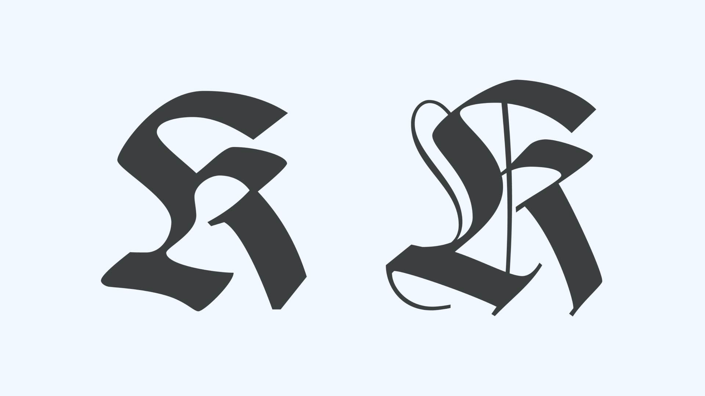
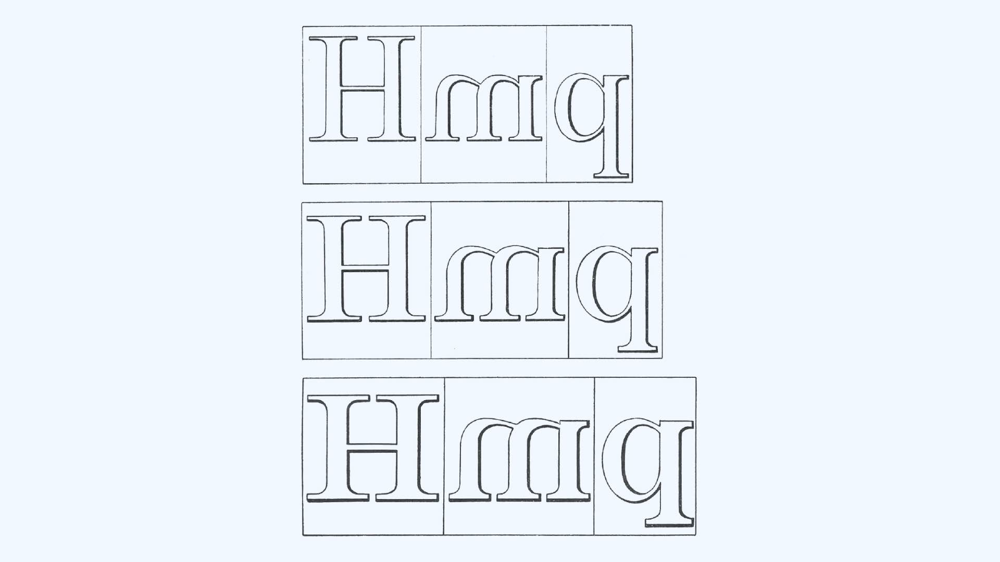
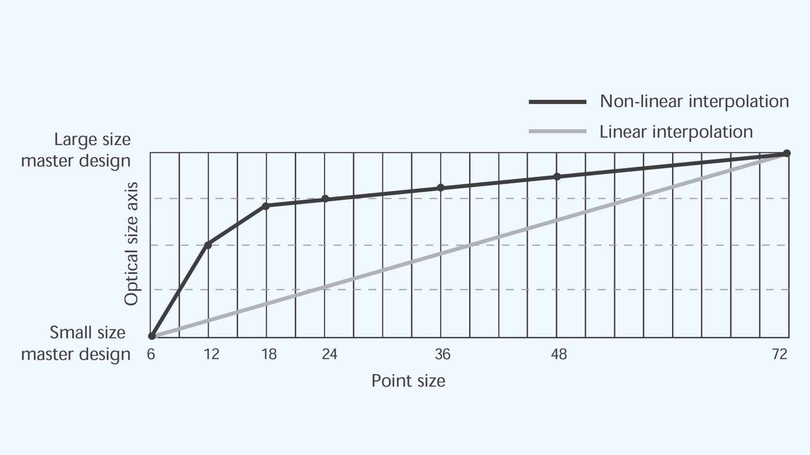
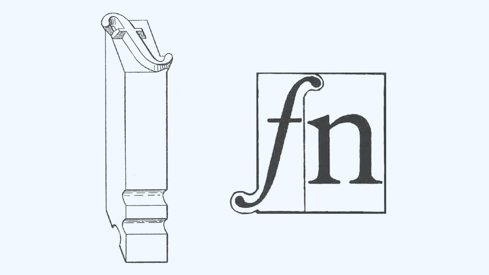
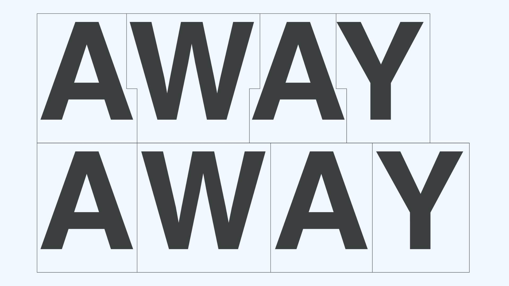
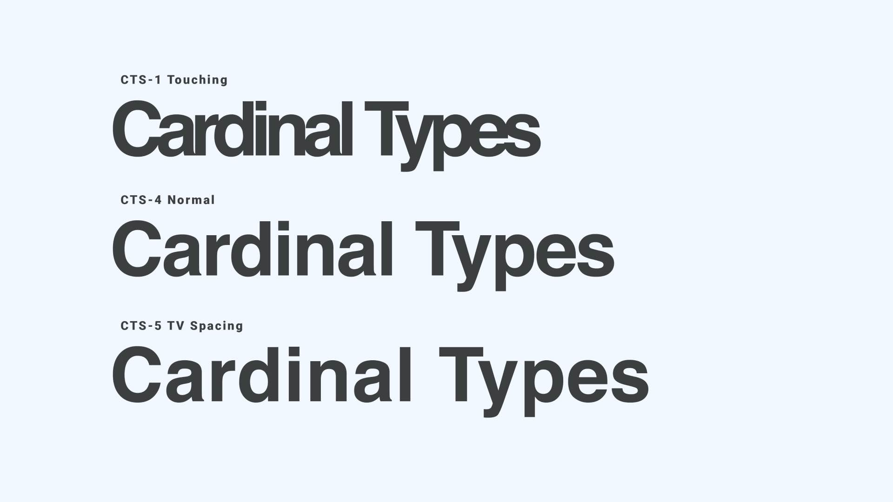
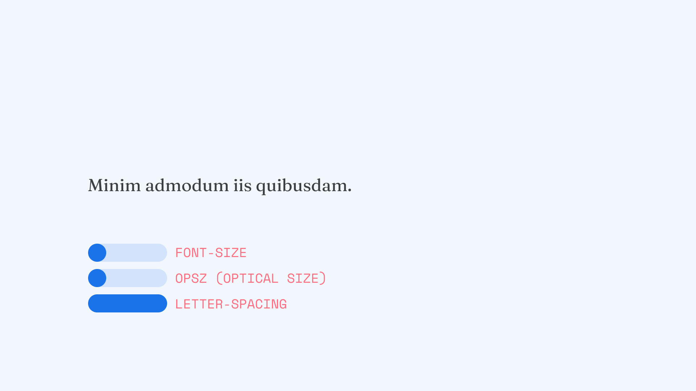

In the 1960s, the introduction of photo-typesetting made it possible to set type tighter than ever before. Over the next two decades, designers like Herb Lubalin and Tom Carnase used this new ability in letter spacing to create a (very cool) new aesthetic called tight-not-touching. Read on to find out how this style came to be and how variable fonts make it easier to achieve the look today.

<figure>

<figcaption>A modern interpretation of the “tight not touching” style, set in <a href="https://fonts.google.com/specimen/Fraunces">Fraunces</a>.</figcaption>
</figure>

## Letter spacing—linear scaling vs. optical scaling

What does scaling have to do with letter spacing?

When you change the font size in a document, the forms of the letters remain the same—they just get bigger or smaller. That’s called linear scaling (“scaling” type simply means enlarging or reducing it). But, because of inherent limitations of the human visual system—which responds in a nonlinear way to changes in scale1— letterforms behave differently at different sizes. Scaling that takes the human eye into account is known as non-linear scaling or [optical sizing](/glossary/optical_sizes). (Although, as Tim Ahrens notes, “Optical is not the most appropriate term here, since the issues involved are perceptual and related to human vision more than the laws of optics.”)3

In the digital age, we’re all accustomed to scalable type: When you create a document, you can make the text any size you like. But if you’ve ever tried to use a display typeface for a footnote, you may have found it difficult to read—the text can be too light overall, details like serifs can be insubstantial or disappear entirely, and the letters can seem to trip over each other. On the other hand, if you’ve ever set a headline in a typeface designed for long-form reading, it may have looked clunky—too heavy, with inelegant details and overly-wide letter spacing.

There are many factors involved in optical scaling, but here are some of the most important adjustments made to accommodate the eye.  At smaller sizes: letterforms are widened, [x-height](/glossary/x_height) is increased, [counters](/glossary/counter) are opened up, overall weight is increased, contrast (the ratio of thick strokes to thin ones) is reduced, and details of the design might be suppressed. At larger sizes, these changes are reversed: Letterforms are narrowed, x-height is decreased, counters are collapsed, overall weight is decreased, contrast is increased, and details of the design might be emphasized. Letter spacing is also a crucial variable in successful optical scaling: At smaller sizes, letters need more space so they don’t crowd together. At larger sizes, letters have a tendency to pull apart; too much spacing and they won’t cohere into words. So, letter spacing should be looser at small sizes and tighter at large sizes.

<figure>

<figcaption>Caption: Comparison of optical sizes in the metal version of Rudolf Koch's Wilhelm-Klingspor-Gotisch, from Size-Specific Adjustments to Type Designs (2014); looking at the smallest size, it’s easy to see the widened letterforms, increased weight, lower contrast, and suppression of details.</figcaption>

</figure>

Today, linear scaling is the norm and optical scaling is the exception, but because of the growing need for type fluidity on screen, that’s changing. And, it wasn’t always the case that linear scaling was more popular. Let’s take a look at the history of optical scaling and letter spacing in type design.

## The history of optical scaling and letter spacing in type design

### Hand punchcutting

From the fifteenth century until the middle of the nineteenth century, there was more or less one way to manufacture type: A steel punch was cut by hand, then struck or driven into a bar of a softer metal like copper to produce a “strike,” or unjustified matrix. After the matrix was trued up (or “justified”), it was fitted into an adjustable mold. Molten type metal (an alloy of lead, tin, and antimony) was ladled into the mold and an individual piece of printing type was cast from it.

This entire process happened at “actual size”—there was no enlargement or reduction. The punch, the matrix, and the resulting type were all on the same scale. Steel punches had to be cut by hand at every size that was going to be cast and each size of type had to be cut as though it were a new design. Under these circumstances, it would have been virtually impossible for punchcutters to reproduce exactly the same letterforms at different sizes even if they’d wanted to—and it seems they didn’t.  In fact, according to Harry Carter in “Optical Scale in Typefounding” (1937), “It is clear to anyone who can examine enlargements of hand-cut types that the good punchcutters varied the design, or at any rate the functional features of it, to suit the scale on which they worked. They did so instinctively because they corrected their work by eye, and they had the wisdom not to let mathematical rules override their judgment.”7

### Machine punchcutting

Despite some changes in the technology of type manufacturing, the basic paradigm of cutting by hand at actual size remained in place until the introduction of engraving machines in the late nineteenth century. Among the earliest (and certainly the most well known) of these was [Linn Boyd Benton](https://en.wikipedia.org/wiki/Linn_Boyd_Benton)’s [vertical pantograph](https://www.circuitousroot.com/artifice/letters/pantocut/benton/vertical/index.html), invented around 1883.

To cut a steel punch on the Benton pantograph, the operator traced the outer contours of a pattern with a stylus or “follower” mounted on the lever arm of the engraving machine. This transferred the motion to a tiny rotating cutter overhead, which in turn reproduced the operator’s movements on a reduced scale. This procedure was repeated several times, with different sizes of followers and cutting tools, until a steel letter in relief was produced.

Before the pantograph, optical scaling didn’t call for any special technology. Each size of type was cut separately by hand, so the punchcutter made the necessary adjustments by eye. Said Raph Levien in “The Bentons: How an American Father and Son Changed the Printing Industry,” “[The challenge was] making the various sizes consistent, or at least harmonious.” With the pantograph, the challenge was reversed: different sizes were reproduced mechanically from a single pattern plate, so consistency of design was automatic, but without additional intervention, there was no optical scaling. According to Harry Carter in "Optical Scale in Typefounding,” “Now that punches [were] cut under industrial conditions by a mechanical process it [was] easy to make the various sizes perfectly uniform—easier, in fact, than to differentiate them.”

“In practice, though the manufacturers had the sense to see that restraint was needed...and they accepted the fact that they must continue the traditional practice of ‘optical compensation,” said Walter Tracy in “Letters of Credit: A View of Type Design.” The conservative practice of the industry at the time was to use a pattern for only two or three sizes of type: “It is not possible to use the same [pattern] upon a punch-cutting machine for a large range of reduction, but, in order that the type may appear similar, other [patterns] must be provided of the proper proportions,” he said.

<figure>

<figcaption>Patterns for different sizes of type: from top to bottom, 12 pt., 9 pt., and 6 pt. From Typographical Printing-Surfaces (1916).</figcaption>

</figure>

### Steam-powered algorithms

Linn Boyd Benton had a more interesting solution: In his system, “All regular type sizes” were, in fact, cut from one pattern, but fine-grained adjustments were made at the engraving machine to cut the letter “proportionately more extended or condensed, and lighter or heavier in face, than the pattern. All these variations are necessary for the production of a properly graded modern series containing the usual sizes. In fact, on account of the laws of optics...only one size of a series is cut in absolutely exact proportion to the patterns.” These decisions weren’t left up to the engraving machine operator, though. Benton himself formulated ratios for optical scaling, codified in his “engraving factor tables,” and “engraving instructions or ‘cutting slips’ were written out for each size of each typeface. These slips guided the engraving machine operator in choosing the proper followers, cutting tools, engraving depth, and other variables.”

The original engraving factor tables are gone (many of Benton’s original notes and papers were lost when ATF moved from Jersey City to Elizabeth in 1935), but [Raph Levien](https://raphlinus.github.io/), a Google Fonts team software engineer who admires Benton’s work, thinks that “It is possible today to analyze and reconstruct [Benton’s] techniques...based on contemporary descriptions of the machines, cutting slips and other documentation  from ATF’s type production operations, and careful scanning of printed results.” Levien sees the Benton pantograph as “a sophisticated, special-purpose ‘analog computer,’ encoding algorithms for type design, particularly optical scaling, into the workings of its machinery.” The two basic algorithms built into the engraving process were anamorphic scaling, which expanded or condensed the letterform while changing its scale, and a form of stroke offset, which controlled stroke weight and contrast. Levien believes that “These algorithms, if properly implemented and applied, would yield results superior to most digital typography produced today, while requiring significantly less labor and expertise than competitive solutions for optical scaling.”

### Photo-typesetting

By the middle of the twentieth century, more and more printing was being done by [offset lithography](https://en.wikipedia.org/wiki/Offset_printing), which required that a plate be exposed to a photographic positive or negative, so it was only a matter of time until photo-typesetting systems emerged to produce “camera ready” type photographically. The era of “hot type” (letters cast from matrices in molten type metal) gave way to “cold type” (letters initially stored as photographic negatives and later as electronic data beamed onto [CRT](https://en.wikipedia.org/wiki/Offset_printing) screens).

The bewildering diversity of photo-typesetting systems over the relatively brief lifespan of this technology (early 1950s–late 1970s) makes an adequate summary of their operation impossible, but this is the basic principle: A photo-typesetter flashed light through a film negative of an individual character from the font—whether negatives were stored on a disc, a strip, a grid, or some other format. (Each manufacturer had its own; creating a unique storage format allowed them to steer clear of existing patents). The negative passed through one or more lenses that magnified or reduced the character image and exposed it onto a roll of photographic paper. After the paper was processed, it was ready for [paste-up](https://en.wikipedia.org/wiki/Paste_up).

According to Charles Bigelow in “Technology and the Aesthetics of Type,” as photo-typesetting came of age: “The manufacturers of typesetting machines had to make an important decision: whether or not to carry forward into the new system the principle of optical compensation, when the plain and tempting fact was that [the lens systems built into the photo-typesetters were] capable of producing a considerable range of type sizes from just one font.” Of the many manufacturers of photo-typesetting systems, “only Alphatype never took advantage of this capability of photographic typesetting. [Their] phototypesetters used a separate photographic master for each size to be set, and [they] adopted the hot metal tradition of creating different master character designs to cover various ranges of type sizes. The other manufacturers moved increasingly toward machines which could produce the entire range of type sizes...from a single font master.”

The user did sometimes have the option of optical sizes: the original Mergenthaler Linofilm, for example, offered “A” (small text sizes), “B” (large text sizes) and “C” (display) masters, and the company continued to offer them on later models. But “using three type masters rather than one [required] that the user buy three times as many type fonts and [gave] him only one-third as many fonts available on the typesetter at one time. Very few users have valued type aesthetics sufficiently to make this trade-off.”

### Digital fonts

In early digital typesetting, a sort of optical scaling reemerged briefly. Rudolf Hell’s Digiset, for example, the first of the early digital typesetters (which substituted [raster](https://en.wikipedia.org/wiki/Raster_graphics) fonts stored in computer memory for the photographic negatives in earlier photo-typesetters) used more than one master design. In Allen V. Hershey’s early experiments with [vector](https://en.wikipedia.org/wiki/Vector_graphics)-based type designs, he effectively designed different optical sizes of serif type. And of course, early screen fonts, like those [Susan Kare](https://en.wikipedia.org/wiki/Susan_Kare) designed for the original Apple Macintosh, were [bitmaps](https://en.wikipedia.org/wiki/Computer_font#BITMAP), so each size had to be drawn separately.

For the most part, though, digital fonts have had only one optical size, perpetuating what Ladislas Mandel called the “original sin” of photo-typesetting, as related by Yannis Haralambous in “Fonts & Encodings” This, in fact, was the whole point of Adobe’s device-independent [Postscript font format](https://en.wikipedia.org/wiki/PostScript_fonts), which stored letterforms as a series of straight lines and cubic [Bézier curves](https://en.wikipedia.org/wiki/B%C3%A9zier_curve): unlimited linear scalability. The same outlines could be printed at 300 dots per inch on a desktop laser printer like Apple’s original [LaserWriter](https://en.wikipedia.org/wiki/LaserWriter) or at 2,540 dots per inch on a professional imagesetter like the [Linotronic 300](https://en.wikipedia.org/wiki/Linotronic).

But relying on linear scaling, Walter Tracy reminds us in “Letters of Credit:” “Inevitably impairs all faces to some degree.” Writing in 1986, Tracy seems to look forward to—and perhaps beyond—Adobe Multiple Masters (the next chapter of our story) when he prophesies that “not until the suppliers of high-resolution fonts adopt the principle of separate masters, each proportioned for a narrow band of sizes, will their claim that their faces are superior to the metal versions be justified in all respects.” Later he expressed his hope that “before long electronic typesetting systems will be equipped with a complete modulation program so that all the aspects of a type—its x-height and stroke weights, and its internal as well as its external spaces—will be automatically adjusted according to type size, so as to maintain a proper balance of all the elements of the design.”

### Adobe Multiple Masters

In 1991, Adobe introduced the [Multiple Master](https://en.wikipedia.org/wiki/Multiple_master_fonts) format, an extension to their PostScript Type 1 font format, realizing at least part of this hope. There were several applications envisioned for this technology, but at Adobe, [says David Lemon](https://vimeo.com/111311809#t=730s), former head of Adobe Type, “some of us were most excited about enabling designs optimized for the specific size being used—a capability that the metal punchcutters always had, but got lost along the way with photo-type.” Multiple Masters put optical scaling into the hands of the user of digital type.

Each Multiple Master release would include two or more manually designed masters at opposite ends of a “design axis” representing some attribute—for example, a weight axis (light to black), a width axis (condensed to extended), or an optical size axis (6 pt to 72 pt)—and allowed the end user to “interpolate,” or generate intermediate instances, between the masters.

A Multiple Master typeface could include multiple design axes. The user would dial each attribute to the desired value and generate an “instance”—an individual font file with that combination of attributes. Minion MM, for example, had three design axes—weight, width, and optical size—so a user might generate an instance with a weight of 345, a width of 450, and an optical size of 12. Depending on the typeface, there could be hundreds or thousands of possible instances.

The designer of a Multiple Master typeface could also define a non-linear “axis map” for any given design axis. Instead of constant, linear interpolation between one master and another, the rate of interpolation could be tweaked. This was particularly relevant to optical scaling, where more interpolation would be necessary between small point sizes (e.g. between 6 and 12 pt) than between larger sizes (e.g. between 12 and 18 pt or 18 and 72 pt).

<figure>

<figcaption>Optical size axis map, from Designing Multiple Master Typefaces (1997).</figcaption>

</figure>

Does all of this sound complicated? Many Adobe customers at the time thought so too. Without much application support, Multiple Master interpolation features were awkward to use. “Users were forced to generate instances for each variation of a font they wanted to try,” [says Tamye Riggs](https://blog.typekit.com/2014/07/30/the-adobe-originals-silver-anniversary-story-how-the-originals-endured-in-an-ever-changing-industry/), “resulting in a hard drive littered with font files bearing such arcane names as MinioMM_578 BD 465 CN 11 OP. Rather than deal with such cumbersome logistics, users would often stick with the pre-generated instances” that shipped with Multiple Master releases.

In October 1999, Adobe announced that it would no longer be developing new Multiple Master fonts. Interpolation between masters, however, continued to be an important production tool for type designers behind the scenes—and more recently, the idea of putting interpolation into the hands of end users has been given new life by version 1.8 of the [OpenType specification](https://docs.microsoft.com/en-us/typography/opentype/spec/), which introduced [OpenType Font Variations](https://docs.microsoft.com/en-us/typography/opentype/spec/otvaroverview)—better known as [variable fonts](/glossary/variable_fonts).

### Letter spacing before photo-type

We’ve already touched upon letter spacing as an aspect of optical scaling, but how were letters spaced in the pre-photo era? Until about 1845, type was made by cutting a letterform into a steel punch, which was hardened, then struck into a bar of copper to produce an unjustified matrix, which then had to be trued up or “justified” by careful filing and trimming before being fitted into an adjustable mold to cast type. But justifying a matrix was not a straightforward, mechanical operation; the work was exacting and laborious. Everything had to be squared up perfectly; the depth of strike had to be consistent with all the other matrices (otherwise, when cast, some letters would fail to print, while others would get too much pressure); the space above and below the letterform had to be adjusted so that it would align properly with the other letters; and finally, the fixed space on either side of the letter (“side-bearings”) had to be established. This would determine the “fit” (inter-letter spacing) of the type. “In the amount of side-bearing lies the artistry in fitting type,” wrote Joseph Blumenthal in “The Fitting of Type.”

Each “letter” (the “face,” or actual printing surface, of the type), along with the “shoulder,” the non-printing area around the letter, including its side-bearings, was contained within a “rectangle” (the “body” of the type). It was impossible for this rectangle to overlap the rectangle before or after it. A letter could, however, be cast so that its face projected beyond its body to the right, left, or both. The overhanging bit was called a “kern,” and the phenomenon was called kerning; it was often done with the roman “f” and “j,” and with some italic letters. (Very rarely, but more often in early printing, some letters kerned above or below the body, which was called “bearding.”) Linecasters like the Linotype could not cast kerned type.

<figure>

<figcaption>Kerned type.</figcaption>

</figure>

It was easy to add letter spacing to metal type; spacing material of the desired width was simply inserted between the letters. Removing letter spacing was also possible, but it was much trickier. Type could be “mortised” by physically removing the metal that separated the letters, either manually with a printer’s saw or with a specialized machine like the [Rouse Type Mortiser](https://www.circuitousroot.com/artifice/letters/press/typemaking/after-casting/mortising/rouse/inst-and-print/index.html). Given the labor involved, mortising was rarely done—usually for combinations of capitals like TA, AT, PA, VA, WA, and YA in display type.

<figure>

<figcaption>Above: mortised type. Below: unmortised type. From ad for Rouse type mortiser, Western Newspaper Union Catalogue of Printing Machinery and Supplies (1953).</figcaption>

</figure>

### “Tight Not Touching”

Photo-typesetting did away with many of the spacing constraints of metal type. For the first time, it was possible to set type as tightly as one liked, even touching—or overlapping. In the photo-typesetting years, most designers still had to “spec” type, ordering it from a typesetting service rather than setting it themselves. At the time, a common specification for the spacing of display type was “tight not touching,” frequently abbreviated “TNT,” which meant reducing letter spacing to a bare minimum, but with none of the letters actually touching. In 1983, for example, one typical photo-typesetting service offered five spacing options: “touching,” “tight with discretionary touch,” “tight not touching,” “normal,” and the widest option, “TV” (for television [supers](https://en.wikipedia.org/wiki/Lower_third)).

<figure>

<figcaption>Spacing options, from Cardinal Type Service catalog (1983).</figcaption>

</figure>

The “tight not touching” phenomenon is strongly associated with the rise of photo-typesetting in the 1960s and 1970s, but as [Paul Shaw points out](https://www.paulshawletterdesign.com/2011/11/tutorial-no-6%E2%80%94tight-but-not-touching-kerning/), Herb Lubalin was already experimenting with the style in the 1950s, adjusting repro proofs of foundry type with a razor blade to achieve tighter spacing. It wasn’t until the introduction of visually-spaced display typesetters like the Photo Typositor, though, that the style came into its own. Seated at the Photo Typositor, the operator could watch each letter through a viewer as it developed, then use that letter to visually position the next (reads a company brochure from the time: “a completely visible developing chamber develops each letter individually and instantly as it is exposed. You see every letter, every space, every word in the viewing chamber as you compose”).

The vogue for tight spacing became so entrenched during the 1970s that by 1980, Allan Haley’s photo-typesetting handbook had to remind designers that “tight isn’t necessarily right,” warning them that “it takes a sensitive and highly trained eye to set tight display type,” and that “many typefaces, no matter how carefully they are set, are simply not conducive to tight display typesetting.” Hermann Zapf was less measured about TNT setting, or what he disdainfully called “sexy spacing.” This fashion for crowding letters together was an “infection,” he said in an article for The Washington Post titled, “For Love of Letters.” “The Americans, Madison Avenue, invented sexy spacing, as it's called, the letters actually kissing. It's too close, you can't read it easily...Look at the subway signs. They’re too narrow. They need air between the letters.” In the sixth of his “Ten Commandments of Photo-Typesetting,”, he implored designers to space their lowercase letters “in a discreet and neighborly manner, encouraging the occasional handclasp of outstretched arms, but loathing the intimacy of touching bodies,” and not to “deprive...caps and small caps of space in which to breathe.”

## “Tight not touching” today

We can reproduce the “tight-not-touching” aesthetic of the 60s and 70s on the web by combining large font size with decreased letter spacing. In the illustration below, notice the difference turning on letter spacing makes to the visual impression of the headline. (Tight spacing looks great in a headline setting, but be sure to remove the negative letter spacing in smaller settings meant for continuous reading.)

And variable fonts can now automatically map optical size to font size. For example, beginning in iOS 14, Apple provides the [San Francisco](https://en.wikipedia.org/wiki/San_Francisco_(sans-serif_typeface)) and [New York](https://en.wikipedia.org/wiki/New_York_(2019_typeface)) fonts as variable fonts that merge the discrete optical sizes like Text and Display into a single, continuous design. This application of variable fonts allows each glyph or letterform to map the spacing, anatomy, and contrast properties of an optical size to the defined font size. InDesign has supported [the mapping of optical size to font size](https://helpx.adobe.com/indesign/using/using-fonts.html#automap) since v16.2.1. In the example below, note how Fraunces’ spacing gets tighter as the font size is increased.

<figure>

<figcaption>Adjustments to font size, the Optical Size axis (OPSZ), and letter spacing when setting [Fraunces](https://fonts.google.com/specimen/Fraunces?) at different sizes.</figcaption>

</figure>
