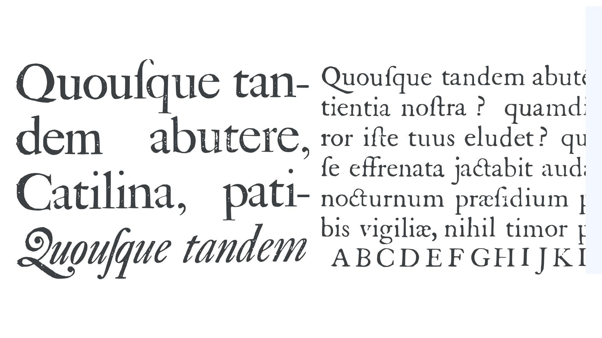

In Europe, by the seventeenth century roman fonts outnumbered [blackletter](/glossary/blackletter). And throughout most of Europe, besides in German speaking lands and parts of Northern Europe, roman fonts were now the natural first choice for most kinds of documents and books.

The seventeenth century marked an explosion in printed matter, from broadsides and standalone art prints to books and pamphlets, leading some to complain that this glut would ultimately devalue books. Gottfried Leibniz, the famed seventeenth-century polymath, famously bemoaned the “horrible mass of books which keeps on growing.” However, this flood of books not only got people thinking about how to better catalog and categorize books (leading eventually to the discipline of bibliography), but it also affected book design and drove the demand for new typefaces.

## Constructed alphabets

In 1692, during the reign of Louis XIV, the French Royal Academy of Sciences  commissioned a typeface family for the Imprimerie Royale, the King’s official printer in Paris. Produced by a committee, the typeface best-known as the _romain du roi_ or King’s Roman marks a watershed in typeface design. The King’s Roman was designed on a grid, very much like a sheet of graph paper. This approach to letter design was not entirely new. Already in the fifteenth and early sixteenth centuries, artists, architects, and mathematicians had recreated [Latin](/glossary/latin) alphabets on geometric principles. Two centuries earlier, the calligrapher and poet Felice Feliciano, the architect Leon Battista Alberti, the mathematician Luca Pacioli, and the brilliant German artist and printmaker Albrecht Dürer produced constructed roman alphabets based on a square and drawn ostensibly with compass and straight-edge alone. However, those alphabets appeared to have had no appreciable influence on contemporary type design, remaining little more than textbook novelties. However, the new King’s Roman, the first actual typeface to fully implement these rational design principles, was to prove remarkably influential.

<figure>

</figure>

<figcaption>From a geometrically constructed alphabet by Albrecht Dürer (1525).</figcaption>

When we say ‘rational’ or ‘rationalized’ with regard to type design, we are describing the underlying or guiding design principles behind the design of the letterforms. So, for example, in earlier romans, we can still see the influence of the broad-nib pen. Rationalization is about removing or turning down the dial on these calligraphic or [handwritten](/glossary/handwriting) features of the design. The resulting typefaces then appear rather more machine-made than hand-made.

<figure>

</figure>

<figcaption>Bracketed serifs.</figcaption>

## Dutch type

The sixteenth century was a period of rapid expansion in the printing industry, and with it the demand for more type. By the seventeenth century, important centers of typefounding appeared beyond the Italian Peninsula and France, most notably throughout the Low Countries. Among a number of talented [type designers](/glossary/type_designer) working in the Low Countries at this time was Christoffel van Dijck. He established a type foundry in Amsterdam in 1647. In his roman type designs, his lowercase letters are a little narrower, and some of his capitals wider; and, overall the letter-spacing is a fraction tighter than in most of the earlier French designs. This combined with a slightly lower [x-height](/glossary/x_height) (or shorter extenders) makes the type feel, as it’s often described, ‘compact’ or ‘robust.’ When Van Dijck died in 1669, his son briefly took over the business, but then when he too died within three years of his father, everything went up for auction, and most of the type was bought by the Elzevirs, the famed Dutch printer-publishing dynasty.

## Transitional type

In the eighteenth century, two other type designers appeared who would leave a lasting impression on the field of type design. William Caslon, from Worcestershire in the English West Midlands, first turned to punchcutting in the 1720s. His typefaces display some French influences, but are predominantly inspired by Dutch types like those of Christoffel van Dijck. When Caslon began designing typefaces, the former Dutch designs were among the most popular in England. Caslon’s designs were also influenced by contemporary calligraphy, notably the fashion for Roundhand, a rounded, formal, high contrast calligraphic script, whose aesthetic appears to have influenced Caslon’s letters—both roman and italic. Caslon’s romans are among the last of the great and popular Old Style typefaces. Caslon was most famously used in the first printed version of the United States Declaration of Independence printed in July, 1776.

<figure>

</figure>

<figcaption>Roman and italic typefaces by William Caslon, c. 1734.</figcaption>

After making his fortune in japanning (varnished lacquerware), John Baskerville, from the emerging industrial city of Birmingham, also in the West Midlands, turned to printing in the 1750s. He was an exceptional typographer and had very clear ideas about how his pages should appear: High contrast letters, plenty of white space, and very crisp printing. He achieved his typographically light, bright, and spacious pages not only by designing his own typefaces, but also by producing new inks and papers.

<figure>

</figure>

<figcaption>A modern revival of Baskerville’s roman and italic.</figcaption>

Typically, rougher paper requires more pressure from the printing press to ensure even printing. However, higher pressures also means more ‘ink squeeze’ (the amount ink bleeds into and spreads across the paper). Baskerville collaborated with paper maker James Whatman to produce a new kind of smooth paper often called ‘wove paper.’ We can think of smoother paper in letterpress printing as analogous to higher screen resolution, with smoother paper being able to support printing of finer or sharper detail in much the same way as more pixels are able to reproduce finer details on screen. With new inks and very smooth new paper only gentle pressure from the press (called a kiss impression) was required, thus reducing ink squeeze and making for a beautifully crisp print. Benjamin Franklin, at the time living in England and paying frequent visits to Baskerville, was among Baskerville’s most enthusiastic patrons and advocates. Others, however, were critical of Baskerville’s type, complaining that the contrast in his typefaces was so high that reading them could hurt your eyes! In overall design, Caslon’s were more influenced by Dutch designs, whereas Baskerville owes more to Garamont and his contemporaries, and to pioneering [Transitional](/glossary/transitional_neo_classical) typefaces like the King’s Roman. 

<figure>

</figure>

<figcaption>From the fifteenth century the stress of letters moved from oblique to upright.</figcaption>

The King’s Roman and Baskerville are known as ‘Transitional’ typefaces because they sit between Old Style and Modern typefaces. From the first romans of the fifteenth century to those of eighteenth, the predominant design trend was a move to upright stress ([axis](/glossary/axis_in_type_design) of rounded letters moved to the perpendicular), and higher [contrast](/glossary/contrast) letterforms with sharper details—a trend that would be further exploited by the likes of Giambattista Bodoni and Firmin Didot in their so-called Modern typeface designs.
