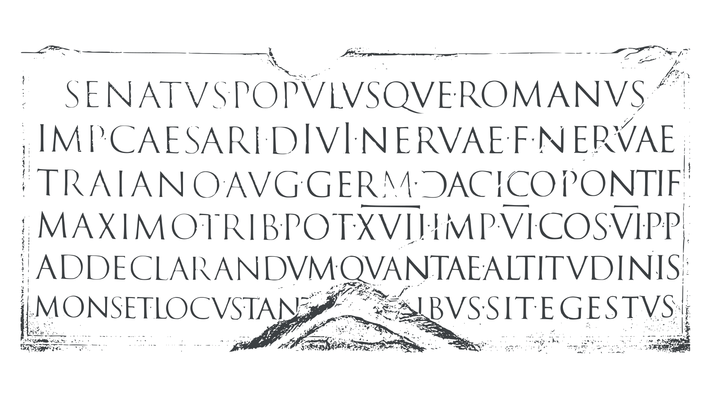
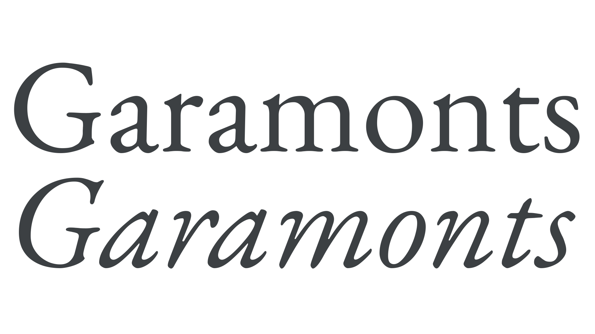
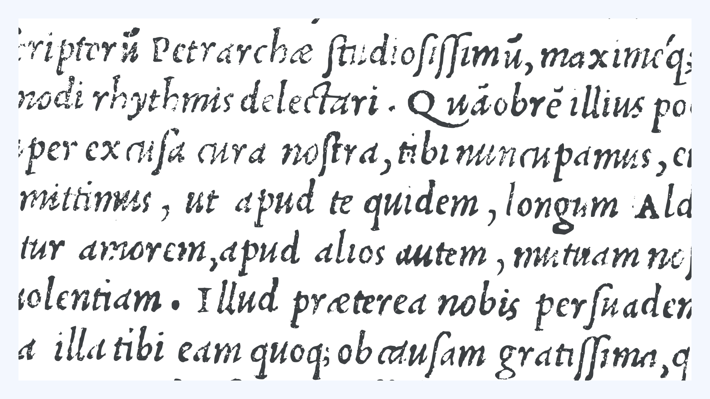

We can be thankful to the Romans for a number of technological innovations and inventions, including aqueducts, sanitation, irrigation, medicine, education, calendar reform, and even underfloor heating. However, there is yet another Roman invention that is even more familiar and ubiquitous. Adapted from the [Greek](/glossary/greek_script) alphabet, in turn borrowed from the Phoenicians, it’s the [Latin](/glossary/latin) or Roman alphabet. Take a trip to Rome, and you can still see one of the finest examples of these letters inscribed on the base of Trajan’s Column, completed in 113 CE. But these letterforms, or ‘monumental capitals’, went the way of the Roman empire, and eventually fell out of use, evolving into numerous entirely different regional scripts.

<figure>

</figure>

<figcaption>Roman square capitals from the base of Trajan’s Column in Rome, c. 113 CE.</figcaption>

## Renaissance influencers

From the fourteenth century, beginning in Florence, Italy, those letters would be given a second life by the humanists. Humanism was a new intellectual movement that arose in Italy in the late fourteenth century, and was the driving force behind the Italian Renaissance. Those humanists considered Greco-Roman antiquity to be a golden age tragically extinguished with the fall of the western Roman Empire in the fifth century CE. They saw the time period from the end of Roman influence to their own day as a kind of ‘middle’ or ‘dark’ age. They made it their mission to rescue classical scholarship, language, and art. For the humanists, gothic script, a product of the Middle Ages, needed to be replaced with something more Roman, in much the same way that they believed gothic or medieval architecture should be replaced by classical designs.

In the fifteenth century, when Europeans first began printing, almost all books and documents were written in various forms of gothic script, so it was entirely natural to make printed books and documents resemble what everyone was familiar with—and so printers used gothic or [blackletter](/glossary/blackletter) fonts. During the fifteenth century, only a small fraction of books used roman [typefaces](/glossary/typeface). Even in Italy, the birthplace of the humanist script, Roman type was typically reserved for works by classical authors—Roman authors, Roman type! But almost everything else, from law books, to vernacular texts, religious books, and books for students, was invariably printed with blackletter fonts. 

But in the sixteenth century, especially from the 1530s, the balance continued to shift away from blackletter to roman typefaces. Why did that happen? What changed? Well, every age has its influencers, and the fifteenth and sixteenth centuries were no different. During the early years of print, we might say that the humanists were the predominant influencers in Europe.

## Garamont and Co.

By the end of the fifteenth century, not only did the cities of the Italian Peninsula constitute the major print center of Europe, but they were also the foremost suppliers of typefaces. However, from the 1530s that began to change, and soon most typefaces were designed and produced in France. Part of this was due to the rise of France as a major economic hub and center of print. Also, especially in Paris, experiments began in printing books historically always printed in gothic, like prayer books, with roman typefaces. The wider adoption of roman type was also influenced by humanist and philologist Geoffroy Tory who, in his 1529 book _Champfleury_, championed both the French vernacular and the use of roman typefaces. The adoption of roman type was also accelerated by the French Court’s insistence that works in the vernacular (in French) be printed in roman types, rather than blackletter. Among those to satisfy the growing demand for roman typefaces was a new generation of punchcutters. Among them were Claude Garamont (also spelled Garamond), Robert Granjon, Antoine Augereau, and Pierre Haultin, to name a few.

<figure>

</figure>

<figcaption>EB Garamond, a modern revival of Claude Garamont’s roman and italic.</figcaption>

The designs of Garamont and his talented French contemporaries soon replaced those of Aldus, first in France and eventually even in the Italian Peninsula. They would prove remarkably influential, spawning scores of roman typefaces in the new French Renaissance style. They differed most markedly from their predecessors by having higher [contrast](/glossary/contrast) and more refined modulation. This feature combined with looser letterspacing affects the overall typographic [color](/glossary/color) of the page, making it lighter in appearance. Again it’s an example of a deliberate move away from the gothic aesthetic to a lighter, airier, more ‘classical’ typographic page.

## Inventing italic

The sixteenth century also gave us [italic](/glossary/italic). The great Venetian printer Aldus Manutius commissioned the Bolognese designer and punchcutter Francesco Griffo to create a new typeface for a new series of small-format books—smaller than modern-day paperbacks—first published in 1501. This new typeface was based on a cursive form of humanist minuscule (a kind of cursive Renaissance version of Carolingian minuscule), a slightly less formal and more quickly written style of [handwriting](/glossary/handwriting) initially promoted by Renaissance scholars like Niccolò Niccoli, and later adopted by diplomatic chanceries, including the Papal Chancery. For this reason, it later came to be known as cancellaresca corsiva or chancery cursive. The typeface based on the early forms of these scripts was called Aldine or Aldino in Italy, while elsewhere it came to be known as italic (literally, ‘from Italy’). Perhaps Aldus used this new typeface to make his new small-format books appear a little less formal. The other way he achieved this was by doing away with the lengthy commentaries that typically accompanied these classic texts—with the dual benefit of saving space and making the text appear a little less intimidating, and so accessible to a wider audience.

<figure>

</figure>

<figcaption>Italic typeface by Francesco Griffo and Aldus Manutius.</figcaption>

The first italic typefaces were paired with upright Roman capitals, but within a couple of decades, they were typically paired with newly designed sloping capitals, which soon became the norm.

## Roman and italic today

Nowadays we typically don’t follow Aldus’s example and set entire books in italic—although who’s to say you shouldn’t! Instead, italic has long since been relegated to a secondary or supporting role to Roman. We use it for emphasis, for foreign loan words or phrases, _par exemple, en français_, for quotations, and for things like book, magazine, and movie titles. We might also use it as a standalone typeface on a book cover or for some other display purpose.
