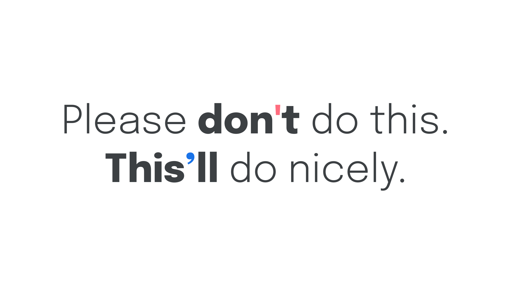
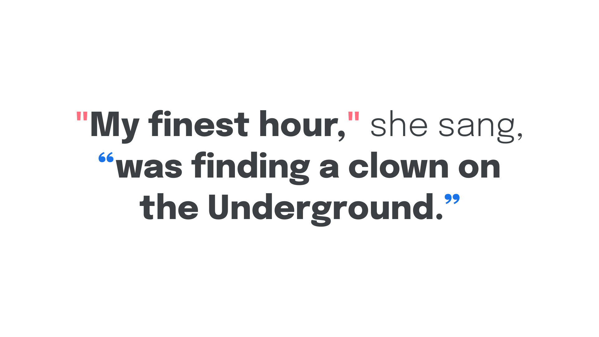
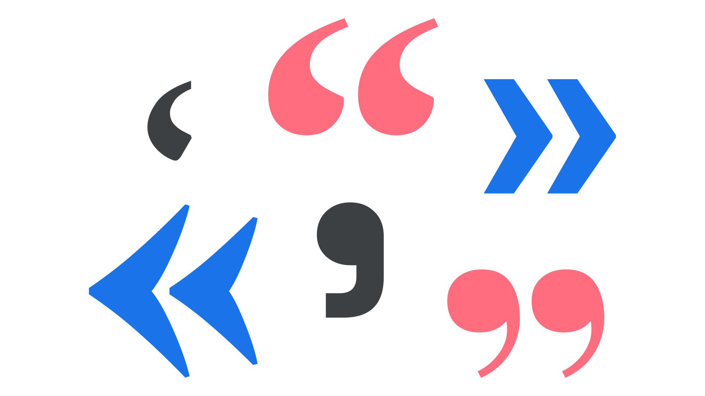
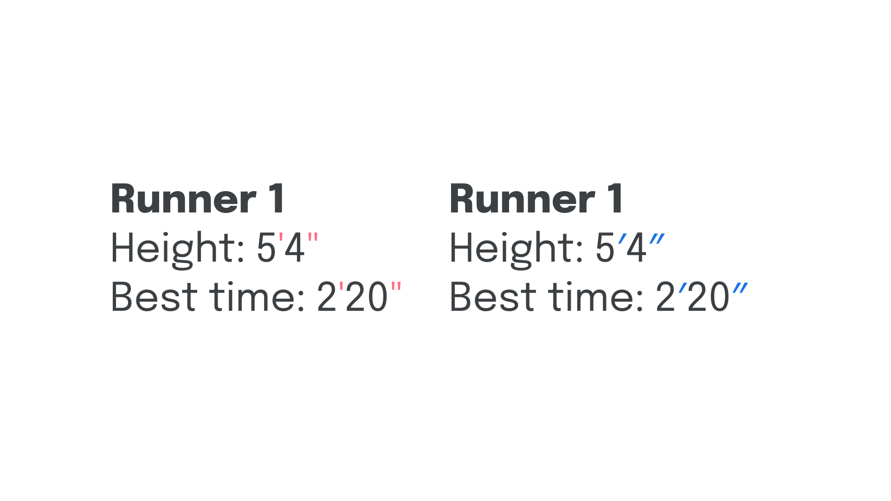
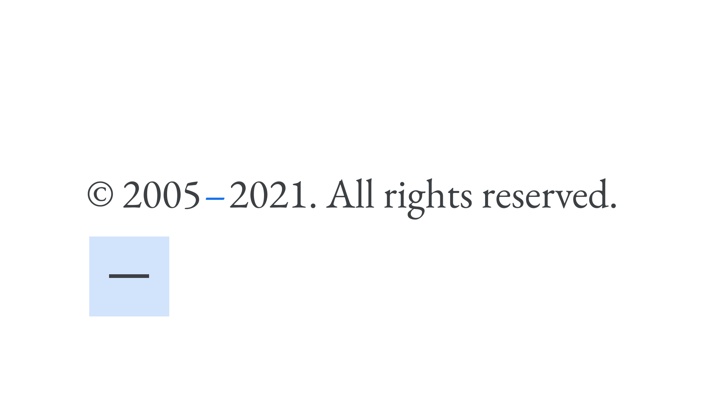
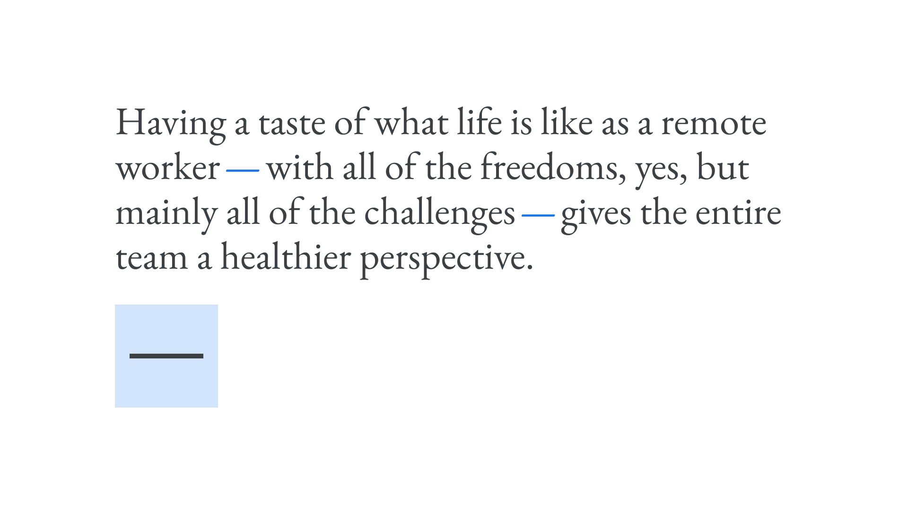
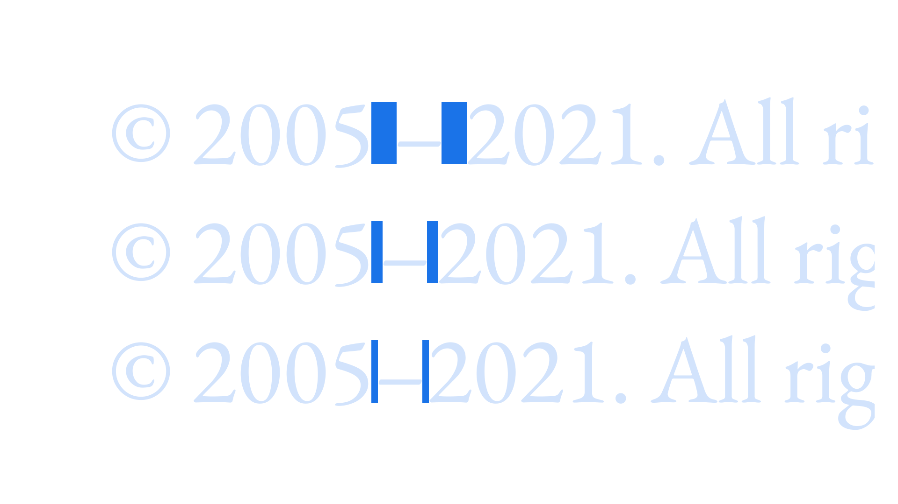

Punctuation matters because it conveys pause and effect to the reader, and mastering it walks the fine line between a skill for [typographers](/glossary/typographer) and a skill for copywriters (and copyeditors). Ideally, it’s one that should be possessed by all. While copywriters can focus on correct punctuation usage to convey meaning through sentence structure, designers can focus on ensuring the correct [glyphs](/glossary/glyph) are rendered as—and when—required.

With this in mind, this article will focus only on the *typographic* considerations of punctuation. As such, we’ll concern ourselves primarily with apostrophes, quotation marks, primes, dashes, and spaces. Using the correct marks is important: Mathematicians, geographers, and many other trades need that distinction. Some typefaces designed specifically for scientific use run into the thousands of glyphs in order to be able to express scientific facts, measurements, relationships, etc.

For a guide on how to type the correct character on a US-English keyboard, please visit [Jessica Hische](https://jessicahische.is)’s [quotesandaccents.com](http://quotesandaccents.com/).

## Apostrophes

Perhaps the most common mistake so many of us make is using a neutral or straight quote symbol in place of an apostrophe:

<figure>



</figure>

Be sure to pay attention to any text that gets copied and pasted: Some of the “smart” formatting of apostrophes can get lost across different apps.

## Quotation marks

Similarly, single straight quotes and double straight quotes are often used incorrectly in place of single and double quotation marks (in English texts), respectively. Correct quotation marks are often referred to as “curly quotes” or “smart quotes” or “typographer’s quotes”—a clue to who cares the most about their correct usage. Some software will automatically substitute straight quotes with curly ones.

<figure>



</figure>

Different quotation marks are used within different languages and regions. In German and Dutch, for example, most non-typographers use „this.“ German and Austrian typographers prefer guillemets, which are used in »this« orientation or «this» one (often according to a style guide’s taste), while in Switzerland, the only correct orientation is «this». In French, guillemets are used, too, but with a space (usually a hair space or thin space) between the guillemet and the letter.

In almost all [Latin](/glossary/latin) languages, single and double options exist, with the rules differing according to whether the quotation marks are primary or secondary. (Usually, “secondary” means a quote-within-a-quote.)

<figure>



</figure>

[Frank Rausch](https://frankrausch.com) has compiled a list of the various quotation marks (and related punctuation) on [github](https://github.com/frankrausch/Typographizer#supported-languages).

## Primes

Very closely related to apostrophes and quotation marks are single and double primes, which are used to indicate imperial units of measuring distance and time. Single primes represent feet and minutes; double primes represent inches and seconds; both are commonly misrepresented using the neutral quotation characters.

<figure>


<figcaption>Single primes can represent feet and minutes; double primes can represent inches and minutes.</figcaption>

</figure>

Although used less often, triple and quadruple primes also exist.

## Dashes

The [hyphen](/glossary/hyphenation) [character](/glossary/character) is often incorrectly called the “dash,” and is one of the most commonly misused glyphs. While the hyphen is indeed a *kind* of dash, it’s actually one of many.

All [dashes](/glossary/dashes) take the form of horizontal bars. The hyphen (Unicode value: U+2010) is the shortest, and hyphenation is used to either connect standalone words, or indicate that a word has been split at the end of a line and continues on the next.

<figure>


<figcaption>“Cutting-edge” is connected with a hyphen; “typographer” is split over two lines with a hyphen.</figcaption>

</figure>

The next widest dash is the [en dash](/glossary/en) (Unicode value: U+2013), which typically takes up approximately half the width of an [em square](/glossary/em). In English, it’s typically used to indicate an interval in time or space, although, again, this differs between style guides.

<figure>



</figure>

Next, we have the longest dash, the [em dash](/glossary/em) (Unicode value: U+2014), which should take up approximately the entire width of an em square. It’s typically used to separate a thought in a sentence (again, in English texts).

<figure>



</figure>

Finally, we have the minus symbol (U+2212), which is the only dash that looks good next to a plus symbol. It should normally be the same width as an equal sign, as should all symbols used with numerals: /, %, $, §, #, +, &, etc.

All the dashes’ lengths are, of course, decided by the typeface designer, and they may choose to create them with unusual widths. In particular, standard-length dashes can seem odd in a condensed typeface. Even type designers disagree on best practice in such cases.

## Spaces

You might’ve noticed that dashes sometimes occur with [spaces](/glossary/spaces) and sometimes without. In English, wrapping or not wrapping en dashes or em dashes in spaces should be dictated by any style guide you might be following—or your own preference if it’s your own writing. But it’s important to be consistent: If you wrap one dash in a space, do it with all of them—but never use spaces on either side of a hyphen. That one *is* a rule.

It’s worth noting that there are a few different kinds of spaces, and it’s best to use them instead of a full word space before and after en dashes or em dashes, which are better surrounded by a narrower character such as a hair space or a thin space.

<figure>


<figcaption>A regular space, a thin space, and a hair space.</figcaption>

</figure>

You can usually access these invisible characters in desktop design software by going to the Edit or Insert menu and choosing “Insert whitespace” (or similar).

On the web, the HTML entities are as follows:

```html
<!-- Thin space: named entity, numeric entity, and hex entity -->
&thinsp; or &#8201; or &x2009;

<!-- Hair space: named entity, numeric entity, and hex entity -->
&hairsp; or &#8202; or &x200A;
```

Note that each kind of space character—like dashes—will occupy different amounts of horizontal space in different [typefaces](/glossary/typeface). In some browsers, and some typefaces, the smaller spaces may be rendered as a regular space or even wider, depending on support for the character.

**A special note on double spaces:** We must *always* avoid double spaces after periods—the practice is a long-redundant hangover from the typewriter era. It was decided many years ago that browsers should merge multiple consecutive spaces into a single space automatically.
