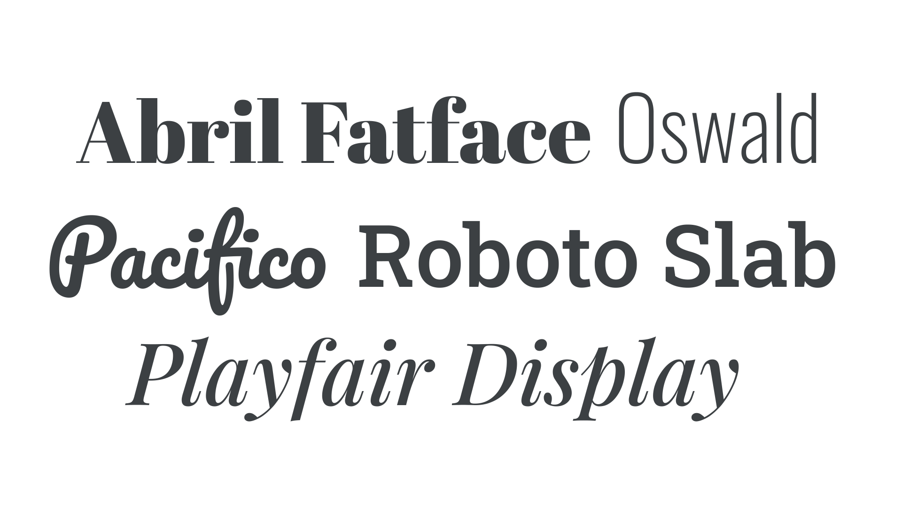
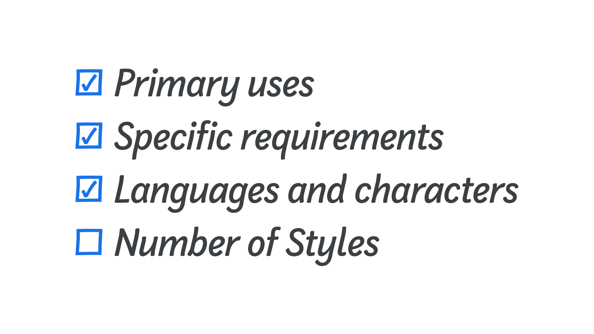
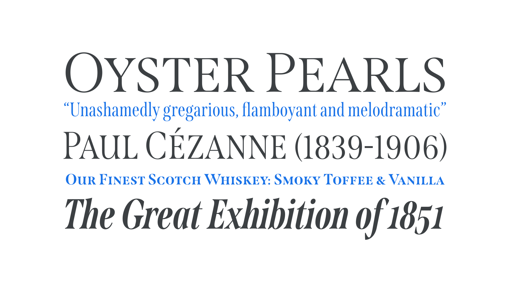

With so many [typefaces](/glossary/typeface) to choose from, you may have wondered where they come from, how they’re made, and if we really need to continue making more of them. In this article, we’ll explore the origin of contemporary typefaces and take a look at the motivation and process for making [fonts](/glossary/font).

<h2>Who makes typefaces?</h2>

People who create typefaces and fonts are called type designers. Improvements in font production software have streamlined the process of making fonts and have led to an increase in fonts being launched by a more diverse range of designers. Despite these technical advances, however, creating and releasing a new, quality typeface still requires a substantial commitment of time and skill. 

Fonts now tend to have more extensive character sets due to increased language support and added typographic features. Such fonts offer far more capabilities than those of the 20th century, but also create far more work for the type designer.

While font creation usually follows a common set of methods and formats, the parameters and quality of typefaces can vary greatly. For example, fonts created by enthusiasts may not have the same range of [characters](/glossary/character) or features as those created by professional type designers. Many fonts are produced by specialized businesses known as [type foundries](/glossary/type_foundry).

<figure>

</figure>

<h2>How do new typefaces come into existence?</h2>

Many typefaces are conceived by type designers who have had a spark of inspiration, perhaps to revive an historical typeface, capture a trend in graphic design, or because they’ve identified a gap in the market. Alternatively, a foundry or individual designer may be commissioned to produce a custom typeface. These are generally designed for an organization that requires a distinct style for its written material, and such typefaces are often designed for exclusive use by the commissioning organization.

<h2>Why make more typefaces?</h2>

Don't we have enough fonts already? Well, imagine we decided we had all the songs we ever needed, and stopped writing more. Just as music conveys and enhances a song, a typeface embeds a visual layer into text and communicates in conjunction with it. Each typeface provides a unique, visual tone of voice to written language.

Typefaces also allow documents to present visual hierarchies, for example, through darker headings. And, they enable graphic designers to represent meaningful structures by differentiating annotations, captions, and other parts of textual communication.

<h2>The importance of a brief</h2>

To ensure their time and skill is used efficiently, and that they meet the needs of their client or audience, experienced type designers usually seek to define the requirements and set the parameters of a type design project in its early stages with a typeface design brief:

* What will the typeface be used for? Is its primary purpose for immersive texts, or for short display headlines?
* What are its specific requirements? Does the typeface need to perform a certain function, such as to read clearly in very small sizes, or to operate in a particular environment such as an e-reader, or within virtual reality?
* What languages and characters should it support? Which countries will the font be used in and what written languages are used there? Does the typeface need to include alternate [glyphs](/glossary/glyph) such as [small caps](/glossary/small_caps) or extended math symbols?
* How many [weights](/glossary/weight) and [styles](/glossary/style) are needed? Regular, italic, bold, and bold italic are expected by most designers; would more weights, or perhaps other [widths](/glossary/width) also be required?
* What existing fonts are already available and how do they compare? Is the new typeface distinct enough from already available designs to warrant its production, both commercially and creatively?

<figure>

</figure>

The answers to these questions are usually distilled into a well-defined project brief. Even if setting their own brief, writing everything down enables the type designer to steer their creative and technical decisions to match the project’s requirements. This may also help avoid the temptation of allowing the project to creep beyond its intended goals, which can lead to a dramatic increase in production time.

<h2>The process</h2>

Although a font’s final form will be a digital file, conceptual explorations often begin with hand-drawn sketches. Type designers initially draw key letters that exemplify the common shapes and attributes of the overall typeface. Through these, they explore the structural and stylistic relationships required to produce a harmonious group of letters. 

<figure>

</figure>

Designers often start with a few letters for the lowercase, such as "n" and "o", or words such as adhesion or videospan. Capitals follow, with "H" and "O" providing key dimensions. These determine the proportionate construction, height, width, weight, and contrast of lowercase letters with flat shade and round sides. Consistency is the key to making type easy to understand for the reader and should be the goal of most typefaces. As the type designer expands the number of glyphs drawn, adjustments may need to be made to previously drawn characters to better integrate particular shapes.

<h2>Drawing</h2>

Once the conceptual phase is complete, the sketches can be digitized. The drawings are most often converted to digital form using Bézier curves. These are line drawings where each line is defined by points at its beginning and end, and off-curve control points that adjust the shape. These line drawings, referred to as vector graphics, form the shape of each glyph.  

<figure>

</figure>

These drawings are usually created within a font software program. These specialist applications provide tools for drawing the glyphs as well as defining metrics such as spacing, and code that controls how they will appear and function. [FontLab](https://www.fontlab.com/font-editor/fontlab/), [Glyphs](https://glyphsapp.com), and [Robofont](https://robofont.com/) are popular applications.

<h2>Spacing and kerning</h2>

Early in the drawing phase, designers group the initial letters into words to determine how they relate to each other. Each glyph must be assigned a volume of [space](/glossary/spaces) on either side (known as “sidebearings”) to separate them from each other. The intention is for each character to be assigned a proportional amount of space, so that when different glyphs are grouped together, all are spaced with a matching rhythm.

<figure>

</figure>

Once the drawing and spacing of all glyphs is complete, type designers check every conceivable combination of glyphs for individual spacing requirements. When particular shapes interact, such as the “VA” combination, specific adjustments, called [kerning](/glossary/kerning_kerning_pairs), may need to be made to improve the spacing between them. This kerning data is contained within the finished font file. 

<h2>Masters</h2>

If a type family contains two or more [styles](/glossary/style) within an [axis](/glossary/axis_in_variable_fonts), such as [weight](/glossary/weight) or [width](/glossary/width), intermediate styles between two extremes can be generated automatically—a process known as “interpolation.” For example, If the typeface requires five weights, the type designer could draw only the lightest and the heaviest styles and the software can automatically generate intermediate weights between them. The extreme styles that have actual outlines are called [masters](/glossary/masters). Drawings for in-between weights are optional.

<figure>

</figure>

<h2>Programming</h2>

Type designers can code layout features in font editing software to control how the font operates for the end user. Using [OpenType](/glossary/open_type) font technology, designers can program glyphs to be substituted or adjusted. This can be performed automatically, or by user control. For example, the font can be programmed to swap certain accented glyphs automatically when the font is used with particular language settings. The font can also be programmed to substitute individual glyphs or a group of glyphs for [stylistic alternates](/glossary/alternates) when the relevant feature is turned on.

<figure>

</figure>

<h2>Mastering, distribution, and usage</h2>

Checking that the font is designed and programmed without errors, and that it operates correctly, is called mastering. Once the designer is satisfied that the font operates correctly, they will export the final font as a TTF or OTF font, ready to be installed on users’ computers. 

The way in which fonts are distributed online continues to evolve. For many years, fonts have been made available directly from their creators’ websites, or or through third party companies which offer a library of typefaces. Increasingly, other options have become available, such as library subscriptions, fonts installed directly into design software, or rented fonts.

Whether a font is offered free or for purchase, it’s always subject to a [license](/glossary/licensing), drawn-up by the designer, foundry, or distributor, which governs how the font may be used. Licenses can be libre (“open source”), highly permissive licenses that permit redistribution and remixing of the font, or proprietary licenses (as usually seen in “commercial” or “retail” fonts), which are more restrictive.

Like any other consumer product, typefaces need marketing to let people know about them. Designers and foundries often create visual materials, called specimens, to show off their designs and attract users. Effective specimens detail the features of the typeface, provide examples of how it might be used, and describe the sort of text it is most suitable for. 

<figure>

</figure>

As we’ve seen, there are many facets to designing a typeface and making a font. Each step in the process requires a broad understanding of the task’s context and skill in implementing it. If you’d like to know more, here are a few resources to get you started:

- [Designing Fonts](https://www.google.com/books/edition/Designing_Fonts/HHRzzQEACAAJ) by Chris Campe, Ulrike Rausch
- [How to Create Typefaces](https://www.google.com/books/edition/How_to_Create_Typefaces/-yW-tAEACAAJ) by Cristóbal Henestrosa, Laura Meseguer, José Scaglione 
- [Theory of Type Design](https://www.google.com/books/edition/Theory_of_Type_Design/_T9iswEACAAJ) by Gerard Unger
- [Inside Paragraphs](https://www.google.com/books/edition/Inside_Paragraphs/nzT3DwAAQBAJ) by Cyrus Highsmith
- [Counterpunch](https://www.google.com/books/edition/Counterpunch/dUZUAAAAMAAJ) by Fred Smeijers
