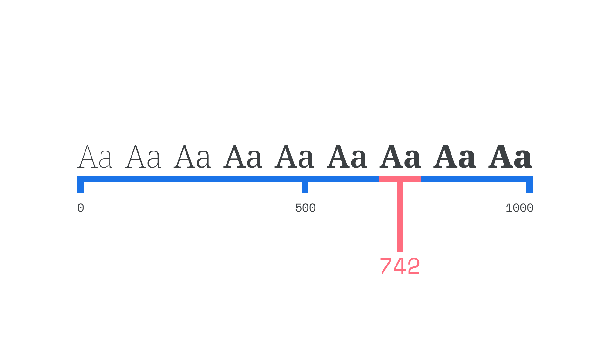

[Variable fonts](/glossary/variable_fonts)—officially known as [OpenType](/glossary/open_type) Font Variations—remove the explicit distinctions between different [weights](/glossary/weight) and [styles](/glossary/style), which have existed since the early days of typesetting. It’s no exaggeration to say that this represents a huge leap forward in [font](/glossary/font) technology in recent years.

With variable fonts, the choice of exactly how heavy or slanted or wide (or any other parameter) type should be is placed into the hands of the user, rather than having those decided for us by the [type designer](/glossary/type_designer). Traditionally, all possible weights and styles have been separated out into different font files, whereas variable fonts combine all of those variations into one. Because of this, overall [file size](/glossary/file_size) is greatly reduced compared to loading multiple individual font files—and that’s a key consideration for [web typography](/lesson/using_web_fonts).

(Did you know you can browse for *just* variable fonts using the “Show only variable fonts” checkbox on [Google Fonts](https://fonts.google.com/?vfonly=true)?)

<figure>

</figure>

The simplest way to think of variable fonts is to imagine a slider (actually called an [axis](/glossary/axis_in_variable_fonts)), with the lightest weight (usually called something like Thin or ExtraLight) at one end, regular in the middle, and the heaviest weight (usually called something like ExtraBold or Black) at the other. Where traditionally we’ve had to choose weights from specific points on that scale—determined by the [type designer](/glossary/type_designer) during font production—we can now choose *any* point on the scale. Rather than decide between using a bold font at the value of 700 (which might not feel heavy enough), or an extra bold font at the value of 800 (which might feel *too* heavy), we can now choose somewhere in the middle, such as 742 – just right!

<figure>

</figure>

However, the real power of variable fonts is that you can have *any* axis for any variable the type designer chooses, and *combine* them. Slant? Yes. Width? Yes. [Optical size](/glossary/optical_sizes)? Yes. *[Temperature?!?](https://codepen.io/mandymichael/pen/pxXNbr)* Yes! And all of the above, used in concert.

By the way, it’s important to note that familiar style names—light, regular, bold, etc. for weight, or condensed, normal, wide etc. for width—still appear in font menus when variable font families are installed. They’re referred to technically as “named [instances](/glossary/instance).” So, using variable fonts doesn’t mean waving goodbye to the labels and conveniently-shared styles that we’ve been used to.

<figure>

</figure>

The best way to understand variable fonts is to start playing with them—and in a way that doesn’t require you to install any [font files](/glossary/font) or write any code. So we’ve put together a few recommendations on what to try, and the results to look out for.

Go to [etceteratype.co/epilogue](https://etceteratype.co/epilogue) and play with the **weight** axis of Epilogue to see how it affects the overall spacing of the type:

<figure>

</figure>

Now go to [etceteratype.co/grandstander](https://etceteratype.co/grandstander) and compare that with Grandstander, which was designed to take up the same amount of horizontal space regardless of changes made to the weight axis. This shows how what happens within an axis of variation is determined by the typeface designer.

<figure>

</figure>

Go to [etceteratype.co/anybody](https://etceteratype.co/anybody) and play with the weight **and** width axes on Anybody, to see how they can be combined, and how they affect each other in a subtle way:

<figure>

</figure>

Go to [etceteratype.co/imbue](https://etceteratype.co/imbue) and play with the **optical size** axis of Imbue to see how the [contrast](/glossary/contrast), [spacing](/glossary/tracking_letter_spacing) and other details change to optimize the design for different sizes:

<figure>

</figure>

Go to [fonts.google.com/specimen/EB+Garamond](https://fonts.google.com/specimen/EB+Garamond) and play with the **[italic](/glossary/italic)** axis of EB Garamond to see how the design “snaps” between roman and italic styles, with no intermediate values:

<figure>

</figure>

Go to [recursive.design](https://www.recursive.design) and play with the [Casual](/glossary/casual_axis) axis of Recursive to see how the outlines become more curvy and playful. Note that this is an example of a [custom axis](/lesson/styling_type_on_the_web_with_variable_fonts).

<figure>

</figure>

For more chances to play around with variable fonts directly in your browser, consider visiting these websites:

- [VariableFonts.io](https://variablefonts.io)
- [VariableFonts.TypeNetwork.com](https://variablefonts.typenetwork.com)
- [Axis-Praxis](https://www.axis-praxis.org)
- [Variable Fonts](https://v-fonts.com)
- [Font Playground](https://play.typedetail.com)
- [Very Able Fonts](https://www.very-able-fonts.com)
