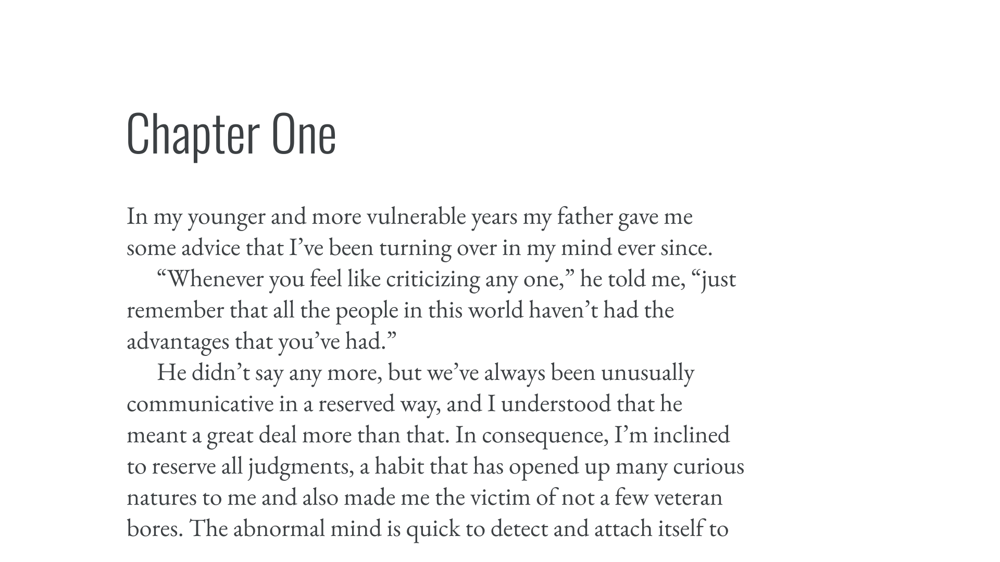

With so many [typefaces](/glossary/typeface) in the world, searching for the right one can be a daunting task, so some kind of sorting or filtering goes a long way toward helping us narrow down our selections. There are many ways we can classify [type](/glossary/type)—and all are helpful when we’re talking about it—but *misunderstanding* classifications can make the whole thing even more confusing than knowing no classifications at all.

For this primer, we’ve tried to keep things as simple as possible. To explore each classification in detail, it’s possible to follow the links to the relevant deep-dives. It’s also important to note that these classifications apply mainly to Latin script faces. We’ll explore other alphabets and writing systems in a future article.

## Genre classifications for Latin type

If you’ve ever browsed an online library of fonts with hundreds of choices, like [Google Fonts](https://fonts.google.com), or an independent [type foundry](/glossary/type_foundry)’s website with dozens of options, you’ve probably noticed it’s possible to filter according to loose groupings. Commonly, you’ll find groupings such as:

- [Serif](/glossary/serif)
- [Sans serif](/glossary/sans_serif)
- [Slab serif](/glossary/slab_serif_egyptian_clarendon)
- [Monospaced](/glossary/monospaced)

Then there are those that are slightly more ambiguous in terms of their potential overlap, but have a shared meaning to most of us, such as:

- [Script](/glossary/script_typeface_style)
- [Handwriting](/glossary/handwriting)
- [Display](/glossary/display)

<figure>

</figure>

It’s important to note that these genres aren’t clearly delineated, nor are they mutually exclusive. It’s possible, for instance, to have a monospaced slab serif, or a script typeface that could easily be grouped as intended for display purposes—and there are people who will go to great lengths to argue over typefaces belonging to one group or another. Treat these as a framework and use the classifications for what they were intended: useful ways of finding and talking about type rather than rules set in stone.

## Historical classifications for Latin type

Another form of classification exists that, while more nuanced, can prove especially useful when discussing a certain kind of type design: *historical* classifications. There’s a degree of crossover with the genre classifications, but the good thing about historical classifications is that they’re linked to a specific historical period; e.g. [grotesque](/glossary/grotesque_neo_grotesque) is a style of sans serif [Latin](/glossary/latin) typefaces first popularized in late 19th century Europe.

Each of the historical classifications below link to a specific glossary term so that they can be explained at length:

### Serif

[//]: # (Didone / modern)
- [Humanist/Old Style](/glossary/humanist_old_style)
- [Slab serif/Egyptian/Clarendon](/glossary/slab_serif_egyptian_clarendon)
- [Transitional/neoclassical](/glossary/transitional_neo_classical)

### Sans serif

- [Geometric](/glossary/geometric)
- [Grotesque & Neo-grotesque](/glossary/grotesque_neo_grotesque)
- [Humanist](/glossary/humanist_old_style)

We might reasonably ask: why do I need to know which period of European typographic history a particular typeface comes from, or is based upon? There are two scenarios where it’s useful to have this information at hand.

The first is when choosing a primary typeface for a project. When assessing its suitability, consider whether it evokes the feel of a certain period of time. Often, that might be a general idea, like avoiding oldstyle typefaces if we’re creating a brand that needs to feel very contemporary; in others, there might be a very specific need for the typeface to refer to a particular period of history, like using typefaces from the 1920s to create on-set artwork for a film set in that time. It’s useful to look at books, album covers, advertising, and signage contemporary with the period we’re trying to evoke.

(And, of course, it’s okay to fake it: [Jessica Hische examined](https://www.jessicahische.is/internetting/gatsby/ver1.html) how typefaces created *after* the publication of “The Great Gatsby” actually did a better job of evoking the feel of the 1920s because of our shared cultural understanding of the aesthetic of that time—despite their historical inaccuracy.)

<figure>

<figcaption>Heading text and paragraph text set in typefaces that are from the same historical period (1920s).</figcaption>

</figure>

The second common scenario that benefits from an awareness of historical classification is when we’re [pairing type](/topic/pairing_type). If a particular period in time is alluded to in the style of the primary typeface, that theme should probably be continued in additional typeface choices, too, unless we’re intentionally attempting to contrast that style.
