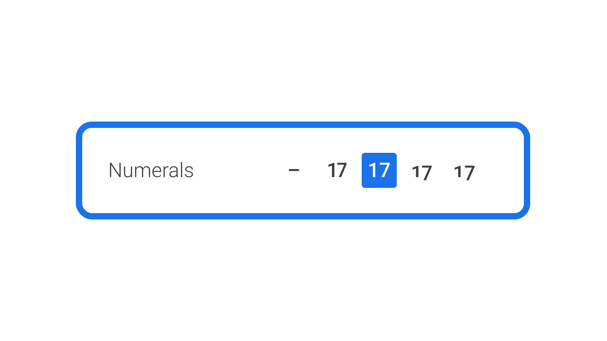
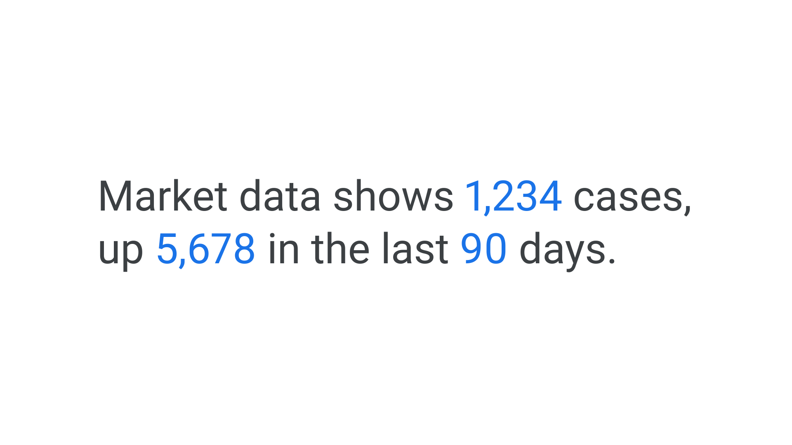
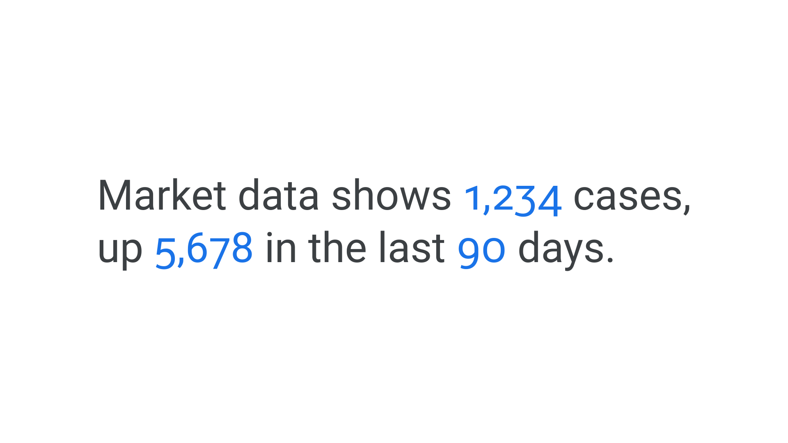
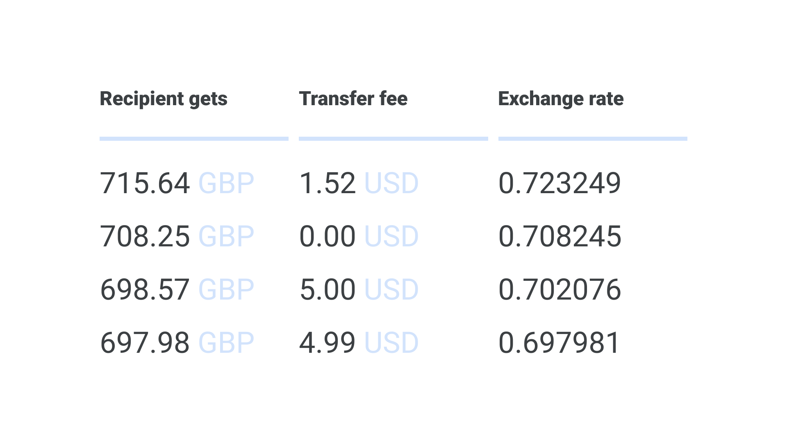
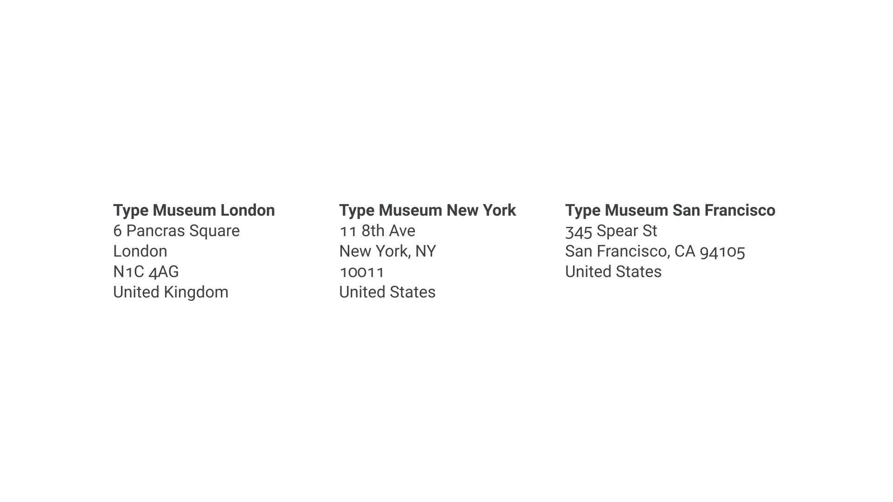

Numbers, like letters, can be conveyed in different ways with typography to communicate meaning. [Numerals, or figures](/glossary/numerals_figures), often come in four distinct flavors:

1. **Proportional lining numerals** are like uppercase: their height matches the [cap height](/glossary/cap_height). All rest on the baseline, and because they’re proportional, each numeral [glyph](/glossary/glyph) has a different [width](/glossary/width)—just like letters.
2. **Proportional oldstyle numerals** follow the logic of lowercase letters, with some possessing [ascenders or descenders](/glossary/ascenders_descenders) that extend above the [x-height](/glossary/x_height) or below the baseline. Again, they’re proportional, so each glyph has a unique width.
3. **Tabular lining numerals** have uppercase-like glyphs that take up exactly the same horizontal space. Because of this, they’re sometimes referred to as [monospaced](/glossary/monospaced) numerals.
4. **Tabular oldstyle numerals**—as you might’ve guessed by now—have lowercase-like glyphs and all of them share a fixed width.

<figure>

</figure>

It’s advisable to have an understanding of how the four numeral variations compare, to ensure we’re working with the appropriate ones in any given scenario.

Just because these four flavors exist, it doesn’t mean they’re present in every [font](/glossary/font). It’s common to find that the [type designer](/glossary/type_designer) only drew one of them. But if they’re present in the file, you can choose the one you want using [OpenType feature](/lesson/implementing_ot_features_in_desktop_apps) controls. If in doubt, use the figure style the type designer has chosen as the default. If they believe the typeface will be used primarily for [body copy](/glossary/body), they’ll make different choices than if they believe their typeface will be used to style financial data.

<figure>

<figcaption>Common design application UI controls for controlling numerals.</figcaption>

</figure>

## When to use proportional lining numerals

If in doubt, use proportional lining numerals: They’re the best catch-all for the majority of situations. Type is used for body copy more often than it’s used for tables, so it makes the most sense to have the figures proportional by default—just like most typefaces’ characters. And while there’s no real reason *lining* numerals are preferable to *oldstyle,* they’re commonly accepted as the norm. A notable exception in a well-known and widely distributed typeface would be Georgia, whose default numerals are oldstyle.

<figure>

</figure>

## When to use proportional oldstyle numerals

Just like proportional lining numerals, proportional *oldstyle* numerals have variable widths, so they work well as part of body text. In fact they work even *better* for body text because of the way we’re used to reading: They have ascenders and descenders, and therefore don’t interrupt the flow of reading lowercase characters, resulting in a more comfortable reading experience.

<figure>

</figure>

## When to use tabular lining numerals

As the name suggests, tabular lining numerals work well for tables, charts, timetables, or any scenario where figures are required to line up vertically.

<figure>

</figure>

Because each character occupies the exact same width, they’re also useful in situations where the numbers might change, but need to stay aligned, such as in an app’s countdown timer.

## When to use tabular oldstyle numerals

The final flavor of numerals completes the options. Likely less often required than the other three we’ve listed, tabular oldstyle numerals will still come in handy for scenarios that require figures to be lined up but also combined with text. For instance: On a page that lists multiple addresses, all of the zip codes will line up, but they’ll also feel a more natural part of the sentence-case addresses.

<figure>

</figure>

[//]: # (TO-DO, post-launch addition: ten kinds, because there’s also superscript, subscript, numerator, denominator, proportional small-cap numerals, and tabular small-cap numerals in Valentin Brustaux’s Tina.)
