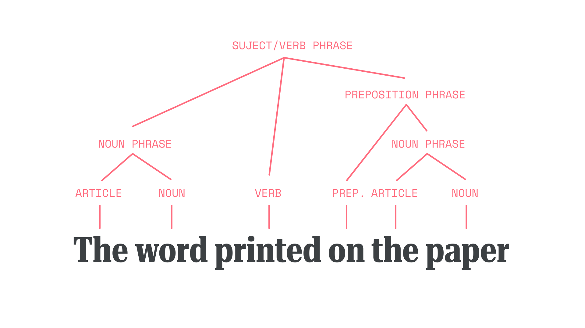
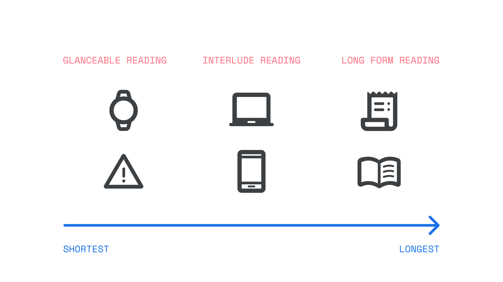

Reading is a complex cognitive process that involves working out what meanings are represented by a set of symbols in a [writing system](https://fonts.google.com/knowledge/glossary/script_writing_system), such as the [Latin alphabet](https://fonts.google.com/knowledge/glossary/latin). Scholars researching how people read can have expertise in a broad range of areas such as psychology, linguistics, semiotics, literary critics, vision sciences, and anthropology. This article is a brief overview of how people read focusing on how those with normal or corrected vision (with glasses/spectacles or contact lenses) read letters, words, phrases and longer texts. (It does not cover the use of braille.) This overview also introduces how typographic decisions can influence the process of reading.

Reading is what we do, while [readability](https://fonts.google.com/knowledge/glossary/readability) refers to qualities of a text that make reading easier. This includes content decisions, or format decisions, which help a reader to easily engage with and comprehend the message intended by the author. Poor readability can obscure, change, or convince the reader never even engage with the author's message.

Readability describes how easily a reader engages with and understands the message intended by the author(s). 

Before someone reads, the text:

* Must be [legible](https://fonts.google.com/knowledge/glossary/legibility)
* Should be clear enough for people to see it 
* Should be engaging.

Making texts more readable makes it easier for a motivated person to read.

There are many scientific models of how motivated people convert the written word into dialogue, thoughts, and ideas.  These cognitive processes explain how people recognize individual letters, words, syntax, and how the ideas in the text relate to each other and the reader in meaningful and memorable ways. 

Individual differences in reading are not only attributable to differences in our physiology.  Our experience of the world, what we have learned, and our preferences can all affect how we see.

Find out more about text accessibility in [“Introducing accessibility in typography.”](/lesson/introducing_accessibility_in_typography)

## Legibility is seeing the text clearly

<figure>

</figure>
<figcaption>Top row: A comparison between less legible type set in Gill Sans and Prosto One (left) with more legible type set in Raleway and Noto Sans (right). Bottom row: A comparison between less readable type (left) with more readable type (right). Both paragraphs are set in Roboto and share the same line-height value, but different font-size values.</figcaption>

Legibility is being able to clearly see the structure of the text. Legibility is achieved when the text is not fuzzy or blurred and the reader can  see all the details without any visual stress such as squinting or rereading. 

There are physiological mechanisms that  determine how well a person can see text.  Understanding written text is a very complex process that originates in the eye with the interplay of two types of light sensing cells, cones and rods, and continue in the brain where the basic visual information from text is decoded by a series of sequential processing mechanisms of increasing complexity that feed into the language processing areas of the brain.

<figure>

</figure>

This process is too complex for the goals of this article, but a wealth of academic literature is available if you're interested in learning more (see [this article](https://visionlab.neuroscience.barnard.edu/sites/default/files/content/Yeatman%2C%20White_Annual%20Review%20of%20Vision%20Science_2021.pdf) for a recent review). The incredible range of individual differences in the ability to process written text, both in typical and atypical readers (e.g. low-vision patients, dyslexia in its multiple forms, etc.) are proxies of the complexity of our cognitive and neural machinery supporting the act of Reading. Every little road bump at each point of this processing hierarchy would generate a different reading style and propagate to a broad range of limitations of the reading experience.

There are several free tools that provide the ability to see how your typography will look to people with varying color vision capabilities. Visit [Material Design Accessibility Color Contrast Guidelines](https://m3.material.io/foundations/accessible-design/patterns), [Material Design Color and Accessibility,](https://m3.material.io/styles/color/the-color-system/accessibility) [The Perception of Color](https://www.britannica.com/science/color/The-perception-of-colour), and [Colour Blindness Awareness](https://www.colourblindawareness.org/colour-blindness/types-of-colour-blindness/). To see what the three main types of color blindness look like, try out the [Chromatic Vision Simulator](https://play.google.com/store/apps/details?id=asada0.android.cvsimulator&hl=en_US&gl=US) application. To see if your choice of background and text colors meet color contrast guidelines, try the free [WebAIM contrast checker](https://webaim.org/resources/contrastchecker/) tool.  

## Learning to read

Written language is a complex code in which combinations of letters, or characters, systematically represent certain sounds. 

For children, learning to read normally starts with becoming aware of how words sound, known as phonological processing. This awareness is coupled with matching sounds and letters. A beginner English reader learns the connections between the 26 letters of the alphabet and the approximately 44 sounds of spoken English (the phonemes). Learners actively explore different ways of reading as they become expert readers. Successful readers build the ability to recognize most words automatically and read fluently, by paying attention to grammar, punctuation, and sentence structure.

Adults  learning a new language or a new [script (writing system)](https://fonts.google.com/knowledge/glossary/script_writing_system) go through a similar process of learning the relationship between the symbols, sounds, and syntax for constructing relationships between ideas. People  learning to read are often simultaneously learning to write. As people learn to read and recognize words, they practice producing letters and words in written form.

To choose a typeface that supports people learning to read and write, find out if there are any fonts that are approved by local educational authorities, such as the [Foundation Fonts for Australian Schools](https://fonts.googleblog.com/) and [Japanese Universal Design fonts](https://fonts.googleblog.com/2022/04/morisawa-biz-universal-design-ud.html).

## Reading words for labels, titles, sentences, and paragraphs

The heart of typography focuses on the reader’s interactions with the words as they are seen, not the meanings of the words. Readability is a combination of typography (how words appear on screen or in print) and the actual difficulty and meanings of the words. For expert readers, word recognition and legibility happen at the same time. Sometimes people recognize a word before they recognize the letters in the word! Cognitive psychologists call this the “[word superiority effect.](https://en.wikipedia.org/wiki/Word_superiority_effect)” The outline shape of words in lowercase text are more distinctive than the outline in uppercase letters. This may also explain why people read Latin texts in lowercase faster than in uppercase and frequently prefer to read in lowercase. 

<figure>

</figure>

The word superiority effect also describes why it's easier to read a string of words that are meaningfully related in a sentence rather than reading a string of words that are not in a grammatical structure. Syntax, which is the way the words are arranged in phrases to create sentences, has a strong impact on readability.

<figure>

</figure>

Readers are surprisingly flexible in their ability to read text that is not spelled correctly and has poor syntax. It requires more effort, but if they are motivated, they can successfully read very inaccurate texts. For example, a reader can understand that this sentence with mistakes: “I yesterday red book.” means “I read the book yesterday.”

[Type scales](https://fonts.google.com/knowledge/glossary/scale) help people recognize how ideas relate to each other in hierarchical ways. Readers who want to quickly get an overview of a long text will use strategies like scanning headings and headlines to find the information they want to read below the headings and headlines. [CAPTION: Scanning the subheadings within a section.]

<figure>

</figure>

A typographer has the freedom to lay out the words in any way that they want to create the desired reading experience. Many typographic and formatting decisions will influence how people experience reading the text. Consider the type sizes, letter, and line spacing.

Some people will experience [crowding](https://www.sciencedirect.com/science/article/pii/S0042698907005561), the inability to read well because of the nearby visual clutter of letters, or words that are too close together. People differ in the extent to which they experience crowding. A crowded text can stop some people from reading at all. Tighter [kerning](https://fonts.google.com/knowledge/glossary/kerning_kerning_pairs) and [letter spacing](https://fonts.google.com/knowledge/glossary/spaces) will increase problems with crowding. 

<figure>

</figure>

When choosing a typeface for labels, titles, sentences, and paragraphs, consider asking  others who are not designers to read examples and give you their feedback. Your experience will be different from theirs. Checking with a range of people could make a positive difference. Ask people to describe their reading experience.  Listen for any mention of crowding. Many may not use the term “crowding” but may complain that there were problems with letter spacing, line spacing, or difficulties that they cannot attribute to anything in particular. Some fonts are designed to have larger letter [spacing](https://fonts.google.com/knowledge/glossary/spaces), such as [Lexend](https://fonts.google.com/specimen/Lexend?query=Lexend). 

To explore settings that might work for your texts, when selecting a font on Google Fonts, go to the Type Tester to try out different variable font axes. 

<figure>

</figure>
<figcaption>Google Fonts’ Type Tester, showing text with variable axes.</figcaption>

## It’s easier to read, learn, and remember meaningful texts

Reading is more than seeing the words and understanding the content based on syntax. The typography itself can convey messages like  “this is meant to be easy to read” or “this is a playful message” to the reader. Just as a sentence can tell of happiness or anger, typefaces too can convey the lightness of happiness, or the boldness of anger. 

<figure>

</figure>

Along with this, the visual design of the typeface always expresses a message in a historical context that will be different for different readers depending on their experiences. 

Choosing a typeface that conveys the same emotion as the content and is meaningful to your readers’ lived experience involves building an understanding of their recent and current type experiences.

Take note of:

* The typefaces used in printed novels and school books, as well as popular online publications, magazines, and newspapers
* The current type design trends in the places your readers visit, both online and in the physical world

## Motivation to read

There are different motivations for why and how people read. 

When asked about what they read, most people think of what researchers call “long form” reading such as reading a novel, a school book, or several pages of formatted text. People might be reading these for pleasure or to learn new things. 

The shortest form of reading is called glancing, when the reader briefly looks at a known location to quickly get a reading of something like a heart rate, time of day, or vehicle speed.  Glance reading normally happens when the reader needs to use their eyes for another visual activity, such as driving. In this type of reading, people are reading to quickly get information that will help them do something, such as finding the arrival time on the bus schedule.  Larger text size in non-condensed formats, as illustrated in Figure 5, is better to support glanceable reading. 

<figure>

</figure>
<figcaption>The time someone has to read a source impacts the way they read it, and what they do while they read. Reading at-a-glance is often done alongside some other task, while reading a long form document generally requires dedication to the reading itself. Most reading is done opportunistically in interludes; while waiting or taking a break.</figcaption>

Interlude reading covers everything between glanceable and long form reading.  There is a wide range including text messaging, navigating through headers and labels, reading some news headlines, summaries, or scanning search results.  The motivations for this type of reading also vary widely,  and includeing learning new things, being with friends,  and finding things.

## Try things with your readers

The best solution for choosing a readable typeface will always be dependent on who your readers are, their motivations, and the message that you want them to take from your type choices.  This article has provided some tools to help you make good choices for your readers, and we’ve added a few more resources below. Best wishes for your creative journey!

## Resources 

You might find these sources valuable for more information on readability and accessibility:

* [Web Usability](https://www.nngroup.com/articles/how-users-read-on-the-web/)
* [Glanceable fonts](https://www.nngroup.com/articles/glanceable-fonts/)
* [Interlude reading](https://www.bendsawyer.com/project/towards-individuated-reading-experiences/)
* [Handwriting in education around the world](https://www.type-together.com/new-research-handwritting)
* [Experiencing crowding](https://www.sciencedirect.com/science/article/pii/S0042698907005561) 
* [Individualising reading formats research provided by The Readability Consortium](https://www.thereadabilityconsortium.org/research) 
* The Science of Reading Progresses: Communicating Advances Beyond the Simple View of Reading.  Duke, N.K., and Cartwright, K.B. (2021). The Science of Reading Progresses: Communicating Advances Beyond the Simple View of Reading. Reading Research Quarterly 56(S1), S25– S44. [https://doi.org/10.1002/rrq.411](https://doi.org/10.1002/rrq.411)
