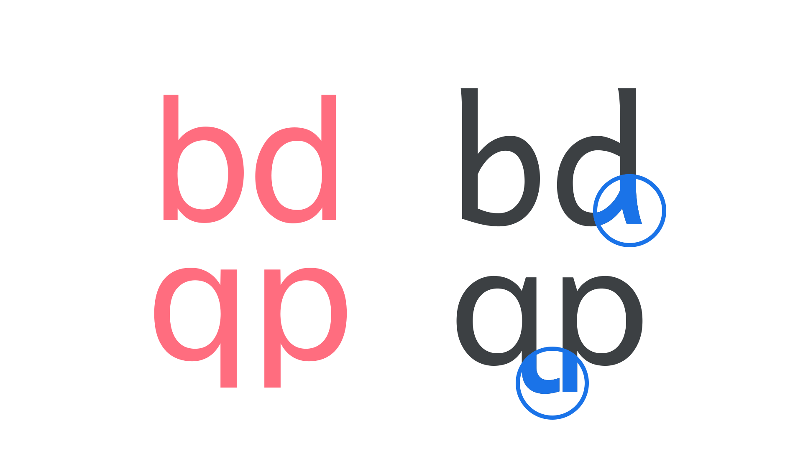

Making [text](/glossary/text_copy) [accessible](https://www.google.com/accessibility/) should be part of everyday practice. However, general [typographic](/glossary/typography) practices of optimizing [legibility](/glossary/legibility) and [readability](/glossary/readability) don’t necessarily go all the way towards making text accessible. 

First, let’s make sure we define **legibility** and **readability**. Both are measures of clarity. 

- **Legibility** is the measure of how distinguishable individual characters and words are to the eye of the reader.
- **Readability** is the measure of how easy it is to read the text overall. 

<figure>


</figure>
<figcaption>Top row: A comparison between less legible type set in Gill Sans and Prosto One (left) with more legible type set in Raleway and Noto Sans (right). Bottom row: A comparison between less readable type (left) with more readable type (right). Both paragraphs are set in Roboto and share the same line-height value, but different font-size values.</figcaption>

## Choosing accessible type

[Accessible typography](https://www.visionaustralia.org/business-consulting/digital-access/blog/typography-in-inclusive-design-part-1#2) considerations start with choosing [type](/glossary/type). There is no single answer for which fonts are most accessible, but there *are* some indications of what could make a typeface more accessible to some people.

Some popular fonts, such as [Poppins](https://fonts.google.com/specimen/Poppins), have proven to be readable with individuals who have cognitive disabilities. Of course, you can also select a [typeface](/glossary/typeface) that has legibility built into its design, like [Lexend](https://design.google/library/lexend-readability/), or [Atkinson Hyperlegible](https://fonts.google.com/specimen/Atkinson+Hyperlegible), for example. 

(The examples in this section are for languages using the [Latin](/glossary/latin) [writing system](/glossary/script_writing_system). However, the same principles of choosing typefaces with distinct [letterforms](/glossary/letterform) (the unique shape of a letter), [numerals](/glossary/numerals_figures), punctuation marks, and [symbols](/glossary/icon_symbol) should apply to other writing systems.) 


## Checking readability

Mirroring, or flipping, occurs when readers flip or mirror letters and numbers that are the same form when flipped horizontally. For example, a reader could mistake a lowercase letter “b” for a lowercase “d." Instead of reading the word “bog,” the reader will think the word is “dog.” 

A different and more pervasive issue among people with dyslexia and other reading difficulties is the transpositioning of letters. For example, a reader may mistake the words “lion” for “loin,” or “line” for “lien.” Transposition is a common experience for people with dyslexia and other reading difficulties, and does not disappear with age. 

To reduce the chances of a reader confusing letters, words and numbers, check the following character pairs to make sure they are distinct enough from each other: 

- qp
- db
- 0O
- nu
- il1I
- a8
- a6
- 6g
- rn, m

When selecting a typeface—especially a [sans serif](/glossary/sans_serif)—it’s useful to assess the similarities or differences between the uppercase “L,” lowercase “l,” and numeral “1” characters because these letters and numbers look very similar. 

Many shapes are simply mirrored without any further alteration. Lowercase “b,” “d,” “p,” and “q” are the most commonly confused letters. Subtle edits to the letterforms may help to differentiate them as the correct characters. 

<figure>



</figure>
<figcaption>Left: Mirroring of letterforms is employed in Helvetica (top) and Public Sans (bottom). Right: The non-mirrored letterforms used in Andika (top) and Atkinson Hyperlegible (bottom) help the reader avoid confusion with potentially similar characters.</figcaption>

<figure>


</figure>
<figcaption>Comparison of “b,” ”d,” “q,” “p,” “a,” “8,” “6,” “g,” “a,” “6,” “1,” “I,” and “l” in Roboto, Abyssinica SIL, Intern Tights, Open Sans, Noto Sans Mono, and Noto Sans Japanese.</figcaption>
 
Look for letters that can be clearly distinguished. For people with moderate to more severe vision impairment, the characters “o,” ”c,” “e,” or “a” can be easily confused, which in turn makes words harder to identify.

<figure>


</figure>
<figcaption>From left to right: The typefaces Andika, Lexend, and Atkinson Hyperlegible show how effective they are in differentiating potentially confusing character combinations.</figcaption>

With our typeface(s) chosen, let’s move on to accessibility considerations for typesetting. The first place to start is to look at the structure of our content. For web typography, that means ensuring that the HTML is marked up with the most appropriate elements, headings have the right level (h1, h2, etc.), and that the hierarchy looks as expected with the default styles used by the browser before we dive into any bespoke CSS.

Semantically structured HTML is not only good general practice, but it also means we’ll be making our content readable by assistive technologies that take advantage of the markup. For example, [screen readers](https://www.afb.org/blindness-and-low-vision/using-technology/assistive-technology-products/screen-readers)—assistive software that allows text to be dictated to users with visual or cognitive impairments, such as Google’s TalkBack on Android, Apple’s VoiceOver on iOS, and Freedom Scientific’s JAWS on desktop—rely on the semantic HTML to give the reader critical information about structure that they cannot see visually. Many text-to-speech tools, such as Microsoft Immersive Reader and Snap & Read, provide visual and audio supports together. These products rely on semantic information for determining how these supports look and sound. These software programs use either a [braille display](https://www.afb.org/node/16207/refreshable-braille-displays) or read text aloud.

The HTML reflects the visual hierarchy by reading the content from the top left (Step 1) to the top right (Step 2), bottom left (Step 3) to bottom right (Step 4).

<figure>


</figure>
<figcaption> Example code for displaying the images in a screen reader-friendly hierarchy</figcaption>

```html
<section id="instructions">
  
  
  
  
</section>
```

For more information on hierarchy, read [Material Design Accessible Design Basics](https://m3.material.io/foundations/accessible-design/accessibility-basics), [Material Design Accessible Design to Implementation](https://m3.material.io/foundations/accessible-design/design-to-implementation), [W3C Headings](https://www.w3.org/WAI/tutorials/page-structure/headings/), and the  [Document Object Model (DOM) order matters](https://developers.google.com/web/fundamentals/accessibility/focus/dom-order-matters) articles.

## Color 

Color contrast is important for users to distinguish various text and non-text elements. Higher contrast makes the imagery easier to see. Low-contrast images or text may be hard for some users to differentiate in bright or low light conditions, such as on a very sunny day or at night. 

Contrast ratios represent how different one color is from another color, commonly written as 1:1 or 21:1. The contrast ratio between a color and its background ranges from 1-21 based on its luminance (the intensity of light emitted). The greater the difference is between the two numbers in the ratio, the greater the difference in relative luminance between the colors. As the absolute bare minimum, the [W3C](https://www.w3.org/TR/UNDERSTANDING-WCAG20/visual-audio-contrast-contrast.html) Web Content Accessibility Guidelines (WCAG) recommends the following contrast ratios for body and image text for an AA rating:

- Large text (at 14 pt bold/18 pt regular and up) and graphics: 3:1 against the background
- Small text: 4.5:1 against the background

The issue with color contrast can be complicated as some people with cognitive disabilities are sensitive to light and could experience eye fatigue or feel distracted when looking at high contrast text and images, such as black text on a white background at a 21:1 contrast ratio. A good middle ground is to aim for a 7:1 contrast ratio, the AAA rating for WCAG. 

These lines of text follow the color contrast ratio recommendations and are legible against their background colors.

<figure>


</figure>
<figcaption>The black text on the white background and the white text on the black background meet color contrast standards.</figcaption>

When picking up several colors for background, text, and other components, consider how readers perceive your choice of colors in addition to color contrast. 

There are several different types of color blindness (also known as color vision deficiency). According to the British Colour Blind Awareness Organisation, there are an estimated 300 million people worldwide with color blindness. About 8% of men and 0.5% of women have red-green color blindness. The most common type is red-green color blindness, which causes difficulty recognizing shades of red, green, and yellow. [The ability to recognize and differentiate colors also deteriorates with age](https://www.webmd.com/healthy-aging/news/20140318/color-vision-tends-to-fade-with-age-study#1), even in those people who were not born with color blindness. Blue and yellow become increasingly difficult for most individuals to decipher as their eyes age.

For more info on color and contrast and color blindness, visit [Material Design Accessibility Color Contrast Guidelines](https://m3.material.io/foundations/accessible-design/patterns), [Material Design Color and Accessibility](https://m3.material.io/styles/color/the-color-system/accessibility), [The Perception of Color](https://www.britannica.com/science/color/The-perception-of-colour), and [Colour Blindness Awareness](https://www.colourblindawareness.org/colour-blindness/types-of-colour-blindness/). To see what different types of color blindness look like, try out the [Chromatic Vision Simulator application](https://play.google.com/store/apps/details?id=asada0.android.cvsimulator&hl=en_US&gl=US). To see if your choice of background and text colors meet color contrast guidelines, try the free [WebAIM contrast checker](https://webaim.org/resources/contrastchecker/) tool.

Note that the concept of contrast discussed here is different to contrast in type design, which addresses the differences between the thickest and thinnest parts of strokes in a letterform.

## Text size and spacing

Make sure your text isn’t too small. The exact dimensions of font sizes can vary depending on the unit used, the size of the viewport (if units are relative), and the pixel density of the device’s screen, but a safe bet would be to use 16px or 1em or 1rem as the smallest size for body type.

Employ generous line heights (although not so generous as to detach lines from each other), and don’t allow measures (line lengths) to become too wide. 

Mobile devices and browsers include features to allow users to adjust their font size system-wide. To enable system font size in an Android app, mark text and their associated containers to be measured in scalable pixels (sp). For iOS, Dynamic Type is the accessibility feature that enables app to adjust font size. Be sure to not hard set the line heights when coding text as dynamic and adjustable. Otherwise, a reader may choose a large text size but be unable to read it because the lines of content overlap. 

<figure>


</figure>
<figcaption>A comparison between less readable type (left) with more readable type (right). Both paragraphs are set in Roboto and share the same line-height value, but different font-size values.</figcaption>

Ensure that there is sufficient space for large fonts and other writing systems. 

Make sure that there is enough [spacing](/glossary/tracking_letter_spacing) between characters. Fonts have different widths. If a font looks too tightly packed, letters may appear to crowd or overlap one another resulting in letter confusion. Crowding occurs when too many letters are too close to each other. Some words may become too hard to read. Words may blur or seem to disappear. Increasing spacing for letters, words and lines may help to reduce, or alleviate, these effects.

When selecting a font on Google Fonts, go to the Type Tester to try out different widths. See which one is most visually comfortable, reduces any sensation of eyestrain, and increases your overall reading satisfaction.

<figure>


</figure>
<figcaption>Type Tester showing text with variable axes for weight, width, slant and ascender height.</figcaption>

There are various resources to learn about [text spacing](https://www.w3.org/TR/WCAG21/#text-spacing), [crowding](https://www.sciencedirect.com/science/article/pii/S0042698907005561), [line heights (for foreign languages)](/lesson/language_support_in_fonts), [choosing line height](https://www.youtube.com/watch?v=ponRmWSzpDg&t=42s), [hierarchy of type sizes, weights, line heights and spacing](https://m3.material.io/styles/typography/applying-type), [type scale and units](https://material.io/design/typography/the-type-system.html#type-scale), [Android text scaling](https://support.google.com/accessibility/android/answer/12159181?hl=en), and [iOS Typography guidelines](https://developer.apple.com/design/human-interface-guidelines/foundations/typography/). 

Read more about [visual acuity and text size](https://www.teachingvisuallyimpaired.com/print-comparisons.html) to learn about how those with visual impairments may need different text sizes. 

## Hyperlinks

Follow these guidelines for hyperlinks:
- Allow user preferences to change the fonts and colors
- Change the color of links that have been accessed. Usually, unvisited links are in blue and visited links are in pink. This helps people see which links they have already accessed. 
- Embedded content (like documents, spreadsheets, videos, or decks) should have a sentence/link near the embedded content that reads, “Open the [content name] in a new window.”
- All hyperlinks are descriptive. Screen reading software often reads links out of context from the surrounding text. Links should clearly describe where the user will be taken or what action it triggers. 
    - Incorrect: “It’s important to meet accessibility standards. [Learn more](https://fonts.google.com/knowledge).”
    - Correct: “It’s important to meet [accessibility standards](https://fonts.google.com/knowledge).”

## Non-text elements and text in images

When designing content with images, it’s important to have captions and alt text for informative images. Decorative images that do not add information don’t need captions or alt text. Captions are the text that appear below an asset (e.g. an image or video). They explain the asset’s contextual information–the who, what, when, and where. Both sighted and screen reader users rely on captions for descriptions of assets. Alt text describes what the image or video is showing. This information is important for people who can’t see the image or video. When an asset doesn’t load on a website, the alt text will appear for people to know what is missing. 

Learn about how to write alt text and captions in [Material Design’s Accessibility Basics](https://m3.material.io/foundations/accessible-design/accessibility-basics) (scroll to the “Writing” section). To learn about which images need captions, visit [Material Design’s From Design to Implementation](https://m3.material.io/foundations/accessible-design/design-to-implementation), the W3C [decorative](https://www.w3.org/WAI/tutorials/images/decorative/), [functional](https://www.w3.org/WAI/tutorials/images/functional/), and [informative](https://www.w3.org/WAI/tutorials/images/informative/) images articles. 

Online menus or price sheets that are images or PDF files of a restaurant menu or price sheet may be easy solutions for business owners. However, they can be difficult or impossible to read for people who use screen reader and text-to-speech software or for people squinting at the pixelated text on their phones. Users can’t do a text search in an image to find what they are looking for. If you’re designing a website for a business, take the menu or price sheet information and put it as regular text on the site rather than adding images of the price sheet or menu. Having the menu and price sheets as text also improves SEO. 

## Resources: 

Here are a few resources to learn more about fonts and their impact on readability in the cognitive space:

- [British Dyslexia Association: A Dyslexia-friendly Style Guide](https://www.bdadyslexia.org.uk/advice/employers/creating-a-dyslexia-friendly-workplace/dyslexia-friendly-style-guide)
- [Reading Well: Dyslexia Fonts](https://www.dyslexia-reading-well.com/dyslexia-font.html)
- [Hating Comic Sans is Ableist](https://theestablishment.co/hating-comic-sans-is-ableist-bc4a4de87093/index.html)
- [WebAIM: Customizable Text](https://www.w3.org/WAI/perspective-videos/customizable/)
- [APA Style, American Psychological Association: Accessible Typography](https://apastyle.apa.org/style-grammar-guidelines/paper-format/accessibility/typography)
- [FS Me: ‘The accessible type’](http://projectrising.in/2015/08/fs-me-the-accessable-type/) (a typeface co-designed with individuals with cognitive disabilities)
- [What’s in a Word? Font preferences](https://medium.com/the-readability-group/whats-in-a-word-53bcf217d5c1)
- [What makes a typeface accessible](https://medium.com/the-readability-group/a-guide-to-understanding-what-makes-a-typeface-accessible-and-how-to-make-informed-decisions-9e5c0b9040a0)
- [Material Design accessibility guidelines](https://material.io/design/usability/accessibility.html)
