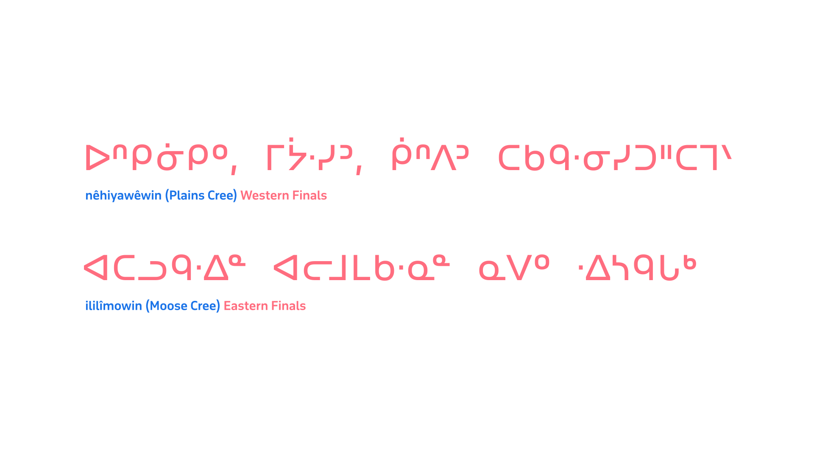
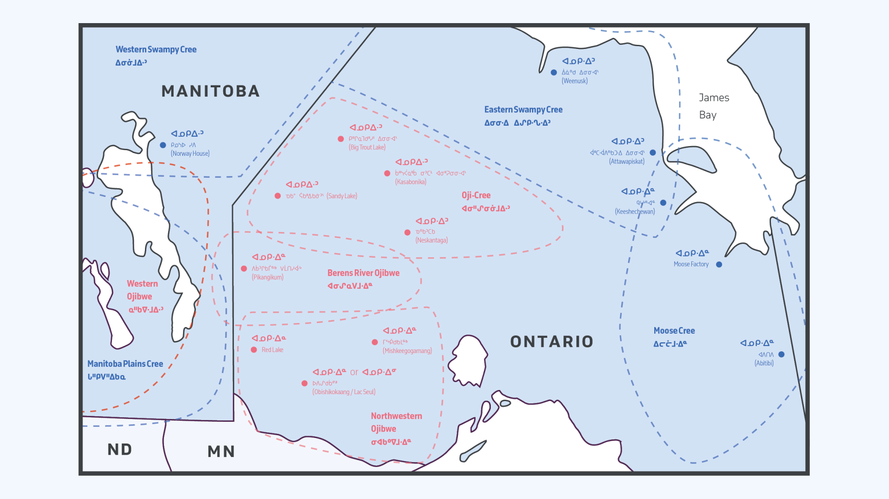
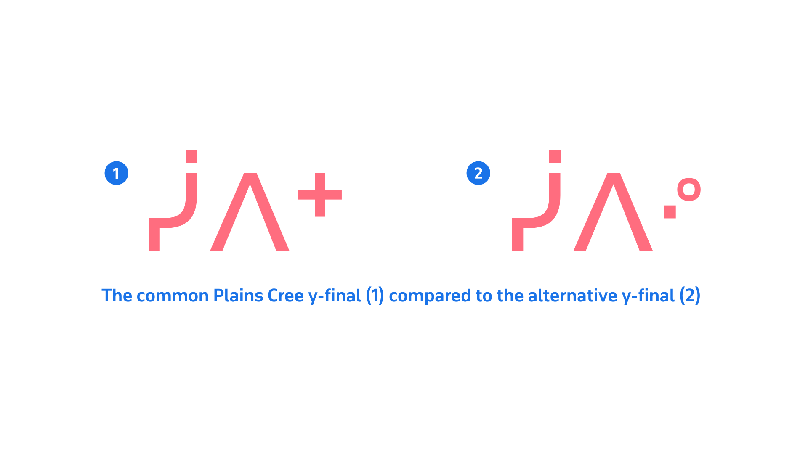
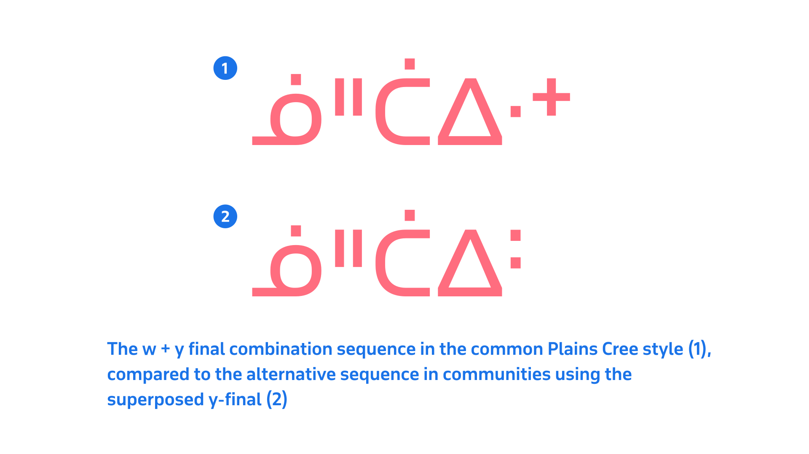

The Algonquian Syllabics were—as the name suggests—used for the Algonquian languages Ojibway (ᐊᓂᔑᓇᐯᒧᐎᐣ) and Cree (ᓀᐦᐃᔭᐍᐏᐣ), and spread to the related dialects in each language from the typographic source in Northern Manitoba (Norway House / ᑭᓄᓭᐏ ᓰᐱᐩ), westward to the prairie communities, as well as eastward into Ontario and Québec, around the same time period. These communities formed variations in both the style of the finals characters that they employed and the style of syllabic characters. Although the Algonquian Syllabic tradition is largely one of the round form style, Western Cree and Ojibway communities—particularly in Alberta—showed periods of using the square form style, as these communities had greater contact with French Catholic missionaries, who were printing works in this style for the neighboring Dene communities. These missionaries were importing the type supply for printing work in the Dene languages, and this material would have been used for printing in Cree and Ojibway as well.

An early and major printing center for the Algonquian Syllabics was Moose Factory, Ontario, where a printing press overseen by John Horden printed works in the local Moose Cree (ᐃᓕᓖᒧᐎᓐ) dialect and in the northern dialects of Ojibway. Horden made a significant change to the Algonquian Syllabics orthography by instituting the method of using finals characters in a series, which were superscript versions of the a vowel syllabic in a given series. This pattern was in stark contrast to the Western Algonquian pattern of using distinct finals characters, separate from the syllabic character forms in the series (see Finals section). This divergence in finals between eastern and western Algonquian Syllabics-using communities forms the main stylistic divide, and in particular led to a significant amount of variation in the Ojibway Syllabics of northern Ontario.

<figure>

<figcaption>Above, showing the difference between the western and eastern Cree traditions in finals characters.</figcaption>

</figure>

## Finals variation across Ojibway communities

​​​​The northern dialects of Ojibway—the only Ojibway language communities to use Syllabics as their primary writing system—are noted as having a high degree of variability in the form of the finals characters that several respective communities prefer to use. The northern dialects of Ojibway that use Syllabics comprise Oji-Cree, Northwestern Ojibway and Berens River Ojibway. All of these communities utilize a Syllabics orthography, although the local preference for the form of the finals characters varies.

<figure>

<figcaption>Anishinaabe (Ojibwe) communities (red); Nêhiyawak (Cree) communities (blue). The above map shows the distribution of Ojibway dialects in Northern Ontario that use Syllabics as their primary writing system, depicting their preference for the form of finals (ᐊᓄᑭᐧᐃᓐ, ᐊᓄᑭᐧᐃᐣ, etc.), as well as the placement of the “w dot”. Neighboring Cree communities have been shown in order to show the relationship in preferences with the Ojibway.</figcaption>

</figure>

This divide manifests in finals characters that a) appear different in form from the base syllabic character in “a series”, and “b”) appear as a superscript version of the base syllabic in a series, commonly the a vowel orientation position in the series.

<figure>

<figcaption>A comparison of the finals preferences for the different Ojibwe communities across the dialects in Northern Ontario that use Syllabics. Note that all Oji-Cree communities follow the same pattern as Western Cree Syllabics, which use finals characters that are different in shape than their base syllabic shape in a given series. The only variation in this pattern occurs in the Neskantaga community, which places the w dot on the left of the syllable in the Eastern Syllabics tradition. The primary variation occurs within Northwestern Ojibwe communities, where the Eastern Cree Syllabics tradition is largely followed, with the Eastern pattern of using superscript versions of the base syllabic in a series, in the “a vowel” orientation position. Within this preference for superscript finals, further variation occurs in the preference for the orientation scheme and vertical position of certain finals. In the Lac Seul community, either the “a position” or “i vowel” position orientation scheme is followed. In the Red Lake community, the standard a-position orientation pattern is followed, with the exception of the n final consonant being vertically positioned centered at the midline.</figcaption>

</figure>

The high degree of variation in Syllabics typographic preferences in Northern Ontario Ojibwe communities is a result of the lack of any formal standardization, such as is seen in Inuktut and Cree Syllabics communities. Despite this lack of standardization, all of the local form variants are encoded in the Unicode Standard.

## Plains Cree *y + w* dot transformation preference
There is variation within Plains Cree communities in terms of the use of different forms for the “y series” final character. The common form of this in Plains Cree is a plus mark (ᐩ); however, some communities prefer to use a superposed dot mark (ᐝ), which is graphically distinct from the common “y final”. It should be noted that this alternative “y final” form should take the shape of a closed “w dot” mark, as well as an open, small ring character, rather than two open ring characters.

<figure>

<figcaption>Showing the two variations in the form of the Plains Cree y final.</figcaption>

</figure>

Further, when the y-final follows a w-dot modifier mark in these communities using the superposed (ᐝ) “y final”, the double dots combine to form a colon character. There is variation in terms of the shaping of this combination “w + y” final sequence. Some texts show this character as the same superposed sequence as the alternative “y final”, while others distinguish the sequence by rendering it as a kerned colon-style symbol.

<figure>

<figcaption>An example, above, of the combination sequence that some Plains Cree communities prefer when pure consonant "w" is followed by pure consonant “y”.</figcaption>

</figure>

## Naskapi *spwaa* preferred form

The Naskapi language community follows the Eastern Cree Syllabics pattern, which sees it used as a basis for the Algonquian Syllabics structures, with finals characters being superscript versions of the a vowel orientation scheme.

<figure>

<figcaption>Demonstrating two compositions of the Naskapi “spwaa” syllabic sequence. Although many typefaces compose this sequence as in example 1, above (U+150B ᔋ CANADIAN SYLLABICS NASKAPI S-W + U+1438 ᐸ CANADIAN SYLLABICS PA), the Naskapi community prefers the singular, composed glyph as in example 2, above.</figcaption>

</figure>

The primary local preference that Naskapi requires is the combination of the syllabic for the spwaa (ᔌ) syllable. Many commonly available pan-Syllabics and Algonquian Syllabics typefaces provide this syllabic composed as a separated inline sequence. The Naskapi user community prefers the composite version of this syllabic form, with the “spw” modifier stacked on top of the base “pa” syllabic. While this form is intelligible in either composition, stylistically the local community prefers the composite form.

## In summary

The typography of the Syllabics may lack a formal body of literature that users can consult; however, professional typographic implementations can be achieved by observing the practices of local communities in both historical and contemporary documents. By adding to the understanding of the inherent conventions that govern the Syllabics across all of the orthographies that use the script, it is possible to deliver solutions that accommodate the best possible typographic experiences for all readers of this writing system, in their respective languages.

## Endnotes

### Works sourced

Base of map vector artwork designed by [Freepik](https://www.freepik.com/free-photos-vectors/travel), accessed 7 May 2020.

[British and Foreign Bible Society], *The four Gospels and the Acts of the Apostles*. British and Foreign Bible Society, London, 1903

[Canadian Bible Society], *ᑲᐅᔅᑭᒋᒋᐱᒡ ᐊᑎᐸᒋᒪᑭᓄᐅᑦ ᒋᓴᔅ / The Beginning of the Story of Jesus*. Naskapi Development Corporation, Kawawachikamach, Québec, 2014

James Evans, *Swampy Cree Hymn book (ᓇᑲᒧᐏᓇ ᐅᒪᐢᑮᑯᐘ ᐅᑎᑘᐏᓂᐘᐤ)*. Norway House, 1841. Image from the James Evans Fonds, University of Victoria library, University of Toronto

John Horden, *Bible and Gospel history, in Saulteux*. Society for Promoting Christian Knowledge, London, 1860

John Maclean, *James Evans: Inventor of the Syllabic system of the Cree language*, William Briggs, Toronto, 1890

[Wawatay News], *ᐗᐗᑌ ᐊᒋᒧᐎᓇᐣ / Wawatay News*, 17 July, 2020 Vol.47, No. 7, PM#0382659799

Arok Wolvengrey, *ᐊᐎᔹᑖᒋᐏᓂᓴ / wawiyatācimowinisa / Funny little stories*. University of Regina Press, 2007.
