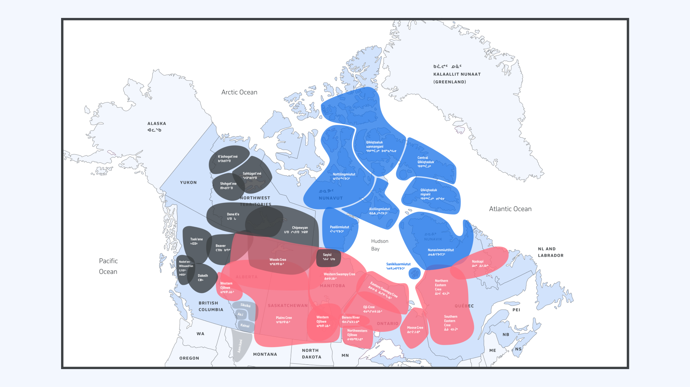

The Syllabics—sometimes referred to as the Canadian Aboriginal Syllabics—is a [writing system](/glossary/writing_system) used by several Indigenous language communities in Canada and the United States, including nêhiyawêwin (Cree), Anishinaabemowin (Ojibwe), Inuktut (Inuktitut), Dakelh (Carrier), iyuw iyimuun (Naskapi), and Saı́yısı́ dëne (Sayisi Dene).

Before we start looking at the construction of the script, let’s first look at the geographic distribution of the various groups and sub-groups of the Syllabics:

<figure>

<figcaption>A map depicting the geographic distribution of the three major Syllabics orthographic / typographic traditions: the Algonquian Syllabics, Inuktut Syllabics, and Dene Syllabics. Additionally, the historical Blackfoot Syllabics system—while based on the pattern of Cree Syllabics orthographically—deviates visually enough from these three major systems to be considered a graphic isolate.</figcaption>

</figure>

#### Algonquian Syllabics

Ojibwe / Anishinaabemowin Syllabics (ᐊᓂᔑᓇᐯᒧᐎᐣ)

- Oji-Cree (ᐊᓂᐦᔑᓂᓃᒧᐏᐣ)
- Berens River Ojibwe (ᐊᓂᔑᓇᐯᒧᐎᓐ)
- Northwestern Ojibwe (ᓂᐊᑲᐤᐁᒧᐎᓐ)
- Western Ojibwe (ᓇᐦᑲᐍᒧᐏᐣ)
- Western Cree Syllabics (ᓀᐦᐃᔭᐍᐏᐣ)

Plains Cree (ᓀᐦᐃᔭᐍᐏᐣ)
- Saskatchewan Plains Cree (ᒐᐦᑭᐯᐦᐃᑲᓇ)
- Manitoba Plains Cree (ᒐᐦᑭᐯᐦᐃᑲᓇ)
- Maskwacis Plains Cree (ᓀᐦᐃᔭᐌᐎᐣ)
- Northern Plains Cree (ᓀᐦᐃᔭᐍᒧᐏᐣ)
- Woods Cree (ᓀᐦᐃᖬᐍᐏᐣ)
- Western Swampy Cree (ᐃᓂᓃᒧᐏᐣ)
- Eastern Swampy Cree (ᐃᓂᓂᐎ ᐃᔑᑭᔗᐎᐣ)

Eastern Cree Syllabics (ᓀᐦᐃᔭᐍᐏᐣ)
- Moose Cree (ᐃᓕᓖᒧᐎᓐ)
- Southern East Cree (ᐄᓅ ᐊᔨᒨᓐ)
- Northern East Cree (ᐄᔨᔫ ᐊᔨᒨᓐ)
- Naskapi / Iyuw Iyimuun (ᐃᔪᐤ ᐃᔨᒧᐅᓐ)

#### Inuktut syllabics

Eastern Canadian Inuktut (ᐃᓄᒃᑎᑐᑦ)

- Aivilingmiutut
- Sagliq (ᓴᒡᓕᖅ)
- Qangiqłiniq (ᑲᖏᖅᖠᓂᖅ) 
- Kivallirmiutut (ᑭᕙᓪᓕᖅ)
- Qairnirmiut (ᖃᒪᓂᑦᑐᐊᖅ)
- Hauniqturmiut (ᑎᑭᕋᕐᔭᖅ)
- Paallirmiut (ᑎᑭᕋᕐᔭᖅ)
- Ahiarmiut
- Nunavimmiuttitut (ᓄᓇᕕᒻᒥᐅᑎᑐᑦ)
- Itivimiut
- Tarramiut
- Qikiqtaaluk nigiani (ᕿᑭᖅᑖᓗᒃ ᓂᒋᐊᓂ)
- Southeast Baffin
- Southwest Baffin
- Qikiqtaaluk uannangani
- Iglulingmiut (ᐃᒡᓗᓕᒃ)
- Tununirmiut

Western Canadian Inuktut

- Nattilingmiutut (ᓇᑦᑎᓕᖕᒥᐅᑐᑦ)

#### Dene Syllabics

Dulk wah'ke (ᑐᑊᘁᗕᑋᗸ)

- Dakelh / Carrier (ᑕᗸᒡ)
- Nadot’en (ᘇᑎᗥᐣ)
- Witsuwit’en (ᗘᙢᗥᐣ)
- Tsek’ ene (ᒡᗧᗥᐣ)

General Dene Syllabics

- Beaver (ᑕᓀᖚ ᖚᗀᐥ)
- Chipewyan / Denesųłiné Yatíe (ᑌᓀ ᓱᒼᕄᓀ ᔭᕠᐁ)
- Saı́yısı́ dëne
- North Slavey / Sahtúot’ı˛nę Yat’í˛ (ᓴᑋᕲᖌᑎᑊᐠᓀᐠ ᔭᕱ)
- K’áshogot’ıné / K’ásho (ᑲᑊᗱᑯᑎᑊᓀ)
- Sahtúgot’ıné / Délįne (ᓴᑋᕲᒼᑯᑎᑊᓀ)
- Shıhgot’ıne / Shúhta (ᗰᑋᑯᑎᑊᓀ)
- South Slavey / Dene K'e (ᑌᓀ ᒐ)

#### Graphic Isolate

Blackfoot / Siksiká (ᓱᖽᐧᖿ)

- Kainai (ᖿᐟᖻ) 
- Piikani / Brocket (ᑯᖾᖹ)
- Aapátohsipikani / Northern Piegan
- Aamsskáápipikani / Southern Piegan

## The fundamentals of Syllabics‘ construction

Syllabics represent the phonetic structure of Indigenous languages through a unique system of rotation in which vowels are indicated by the orientation of the base [character](/glossary/character) across four possible positions (ᕓ=fe, ᕗ=fo, ᕙ=fa, ᕕ=fi). Consonants are represented by small, raised characters, which may or may not be superscript versions of the base syllable (ᓇᓂᓄᓀᐣ or ᓇᓂᓄᓀᓐ). A range of full-size Syllabic characters and its corresponding final character are called a series. Diacritics are placed above syllables mark vowel extensions, which take the form of a dot or ring mark, depending on the orthography (ᕖ ᕔ).

In order to grasp the scope of local typographic variation in the Syllabics script, we need to first understand the fundamental styles that exist within the system, how Syllabics spread to communities across the continent, the uses of the Syllabics in these communities—both historical and contemporary—and the encoding practice that was undertaken by the original script encoding committee that developed the Unified Canadian Syllabics repertoire within the [Unicode](/glossary/unicode) Standard. By exploring these factors, and the context behind them, we can begin to see why particular typographic preferences exist across various communities. This also helps explain why some communities’ preferences are clearly met within the current digital text standards (Unicode), and why others are not.

The Syllabics system—even given its great variability in local preferences and conventions—is still anchored by general typographic conventions that are present across all orthographies, and that are Syllabics-specific. In order to implement them correctly, we need to respect both the core typographic principles and variations in local typographies:

## Rotation
A defining feature of Syllabics typography is the rotation of syllabic (syllable) characters across four potential orientations. While this serves an important linguistic purpose (to indicate vowel inflection), it also has notable implications for the design of Syllabics typefaces, particularly in those that contain a [contrast](/glossary/contrast) model. Typically, syllabic characters are reflections or rotations of one base character that populates the subsequent glyphs in a series, in some cases with minor optical adjustments. Since the graphic form of the Syllabics developed as a monolinear structure, there is no writing model to dictate a modulation structure in Syllabics typography. Rather, a modulation pattern is fixed onto the characters, and that pattern must also adhere to rotation through the four orientations.

<figure>

<figcaption>Top left, a study by the author after the late Anishinaabe professor Alex McKay, teaching the Anishinaabe (Ojibway) methodology for syllabic and finals stroke construction. The diagrams to the right of the study show syllabic series across all of their rotation orientations, with the effect on modulation structures shown in purple.</figcaption>

</figure>

## Syllabic
A syllabic is a full- or medium-height character (depending on the style tradition) which represents a vowel or consonant cluster. Each syllabic form represents a consonant, and the base vowel is changed depending on its orientation (ᕓ=ve, ᕕ=vi, ᕗ=vo, ᕙ=va). Rotation is in fact the unique orthographic trait that distinguishes the Syllabics from other scripts, and this also underpins its design structure. Note that each syllabic form is typically unchanged when it is rotated across the four positions.

<figure>

<figcaption>A diagram depicting syllabics characters, which represent syllables within the Syllabics writing system scheme. A consonant is represented by a base form, with the vowel in a syllable being inflected depending on the orientation of the base symbol. In the above example, the first line shows the pure vowel series, with subsequent syllable series’ on lines two and three, made up of syllabic base characters across their four rotations.</figcaption>

</figure>

## Final
Finals are primary characters that are smaller in size than the full-size syllabics (but are not  diacritic marks); they are typically about one half the scale of the syllabic characters. Some communities and their orthographies prefer that these characters appear as superscript versions of the a or i position syllabic (ᒪᐦᑭᓯᓐ), while others prefer shapes that do not reference the final pure-consonant syllabic they represent in a given series (ᒪᐦᑭᓯᐣ).

<figure>

<figcaption>A diagram depicting finals characters, in contrast to the larger syllabic characters. These forms represent the pure consonant sounds when no vowel is present and are notably smaller in comparison to the syllabic characters for distinction in text settings. The above example shows the difference between Eastern and Western finals character forms.</figcaption>

</figure>

In many Syllabics orthographies, the finals are vertically positioned at the topline metric, which is the default positioning of finals characters in the Unified Canadian Aboriginal Syllabics (UCAS) code charts. This is the case for the Algonquian and Inuktut Syllabics; however, the orthographies for the languages that use the Dene Syllabics require variation in the vertical positioning of their finals marks between top-, mid- and baseline metrics in order for accurate pronunciation to be represented in these languages. The Carrier Syllabics similarly maintain a preference for their finals characters to be vertically positioned at the midline, although this preference is stylistic, rather than a requirement for accurate representation of the language in text.

<figure>

<figcaption>The above diagram shows the three vertical positions that finals characters can sit at within Syllabics typography. The variation in this position occurs in some languages as a stylistic means, however, in some, such as northern Dene languages, the vertical positioning is critical to the correct pronunciation of words.</figcaption>

</figure>

## Series

A series in the Syllabics is a collection of the syllabic and finals characters across their respective rotations in a given orthography (ᑫᑭᑯᑲᒃ). Note that the consonant remains consistent and the vowel inflection depends on the orientation in which the syllabic is rotated. The final character is used to represent a pure consonant form and is smaller in size when contrasted with the larger syllabic characters.

<figure>

<figcaption>Above, a diagram depicting the “k series” that is found across many Syllabics-using language communities.</figcaption>

</figure>

## Square form vs round form styles

In many script traditions, differing styles exist, with certain communities strongly identifying with one over the other. This can be seen in the style traditions within the Arabic script, for example, where some communities prefer the Naskh style for general text composition, while others, such as Persian communities, strongly identify with the Nasta’liq style. The same script and generally the same essential characters are being used across these communities, but each community expects to see their language written in their respective preferred style. To ignore this would result in a text that was neither culturally appropriate for local readers, nor able to adequately convey the meaning and atmosphere of the text for that readership.

<figure>

<figcaption>A comparison of the same text rendered in two differing styles of the Arabic script: Naskh (top) and Nasta’liq (bottom).</figcaption>

</figure>

A similar situation exists within the stylistic spectrum of the Syllabics, where there are two dominant style traditions: the square form and the round form style. These systems differ typographically in their proportional relationships, particularly in terms of each model’s rules for height and width proportions for the syllabic characters.

<figure>

<figcaption>A diagram depicting an Oji-Cree word, showing a direct comparison between the round form (top) and square form (bottom) Syllabics styles. The Round Form is characterized by the variability in the height of the full-size syllabics, with variation between a medial and top line position. The Square form by contrast is uniform in height, without medial height characters, and generally uniform character width proportions.</figcaption>

</figure>

The name “round” in the round form style comes from the open, circular forms used in many of the series. This was the original style to appear in the first printed Syllabics texts and it is the most common style of Syllabics in use, which has led to it becoming the default style within the Unified Canadian Aboriginal Syllabics code charts.

The “square” form style is characterized by the uniformity of all character heights, with syllabic characters all reaching the top line height. All characters also share an optically uniform width proportion, with the visual ratio of width-to-height being roughly 1:1, giving the character set a square appearance. This style was primarily used by French Catholic missionaries in Western Canada who were importing their printing equipment from France, with their type being supplied from Brussels.

## Word space

In order for Syllabics word images to be legible and easily read in text settings of any kind, the word space character must be much wider in comparison to the conventional Latin word space. \[1\]

This wider word space is required primarily due to the very wide stance of the Syllabics system, exacerbated by the frequency of large, open counter spaces that result in pockets of whitespace throughout paragraphs of text. The space glyph in the Syllabics text must be roughly as wide as the width of the largest counterspaces (commonly, characters such as ᐃᐊᑎᑕ), allowing for word images to be clearly distinguished from one another.

<figure>

<figcaption>Above, a diagram depicting the difference between the required width for the Syllabics word space character in order for Syllabics texts to be readable. Compared to the Latin word space, line two, the Syllabics space must be significantly wider.</figcaption>

</figure>

<figure>

<figcaption>A comparison of the same text, one showing a word space glyph that is too narrow for legible Syllabics reading (1) and the other showing an ideal word space glyph width that allows for easy reading of Syllabics texts (2).</figcaption>

</figure>

## Syllabics typographic grid
As in any type system, there are inherent vertical metrics that contribute to the optimal appearance of a given writing system. An aspect of the Syllabics typographic grid that must be observed is the relationship of the Syllabics to the vertical metrics of the Latin scripts, as these two systems are frequently used together. This has much to do with the internal counter spaces of the Syllabics, which are wide and usually open, and contribute to a horizontal movement on the line. By contrast, the internal counter rhythm of Latin type is very narrow and vertical, which gives it a more vertical stance in lines of type. For this reason, the topline of the full-height Syllabics characters should be roughly 10–15% shorter than that of the Latin cap height, even when the Syllabics is set on its own in paragraphs of text.

<figure>

<figcaption>The vertical metric proportions that are inherent and ideal to the Unified Canadian Aboriginal Syllabics script are shown above. Note that the Syllabics topline is roughly 10–15% shorter than the capital height in the Latin script. This variable is important for achieving an ideal harmony between the two scripts.</figcaption>

</figure>

<figure>

<figcaption>A comparison of the internal counter structure of the Latin script and the Syllabics. The Syllabics have an inherently horizontal and linear inner rhythm, which forms wide, open spaces. The Latin—by contrast—has a vertical internal proportion rhythm.</figcaption>

</figure>

## The importance of the midline

In the vertical metric proportions for the Syllabics, the midline is an essential grounding point for anchoring the full-sized syllabic forms (full height and medial height), finals, and diacritic marks.

The midline provides a unit of measure for the appropriate and ideal size of the finals characters. While there can be no definitive vertical height metric for these marks, ideally they all generally conform to a height proportion dictated by the midline. This allows them to remain at a size that allows for their easy distinction in text settings, making word images easier to decipher.

## Syllabics hyphen and full stop

While many orthographies use only Latin punctuation marks, many of the Algonquian Syllabics communities employ a script-specific hyphen and full stop mark. These marks are important in such orthographies—especially the Western Algonquian Syllabics model—whose finals marks risk becoming ambiguous when used with the Latin hyphen and full stop character forms.

<figure>

<figcaption>A depiction of the Syllabics-specific hyphen (U+1400) and full stop (U+166E) characters. Many Algonquian Syllabics communities – particularly those that use the Western pattern of finals characters—require the use of these punctuation mark forms in order to avoid confusion between finals characters, and punctuation.</figcaption>

</figure>

## Syllabics anatomy

It is common for viewers outside of Syllabics-using communities to view the Syllabics characters as simple geometric constructs without a writing path direction. This is not the case, however, as syllabic characters do possess a construction pattern, which provides a view of the foundational components that build up Syllabics characters. If we look at the handwriting of Syllabics users, we can see the common stroke construction and these foundational structures quite clearly, which, together, paint a useful picture of the underlying structure of Syllabics typefaces.

<figure>

<figcaption>The above diagrams show the broken construction model from a sample of everyday handwriting, which reveals the components inherent to Syllabics character forms. Note that Syllabics characters are largely composed of straight, linear strokes, curved hooks, and circular shapes (which was referred to as “rings” within the nomenclature of the writing system). These patterns vary only in the Dakelh (Carrier) Syllabics, which employ more complex, ornate shaping in their Syllabics characters. From Tamalik, Letter of support to the Unicode Technical Committee, 3 September 2020.</figcaption>

</figure>

## Line spacing

While the Syllabics possess a structure that features relative uniformity in the height metric compared to the Latin script, with only diacritic marks reaching above the topline height of the characters, and generally no elements reaching below the baseline, paragraphs of text benefit greatly from wider line spacing than is typically seen or needed in the Latin script. The large, wide-open counters in many characters—which tend to manifest frequently across the various orthographies and the patterns their languages produce—result in large pockets of whitespace interspersed throughout a given paragraph. These large voids of whitespace can form rivers through a paragraph of text that interfere with the reading experience significantly. Increasing line spacing helps solve for this. These same factors are why word spacing must be of an appropriate width to suit the wide Syllabics character forms.

<figure>

<figcaption>An example showing the impact that greater spacing between lines has on the readability of Syllabics texts.</figcaption>

</figure>

## Punctuation marks

While it was noted above that there are script-specific Syllabics punctuation marks used by the Algonquian languages with an orthography in this writing system (the Syllabics full stop [᙮] and hyphen [᐀]), all orthographies within the Syllabics writing system utilize Latin script punctuation marks in text settings, including exclamation and question marks, parentheses, brackets, dashes and quotation marks. As revealed in the Syllabics typographic grid, the Syllabic glyph proportions should ideally be designed at 10–15% of the cap height, and therefore, the same Latin punctuation that is tailored for the Latin script will appear out of place when used with the Syllabics. To solve this, dedicated punctuation marks and special character glyphs should be available that are designed to suit the shorter height of the Syllabics, as well as the wider proportions of the Syllabics glyphs. This allows for a cleaner reading experience for Syllabics texts, especially in documents that have Syllabics and Latin settings running alongside one another, or in embedded settings, which is very common.

<figure>

<figcaption>An example of punctuation marks tailored to suit the proportions of the Syllabics, and those designed to suit the Latin script, in the same type system.</figcaption>

</figure>

## Numerals

As in the script-specific substitutions for the punctuation marks and special characters shared between the Latin and Syllabics scripts, a similar solution is required for numerals, in order that they harmonize well with the inherent proportions of the writing system. As previously noted, the shorter height and wider character proportions of the Syllabics are counter to those of the Latin script. The numerals in a typeface that have been designed for use with the Latin script will be too tall, and too narrow in width, to create a comfortable rhythm in Syllabics text settings. This is particularly true for nested settings in paragraphs, as well as lists. It is also worth noting that the Syllabics—a unicase script that features only the rarest occurrences of a descender in some dialects of Inuktut (ᖢᖤ)—only requires the use of lining figures, and not a model varied in height as in oldstyle figures.

<figure>

<figcaption>Numerals that are designed to suit both the height proportions and width proportions of the Syllabics, left. This is compared to the standard lining figures that would suit the proportions of the Latin script.</figcaption>

</figure>

## Line lengths

Generally, the Syllabics will need a wider paragraph measure than the Latin script to account for the wider stance of the writing system (as noted above). This is variable, however, and depends on the language in which the respective script is being typeset. The Algonquian and Inuktut Syllabics tend to have on average long word character counts, which results in a significantly longer line length needed compared to English or French text. The Dene Syllabics (which also includes the Carrier Syllabics)—in contrast to the Algonquian and Inuktut Syllabics—possess word character count lengths that are much shorter on average, thus allowing for narrower paragraph measures. However, a wider line length is still advantageous for easier reading, as the same internal counter structure discussed above is present in the Dene Syllabics, which benefits from the added space.

<figure>

<figcaption>The above example compares a narrow line length, to that of a wider line length, for Syllabics paragraphs. Syllabics paragraphs benefit from a wide line length for easier readability.</figcaption>

</figure>

<figure>

<figcaption>Syllabics paragraphs require a wide line length to a comparative French or English language text, of which Indigenous languages set in Syllabics are often paired in multilingual documents. Similarly, it is very common in language learning contexts to have transliterations of Syllabics texts in the standard roman orthography of the language in question. In situations such as these, a similar or identical line length for both the Syllabics and transliterated roman text is ideal, due to longer character counts in the Latin script text.</figcaption>

</figure>

## Romanisations

While this essay focuses on a discussion of the Syllabics and its inherent typographic conventions, each community that uses this writing system also requires the use of a standard roman orthography. In the Indigenous language communities that use this script, Syllabics is the primary orthography for writing the language, with the romanisations necessary for transliterations of Syllabics texts—mainly for language learning purposes, for accessibility of texts for non-local speakers, and to provide a mode of text input on various digital platforms.

<figure>

<figcaption>A section from a Carrier (Dakelh) text by Francois Prince, 2021, which shows a transliteration of the Syllabics text in the Carrier languages standard roman orthography.</figcaption>

</figure>

When working with romanizations of a language that also uses Syllabics, it is important to pay close attention to the text composition/decomposition requirements of the roman orthography. In some languages, the standard roman orthography has no special requirements in this area—such as Inuktut, Cree and Ojibway. Others, however, feature glyph sequences requiring combining marks that must stack on top of or beneath the base glyph in order for the romanised text to be readable. This is true for many of the Dene languages that also employ a Syllabics orthography. Care is needed when choosing a font that accommodates these requirements, as most typesetting scenarios for these languages will require the handling of both Syllabics and roman text.

<figure>

<figcaption>Showing the glyph composition/decomposition requirements for the Chipewyan (Dëne Sųłınë́ Yatıé) language’s standard roman orthography, which requires a typeface with the applicable mark-to-mark attachment rules to specify the stacking of the combining acute diacritic mark (purple).</figcaption>

</figure>

<figure>

<figcaption>In the standard roman orthographies of many Dene languages (as well as many of the standard roman orthographies of Indigenous language across North America), mark-to-mark attachment rules are required to render diacritic stacking sequences, such as the above example. If the font being employed is not capable of rendering such sequences, a situation such as seen in the left example will occur, where the combining diacritic overlaps with the base glyph. This results in an unreadable text for the user community. It is important, therefore, to select a typeface that accommodates this behavior for these language communities.</figcaption>

</figure>

## Encoding: UCAS

The Canadian Syllabics were initially encoded in the Unicode Standard in 1999, originally in a range carrying the name [Unified Canadian Aboriginal Syllabics](https://unicode.org/charts/PDF/U1400.pdf). This was further supplemented by the range [UCAS Extended](https://unicode.org/charts/PDF/U18B0.pdf), published in 2008. This encoding model was an attempt to harmonize the many Indigenous languages and their Syllabics orthographies that used the writing system within one script range. The result was a character map that sought to avoid duplication of characters, making decisions to unify the appearance and behavior of syllabic and finals characters that all languages would use. While this was the goal of the original script encoding committee, in practice, it has resulted in many orthographies—particularly the Dene and Dakelh (Carrier) Syllabics—not being accurately represented and supported. Many characters needed specifically for the Dakelh Syllabics were disunified in the original encoding for the Syllabics, but despite this, the representative glyphs were erroneously harmonized with the style of the more populous Inuktut and Algonquian Syllabics communities. Further, recent additions made to UCAS by Typotheque’s Syllabics project have added new syllabics characters required for Nattilingmiutut ([UCAS Extended-A](https://unicode.org/charts/PDF/U11AB0.pdf)), a dialect of Western Nunavut.

Another factor for typographers to be aware of is that multiple encodings for the Syllabics have existed in digital text—the Unicode Standard mentioned in this section, as well as support in the ASCII Standard—with corresponding fonts following these encoding models. This can result in significant errors in mappings of document texts encoded using ASCII, and intended for use with legacy fonts that follow this Standard.

It is therefore important for users to be aware that local typographic variations exist within different communities, and to be able to identify the digital text encoding standard with which a given document has been created. A font should then be selected that addresses the local preferences of the particular community and that pays attention to the encoding model which was used to prepare the text to be typeset.

## Local typographic preferences in Syllabics-using Indigenous communities

While there are many general conventions in Syllabics typography which permeate the multiple languages that use the writing system, there is also a great deal of local variation in the typographic preferences between individual communities across North America. This is not only due to the large geographic spread of the Syllabics across the continent, but is also the result of the self-governance of some linguistic communities, and the lack of large-scale standardization in the writing system. For example, the local preferences in some Ojibway communities might show only slight differences from those of nearby groups, or vast ones, often for geopolitical reasons. In some cases, these variations in stylistic patterns have a long tradition of use by a given community, and should be accommodated as they are important to the community’s independent visual and linguistic identity within a larger language family. The following section documents these variations across the Indigenous communities that use the Syllabics, and provides insights towards employing these variations.

Often, analyses of the Syllabics as a writing system focus on the major and minor language family classifications into which the corresponding Indigenous communities who use the script are divided. However, a more appropriate basis for organizing the Syllabics-using communities is to focus on the graphic attributes of the orthographies. This leads to a grouping of the communities into three major traditions: the Algonquian Syllabics, the Inuktut Syllabics and the Dene Syllabics. By collating the languages into groups by the tradition they fall into, we can more clearly follow the development of Syllabics across North America from an historical perspective, and see where, how and why certain styles and practices arrived in certain communities, and we can better detail the nuances of current local preferences.

<figure>

<figcaption>A showing comparing the graphic similarities and differences between the many orthographies that use the Syllabics. Note the similarity between the Algonquian and Inuktut Syllabics traditions, and the visual distinctions of the Dene Syllabics traditions.</figcaption>

</figure>

## In summary

The typography of the Syllabics may lack a formal body of literature that users can consult; however, professional typographic implementations can be achieved by observing the practices of local communities in both historical and contemporary documents. By adding to the understanding of the inherent conventions that govern the Syllabics across all of the orthographies that use the script, it is possible to deliver solutions that accommodate the best possible typographic experiences for all readers of this writing system, in their respective languages.

## Endnotes

\[1\] Bill Jancewicz, Algonquian Syllabics expert, notes (in email correspondence with the author) that “Much more difficulty has been experienced however with the whitespace, in particular the word-space character, which is encoded in BJCree UNI at somewhat wider than an em. The Euphemia word space is much too narrow for legible reading of syllabics.”

The author owes much gratitude to ᓂᓚᐅᓛᖅ ᐊᒡᓘᒃᑲᖅ (Miriam Nilaulaaq Aglukkaq), ᑕᒪᓕᒃ (Janet Tamalik McGrath), ᐊᕐᓇᐅᔪᖅ ᐊᓗᑭ (Arnaoyok Alookee), ᕿ’ᖓᖅᑐᖅ ᐃᑦᑐᓗᒃ (Qi’ngaqtuq Kevin Eetoolook), ᐊᑏᒪ 𑪴ᓪᓚᕆ (Attima Hadlari), ᗮᘧᐣᙒᔆ ᗮᘦᐣᙆ (Francois (Guy) Prince), ᑓᐣᘆᔆ ᗷᒼᗫᐩᘧᐣᐪ (Dennis Cumberland), and Bill Jancewicz, who kindly shared their knowledge and discussed the concepts, local preferences and requirments, and best practices for Syllabics typography presented in this module with the author.

### Works sourced

Base of map vector artwork designed by [Freepik](https://www.freepik.com/free-photos-vectors/travel), accessed 7 May 2020.

William Carpenter Bompass, *Prayers, lessons, and hymns in the Tenni or Slavi language of the Indians of Mackenzie River in the North-West Territory of Canada*. London, Society for Promoting Christian Knowledge, 1900

[British and Foreign Bible Society], *The four Gospels and the Acts of the Apostles*. British and Foreign Bible Society, London, 1903

[Canadian Bible Society], *ᑲᐅᔅᑭᒋᒋᐱᒡ ᐊᑎᐸᒋᒪᑭᓄᐅᑦ ᒋᓴᔅ / The Beginning of the Story of Jesus*. Naskapi Development Corporation, Kawawachikamach, Québec, 2014

James Evans, *Swampy Cree Hymn book (ᓇᑲᒧᐏᓇ ᐅᒪᐢᑮᑯᐘ ᐅᑎᑘᐏᓂᐘᐤ)*. Norway House, 1841. Image from the James Evans Fonds, University of Victoria library, University of Toronto

Ervin Bird Glass, John McDougall, *The ritual of the Methodist Church, with forms of prayer*. Methodist Missionary Society, Toronto, 1899

John Horden, *Bible and Gospel history, in Saulteux*. Society for Promoting Christian Knowledge, London, 1860

[International Organization for Standardization], *Information technology—Universal Multiple-Octet Coded Character Set (UCS): Part 1: Architecture and Basic Multilingual Plane: Amendment 11: Unified Canadian Aboriginal Syllabics*. From ISO/IEC 10646–1:1993, FDAM 11, L2/98–128, 1998

[ᐃᓕᓴᕐᓂᓕᕆᒥᖅ / Kativik Ilisarniliriniq], *ᐋᕐᕐᑭᓯᒪᑎᑦᓯᓂᕐᓄᑦ ᐸᕐᒣᓀᒍᑏᑦ 2016–2023 / Strategic plan 2016–2023*. from ᑲᑎᕕᒃ ᐃᓕᓴᕐᓂᓕᕆᒥᖅ / Kativik Ilisarniliriniq, 2016.

Louise Perrault, *Prières, cantiques et catéchisme en langue Montagnaise ou Chipeweyan*. Montréal, 1857.

John Maclean, *James Evans: Inventor of the Syllabic system of the Cree language*, William Briggs, Toronto, 1890

Janet Tamalik McGrath, *Letter of support to the Unicode Technical Committee*, 3 September 2020.

Adrien-Gabriel Morice, *ᗫᣟ ᑐᔆᘼᔆ ᐅᙨᑐᐟᣟᐈᑋ / Carrier reading-book*. Fort Saint James, 1894.

Adrien-Gabriel Morice, *Mission Papers (ᑐᔆᘼᔆ ᘇᗘᑊᘄᐟ), Second Edition (ᗪᒡ   2   ᑐᔆᘼᔆ)*, Volume 11 (ᗪᒡ   11   ᙓᘄᐣ), 1891.

Louise Perrault, *Prières, cantiques et catechisme en langue Montagnaise ou Chipeweyan*. Montréal, 1857.

Jean Baptiste Thibault, *ᐊᔭᒥᐁ ᓀᐃᔭᐁᐧᒪᓯᓇᐃᑲᐣ ᐊᔭᒥᐊᐃᐧᓇ ᓇᑲᒧᓇ ᒥᓇ ᑭᐢᑭᓄᐊᒪᑐᐃᐧᓇ / Prières, cantiques, catéchisme, etc., en langue crise*, Imprimerie de Louis Perrault, Montréal, 1866

[Wawatay News], *ᐗᐗᑌ ᐊᒋᒧᐎᓇᐣ / Wawatay News*, 17 July, 2020 Vol.47, No. 7, PM#0382659799

Arok Wolvengrey, *ᐊᐎᔹᑖᒋᐏᓂᓴ / wawiyatācimowinisa / Funny little stories*. University of Regina Press, 2007.
