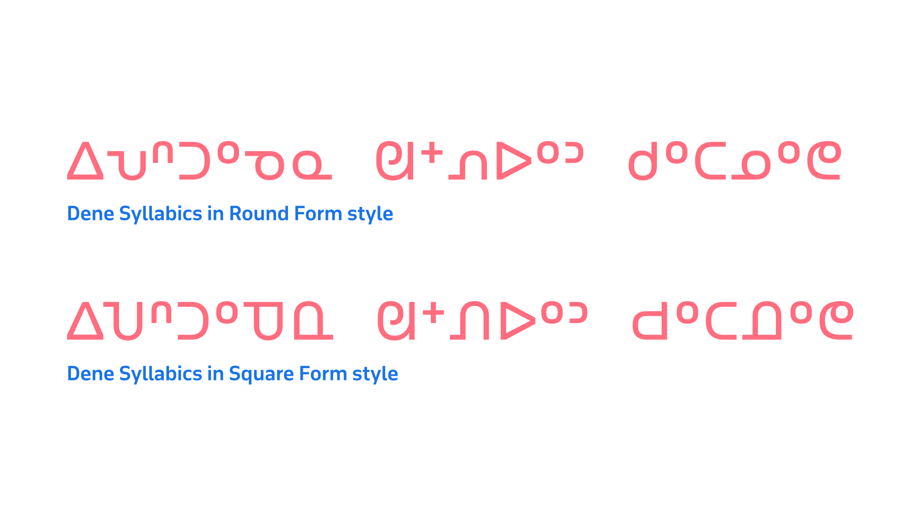
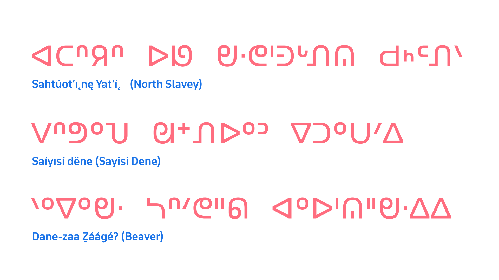

The Dene (Athabaskan) Syllabics faced orthographic requirements that differed from those representations for the Algonquian or Inuktut languages, primarily in the size of the orthography, and in phonetic distinctions that represent a greater inventory of sounds. Additionally—as mentioned in the section Dissemination of Syllabics across North America—French Catholic missionaries largely adapted Syllabics for the Dene languages, and this led to the use of the square form style. This was not only stylistically distinct and preferred in these communities; it was also required in order to allow the legible reading of Dene Syllabics texts. In order for Dene Syllabics orthographies to represent the many consonants and inflections in the language, finals marks had to be positioned at varying vertical positions in relation to the baseline rather than consistently at the topline. The Dene Syllabics can be split into two distinct yet related groups: the general Dene Syllabics and the Carrier Syllabics.

## The square form style preference

The Dene Syllabics use the square form style, with all communities preferring this form over the round form. It can even be argued that the square form use in the Dene Syllabics is a requirement for these orthographies, due to the required behaviors of the finals marks in these systems. In contrast to the Algonquian and Inuktut Syllabics, the Dene Syllabics needed to represent in their orthographies a much greater range of consonants and their corresponding syllables. As a result, finals characters were designed to sit at varying vertical positions in relation to the baseline and topline. This meant that having a uniform height for the syllabic characters was essential in order that readers were able to distinguish these finals marks.

<figure>

</figure>
<figcaption>A comparison of Sayisi Dene Syllabics in the round form style (top) and the square form style (bottom). Note that the square form style in the bottom sample allows for the variation in the vertical positioning of the finals characters to be more clearly distinguished than in the round form style showing of the same text.</figcaption>

## Vertical positioning variation for finals

The vertical positioning of finals is largely stylistic in many Syllabics orthographies; however, in the northern Dene Syllabics orthographies (North and South Slavey, and Chipewyan), this positioning is required for the correct pronunciation of the language. This requirement—although important to these orthographies and languages—creates issues in representation in the current UCAS repertoire in the Unicode Standard. This is because the finals characters required for northern Dene Syllabics are used by other Syllabics orthographies within UCAS, which require these same forms to be rendered at the topline position.

The UCAS code charts use the topline position for all finals characters, and as a result, all commonly available typefaces (especially those at the system level, which are the most accessible to these communities) have finals marks rendered at the topline position. This results in many northern Dene Syllabics communities not being able to render their finals at the vertical positions they require in the typefaces to which they have access.<a id="back-1" href="#1">1</a>

<figure>

</figure>
<figcaption>A showing of the vertical positioning variation for finals characters across four separate Athabaskan languages that use the Dene Syllabics.</figcaption>

As a result of these preferences, Syllabics fonts wishing to support the Dene Syllabics should provide the correct vertical positioning schemes for all Dene Syllabics orthographies by offering midline and baseline finals.

## In summary

The typography of the Syllabics may lack a formal body of literature that users can consult; however, professional typographic implementations can be achieved by observing the practices of local communities in both historical and contemporary documents. By adding to the understanding of the inherent conventions that govern the Syllabics across all of the orthographies that use the script, it is possible to deliver solutions that accommodate the best possible typographic experiences for all readers of this writing system, in their respective languages.

## Endnotes:

<a id="1" href="#back-1">1.</a> Chris Harvey notes in his article _[Syllabic glyph variation](http://www.languagegeek.com/typography/syllabics/syllabic_variation.pdf ),_ “While final placement in most syllabics languages may be stylistically conventional, it would in no circumstances impede legibility. In northern Dene languages on the other hand, the location of the final indicates pronunciation.”

## Endnotes

## Works sourced

William Carpenter Bompass, *Prayers, lessons, and hymns in the Tenni or Slavi language of the Indians of Mackenzie River in the North-West Territory of Canada*. London, Society for Promoting Christian Knowledge, 1900

[British and Foreign Bible Society], *The four Gospels and the Acts of the Apostles*. British and Foreign Bible Society, London, 1903

Ervin Bird Glass, John McDougall, *The ritual of the Methodist Church, with forms of prayer*. Methodist Missionary Society, Toronto, 1899

[International Organization for Standardization], *Information technology—Universal Multiple-Octet Coded Character Set (UCS): Part 1: Architecture and Basic Multilingual Plane: Amendment 11: Unified Canadian Aboriginal Syllabics*. From ISO/IEC 10646–1:1993, FDAM 11, L2/98–128, 1998

Louise Perrault, *Prières, cantiques et catéchisme en langue Montagnaise ou Chipeweyan*. Montréal, 1857.

Louise Perrault, *Prières, cantiques et catechisme en langue Montagnaise ou Chipeweyan*. Montréal, 1857.

Jean Baptiste Thibault, *ᐊᔭᒥᐁ ᓀᐃᔭᐁᐧᒪᓯᓇᐃᑲᐣ ᐊᔭᒥᐊᐃᐧᓇ ᓇᑲᒧᓇ ᒥᓇ ᑭᐢᑭᓄᐊᒪᑐᐃᐧᓇ / Prières, cantiques, catéchisme, etc., en langue crise*, Imprimerie de Louis Perrault, Montréal, 1866
