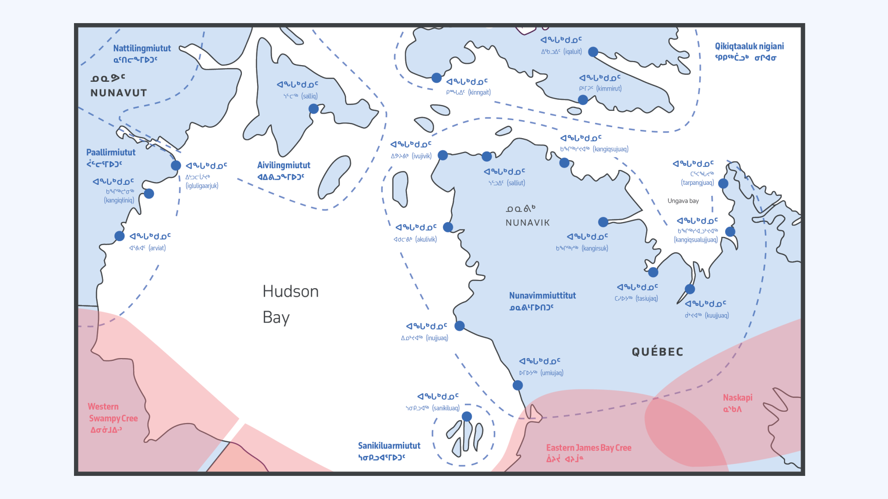
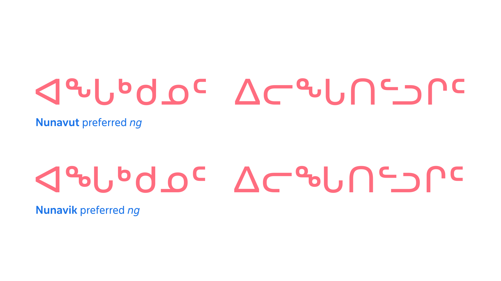

The Inuktut (Inuktitut) Syllabics share a strong graphic relationship with the Algonquian, owing much to the relative proximity of Inuktut communities to an early and major center for Syllabics printing in the area: Moose Factory, Ontario. As Moose Factory was a center for Indigenous language printing, the resident printer John Horden was approached by a group of Inuktut speakers in Northern Québec to print their language in Syllabics. Horden typeset and printed these early texts in his Cree type material, which therefore provided the foundation for the current style of Inuktut Syllabics: round form style with superscripted finals in the “avowel” position.

With the first printed work in the language, the Inuktut Syllabics essentially inherited the Algonquian Syllabics style via the type material that Horden’s press had available. Horden is noted as implementing the Syllabics pattern of using a superscript version of the “a vowel” syllable position as the final character of a series. While the first book that Horden printed in Inuktut Syllabics used Western Cree finals to note the finals characters in Inuktut, shortly thereafter Inuktut Syllabics adopted the convention of using the a vowel position syllable as the final character in each series. In particular this meant that Inuktut adopted from the outset both the round form shape structure and the pattern of using superscripted final characters oriented after the a vowel position of the given series (ᓀ=ne ᓂ=ni ᓄ=no ᓇ=na ᓐ=n). As printing operations were established in Inuktut communities, the orthography was adapted to suit the unique phonetic needs of the language and the various dialects across the circumpolar region.

​​In some Inuktut Syllabics communities, a great deal of effort has been made towards orthographic standardization that allows for a more cohesive and consistent representation of all dialects within a linguistic region. Such is the case with the Inuktut Syllabics (ᖃᓂᐅᔮᖅᐸᐃᑦ  qaniujaaqpait), where efforts in the mid-1970s by the Inuit Cultural Institute (ICI) reformed the Syllabics (and roman orthography qaliujaaqpait) into one consistent repertoire. This reform was an attempt to organize all of the various dialects of Inuktut across the Canadian Arctic, particularly in Nunavut and the Nunavik region of Northern Québec. Regional variation, however, still persists to the present day.

## Nunavik *ng* (ᖕ) preferred form

One of the most notable localisation preferences in all of Syllabics typography is the different preferences, in the Nunavik and Nunavut communities, in terms of the final “ng” character (“angma” in Inuktut). In the Nunavut region, the form for the “ng” final takes the shape of a combined sequence of ᓐ + ᒡ, which results in the shape ᖕ. By contrast, the Nunavik region’s communities prefer their “ng” to be a sequence of ᓐ + ᒃ, resulting in the shape ᖕ.

The Nunavut preferred form (ᖕ) is the default representative form for ng in the Unified Canadian Aboriginal Syllabics code chart, and it is also the most common variant of the form. Nunavik communities deal with this preference by implementing localized typefaces that have their preferred ng shape (ᖕ) in the code point position for this character (U+1595).

While readers in Nunavik encounter the Nunavut ng form more frequently, due to it being the default in many system-level Syllabics typefaces, Nunavut readers occasionally also encounter this form in materials from Nunavik, and refer to it as ᐃᒡᒑᙳᐊᒃ  *iggaannguak* (“little eye glasses”).<a id="back-1" href="#1">1</a>

Both forms are mutually intelligible between either community, with the only difference being that texts set with the preferred “ng” form for Nunavik (ᖕ) have a graphic distinction that alerts the reader to the fact that it is notably a text from the Nunavik region.

<figure>

</figure>
<figcaption>Inuktut communities across Nunavik & Nunavut (blue), Cree communites** (red), Naskapi communites** (red). The above map shows Nunavik and Nunavut communities with their preferred form of ng depicted above the community place name (ᐊᖓᒃᑯᓄᑦ,  ᐊᖓᒃᑯᓄᑦ). The Nunavik region—while complying with the ICI orthographic standards—prefers an "ng" form that is different than that of the Nunavut region.</figcaption>

<figure>

</figure>
<figcaption>A comparison of the same text using the Nunavut and Nunavik local preferences for the ng final glyph shape composition, respectively.</figcaption>

This preference is satisfied in Typotheque’s November and Lava Syllabics typefaces through the implementation of OpenType Stylistic Set substitutions, which allows for switching between these two preferred character variants for these user communities.

## In summary
The typography of the Syllabics may lack a formal body of literature that users can consult; however, professional typographic implementations can be achieved by observing the practices of local communities in both historical and contemporary documents. By adding to the understanding of the inherent conventions that govern the Syllabics across all of the orthographies that use the script, it is possible to deliver solutions that accommodate the best possible typographic experiences for all readers of this writing system, in their respective languages.

## Endnotes

<a id="1" href="#back-1">1.</a> Janet Tamalik McGrath—an Inuktut language consultant familiar with the range of Inuktut dialects of Canada– notes (in email correspondence with the author) that “ICI Nunavut uses a combo of ᓐ + ᒡ (ᖕ) and Nunavik uses what we call iggaannguak (little eye glasses, i.e. two little circles) … For me, I just use the Nunavut ICI keyboard and when reading Nunavik material, I understand it fine and don’t think about style.”

### Works sourced

Base of map vector artwork designed by [Freepik](https://www.freepik.com/free-photos-vectors/travel), accessed 7 May 2020.

James Evans, *Swampy Cree Hymn book (ᓇᑲᒧᐏᓇ ᐅᒪᐢᑮᑯᐘ ᐅᑎᑘᐏᓂᐘᐤ)*. Norway House, 1841. Image from the James Evans Fonds, University of Victoria library, University of Toronto

[International Organization for Standardization], *Information technology—Universal Multiple-Octet Coded Character Set (UCS): Part 1: Architecture and Basic Multilingual Plane: Amendment 11: Unified Canadian Aboriginal Syllabics*. From ISO/IEC 10646–1:1993, FDAM 11, L2/98–128, 1998

[ᐃᓕᓴᕐᓂᓕᕆᒥᖅ / Kativik Ilisarniliriniq], *ᐋᕐᕐᑭᓯᒪᑎᑦᓯᓂᕐᓄᑦ ᐸᕐᒣᓀᒍᑏᑦ 2016–2023 / Strategic plan 2016–2023*. from ᑲᑎᕕᒃ ᐃᓕᓴᕐᓂᓕᕆᒥᖅ / Kativik Ilisarniliriniq, 2016.

John Maclean, *James Evans: Inventor of the Syllabic system of the Cree language*, William Briggs, Toronto, 1890

Janet Tamalik McGrath, *Letter of support to the Unicode Technical Committee*, 3 September 2020.
