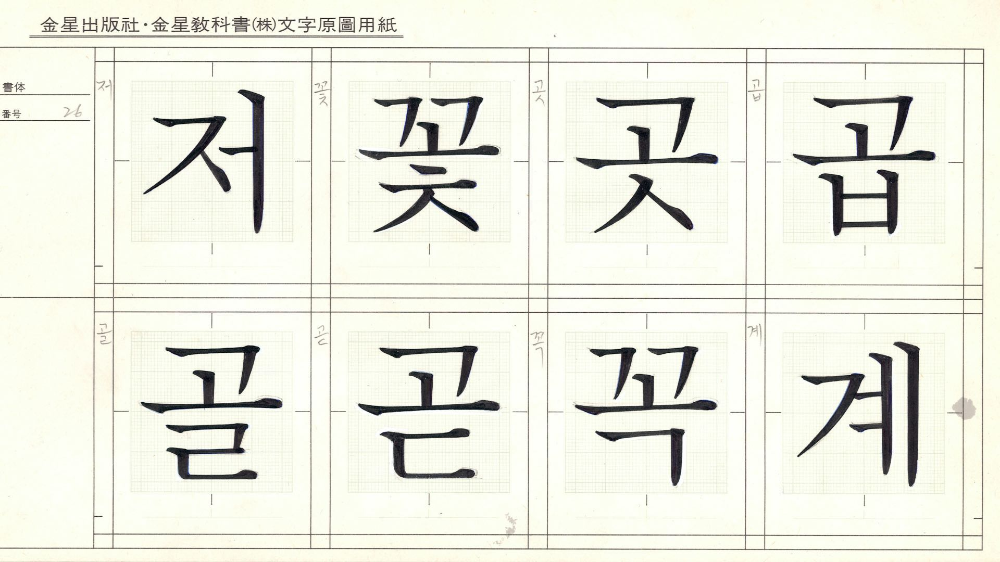

Hangeul, the Korean [script](/glossary/script_writing_system), was created in 1443 and published in 1446. Until then, Korea borrowed Chinese characters to apply them to Korean sounds, as did Japan. Please read [“Type classification in CJK”](/lesson/type_classification_in_cjk_korean) for more information.

## A sans serif origin

<figure>

</figure>

While Latin and Japanese developed their [type](/glossary/type) design from brush and pen based letterforms, Korean was developed completely the other way around.

The first Hangeul design was a [sans serif](/glossary/sans_serif) style, with rounded elements, and this is where the type development of Hangeul starts. King Sejong, the director of Hangeul’s creation, intended this design for citizens to be able to learn the new script easily by drawing on the ground with a stick. For more information, read our [Designing Hangeul](/lesson/an_introduction_to_hangeul) collection of articles by Darrell Penta.

However, after Hangeul was widely spread in the country, the [letterforms](/glossary/letterform) naturally developed into a [script](/glossary/script_typeface_style) style with a use of pointed brush, and this style is called Gung in Korean. The name Gung-chae means “the typeface for the palace,” because the style was popular among the people in the palace. And this script type enjoyed ubiquity until the Korean [serif](/glossary/serif) style was designed by the [type designers](/glossary/type_designer) Kyungseo Park and Jeongho Choi in the 1900s.

<figure>

</figure>
<figcaption>Gungseo font in Mac system, designed to express the Gung style back in the 16th century.</figcaption>

Although Jeongho Choi defined the Korean serif style that we know now, Kyungseo Park built the important structure of the Korean serif. Jeongho Choi also designed a lot of Korean serif typefaces for type foundries in Japan and his designs are still a huge inspiration for many type designers in Korea.

<figure>

</figure>
<figcaption>Jeongho Choi’s sketch. From “Hangeul designer Choi JeongHo,” written by Ahn, Sangsoo and Noh, Eunyou. Ahn Graphics 2014.</figcaption>

<figure>

</figure>

## The non-square style

In the 1980s, type designers started to experiment. Sangcheol Lee and Sang-soo Ahn designed a “non-square” Hangeul font called Saemmulchae and Ahn Sang Soo chae. Ahn received the Gutenberg Prize later in the 2000s for his work. Most Hangeul fonts back then were square and monospaced, but these non-square typefaces were fully proportional, and it broke the stereotype that Korean type design had until then. The non-square structure is also more efficient when designing the type, since it doesn’t have to fit the full width of a square; components can be reused instead of adjusting and squishing. Non-square soon became a new classification, unique to Korean, and more designers started to design non-square fonts.

Please read [“CJK typesetting rules”](/lesson/cjk_typesetting_rules) for more detail about CJK monospaced and full-width fonts.

<figure>

</figure>

## Recent trends and experiments

In the 1990s and early 2000s, the first generation of social media and blogs became popular and Korean type foundries found a new business opportunity. Several social media services in Korea started to sell fonts that you could apply on your blogs or phones. Some, called “action fonts,” had GIF-like animations which made them more suitable for web usage. The social media trend back then didn’t survive to today, but the culture of choosing fonts just for your phone remains, even globally.

Another Korean trend in the early 2000s—particularly on movie posters and book covers—was handwritten type. Because people were fond of the style, many type foundries started to commissioned professional calligraphers to design casual, handwritten-style typefaces.

<figure>

</figure>

From the late 2000s, the trend of retro type kicked in, and took over movie posters and book covers instead of handwritten type. Retro type could be said to be something that feels old but stylish, nostalgic but new, rough but also executed gently. Retro typefaces offer a familiar and friendly feel, and these fonts were used in various settings, from restaurants to pickets.

<figure>

</figure>

In this past decade, the biggest change in Hangeul type design is letter width. Hangeul fonts are monospaced by default, except for the “non-square” fonts, which meant that Hangeul glyphs had 1000 units for the letter width. However, because Hangeul is a composition letter of syllable blocks, when the block has as many components as possible, the letter is likely to pile up. Inevitably, some characters would look squished. By slimming the letter width, the letters would look slightly narrower, resulting in a smoother and smarter reading experience. Most Hangeul fonts designed and released now have a narrow letter width—around 850–950 units—including [Noto Sans Korean](https://fonts.google.com/noto/specimen/Noto+Sans+KR).

Hangeul was created in 1400s, and the first Korean serif was designed in 1900s, which are both relatively later than other scripts. Both Hangeul type design and typography are still evolving, and there are so many potentials and possibilities waiting to be tested.
