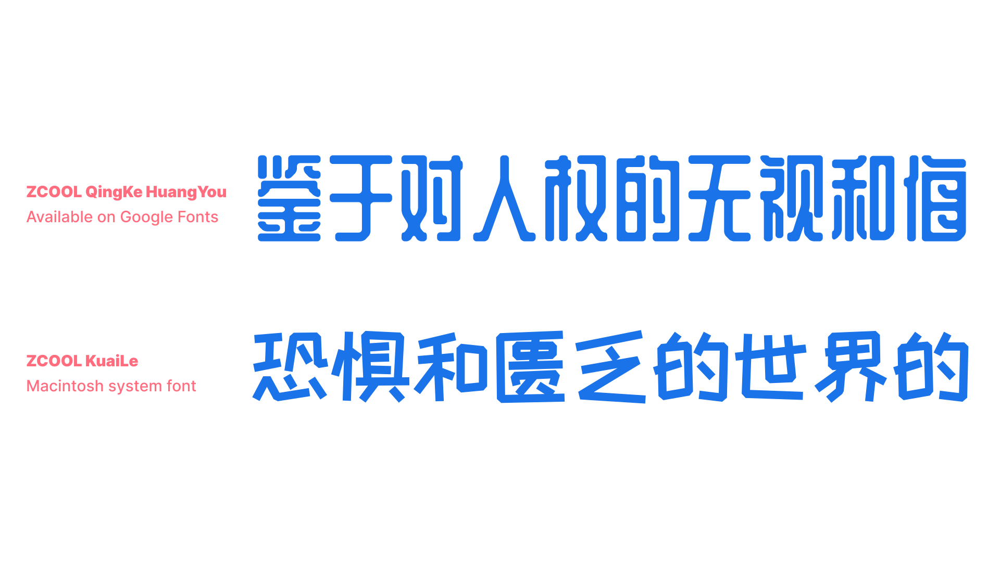

The categories in Chinese type classification can be seen as a set of names from the most popular styles that appeared throughout Chinese type history, all the way to our contemporary times. Even with digital technologies and the multiple mechanical printing techniques, there is—and always has been—a strong connection to handwritten calligraphy. Thus, Chinese typeface categories with styles related to calligraphy are still popular even today, due to the very nature of the characters (which are more organic than mechanical). Styles that are less calligraphic appeared very late in history (first in woodblock printing with Songti and Mingti), as ways to respond to the needs of their times and follow contemporary trends (e.g. Yuanti and Heiti).

As Chinese type evolved mostly independently from Latin, the groups or styles are different. Chinese (digital) type classification can be presented in seven categories, from the most “traditional” style to the most “modern.” Let’s explore the major categories:

### Kaiti (楷体) or “Regular style”

Kaiti style is related to the calligraphic Regular Script (楷书), with “regular” denoting “official” or “formal.” Regular Script is the last calligraphic style that appeared in the history of Chinese calligraphy (around the 7th century). Other than carrying the movements of the brush (traditionality, warmth, liveliness), it’s a separate category to the Handwritten one because Kaiti obeys a number of proportions and details that make it more “standardized.”

<figure>

</figure>

### Handwritten style or Cursive style (手写体, 行书)

Typefaces with a handwritten style in Chinese can vary significantly depending on the tool influencing the shapes or the speed of the movements. 

<figure>

</figure>

### Songti (宋体)

Songti style typefaces have design features made to fit woodblock carving, like straight lines, diamond shaped serifs, and accentuated contrast. Songti was the dominant style used for woodblock printing, which was the main technique used for Chinese printing from the Song dynasty (960–1279) all the way until the Ming dynasty (1368–1644). As it’s the style used for the biggest part of Chinese typography history, it’s the most familiar and popular one for texts, even today. 

<figure>

</figure>

### FangSongti (仿宋体)

FangSongti means “pseudo-Songti.” It’s a style derived from Songti, but with slightly more movement than its precursor (with a subtle slant of horizontal strokes, sharper serifs and endings, and stiffer curves). It's most often suited to classical editorial usage as of the last couple of decades.

<figure>

</figure>

### Heiti (黑体)

With 黑 [hei] meaning “black” or “dark” and 体 [ti] meaning “style,” this is the equivalent of sans serif in Latin script. The first Heiti typefaces appeared recently in Chinese type history (very early 20th century), with the influence of typefaces imported from Europe. Contemporary digital designs made Heiti one of the most popular styles in the digital realm.

<figure>

</figure>

Yuanti (圆体) is a sub-group of Heiti because, even though it is a rounded style (rounded tips and corners), it is the only other style without any serifs.

<figure>

</figure>

### Decorative or Artistic (展示体, 美术体)

This category can be compared to “Display” or “Titling” styles in Latin, with all kinds of playfulness, personality, and quirkiness allowed by the versatility of Chinese characters (remember that this is an organic writing system first!).

<figure>

</figure>

### About the names

You may have noticed how some names start the same, but end up with either “-ti” or “-shu”. In Chinese, 书 [shu] means “calligraphic style” in the context of 书法 [shufa] for calligraphy. And 体 [ti] means “typographic style” in the context of 字体 [ziti] for typography. A typographic style is very often named after its calligraphic style, or contains a reference to its style directly in the name.
