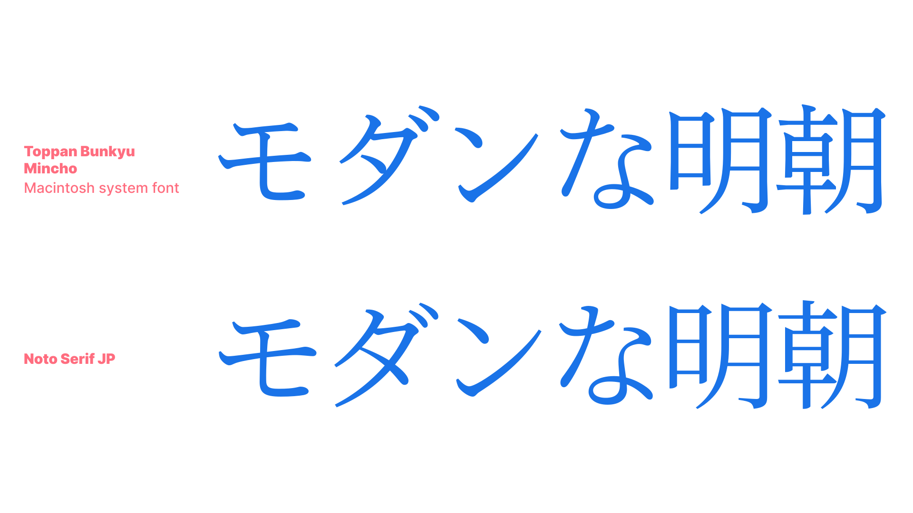
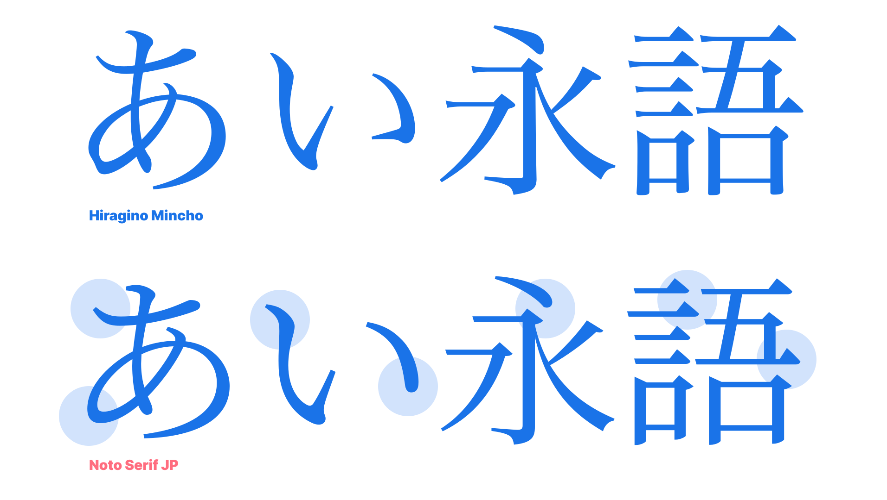

The term “modern serif” in Latin type refers to a classification called didone, such as Bodoni and Didot. However, in Japanese typography, the definition of a modern serif is a little different. Let’s first look at an old-style serif:

<figure>

</figure>

The very first Japanese metal type was designed as an old-style serif because the use of a traditional east-Asian brush for writing was common at the time, and the letterforms were easy to apply to serif designs. 

The characteristics of a traditional Japanese old-style serif has a lot in common with an old-style serif in Latin: small, delicate counters and letter size; elegantly lingering brush strokes—but not so much that it becomes more script design than serif—and organic, natural curves.

<figure>

</figure>

Modern serif classification in Japanese typography is on the opposite end of the spectrum from the old-style serif. It has relatively large and dynamic counter size, simpler strokes, clean elements, and sometimes low contrast between vertical and horizontal strokes. For example, [Noto Serif JP](https://fonts.google.com/noto/specimen/Noto+Serif+JP), while it respects the traditional letterform, it's designed with low contrast and distinctive elements, employing wider counters to improve readability on screen.

<figure>

</figure>

The definition of old-style and modern for sans serif is the same as serif, but for the modern style, there are two kinds of interpretation: Humanist Modern san serif—popular for Latin—and a more systematic and geometric sans serif. Let’s see the difference.

<figure>

</figure>

<figure>

</figure>

As we covered earlier, Noto JP pursues modern elements and strokes while honoring the traditional letterform. If you look at M Plus 1p, however, the counter and letter size is prominently larger, and the movement of strokes are more systematic. It is not strictly geometric all the way in terms of the circles and curves, but has the nuance of a systematic structure.
