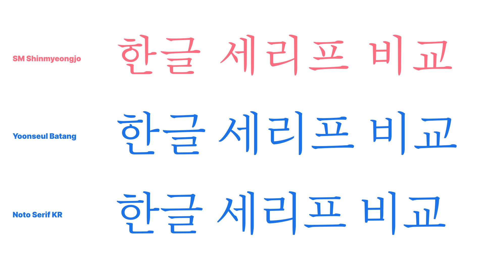
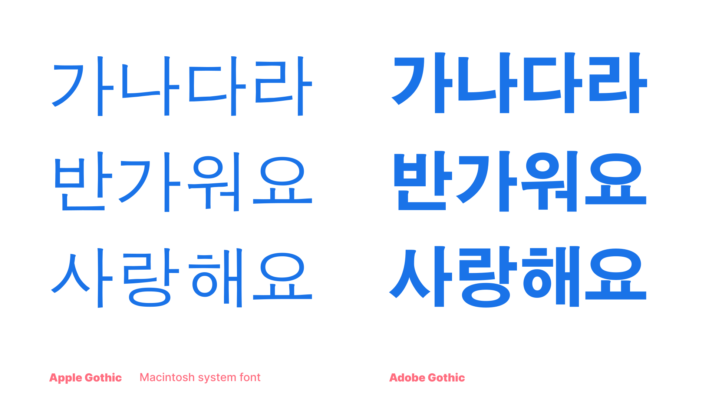
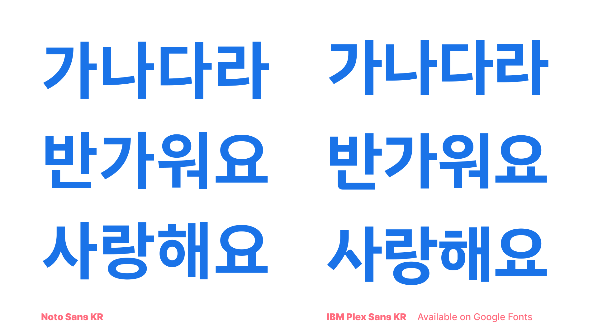
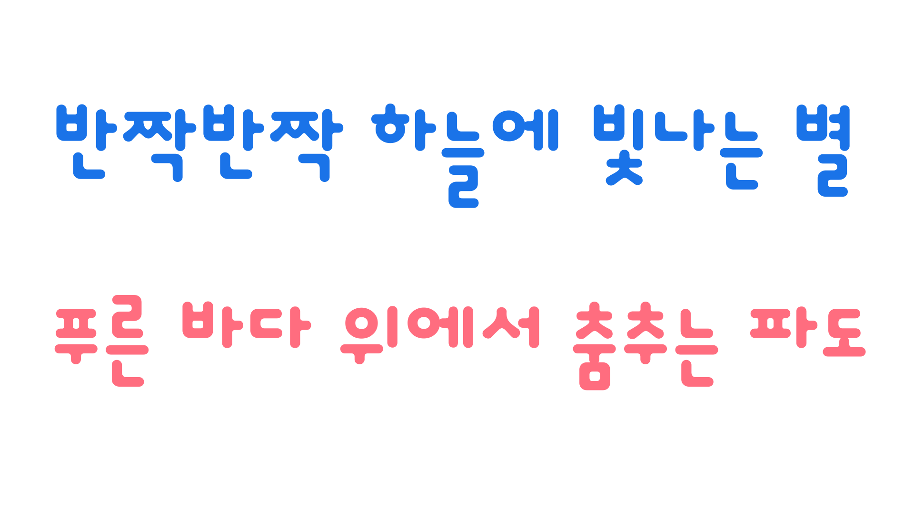

The basic type classification of serif and sans for Korean has a lot in common with Japanese, but since Korean letterforms are fundamentally geometric and have less variety in terms of curves than Japanese, the characteristics to look when understanding the classification is a little different.

Korean old-style serifs also have small counters, but not always the small letter size. However, the strokes can be more brush-like and lingering, rather than systematic. The unique part is that although most old-style serifs in Latin and Japanese would have humanist brush strokes, because they developed from brush writing, Korean old-style serifs are the other way around: They follow the original geometric letterform of the Hangeul from Hunminjeongum. For more information, read our [Designing Hangeul](/lesson/an_introduction_to_hangeul) collection of articles by Darrell Penta.

<figure>

</figure>

Modern serifs in Korean can have several different characteristics. [Noto Serif KR](https://fonts.google.com/noto/specimen/Noto+Serif+KR) is a classic modern serif, with humanist letterforms and distinctive elements. Nanum Myeongjo is a more unusual modern serif, with stiff elements, and larger letter size than Noto Serif KR. Even though the typeface has a strong uniqueness, as long as it’s intended for text usage, it’s considered a modern serif, not a display.

The sans serif classification in Korean is more of a development of the design rather than a classification category. Typical old-style Korean sans serifs will have full-width square letterform, and each component has a wider range of different sizing to forcibly fit the square form. 

<figure>

</figure>

Modern sans serifs, or any sans serifs designed and released in the past couple of decades, have narrow letter width between 850–970 units (85–97%), for a smoother reading experience and more modern feel. The components are not forcibly stretched or stuffed in; instead, the sizing of components changes within a sensible range to respect the original form of the Hangeul component, while keeping the monospaced letterforms. 

<figure>

</figure>

Most Korean fonts are monospaced by default, but very rarely there are also proportional and kerned sans serifs. Also, there is a Korean-only classification called “Talnemo,” meaning out-of-the-box or non-square, and this is also a proportional and kerned Korean type classification.

<figure>

</figure>

 Please read [“The evolution of Hangeul type design”](/lesson/the_evolution_of_hangeul_type_design) for more details.
