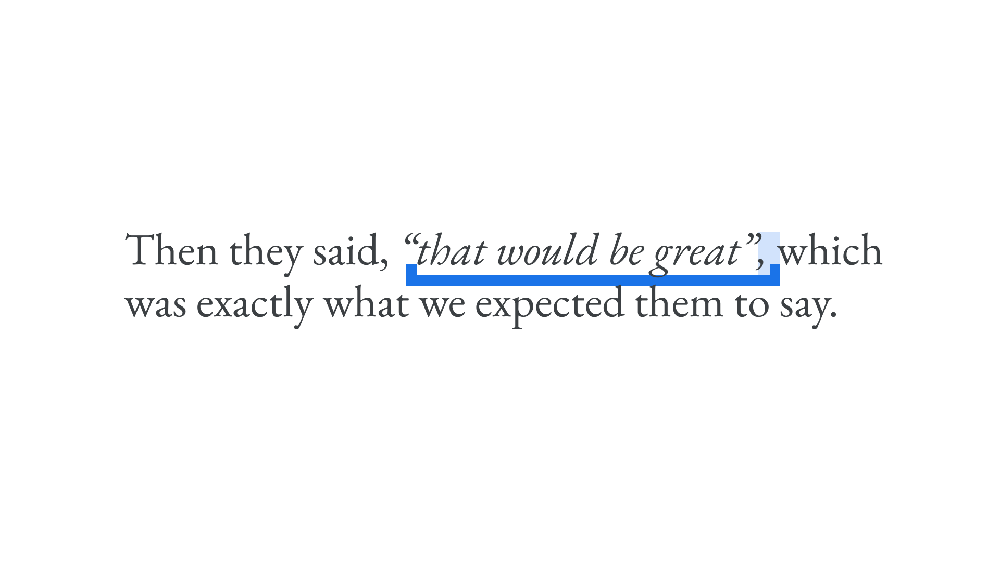
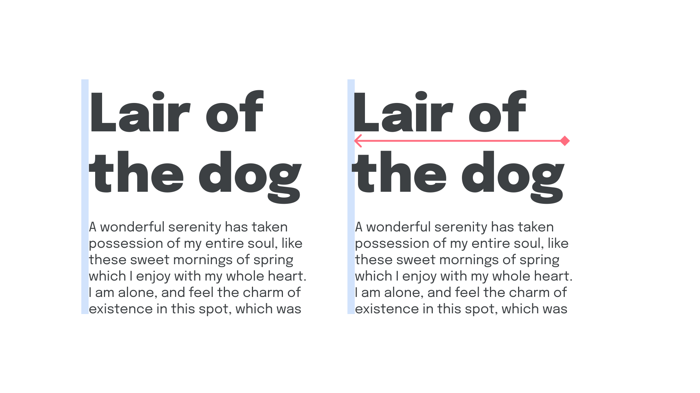

If you’ve read even a handful of articles on **Google Fonts Knowledge**, you’ll have likely noticed a common message being conveyed: That, despite us trying to outline as many typographic good practices as possible, a lot of the time, good [typography](/glossary/typography) is actually about *breaking* the rules. The reason for that is because there are plenty of [typesetting](/glossary/typesetting) scenarios where the standard way of doing things can create undesirable visual effects. We’ve already talked about this in our article about [hanging punctuation](/lesson/working_with_hanging_punctuation). Here, we’re going to cover a few circumstances where we’ll likely need to break the rules within our own typographic system. And, by documenting them, we’ll end up with a *better* system.

## Change the weight of reversed-out type

We explore this at length in our article on why it’s almost always beneficial to have [a typeface that contains multiple weights](/lesson/exploring_typefaces_with_multiple_weights_or_grades)—or better yet, a [variable font](/glossary/variable_fonts) with either a [weight](/glossary/weight) or grade [axis](/glossary/axis_in_variable_fonts). But to put it briefly: If most of our text is set in dark type on a light background, and then in some scenarios it swaps to being set in light text on a dark background, that type will look different—it'll be heavier than normal if we’re working on screen, and lighter than normal if we’re working in print. To counter this,

- on screen, **increase** the weight (or grade) for dark type on a light background,
- in print, **decrease** the weight (or grade) for dark type on a light background,
- on screen, **decrease** the weight (or grade) for light type on a dark background, and
- in print, **increase** the weight (or grade) for light type on a dark background.

To do this using variable fonts on the web, be sure to read Greg Gibson’s article, [“Using CSS Custom Properties to Adjust Variable Font Weights in Dark Mode” on CSS-Tricks](https://css-tricks.com/using-css-custom-properties-to-adjust-variable-font-weights-in-dark-mode/).

<figure>


<figcaption>On the left, light text on a dark background, set in Lato’s Regular weight; on the left, dark text on a light background, set in the Semibold weight.</figcaption>

</figure>

## Move footnotes outside of punctuation

If we have a word in our copy that requires a footnote, its reference should appear immediately after the word. However, if we have punctuation following that word, such as a comma, the extra whitespace caused by the reference will look odd. In this scenario, let’s break the rules and move the reference to *after* the comma.

<figure>


<figcaption>Note the position of the second reference in the right-hand version.</figcaption>

</figure>

## Italicize punctuation and spaces, too

When we [italicize](/glossary/italic) a word and then follow it with punctation—perhaps a comma, a period, or a closing parenthesis—the reduced space caused by the slanted [letterforms](/glossary/letterform) will make it look like the punctuation is nudging up against the italicized word too tightly. Instead, italicize the punctuation as well, and it’ll look considerably better.

While we’re at it, if there’s a space after the punctuation mark, let’s include that space in our italic selection, too. It’s more subtle, but will still improve the [readability](/glossary/legibility_readability) overall because of the spacing in italic forms.

Interestingly, this doesn’t apply to [bold](/glossary/bold) type. Leave any punctuation and spaces un-bolded.

<figure>



</figure>

## Use incremental leading

[//]: # (As we discover in our article “Constructing a Typographic System”...)

Incremental [leading](/glossary/line_height_leading) is the process of getting text to line up to the baseline grid every *few* lines rather than *every* line. This is useful for elements with very small font sizes, where the body line height will likely be too open, and for very large type, where the leading will likely be too tight.

<figure>


</figure>

## Don’t indent paragraphs after a heading

On the web and in print, the default setting for paragraphs is to not indent the first line of [text](/glossary/text_copy); however, it’s a common approach to set up such a paragraph rule in print for longform texts. If choosing to adopt an indentation rule for paragraphs, we might find that it pays to *not* indent the very first one that follows a heading (or other element).

In CSS, it’s possible to indent only paragraphs that immediately follow another paragraph like so:

```css
p + p {
	text-indent: 1em;
}
```

<figure>


</figure>

## Nudge display type to the left

[//]: # (As we explore in a our article about optical alignment...)

The spacing in front of each character might be especially noticeable in [display](/glossary/display)-sized [type](/glossary/type), and might cause it to appear as if it’s ever so slightly indented. Nudge it over to the left a little—perhaps even outside the grid, if possible—so that the prominent stems of the characters on the far left optically align with the body text below. (Obviously, the reverse is true if we’re setting right-aligned type.)

<figure>



</figure>

## Customize drop caps

If we employ [drop caps](/lesson/drop_caps) in our design system, but we have a piece of content that starts with an opening quotation, that mark will become the drop-cap and will probably look a little strange. If possible, let’s take that opening quotation mark outside of the usual text box and manually align it to the “proper” drop-cap; i.e., the first actual letter in our content.

<figure>


</figure>

These are just *some* of the examples of rule breaking that make us better typographers.
