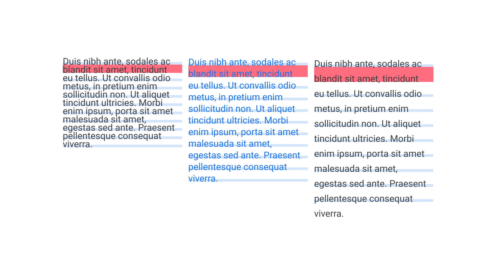
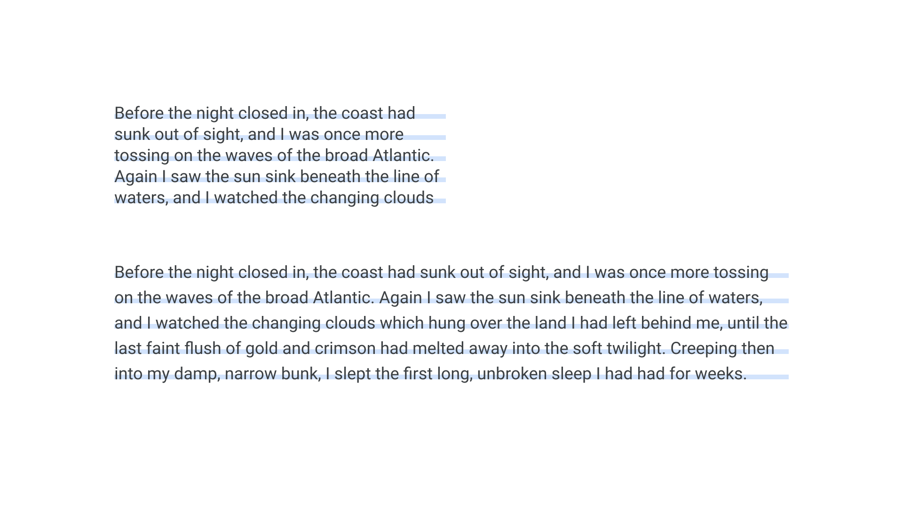

[Line height](/glossary/line_height_leading) is a property so often left at its default value that it can be easily overlooked by the novice [typographer](/glossary/typographer). Any type of software that allows for the setting of [text](/glossary/text_copy)—which is almost any app you can think of, including the humble SMS app—will have a default value set for the space between lines, and this value is usually a percentage of the [font](/glossary/font) size. For many of us, our first encounter with line height selection is being asked to “single space” or “double space” our essays at school.

Our goal as typographers should be to find that “Goldilocks zone” for the content we're working with. Paragraphs should feel open and comfortable to read, but not so open that lines or ideas break apart.

<figure>

<figcaption>Too tight, just right, too open.</figcaption>

</figure>

## Setting line height

Line height can be expressed in a variety of [units](/glossary/unit), including points, pixels, ems, and rems. Thinking in percentages is perhaps the easiest way of understanding the relationship between font size and line height. Setting a line height of 150% in a design application multiplies our font size by 1.5. The exact value we should use for our line height depends on a variety of factors, which we’ll explore in this article. But, generally speaking, between 115% and 150% is where the optimum value sits (often expressed as 1.15 to 1.5 in word processing software settings) for type set in a [Latin script](/glossary/latin). Languages that use plentiful [diacritics](/glossary/diacritic_accent_marks) will usually need more generous leading.

It’s worth remembering that line height is affected by the [x-height](/glossary/x_height). Much like how different [typefaces](/glossary/typeface) can appear to be different heights despite being set at the same font size, so too can line height appear to be more open or tighter, depending on each individual font.

<figure>

<figcaption>The typeface on the right, although set at the same font-size as the one on the left, appears optically larger, and therefore deserves more open line height settings.</figcaption>

</figure>

The smaller the [type](/glossary/type), the more generous we should be with our line height values. When text is set large, the space between lines need not be too big. In fact, for [display](/glossary/display) type, a line height *smaller* than the type size will usually look better. Consider 72px type with a line height of between 90% and 100%.

<figure>

<figcaption>With no concerns about clashing descenders and ascenders in all-caps type, we can sometimes opt for a very tight line height in display settings—again, as long as we don’t need to consider diacritics.</figcaption>

</figure>

## Adapting line height

However, while avoiding collisions between [descenders](/glossary/ascenders_descenders) on one line and [ascenders](/glossary/ascenders_descenders) (or diacritics) on the line below is the first concern of setting the appropriate line height, the best value is not necessarily just based on the size of the type, but on the relationship between the size of the type and the length of the line, or [measure](/glossary/measure_line_length). So, as our measure grows wider, so too should our line height become more open, to aid the reader as they move between lines down the page.

In screen-based design, some designers can neglect the line height value for [body](/glossary/body) type on mobile devices. In this scenario, the optimum experience would be for the line height to be relatively tight: A value such as 150% for wide viewports might instead be 130% at mobile sizes. This is because users’ eyes don't have to travel very far on such narrow screens. And, by the time the design flexes to a wide desktop size, the line height needs to be open enough to aid that same eye movement.

<figure>

</figure>

There’s no secret formula for setting the “right” line height for type. It’ll depend on the font, the size it’s set at, the length of the line, and the overall reading context—which will include the amount of whitespace around the block of text, or between elements on a page. Generally, it’s best to start with body text, and—when working on screen—begin at the narrowest viewport. Then start working up from there. Don’t be afraid to experiment and to adjust the line height value(s) as other parameters change.

[//]: # (To learn about how to adapt line height values within the confines of a baseline grid, see our article, “Constructing a typographic system”)

Note: Line height is not the same as leading. Traditionally, in metal type, line height was the combined measurement of the font size and the strips of lead that were inserted between each row of type. For a 10pt font, inserting two strips of lead would bring the line height to 12pt.
