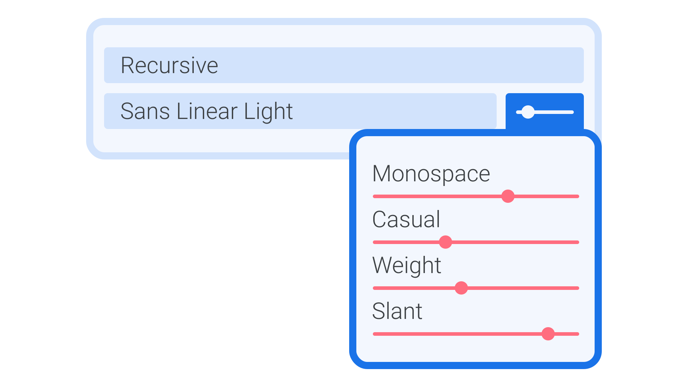

Although [variable fonts](/glossary/variable_fonts) took a while to catch on (the technology has been around since 2016), most of the top desktop design apps now support them, and implementation is fairly consistent across apps from different developers.

In your design app of choice that supports variable fonts, the settings can be found—unsurprisingly—with the [type](/glossary/type) controlling tools. If a variable font is selected, the user interface will show you a range of [axes](/glossary/axis_in_variable_fonts) for whichever parameters the user can control. Most commonly these will be [weight](/glossary/weight) or [width](/glossary/width) or [slant](/glossary/style), but as shown in our [introduction to the subject](/lesson/introducing_variable_fonts), absolutely any aspect of a [typeface](/glossary/typeface)’s design can become variable if the [type designer](/glossary/type_designer) so chooses.

Because it’s still possible to select from various named [instances](/glossary/instance) within a typeface—essentially as a way of shortcutting to the more traditional selections of weight and style—you’ll find controls for that as well. Importantly, jumping into a particular named instance will effectively override any custom positions on the axes that you’ve explored.

In Sketch and Adobe Creative Cloud apps (InDesign, Illustrator, Photoshop, etc.), an additional icon appears to the right of the font weight dropdown, indicating that variable font controls are available. Clicking that will then open up the variable axes you can work with:

<figure>

<figcaption>An approximation of the user interface controls present in most design software that supports variable fonts.</figcaption>

</figure>

Corel Draw also supports variable fonts, although its UI is slightly different to the approach of Sketch and Adobe.

At the time of writing, Figma doesn’t currently support variable fonts. However, the [Variable Fonts plugin by Toni Gemayel](https://www.figma.com/community/plugin/966184368629063440/Variable-Fonts) acts as a useful stop-gap.

[Nick Sherman](https://nicksherman.com) maintains a list of app, browser, and system support for variable fonts at [v-fonts.com/support](https://v-fonts.com/support/).

**A note on optical sizing:** If an optical size axis is present in a font and an app supports it, the appropriate optical size may be set “smartly” by the app without the need for the user to interact with a slider.
