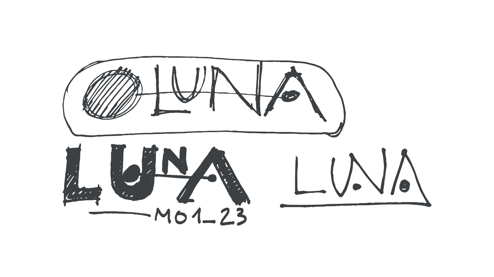
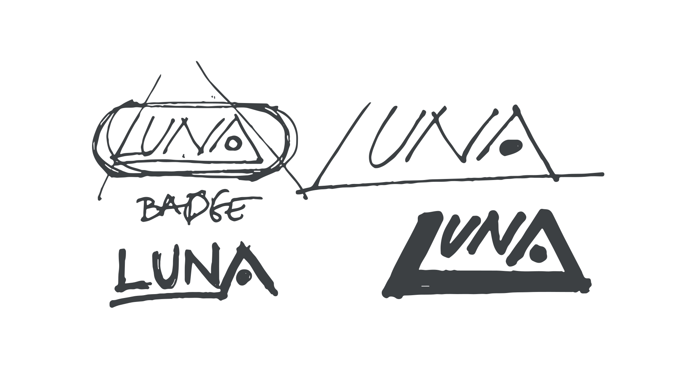
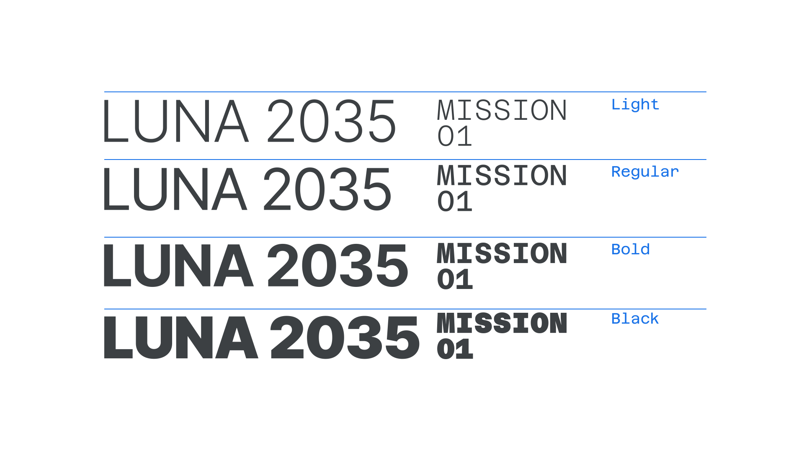
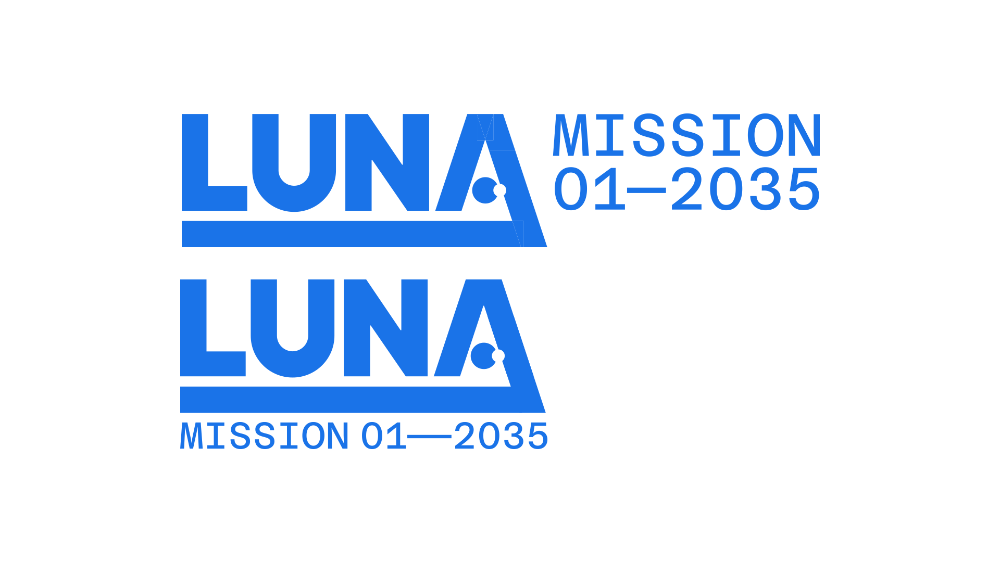
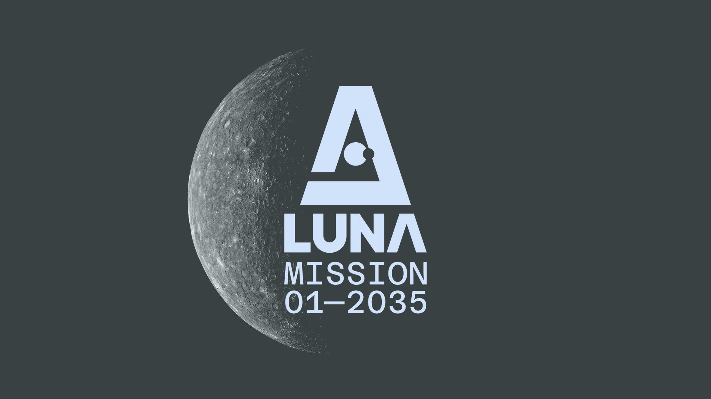
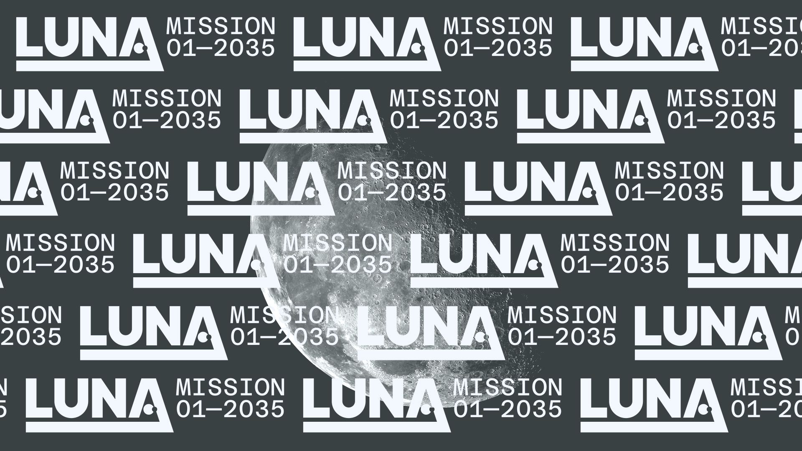
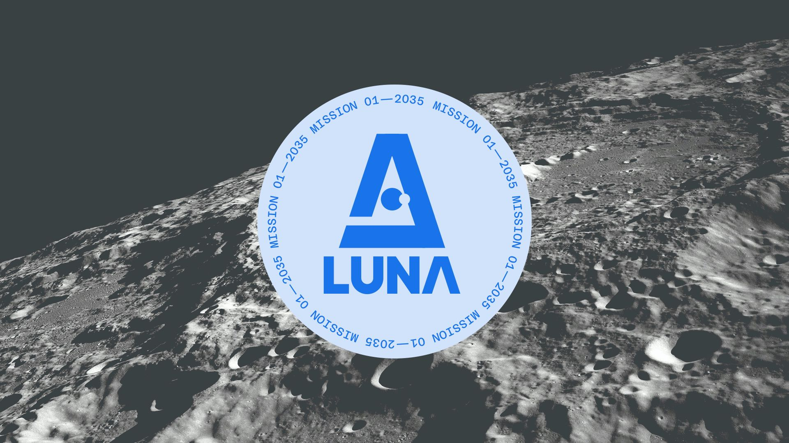
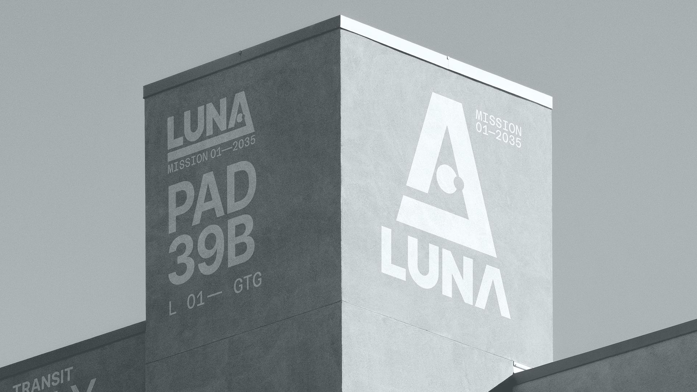
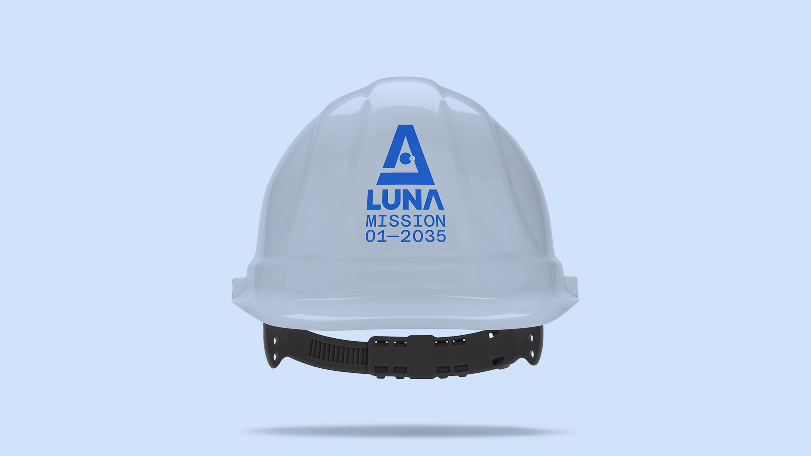

## Do logos still matter?

Ah yes, the perennial question (or argument depending on your point of view) that provides endless nourishment for the design Twitterati and design influencers. It’s a moot discussion, of course, because—surprise—logos matter, maybe now more so than ever. Now that I’m on my soapbox, I’d like to argue that case, and explain through my own creative process how a successful logo is created, from the initial sketch right through to delivery and application. Along the way, I’ll explain the creative decisions I make in order to achieve a result that inspires and hopefully resonates with the audience—effectively communicating the idea, product, or brand. 

As design, branding, and marketing have evolved since the mid 1950s—roughly the birth of modern corporate graphic design and marketing as we know it today—so too has the role of the logo, that stalwart of visual and brand identities. It was—and is—the first thing someone sees when connecting to a brand or product. It’s the signifier that (hopefully) pulls you deeper into the world of that brand.

It used to be enough to just place the logo on whatever you wanted to use to market your brand and stop there. Your identity was defined by the logo and how that logo was placed on everything from letterheads to vehicles to coffee cups. But, as we all know, we now live in a world where a logo has become a much smaller part in a very big ecosystem that involves language and empathy, sound and motion, messaging and positioning. Having a logo alone isn’t enough anymore to connect an audience with your brand and message. BUT (big but), your logo is still that vital first impression. That little graphic that people see and associate with your brand. The swoosh, the apple, the G, the camera, the bird, the music note—they all immediately conjure up images of what those brands mean to you, beyond the actual logo. If you get your branding right, your logo will become a mark of quality, of connection, of belonging—and people will want to own a part of it.
 
And now, with everyone living on their devices, the logo has found more relevance than ever, becoming the literal gateway into your digital world. 

However we—and the way we consume content and interact with brands—change, one thing remains constant: We all need symbols and marks that represent the things that surround us. Whether they were carved on stone tablets or appear as icons on your phone’s home screen, the need for a visual shorthand that communicates ideas and messages is here to stay.

## What’s in a logo? A logo, a logomark, and a logotype walk into a bar...

Before we get going, a quick reminder on the ways to correctly describe logos: A logo can come in various shapes, components, and sizes. When we say *logo*, we’re usually talking about a unique combination of elements—primarily type and graphics—that together create a unique and recognisable design, for example Target, AirBnB, Instagram, etc.

A *logomark* is the specific graphic element, symbol, or icon (e.g. the Nike Swoosh, or the Apple, er... apple) that represents the company or brand. A *logotype* (also known as a wordmark) is a specific typographic design of the naming. Sometimes it can be as simple as [choosing the right typeface](/lesson/a_checklist_for_choosing_type) and writing it out, but usually you’ll spend time customizing the letterforms to create something unique and ownable. The Nike  logo is a great example of that.

When you’re designing a logo for a company, more often than not you’ll end up creating assets that consist of both a logomark and a logotype: A strong graphic symbol paired with a bespoke wordmark that really represents all the qualities of the brand. But something interesting has been happening the last decade or so: Logos need to be infinitely flexible.
 
It used to be enough to ask yourself “Can it fax?” If your design survived the low quality transmission of the faxing process and came out legible on the other side, you passed. Today, however, your logo needs to work as an (app) [icon](/glossary/icon_symbol), on responsive websites, on TV, on billboards, T-shirts, tote bags, and Twitch avatars, just to name a few applications—resulting in an emphasis on the logomark as a vital part of any visual identity toolkit. Gone are the days when a logo was only presented in one static lockup across every single application.

Today, a successful logo is one that can be pulled apart into its single components and reconfigured in different ways without ever losing its essence and character. The multicolored Google logo reduces into a G icon on your phone, or when it’s paired with another part of the wider Google brand ecosystem. It can move and bounce and rotate, and it informs a much bigger identity system. In the heading of this page, for example, the logo is small and single-color. And with the brand’s colors applied to a new Google Fonts icon, we never lose track that it’s *Google* wherever you interact with that logo—whether it’s on your phone, in a TV ad, across a billboard, or even that little G on a Google Home device—the experience of connecting with the brand and a logo that moves from logomark to logotype is seamless.

And with all this in mind, let’s put everything into practice and design a logotype.

## From type to logotype!

For our evergreen subject matter, we’ll tackle something future-facing that will, hopefully, stay relevant for a long time: A moon mission! I admit I’m a bit of a sci-fi and space geek, and with the recent developments in the American Space Program, it looks like we actually might send people back to the moon in the next few years—so lets do a bit of speculative design to riff on that. Welcome to **LUNA 2035**, the next crewed mission to the moon!

So, as I said, I’ll design a logotype. However, since a logomark is nowadays so vital to a successful and versatile logo, let’s make that a part of the final project, too.

## The process

As with a real client project, I want to set us a brief, mainly to build guardrails around the work I’m intending to do, and clarify exactly what I’m aiming to achieve at the end of this mini project.

The goal is to design a logo for **LUNA 2035**, a fictional, future, crewed moon mission. The logo will need to be future-forward and evocative of human progress; the endeavor of humankind exploring space; a little bit of that space-age optimism blended through a modern lens. (Note: Because this is obviously a fictitious mission, I’m refraining from using any official NASA or JPL logos). The end result will be the **LUNA 2035** logo, with supporting typographic and presentation treatments.

With the brief set, I begin the creation process by doodling and sketching concepts on paper. I find this is a quick, intuitive, and fluid way to instigate, refine and define ideas, rather than dive into digital design straight away. 

<figure>

</figure>

As I’m sketching, I also think of which typefaces I might use for the logo. (Quick reminder: A typeface is the distinct design of a family of related fonts, e.g. Roboto. A specific weight and style within the family is a font, i.e. Roboto Bold).

Choosing the right typeface is an art in and of itself, and can make or break your design and how it communicates with your intended audience. (If you want to get deeper into this subject I recommend you read [“A checklist for choosing type.”](/lesson/a_checklist_for_choosing_type))

For this project, it can be easy to get sidetracked into pastiche sci-fi design—the book [Typeset In The Future](https://typesetinthefuture.com/) is a wonderful treasure trove of Sci-Fi typography—which is what I want to avoid. Even though this is all speculative, I want the design to have verisimilitude (the apperance of being real).

## Designing the logo

With any project of this kind, I will always start with pen and paper sketching. The speed at which you can dot ideas on a page beats any app by miles. It just allows you to let ideas (good ones and bad ones) flow freely and get to a result very quickly. In my own practice, I’ve had logo designs approved based purely on a sketch. More famous examples are Paula Sher’s [Citi](https://nedwin.medium.com/the-1-5m-napkin-abd2702927d0) sketch and Trevor Key’s napkin doodle of what would become the [Virgin logo](https://static1.squarespace.com/static/62582f26084d6a5b79ee56c4/t/6274f909e028ed2b08247531/1651833098685/The+Virgin+logo+story.pdf).

When I’m sketching, I’m aiming for a few things:
- An iconic, minimal mark (icon) that I can use as a graphic device with the wordmark and that allows me to play with different lockups.
- Clean, geometric shapes. Maybe I can replace certain letters in **LUNA** with a graphic shape?
- Modernity: I want a simple, clean and timeless look.

<figure>

</figure>

As you can see, most of the sketches are mainly a variation of writing the word **LUNA** in different ways, editing shapes, customizing letters, etc. I want to start from an existing typeface and edit that, so I’m consciously avoiding creating “out there” designs (see also my point about verisimilitude).

<figure>

</figure>

As I’m sketching I’m also considering potential stylistic treatments such as creating a ligature within the name. I also briefly consider creating a holding shape that can encapsulate the logo—especially relevant when you think about mission patches—but it doesn’t go deeper than a cursory sketch idea.

<figure>

</figure>

Another idea involves redrawing all letters at an angle pointing upwards—also creating a symmetry with the “A” (but I quickly disregard this idea because it looks too agressive).

<figure>

</figure>

Once I feel I’m getting to a conceptual place I like, I begin to translate my sketches into vectors. 

<figure>

</figure>

<figure>

</figure>

My go-to tool for this is Adobe Illustrator (sometimes in combination with the Adobe Capture app on my iPhone to photograph and convert sketches into SVG files that I can import into Illustrator).  If you’re not using Adobe Illustrator, there are many other applications like Affinity Designer, Figma, or Sketch that are great tools for this part of the design process.

Now that I’m confident that I have a good set of sketched concepts, I start to edit down the list of typefaces I’ve been researching since I began the project. My initial selection yields a few interesting choices: [Rubik Mono One](https://fonts.google.com/specimen/Rubik+Mono+One/tester?query=Rubik) (bold and chunky—interesting, but perhaps too stylized) and [Goldman](https://fonts.google.com/specimen/Goldman/tester?category=Display,Monospace&preview.text=LUNA%20MISSION&preview.text_type=custom) (reminds me of a modern interpretation of the mid-century [sci-fi classic](https://typesetinthefuture.com/2014/11/29/fontspots-eurostile/) [Eurostile](https://en.wikipedia.org/wiki/Eurostile)).

<figure>

</figure>

I think it’s key to start looking at potential typefaces throughout the span of the creative process, rather than add it on after you’ve made a few sketches. Your design and type choices need to work in tandem.

One thing I know for sure is I want to use a secondary [monospaced](/glossary/monospaced) typeface for things like potentially displaying data and stats (hey, it’s a moon mission). I love [Space Mono](https://fonts.google.com/specimen/Space+Mono?category=Display,Monospace&preview.text=LUNA%20MISSION&preview.text_type=custom) and would instinctively go for that workhorse. But **[Azeret Mono](https://fonts.google.com/specimen/Azeret+Mono/tester?category=Display,Monospace&preview.text=LUNA%20MISSION&preview.text_type=custom)** has some lovely unexpected qualities that remind me of modern interpretations of typefaces like [OCR-B](https://en.wikipedia.org/wiki/OCR-B) and [Courier](https://en.wikipedia.org/wiki/Courier_(typeface))—which lean very close to the fonts NASA used. For inspiration, you can see the [Apollo 11 Flight Plan](https://www.nasa.gov/specials/apollo50th/pdf/a11final-fltpln.pdf), which uses [Futura](https://en.wikipedia.org/wiki/Futura_(typeface)) and what looks like a monospaced version of [Bell Gothic](https://en.wikipedia.org/wiki/Bell_Gothic) (a popular typeface designed specifically for maximum legibility of dense, small copy).

<figure>

</figure>

Adapting the sketches into digital designs—and aiming for the modern, timeless look I set out to achieve—I choose **[Inter Tight](https://fonts.google.com/specimen/Inter+Tight?query=inter&preview.text=LUNA%20MISSION%2001%2FONE&preview.text_type=custom)** as my primary typeface for the **LUNA** wordmark for a few reasons. Firstly, the aforementioned timelessness. Looking at how NASA uses Helvetica (especially since the much revered [“Worm” design by Danne & Blackburn](https://www.creativereview.co.uk/nasa-worm-logo/)), I want to stay close, but look at a more contemporary iteration, one that also works great on-screen. Inter ticks all those boxes, but I feel Inter Tight adds a little extra character to the way text is typeset that strikes a perfect balance between what’s past and what’s tomorrow. And importantly, Azeret Mono [pairs](/lesson/pairing_typefaces) really nicely with it.

<figure>

</figure>

Sometimes typeface choices really come down to “does it evoke the right feeling?” And even the basic geometry of an open or two-storey “a” can make all the difference in how it evokes the brand or project it represents.

<figure>

</figure>

With my typeface choices made, I can now work at speed, creating iterations of the **LUNA** and **LUNA MISSION** lockups. As you see, I’ve subtly tweaked the letterforms of the “U” and “A” in **LUNA** to make them look slightly more like geometric shapes. I’ve also removed the crossbar in the “A”. It feels like an appropriate nod to NASA’s Worm logo) and want to integrate two dots that symbolize the relationship between Earth and the Moon—reflecting the history and significance of the event inspired by the [1967 Apollo Mission Flight Plan chart](https://moon.nasa.gov/resources/348/apollo-mission-flight-plan-1967/). 

<figure>

</figure>

<figure>

</figure>

My original idea is to create an updated idea of that graphic and construct a logo where the dots are—as far as that’s possible—accurately scaled and placed to indicate the distance between the two. But, as I start to translate my sketches into vectors it quickly becomes obvious that the visual balance and weight is off. It could work by inventing a completely new “A” shape, but that would defeat the purpose of this exercise, and I want to keep the geometry of the uppercase “A”.

<figure>

</figure>

Similarly, the ligature idea ends up going nowhere—it breaks the visual balance of the word, and there’s really no strong conceptual reason to justify having a ligature there. Sometimes a sketch can look great and evolve into a strong design, but in this case the sketch should stay just that.

<figure>

</figure>

But this gives me another idea: instead of placing the “Earth–Moon” dots apart, they can be one element—an abstract representation of the Moon passing in front of the Earth. 

<figure>

</figure>

Initially I nestle the element within the “U”, and within the “A” as a replacement of the crossbar I removed earlier. The “A” with the dots forms a striking mark, especially with the thick horizontal bar I’ve incorporated into the design from my sketches—and it creates a strong rocket motif. 

<figure>

</figure>

Now that I have a strong icon, I decide that the best solution is to integrate it into the “A”, rather than the “U”: Thematically, it makes sense for the aforementioned reasons (rocket motif, upwards motion, strong silhouette)—and the full logo can be reduced to the “A” mark, giving me a range of design options for the logo lockups, and applications where I’ll need a more compact logo.

Having iterated the designs I arrive at the final results of the logo and logotype in the various lockups.

## The logo

<figure>

</figure>

The final result is a contemporary and (hopefully) timeless **LUNA 2035** logo that can be used and adapted across a variety of touchpoints—from the side of a launch vehicle to the Instagram avatar of the mission’s social channels; from apparel and broadcast graphics.

<figure>

</figure>

<figure>

</figure>

Keeping flexibility of usage in mind, I create both horizontal and vertical logo lockups—with and without the supporting “Mission 01—2035” copy. This gives me—and the end client—a good range of assets that all carry the same visual design consistency across formats.

<figure>

</figure>

<figure>

</figure>

While the horizontal logo lockup can be seen as the “master logo”—it contains the full message and all design elements are represented in the unit—the vertical lockup and stand-alone “A” mark are more *iconic*. And, as the following examples show, they're also more appropriate in the context of this little space exploration branding project, where you’ll see logos live on everything from buildings, uniforms, utilities and patches (even though the “A” scales down perfectly to a social avatar).

<figure>

</figure>

<figure>

</figure>

I’ve created a set of presentation hero graphics to show how the logo can be brought to life as a visual asset that represents the initiative and hopefully inspires the audience. Most of the time this is what the public at large will see, so it needs to have impact and make an immediate connection.

<figure>

</figure>

<figure>

</figure>

<figure>

</figure>

The fun here, of course, is to look at potential use cases, and imagine how the **LUNA 2035** logo—and design language—would be applied in real-world scenarios that go beyond brand expression graphics.

<figure>

</figure>

<figure>

</figure>

<figure>

</figure>

<figure>

</figure>

<figure>

</figure>

<figure>

</figure>

## Parting thoughts

I used to firmly believe that all logos (and especially the ones I designed) need to be created from bespoke typefaces, rather than use something that exists already. There are many arguments for that approach, but what I’ve found over the years is that *how* you use type to create something unique is more important than starting with a unique typeface. If you look around, you’ll see there are 1000s of logos that all use the same (or very similar) typefaces. And yet, each logo is unique to its brand, thanks to unique design details and the context they’re placed in.

<figure>

</figure>

Ultimately, it’s about knowing what’s right for any given project. You can achieve great solutions by the smallest interventions, and often using the tools and ingredients that are already out there will give you the perfect starting point to build something exciting that resonates with everyone.
