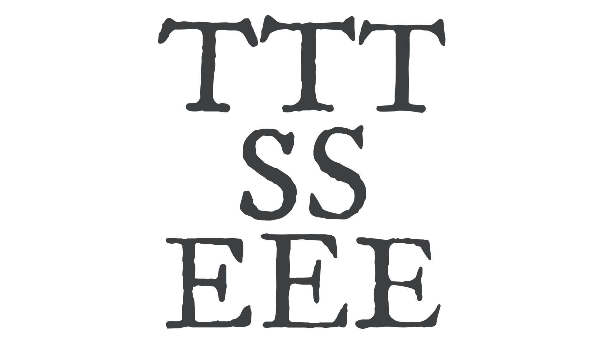
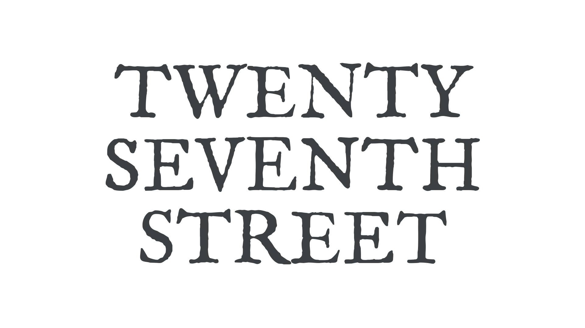

The vast majority of the time, [type](/glossary/type) should look like type. Reading a blog post, following instructions in a recipe book, paying attention to road signage—the uniformity and reliability of type is what helps readers understand [text](/glossary/text_copy). But there are some design scenarios, such as when we’re creating a logotype, a poster, or product packaging, where a more unique approach might be more appropriate.

Consider a magazine cover, where the display [typography](/glossary/typography) might need to resemble [lettering](/glossary/lettering) or sign writing. Even the most attractive handwritten-style [typeface](/glossary/typeface) will lose its human touch if we see repeating [letterforms](/glossary/letterform). The typeface we’re using in this example, [Birthstone](https://fonts.google.com/specimen/Birthstone?query=Birthstone), is beautiful, but it’s a bit too rigid for our magazine cover. There’s a fair amount of repetition, which doesn’t make it look particularly exciting. 

<figure>

</figure>

This scenario requires a touch of the human hand. The good news is that we don’t need to manually manipulate the outlines of our type—we can add a hand-lettered feel by using alternate glyphs with the power of [stylistic sets](/glossary/stylistic_sets) via [OpenType](/glossary/open_type) controls. (Head over to [“Introducing alternate glyphs”](https://fonts.google.com/knowledge/introducing_type/introducing_alternate_glyphs) for an overview.)

<figure>

</figure>

This [font](/glossary/font) actually comes with a number of stylistic sets. To experiment with them, try switching different sets on for different parts of the text. But beware! Not all play nicely together:

<figure>

</figure>

Our text is now a bit of a mess, for several reasons:

1. Some letterforms clash directly with adjacent glyphs.
2. Some letterforms have lead-ins and lead-outs that come from or go nowhere.
3. Some of the more elaborate [swashes](/glossary/swash_glyph) create undesirable amounts of negative space between the characters.
4. Some overlaps of strokes create unsightly dark spots, or distracting counters. In short, the result does not have the combination of consistency and originality that a skilled letterer would impart.

To counter this, we need to choose [alternate](/glossary/alternates) [glyphs](/glossary/glyph) that work well together, both in terms of how they physically fit together and also how they resemble a hand-lettered approach.

Here’s our finished example, which balances the fluidity of the human hand with the precision of type. We’re also employing some subtle spacing, [line-height](/glossary/line_height_leading), and font size changes here to get everything working really well together:

<figure>

</figure>

Here’s a mockup of our finished piece:

<figure>

</figure>

The result is an authentic touch that goes much further than simply typing with the font’s defaults. For more on turning type into a logo, be sure to read Tom Muller’s [“From type to logotype”](/lesson/from_type_to_logotype) article. And to learn how to work with stylistic sets using CSS, see [“Implementing OpenType features on the web.”](https://fonts.google.com/knowledge/using_type/implementing_open_type_features_on_the_web)

For our second example, let’s consider a film logo, where the title is meant to be reminiscent of old street signs. A common faux pas is to use a typeface that has a distressed or worn aesthetic, which then loses its impact when we see repeated characters having identical forms:

<figure>

</figure>

This typeface, [IM Fell English](https://fonts.google.com/specimen/IM+Fell+English?query=im+fell), conveys the feel we’re after really well, but because this is going on a poster that’s going to be reproduced at large sizes, some of the intentional wearing is going to appear obviously repetitive.

Just look at how repeating [characters](/glossary/character)—or repeating sequences of characters—look when isolated:

<figure>

</figure>

Let’s fix this by introducing some variations here. This time we won’t be using alternate glyphs via OpenType; instead, we’re going to employ a slightly different version of the same typeface. 

Here are the different versions of the T, S, and E characters we’re going to use, set in IM FELL English, [IM FELL DW Pica](https://fonts.google.com/specimen/IM+Fell+DW+Pica?query=im+fell), and [IM FELL Great Primer](https://fonts.google.com/specimen/IM+Fell+Great+Primer?query=im+fell):

<figure>

</figure>

Using different versions of the same typeface, we keep the underlying structure and familiarity of the letterforms, but introduce enough uneven, rough, imperfect variations to remind the reader that these may very well have been hand-carved into old stone buildings. 

Here’s our final lockup:

<figure>

</figure>

Here’s a mockup of our finished piece:

<figure>

</figure>

Again, with just a little extra care, we’ve given our type much more authenticity and created an end result that more accurately conveys the feel of the subject the type is attempting to represent.
