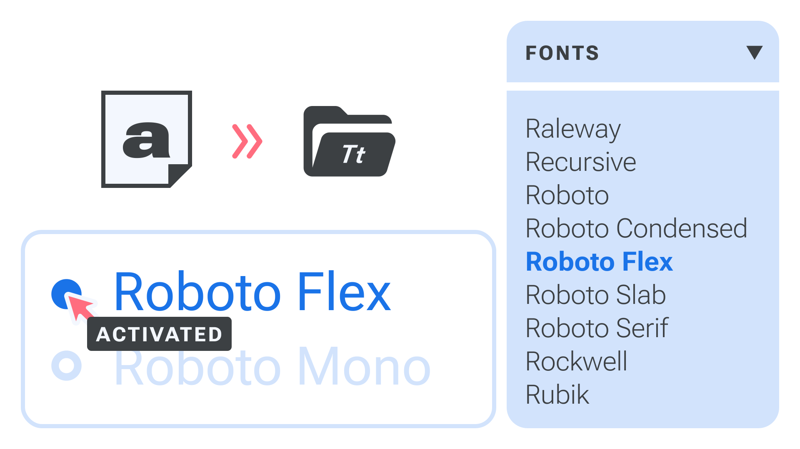
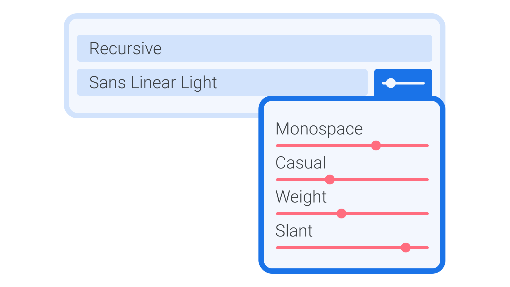

Building and maintaining a [font](/glossary/font) collection on the computer you use for design work is an important part of life as a designer. However, there are a number of ways this process can be optimized—primarily by understanding where font files live, but also by proactively organizing your collection with font management software. If you’ve embraced the world of [variable fonts](/glossary/variable_fonts), there are a few additional considerations. We’ll cover all of that in this article, which is intended to serve as a universal guide for managing fonts, whether you’re working with static fonts, variable fonts, or a combination of both.

<figure>

</figure>

## Acquiring & installing fonts

Whether you’ve downloaded a font from somewhere like Google Fonts or purchased a license from an independent type foundry, you’ll need to know where your font files are. And, unless you’re using fonts already included in the font menu of an app (or using a font manager—see below), you’ll need to move them to the directory required by your system so that they’ll show up in all apps’ font menus.

On macOS, the system font location is `Macintosh HD > Library > Fonts`. (If you can’t see the Library folder, holding down the option (⌥) key while opening the Finder’s Go menu will reveal the “Library” option. From there you can find the `Username > Library > Fonts` folder to install fonts that can only be accessed by your own username.) However, Apple makes the process easy thanks to Font Book—macOS’ built-in font manager. We’ll dive into font managers shortly.

On Windows, the location is `C:\Windows\Fonts`. (If you can’t move fonts there, use `C: \Users\Username\AppData\Local\Microsoft\Windows\Fonts\` to install fonts that can only be accessed by your own username.)

For more information, see [Adobe’s help documentation](https://www.adobe.com/products/type/install-instructions.html) on installing fonts for all kinds of operating systems.

Once the new font files are in the correct location, they should be ready to use in every app, although often you’ll need to restart an app if it was already running before you installed a font.

## Using a font manager

Font management apps are useful if you have a large font library, or work as part of a team that maintains a large shared library. Font managers allow you to have many fonts installed, but only a select few *activated* at any one time —it’s only fonts that are activated that show up in apps’ font menus.

Here are some popular font managers:
- Font Book (macOS, installed by default)
- [FontBase](https://fontba.se) (macOS / Windows / GNU+Linux)
- [FontExplorer Pro X](https://www.fontexplorerx.com) (macOS / Windows, discontinued)
- [Connect Fonts](https://www.extensis.com/connect/fonts) (macOS / Windows, formerly known as Suitcase Fusion)
- [Typeface](https://typefaceapp.com) (macOS)
- [RightFont](https://rightfontapp.com) (macOS)
- [Font-Manager](https://github.com/FontManager/font-manager) (GNU+Linux)

Each font manager is unique, but all share core functionality: You choose where to store your font library and select which fonts should be activated or deactivated. Most also offer additional ways of managing fonts such as grouping or tagging, either automatically or manually. Those that support variable fonts may also offer interactive previews of the variable [axes](/glossary/axis_in_variable_fonts).

Some font managers are designed to manage only those fonts available from a particular service rather than control all fonts on your system. These include Adobe’s Creative Cloud application, Monotype Fonts, and FontStand.

## Considerations for variable fonts

If you intend to work with variable fonts, the first thing you’ll need to do when acquiring the files is to make sure you’ve actually *got* variable fonts.

The file extension variable fonts use is usually .ttf and, rarely, .otf, but sadly that doesn’t distinguish them from their non-variable kin. Many foundries and distributors choose to include an indication of variation in the filename, such as the way Google Fonts lists the axes tags (`RobotoSerif[grad,opsz,wdth,wgth].ttf`). This makes it easier to see that it’s definitely a variable font, and which axes are available at a glance.

Using variable fonts on the web is relatively straightforward, especially with a service such as Google Fonts: Simply [load the variable fonts](/lesson/loading_variable_fonts_on_the_web) you’d like to use, then [style the type with CSS](/lesson/styling_type_on_the_web_with_variable_fonts). But how do you use variable fonts in a desktop app?

One important thing to note is that not all desktop apps populate their font menu in the same way. Sketch, for instance, uses fonts installed locally on your system, whereas Figma combines local fonts with a selection of fonts served from the Google Fonts library—which now includes hundreds of variable fonts. Adobe’s various Creative Cloud apps also combine local fonts with a selection of fonts bundled with the apps (including a few variable fonts). The Adobe Fonts library does not yet provide any variable fonts.

Some font manager apps allow the Google Fonts library to be synced to your computer, which means they should show up in all font menus. At the time of writing, Typeface is the only app to sync the entire Google Fonts library, *including* variable fonts. Other apps sync the library, but without variable fonts included.

Also, support for variable fonts can differ between apps, falling into one of these four scenarios:

1. Variable fonts are supported with full integration into the typography engine. For example, the [Optical Size axis (opsz)](/glossary/optical_size_axis) is applied automatically based on the font size in points, with a way to change the ratio or manually set the size; or, when adding a stroke to text, the app correctly applies the stroke only to only the outer shape of each glyph (and not the inner contours used to construct it). Within an app’s scripting or type preferences, we can define contextual rules to apply [axis](/glossary/axis_in_variable_fonts) values to character or paragraph styles, rather than only setting axes directly in a GUI.

2. Variable fonts are supported with direct control over axes (usually shown as sliders and number inputs). Many design apps now allow for this, including Figma, Sketch, and Adobe’s Photoshop, InDesign, and Illustrator apps. [v-fonts.com/support](http://v-fonts.com/support) actively maintains a list of supporting software.

3. Variable fonts are presented as a set of static fonts. In this case, we can’t set any axis value, but we can access the named [instances](/glossary/instance). Current examples include Apple’s Keynote, Numbers, and Pages apps, and Microsoft’s Word and Powerpoint. In Affinity’s suite of apps, variable fonts’ metrics remain at their default values, which means they’re currently unusable.

4. Variable fonts are occasionally not supported at all, in which case only the default style can be used.

## Resolving variable font conflicts

With your variable font acquired and installed, it should be ready to use in your (supported) app of choice. But it’s not always that straightforward.

Perhaps the most common hurdle when using variable fonts in desktop apps is the conflict between variable and non-variable versions of the same typeface, if they have the same family name. It’s not uncommon to install both versions to cover all bases, only to find things looking confusing in apps’ font menus. And what happens if you have a static font installed locally, but the variable version is being served via your design app of choice? Some apps, such as Figma, include built-in [static font replacement](https://help.figma.com/hc/en-us/articles/5579502031511-Use-variable-fonts#Replace_static_fonts) features.

This is where font managers can be especially useful. Instead of deleting or moving files locally to resolve conflict issues, you can simply deactivate any local fonts that might be causing the problem.

## Best practices for font management

Anyone maintaining a font collection, whether variable or static, should use a font manager. Being able to activate and deactivate fonts helps not only with font choices by removing all the irrelevant fonts from the menu, but also with resolving any conflicts or issues with your font files.

Always choose a specific location for your font library rather than simply dragging fonts into the font manager app. Knowing exactly where your library lives, with all (non-system) fonts stored in one place, will make any troubleshooting a lot easier. And, if that location is a shared or synced folder, as well as serving as a back-up, it will also help you keep your library consistent across different machines. Just be sure to check that the font license allows for activation on more than one device.
