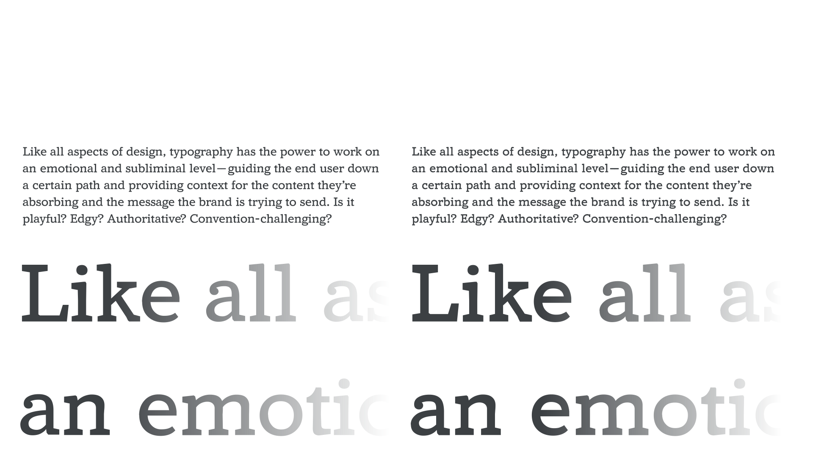

In variable fonts, axes control the different aspects of a typeface’s design, such as weight, width, optical size, italic, slant, or indeed any change dreamed up by the type designer. A parametric axis takes this concept further by allowing the fine tuning of just one singular aspect of a typeface, which makes it possible for expert users to finesse a typeface in ways that were previously reserved for type designers.

<figure>

<figcaption>CAPTION</figcaption>

</figure>

They are useful by themselves to tune a single aspect of weight, width or height, and can often be modified in concert with other axes or settings. Knowing what the desirable changes are, and which sets of adjustments to make, requires experience and expertise, and we’ll attempt to cover the basics in this introductory article.

There are four fundamental parameters to any typeface:

1. The opaque stroke widths that typically exist along the X dimension, such as in the thicker vertical stems in H; or the thicker strokes of the glyph when not aligned to a cartesian grid, such as in X or O when the type design has slanted angle of stroke contrast, or ‘stress’. Opaque shapes are also known as positive shapes.
2. The opaque stroke widths that typically exist along the Y dimension, such as the thin bar stroke across the H, or the thinner strokes of a glyph, such as X or O.
3. The transparent spaces that change in X dimension, where there are no strokes (and are known as negative shapes, or counters).
4. The transparent spaces that change in the Y dimension (and are known as vertical alignment zones, such as x-height or cap height).

<figure>

<figcaption>CAPTION</figcaption>

</figure>

However, fonts with parametric axes typically offer more than four parameters to make it more convenient to improve typography. For example, to control vertical alignments, a set of axes for different transparent sections or zones in the Y dimension may be offered, such as Parametric Uppercase Height (YTUC) and Parametric Lowercase Height (YTLC), which control the heights of uppercase and lowercase glyphs respectively.

<figure>

<figcaption>CAPTION</figcaption>

</figure>

Yet these kinds of enhancements can be packaged into “smart” functionality that optimizes typography for designers and users who do not need to understand the internal mechanics. For example, the Parametric Counter Width (XTRA) axis can be used alongside adjustments to word space and letter spacing to improve justification, as demonstrated in Type Network’s variable fonts brochure.

Any individual font style, whether a static font or an instance of a variable font, can be calibrated with parametric axes values, as the axes ranges are “absolute” values that can be compared across styles. (For developers, the parama-roundup Github project by Font Bureau demonstrates how to do this calibration.)
Consequently, in theory, if a broad range of parametric axes are created by a type designer, all typical variations of style within a family—all weights and widths across a set of optical sizes— can be synthesized by using parametric axes in concert. However, such synthesis or the interrelation of axes are not yet possible with the current OpenType variable fonts technology. Therefore, the practical use of parametric axes is limited to using them carefully in conjunction with other axes, to fine-tune those axes and redefine the predefined styles offered within them.

<figure>

<figcaption>CAPTION</figcaption>

</figure>

Another consequence of axes not being interrelated in OpenType is that the minimum and maximum ends of parametric axes often have an extreme effect, which is required to be useful at some extreme design space location (such as the widest, heaviest, largest style) but will create undesirable results if applied at other more typical locations.

<figure>

<figcaption>CAPTION</figcaption>

</figure>

Future improvements to OpenType may allow type designers to prevent parametric axes from creating undesirable results, and further reduce the file size of complete variable font families by using them to synthesize weight, width, optical size, grade, small caps, old style figures, and other axes and alternates.
