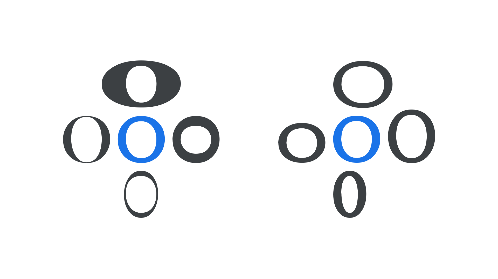
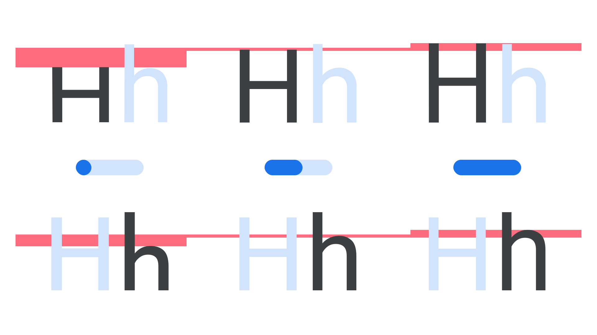

In [variable fonts](/glossary/variable_fonts), [axes](/glossary/axis_in_variable_fonts) control the different aspects of a [typeface](/glossary/typeface)’s design, such as [weight](/glossary/weight_axis), [width](/glossary/width_axis), [optical size](/glossary/optical_size_axis), [italic](/glossary/italic_axis), [slant](/glossary/slant_axis), or indeed any change dreamed up by the [type designer](/glossary/type_designer). A [parametric axis](/glossary/parametric_axis) takes this concept further by allowing the fine tuning of just one singular aspect of a typeface, which makes it possible for expert users to finesse a typeface in ways that were previously reserved for [type foundries](/glossary/type_foundry).

They are useful by themselves to tune a single aspect of weight, width or height, and can often be modified in concert with other axes or settings. Knowing what the desirable changes are, and which sets of adjustments to make, requires experience and expertise—and we’ll attempt to cover the basics in this introductory article.

There are four fundamental parameters latent in any typeface:

1. The opaque [stroke](/glossary/stroke) widths that typically exist along the X dimension, such as in the thicker vertical stems in H; or the thicker strokes of the [glyph](/glossary/glyph) when not aligned to a cartesian grid, such as in X or O when the type design has slanted angle of [stroke contrast, or stress](/glossary/axis_in_type_design). Opaque shapes are also known as positive shapes. (Shown below, left, above and below.)
2. The opaque stroke widths that typically exist along the Y dimension, such as the thin bar stroke across the H, or the thinner strokes of a glyph, such as X or O. (Shown below, left, left and right)
3. The transparent spaces that change in the X dimension, effecting width. These spaces are also known as negative shapes, or counters. (Shown below, right, above and below.)
4. The transparent spaces that change in the Y dimension, effecting height. These spaces are also known as vertical alignment zones, such as [x-height](/glossary/x_height) or [cap height](/glossary/cap_height). (Shown below, right, left and right.)

<figure>

<figcaption>Amstelvar's lowercase “o” shown at the extreme ends of four parametric axes, showing opaque axes (left) and transparent axes (right), with the default design in blue.</figcaption>

</figure>

However, [fonts](/glossary/variable_fonts) with parametric axes typically offer more than four parameters to make it more convenient to improve typography. For example, to control vertical alignments, a set of axes for different transparent sections or zones in the Y dimension may be offered, such as [Parametric Uppercase Height (YTUC)](/glossary/ytuc_axis) and [Parametric Lowercase Height (YTLC)](/glossary/ytlc_axis), which control the heights of uppercase and lowercase glyphs respectively.

<figure>

<figcaption>Roboto Flex's minimum value, default value, and maximum value of the Parametric Uppercase Height (YTUC) axis (top) and Parametric Lowercase Height (YTLC) axis (bottom).</figcaption>

</figure>

Yet these kinds of enhancements can be packaged into “smart” functionality that optimizes typography for designers and users who do not need to understand the internal mechanics. For example, the [Parametric Counter Width (XTRA)](/glossary/xtra_axis) axis can be used alongside adjustments to word space and letter spacing to improve [justification](/glossary/alignment_justification), as [demonstrated in Type Network’s variable fonts brochure](https://variablefonts.typenetwork.com/topics/spacing/variations).

Any individual font style, whether a static font or an [instance](/glossary/instance) of a variable font, can be calibrated with parametric axes values, as the axes ranges are “absolute” values that can be compared across styles. (For developers, the [parama-roundup](https://github.com/FontBureau/Parama-roundup) Github project by Font Bureau demonstrates how to do this calibration.)

Consequently, in theory, if a broad range of parametric axes are created by a type designer, all typical variations of style within a family—all weights and widths across a set of optical sizes— can be synthesized by using parametric axes in concert. However, such synthesis or the interrelation of axes are not yet possible with the current [OpenType](/glossary/open_type) variable fonts technology. Therefore, the practical use of parametric axes today is by using them carefully in conjunction with other axes to fine-tune them, redefining the predefined styles they offer. For example, if you need an optical size design optimized for text even smaller than the Optical Size axis mininum, starting with that style and then slightly increasing the Parametric Thin Stroke axis (YOPQ), and setting some positive tracking, can work well.

<figure>

<figcaption>Amstelvar, set at the very small 6pt optical size (left), can be subtly optimized for even smaller text sizes (right) by slightly increasing its Parametric Thin Stroke axis (YOPQ), along with some positive tracking.</figcaption>

</figure>

Another consequence of axes not being interrelated in OpenType today is that the minimum and maximum ends of parametric axes often have an extreme effect, which is required to be useful at some extreme design space location (such as the widest, heaviest, largest style) but will create undesirable results if applied at other more typical locations.

<figure>

<figcaption>Parametric axes are powerful and can be misused to achieve undesirable results–in this case, the maximum value for the Parametric Thin Stroke axis (YOPQ) is applied to a light weight of Roboto Flex.</figcaption>

</figure>

Future improvements to OpenType may allow type designers to prevent parametric axes from creating undesirable results, and further reduce the file size of complete variable font families by using them to synthesize weight, width, optical size, grade, small caps, old style figures, and other axes and alternates.
