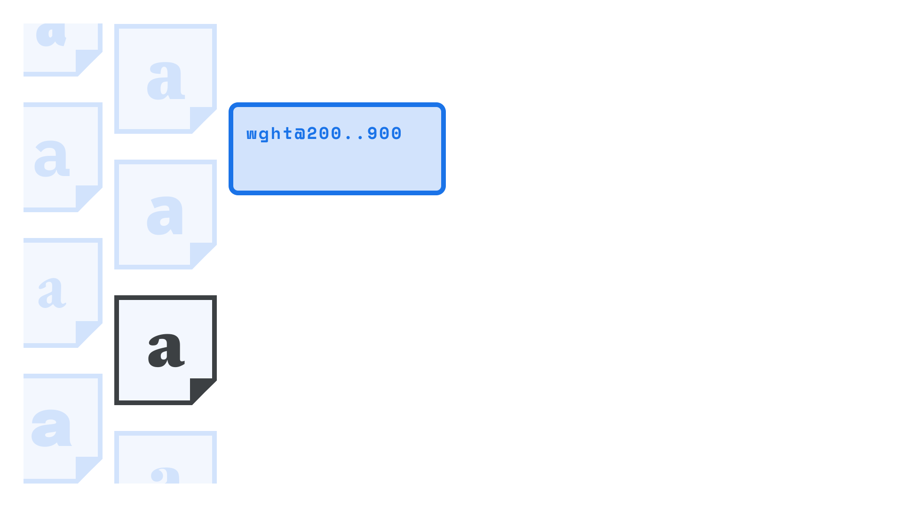

Using a [variable font](/glossary/variable_fonts) on our website is straightforward, but let’s break down each step in the process so we can see how it differs from using traditional [web fonts](/glossary/web_font).

First, we’ll need to choose a variable font, either from a [font delivery service](/lesson/using_web_fonts_from_a_font_delivery_service) such as Google Fonts, or one we’re choosing to [self-host](/lesson/self_hosting_web_fonts).

<figure>



</figure>

## Loading variable fonts from a font delivery service

If we’re using Google Fonts, we might be used to seeing this embed code for non-variable web fonts:

```
https://fonts.googleapis.com/css2?family=Oswald:wght@200;700&display=swap
```

[//]: # (We need to remove the asterisks from all of these these code examples if we can’t do proper boldening!)

The `wght@200;700` part of that code will load the 200 and 700 weights of Oswald. But for variable fonts, we can specify a *range* of weights by turning that semi-colon into two periods:

```
https://fonts.googleapis.com/css2?family=Oswald:wght@200..700&display=swap
```

Easy! Of course, not all designs take advantage of the complete range of styles, but the real value of variable fonts is the ability to expand the range of our design while reducing the amount of font data transferred. In this case, we’d get the entire weight range of 200–700 for the equivalent of two or three individual styles—all in a single download.

It’s also possible to specify just one particular weight value rather than a range. In this example, we load only the weight value of “284”:

```
https://fonts.googleapis.com/css2?family=Oswald:wght@284&display=swap
```

The above examples load different weights, but it’s possible to load other variable axes, too. Check out our article [“Styling type on the web with variable fonts.”](/lesson/styling_type_on_the_web_with_variable_fonts)

(By the way, we’re only including code examples for Google Fonts because, at the time of writing, Adobe Fonts doesn’t serve variable fonts for web use.)

## Loading variable fonts when self-hosting

As noted on our article on [using self-hosted web fonts](/lesson/self_hosting_web_fonts), we need to set up some basic `@font-face` rules before we get into any actual typesetting. However, because variable fonts can operate over ranges of values, we need to express those ranges using CSS descriptors:

- `font-stretch` (expressed as percentages), to control width;
- a potentially quite different value for `font-style` than what we’re used to (see the note below);
- and a range (rather than a single value) for `font-weight` to control weight.

Here’s a template:

```css
@font-face {
  font-family: 'FAMILY_NAME';
  font-stretch: PERCENTAGE_RANGE_LOW_TO_HIGH; /* Note that font-stretch is a % of normal width */
  font-style: NORMAL_OR_ITALIC; /* See note below */
  font-weight: NUMERIC_RANGE_LOW_TO_HIGH;
  src: url(FONT_FILE_NAME.woff2) format('woff2');
}
```

### A note on the new font-style conventions

Currently, `font-style` should only be specified for variable fonts in two scenarios:

- If we’re loading a font file that only contains [italics](/glossary/italic) (such as when loading [upright](/glossary/regular_upright) and italic font files, and grouping them with the same family name).
- If our variable font contains a “slant” axis but not an “italic” one.

If we’re loading an italic-only font file, we need to use `font-style: italic;`. If we’re loading a font file with a slant axis, we have to specify the low and high degree values, such as `font-style: oblique 0deg 10deg;`

Due to some inconsistencies with how browsers handle variable font files that contain both italic *and* upright variants (and also files that contain both italic *and* slant axes), in these scenarios it’s best to omit the `font-style` line completely.
