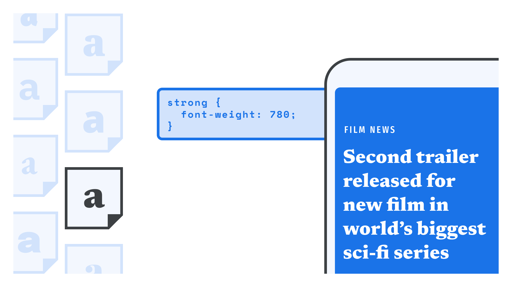

Whether loading [variable fonts](/glossary/variable_fonts) from a [font delivery service](/lesson/using_web_fonts_from_a_font_delivery_service) or [our own server](/lesson/self_hosting_web_fonts), the actual styling of them via CSS is almost the same as standard, non-variable [fonts](/glossary/font)—with the addition of a new CSS property to control custom [axes](/glossary/axis_in_variable_fonts).

<figure>



</figure>

As we mentioned in our article [“Loading variable fonts on the web,”](/lesson/loading_variable_fonts_on_the_web) it’s possible to specify the axis we want to manipulate and load the *range* of that axis, as with this example for loading weights 200–700 of Oswald from Google Fonts:

```
https://fonts.googleapis.com/css2?family=Oswald:wght@200..700&display=swap
```

Now let’s consider other axes we can work with. The ones currently referenced in the CSS spec (i.e., widely supported in modern browsers) are [Italic](/glossary/italic_axis), [Optical Size](/glossary/optical_size_axis), [Slant](/glossary/slant_axis), [Weight](/glossary/weight_axis), and [Width](/glossary/width_axis). (When using the Google Fonts API, be sure to list them alphabetically.) They’re mapped to CSS proper like so:

| Axis & Abbreviation: | CSS attribute: |
| --- | --- |
| Italic (ital) | font-style |
| Optical size (opsz) | font-optical-sizing |
| Slant (slnt) | font-style |
| Weight (wght) | font-weight |
| Width (wdth) | font-stretch |

As you can see, the registered axes correlate to standard CSS properties that we’re used to. But we’re in no way restricted to using these registered axes. As we’ve discussed before, the [type designer](/glossary/type_designer) can choose to make any aspect of a [typeface](/glossary/typeface) design variable, and these custom axes can be referenced using the new CSS property `font-variation-settings` (see “Working with custom axes” below). This property is also useful in certain scenarios for the registered axes.

## Registered axis: weight

<figure>


<figcaption>The Weight axis in the typeface <a href="https://fonts.google.com/specimen/Epilogue">Epilogue</a></figcaption>

</figure>

Let’s assign a variable **[weight](/glossary/weight_axis)** property to some of our paragraph type and anything marked up as `strong`:

```css
p {
  font-weight: 350;
}

strong {
  font-weight: 780;
}
```

The only thing new about this CSS is that, unlike non-variable fonts, the `font-weight` values no longer have to be declared in units of 100. Rather than have body copy set in a regular weight, which would usually sit at 400, we can set it a little lighter, at 350. 300 is usually where a light weight might sit, so we’re effectively choosing a value that’s in between light and regular.

Similarly, whereas `strong` text would usually be set in a bold weight, most often with a value of 700, we’re setting it at 780: heavier than a bold, but not quite as heavy as an extra bold—which would usually be the weight that sits at 800.

## Registered axis: width

<figure>


<figcaption>The Width axis in the typeface <a href="https://fonts.google.com/specimen/Anybody">Anybody</a></figcaption>

</figure>

Assigning a variable **[width](/glossary/width_axis)** property follows much the same pattern:

```css
p {
  font-stretch: 50%;
}

strong {
  font-stretch: 193%;
}
```

Here, our paragraph text will be quite narrow—50% is what the type designer has decided is half of the regular (100%) width—and the strong text will almost twice the width of the regular. Width values are always above 0, with 100% being the regular width.

## Registered axes: italic and slant

<figure>


<figcaption>The Slant axis in the typeface <a href="https://fonts.google.com/specimen/Recursive">Recursive</a></figcaption>

</figure>

For setting variable **[italic](/glossary/italic_axis)** and **[slant](/glossary/slant_axis)** values, things are a little different, as these two properties are closely related.

First, let’s deal with italics. Because true italics are original drawings rather than just slanted versions of the upright typeface, and some characters (e.g., a and g) have notably different italic forms, it often makes no sense to offer smooth variation between them. Therefore, the italic axis is usually effectively an on/off switch that links two separate font files.

If the upright and italic versions sit in entirely separate font files, we can use standard CSS syntax for styling the italicized type:

```css
body {
  font-style: normal;
}

em {
  font-style: italic;
}
```

If, however, we have a single variable font that contains an italic axis, it’s currently necessary to use the low-level `font-variation-settings` syntax:

```css
body {
  font-variation-settings: 'ital' 0;
}

em {
  font-variation-settings: 'ital' 1;
}
```

It’s possible to have the upright and italic in the same font file, but in that case, it’s more likely the font would use the slant axis. And, for most situations, it currently makes sense to use the low-level `font-variation-settings` syntax to control slant, even if there’s no italic:

```css
body {
  font-variation-settings: 'slnt' 0;
}

.oblique {
  font-variation-settings: 'slnt' -12;
}
```

It’s fair to say that the close relationship between the italic and slant axes, the differences between the high-level and low-level syntaxes, and the (currently) inconsistent browser implementation of the CSS spec mean there are more than a few nuances! Fortunately, Stephen Nixon, designer of the [Recursive](https://www.recursive.design) typeface, has put together a test page on [arrowtype.github.io](https://arrowtype.github.io/vf-slnt-test/slnt-ital-tests/index.html).

## Registered axis: optical size

<figure>


<figcaption>The Optical Size axis in the typeface <a href="https://github.com/googlefonts/amstelvar">Amstelvar</a></figcaption>

</figure>

The last registered axis we’ll look at is **[optical size](/glossary/optical_size_axis)**. The concept is that the numeric value for this axis should match the rendered font size in px, and a new CSS attribute was introduced to go along with it: `font-optical-sizing`. The default is `auto`, so this CSS is already pre-loaded behavior in all modern browsers:

```css
body {
  font-optical-sizing: auto;
}
```

We can change it to `none`, but it is more common to leave that property on and instead set an explicit value by using `font-variation-settings`, like so:

```css
body {
  font-variation-settings: 'opsz' 16;
}

h1 {
  font-variation-settings: 'opsz' 48;
}
```

## Working with custom axes

As we’ve explored in our article [“Introducing variable fonts,”](/lesson/introducing_variable_fonts) it’s possible for a type designer to assign almost any aspect of a typeface’s design to a variable axis, no matter how inventive. In the Recursive typeface, one of the custom axes is “Casual,” (`CASL`) which makes the font shift from a typical sans serif design to one that looks more like freehand sign-painting.

Using custom axes is straightforward, but in *all* scenarios we need to use the `font-variation-settings` property:

```css
p {
  font-variation-settings: 'CASL' 0.15;
}

span {
  font-variation-settings: 'CASL' 0.86;
}
```

We should always refer to the documentation provided by our chosen font’s [foundry](/glossary/type_foundry) for the correct four-character axis name, and be sure to reference any custom axis in UPPERCASE. In line with the current CSS spec, only the OpenType registered variable axes (those five demonstrated in the first part of this article) should appear in lowercase. Also, if we’re using the Google Fonts API, the uppercase axes have to appear first in the URL.

[//]: # (TO-DO: Move the sentence above to the “Loading variable fonts on the web” article.)

## Progressive enhancement & legacy browser support

To support the broadest set of browsers and devices, it’s advisable to set up our CSS with standard values first, and the variable styles within an `@supports` block. The Google Fonts API is smart enough to [supply the static font files if the browser doesn’t support variable ones](https://developers.google.com/fonts/docs/css2#legacy_browser_support), so all we have to do is manage the CSS side of the equation. If we’re using an alternative font delivery service or hosting the fonts ourselves, we just need to add a reference to the variable font family inside the `@supports` block.

Adding in the `font-synthesis: none` declaration prevents browsers from [artificially bolding or italicizing the font](/glossary/faux_fake_pseudo_synthesized), which can lead to unexpected and less-than-ideal results.

```css
p {
  font-synthesis: none;
  font-weight: normal;
}

strong {
  font-synthesis: none;
  font-weight: bold;
}

@supports (font-variation-settings: normal) {
  p {
    font-weight: 350;
  }
  strong {
    font-weight: 575;
  }
}
```

Lastly, it can be be useful to simplify our usage of `font-variation-settings` using a CSS custom property (also known as a CSS variable) so that we can alter only the axis’ value without having to redeclare the entire `font-variation-settings` string (which is especially useful to avoid the [variable font inheritance problem outlined  by Roel Nieskens](https://pixelambacht.nl/2019/fixing-variable-font-inheritance/)).

Here’s an example for controlling the italic axis...

```css
:root {
  --text-ital: 0;
}

body {
  font-variation-settings: 'ital' var(--text-ital);
}

em {
  --text-ital: 1;
}
```

... the slant axis...

```css
:root {
  --text-slnt: 0;
}

body {
  font-variation-settings: 'slnt' var(--text-slnt);
}

.oblique {
  --text-slnt: 12;
}
```

... and the optical size axis:

```css
:root {
  --text-opsz: 16;
}

body {
  font-variation-settings: 'opsz' var(--text-opsz);
}

h1 {
  --text-opsz: 48;
}
```

Note that none of that is necessary to get started with controlling variable fonts, however—it might just save us time once we’re comfortable with the basics.
