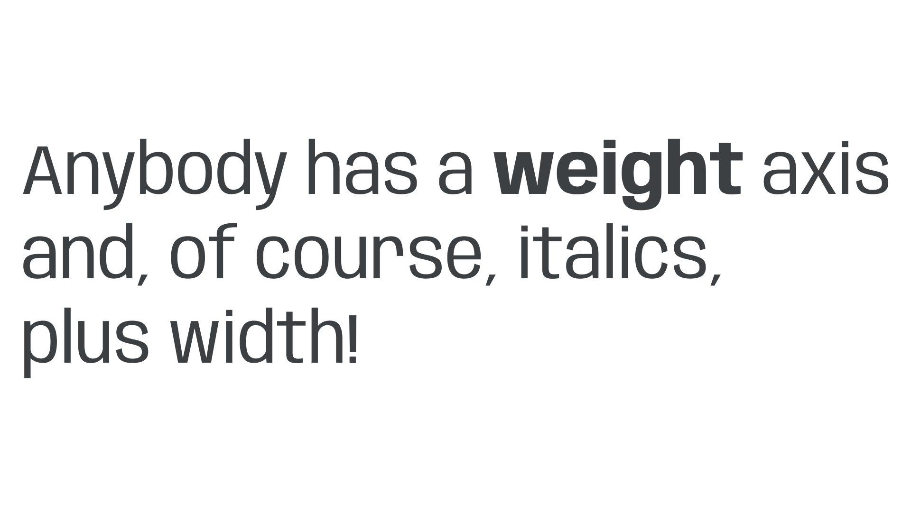
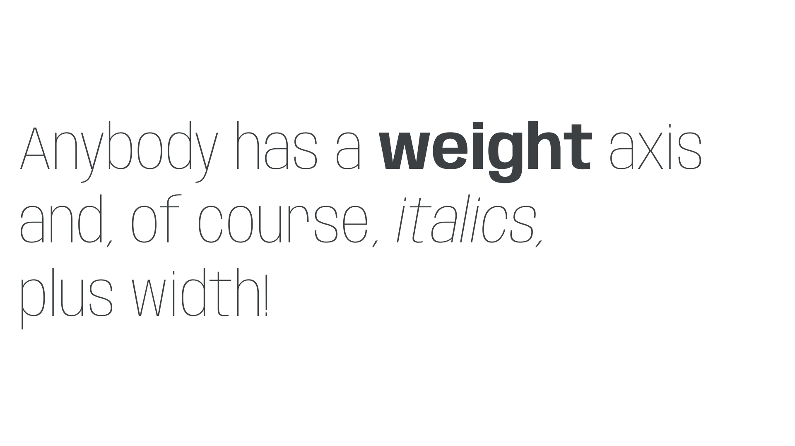
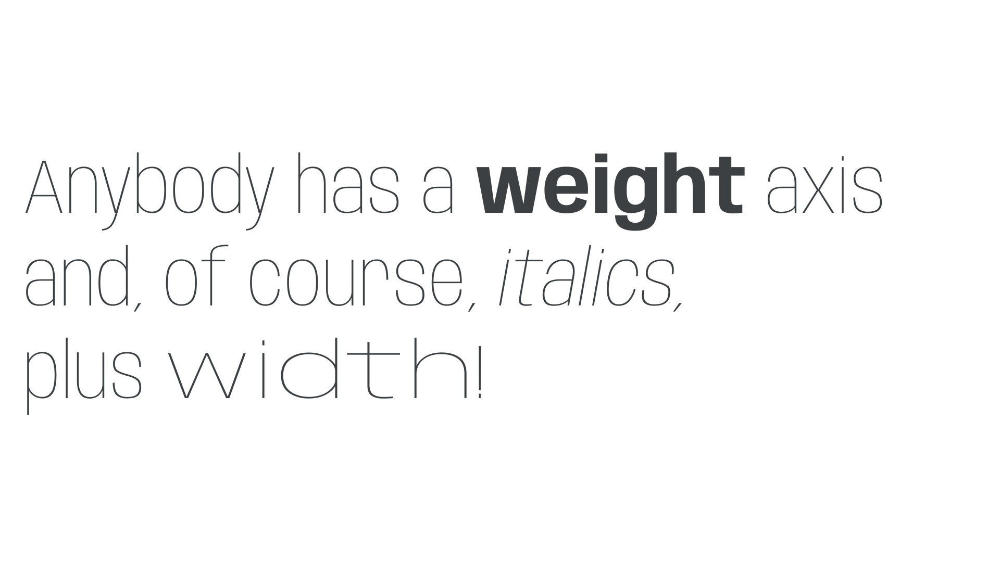

For many designers, implementing [variable fonts](/glossary/variable_fonts) on a website might mean treating the project as a blank canvas, and using a brand new [typeface](/glossary/typeface) to experiment with the possibilities variable fonts offer. However, swapping out our static fonts for variable ones can be a useful way of dipping your toes into this new world. Plus, moving from a typeface’s static fonts to its variable cousins offers some advantages: With the overall typographic system tried and tested, we’re not actually changing that much; it’s more of a case of finessing our [typography](/glossary/typography)—and saving some data while we’re at it.

## Manipulating the first axis

Let’s test this out and make the move from the static version of [Anybody](https://fonts.google.com/specimen/Anybody/), by Tyler Finck, to its newer, variable version. This font contains three variable axes: [Weight](/glossary/weight_axis) (`wght`), [Italic](/glossary/italic_axis) (`ital`), and [Width](/glossary/width_axis) (`wdth`). But before we get into the axes themselves, we first need to actually load the variable fonts. Assuming we’re using the Google Fonts API (of course, we could always download the font files and [self-host](https://fonts.google.com/knowledge/using_type/self_hosting_web_fonts) them), we’ll update the line in our HTML’s `head`—which is currently using the Regular (400), Regular Italic, Bold (700), and Bold Italic styles—from this:

```html
<link href="https://fonts.googleapis.com/css2?family=Anybody:ital,wght@0,400;0,700;1,400;1,700&display=swap" rel="stylesheet">
```

To this:

```html
<link href="https://fonts.googleapis.com/css2?family=Anybody:ital,wdth,wght@0,50..150,100..900;1,50..150,100..900&display=swap" rel="stylesheet">
```

All we’re changing here is moving from static instances to a *range* of values, with each `..` surrounded by the minimum and maximum values of the axis. In terms of weight, this range then allows us to use *any* value between 100 and 900 for both our upright and italic text. (We’re also adding another axis, `wdth`, which has a range of 50–150, but more on that in a second.)

In the static world, we had `font-weight` declarations that look like this:

```css
body {
  font-weight: 400;
}

strong {
  font-weight: 700;
}
```



Well, good news, because they *still* look like that! Although specialized variable axes require us to use `font-variation-settings` to control them, the weight axis has been mapped to the `font-weight` property we all know and love.

So now let’s get a bit more inventive and harness the power of variable fonts to tweak those weights. We’ll make our `body` text a lot lighter (147 rather than 400) and our `strong` text ever-so-slightly lighter than a usual bold (663 rather than 700):

```css
body {
  font-weight: 147;
}

strong {
  font-weight: 663;
}
```


Note: It’s not just the `strong` element that needs to be updated, but also any HTML element where the browser stylesheet is applying a bold weight. Typically, unless they’ve been overridden already, this includes `b`, `h1` to `h6`, and several other elements, including table headings (`th`) and dictionary definitions (`dd`). These will all need the setting of 663, too (or their own custom weight if you’d prefer).

## The italic axis

Next, let’s style our italics. Because Anybody’s italic variations are in a separate font file, we can keep using `font-style: italic`, just as we would with a static font:

```css
em {
  font-style: italic;
}
```



Switching italics on and off in this case is very easy because it essentially just swaps between the two files. When uprights and italics (or [obliques](/glossary/oblique)) are bundled within the same variable font file, we need to employ `font-variation-settings` and use the `slnt` axis—see below.

## Manipulating an additional axis

It’s time to move onto our third axis: Width (`wdth`). In this font in particular, width wasn’t exposed until the release of this variable version, so it’s a great excuse to make use of variable fonts’ powers of further refinement. 

Once again, the Width axis has been mapped to familiar CSS: we can manipulate it using the `font-stretch` property. The only difference is that, unlike weight, we need to declare it as a percentage. Let’s give our `span` element the maximum width value of 150%:

```css
span {
  font-stretch: 150%;
}
```



And while we’re at it, why not make everything *but* the `span` a little more condensed with a font-stretch value of 72%? 

```css
body {
  font-stretch: 72%;
}
```


With some very subtle tweaks to some already familiar code, we’ve switched from the static to variable version of Anybody, and used the power of variable fonts to give our text more stylistic variation that wouldn’t have been possible before, and all without loading multiple font files. Let’s review our final CSS:

```css
body {
  font-family: "Anybody", sans-serif;
  font-stretch: 72%;
  font-weight: 147;
}

strong {
  font-weight: 663;
}

em {
  font-style: italic;
}

span {
  font-stretch: 150%;
}
```

## Going further

In this example, we’ve stuck to axes that have been mapped to existing CSS properties. If you’re using a font that has a different axis, such as the aforementioned Slant (`slnt`), you’ll need to use `font-variation-settings` to control that parameter. For example:

```css
body {
	font-variation-settings: "slnt" 0;
}

em {
	font-variation-settings: "slnt" 1;
}
```

Note that `font-variation-settings` is also required for any custom axes. For more information, please see [“Styling type on the web with variable fonts.”](/lesson/styling_type_on_the_web_with_variable_fonts)