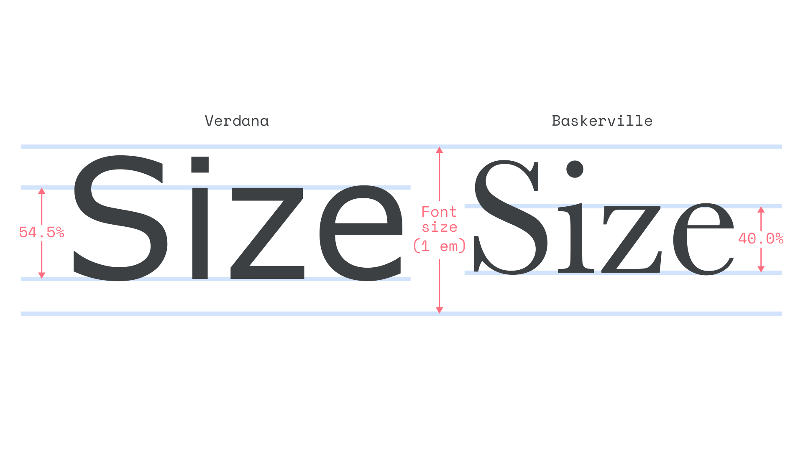
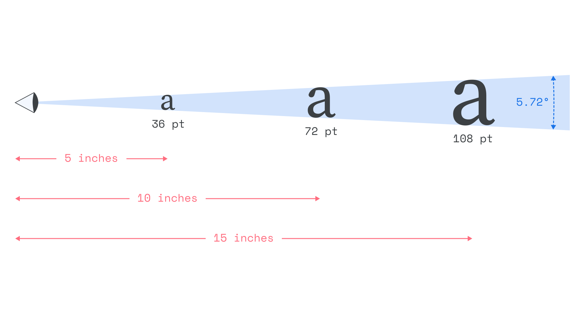
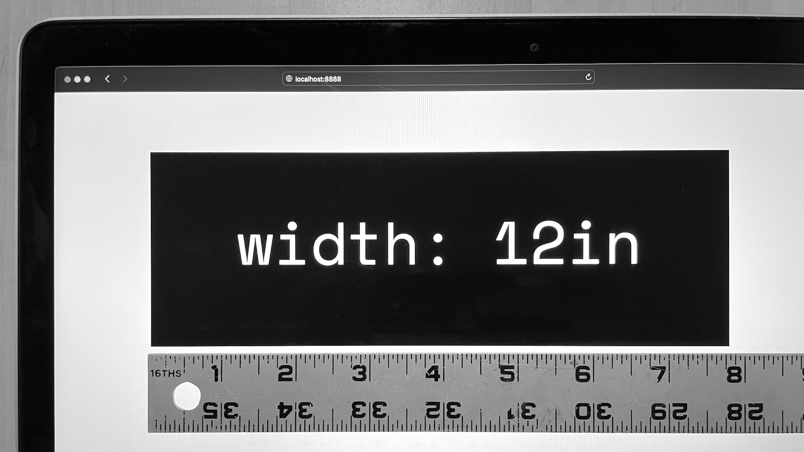
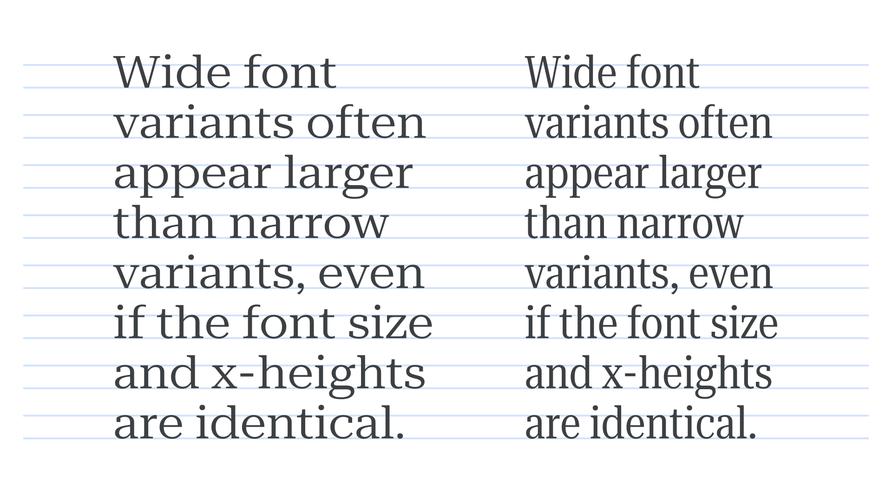

The process of establishing an appropriate [font](/glossary/font) size for different elements is more complicated than it might seem at first. In the context of web design, it can be especially tricky to weigh all the factors involved for an ideal reader experience. While keeping track of all these issues can sometimes cause headaches, it’s helpful to at least be aware of them and approach the job of setting type with as much knowledge as possible. Let’s go through some of the most relevant considerations.

## A font’s body size only says so much about the actual size of its glyphs

Different fonts set at the same nominal font size can—and often do—look like they are set at very different sizes. This is because the standard technique for specifying typographic size is tied to the font’s body height.

In digital fonts, every [glyph](/glossary/glyph) sits on its own invisible box, or body. The body establishes how much space is built in around each glyph by default, among other things. Different glyphs can have different body widths, but all glyphs in one font share the same body height, and that height is the [em](/glossary/em). Glyphs can extend beyond the bounds of their body, but most fonts are usually produced so the tops and bottoms of the [ascenders and descenders](/glossary/ascenders_descenders) fully fit vertically within the em. When setting the font size in most contexts—including in CSS—we’re specifying the intended size of the *em.* When the font size is 16px, the em is 16px.

<figure>

</figure>

The problem is that the metrics that most affect how large a [typeface](/glossary/typeface) appears—like its [cap height](/glossary/cap_height) or [x-height](/glossary/x_height)—can vary quite a bit between different fonts with the same em size. For example, let’s compare two standard-issue versions of Verdana and Baskerville: Verdana’s x-height takes up about 55% of the font’s em. But Baskerville’s x-height only takes up about 40% of them em. As a result, Baskerville appears noticeably smaller than Verdana when set at the same font size. To achieve a similar visual size as Verdana, Baskerville must actually be set to a larger font size.

Some design apps like Adobe Illustrator allow for font sizes to be specified according to metrics other than the em, like x-height or cap-height. This can be helpful for normalizing font sizes visually. Unfortunately, doing something similar in the context of CSS would currently require access to each font’s internal metadata, as well as some custom math calculations.

## The most critical measurements for perceiving type sizes are angular

Even young children understand that the closer something is to your eyes, the larger it will appear. Measurements for the perceived size of things when accounting for distance is measured not with fixed units like points or inches, but with angular measures such as degrees and [arcminutes](https://en.wikipedia.org/wiki/Minute_and_second_of_arc).

<figure>

</figure>

For example, [type](/glossary/type) with a physical size of 72pts viewed from a distance of 10 inches has [a perceived size](https://sizecalc.com/#distance=10inches&physical-size=72points&perceived-size-units=arcminutes) of about 5.72°, or 343 arcminutes. To match that same perceived size from 1.5 times the distance (15 inches away), you’d have to also [increase the physical size](https://sizecalc.com/#distance=15inches&perceived-size=343.488627arcminutes&physical-size-units=points) by 1.5 times (to 108 pts).

Angular measurements like this are the basis of [visual acuity](https://en.wikipedia.org/wiki/Visual_acuity) tests you may be familiar with from the [eye charts](https://en.wikipedia.org/wiki/Eye_chart) at your optician’s office. They also inform standards about the design of traffic signs and other critical text-based information. This way of measuring perceived size is among the most relevant when it comes to how we experience text in the real world because it’s directly related to how quickly and easily we can decipher letters and words.

As you might imagine though, setting the size of type based on its perceived size in arcminutes isn’t always easy, possible, or even desirable. On the web, it can be especially tricky because the same design may need to function close up on a tiny device just as well as it does from multiple feet away on an extra-large desktop display. Other situations—for instance, video graphics being viewed by multiple people from different viewing points on a projected screen—also require special consideration.

CSS media queries and responsive design go a long way toward compensating for all those potential reading environments. But without knowing the exact specifics of every reader, there will always be some amount of compromise, backed by estimation, assumption, and plain old guesswork.

## It is currently impossible to confidently work with exact physical sizes on the web

It may seem counterintuitive, but using CSS to specify “absolute” physical units like [points](/glossary/point), centimeters, or inches will not allow you to work with actual physical sizes in most cases. You can set the width of an element to `12in` in CSS, but if you measure the result as rendered on any given device it may not (and very likely won’t) be exactly 12 inches wide. And, in fact, it will probably be rendered at a different physical sizes between different devices.

<figure>

</figure>

The same goes for media queries. You can technically specify that you want the design of your web page to change when the reader’s browser window is, say, 20cm wide. But that measurement of 20cm won’t actually relate to a real-world length as measured with a ruler. The ability to confidently detect the actual physical size of a reader’s device or [viewport](/glossary/viewport) would be an immense benefit when it comes to the previously-mentioned necessity for estimation and assumption. Knowing a display’s width is 10 feet instead of 1 inch would help a lot with inferring how it’s likely being used.

The “absolute” units are so unreliable for physical sizing because, at the end of the line, they are all just multipliers for pixels. And in web design, [pixels aren’t tied to any reliable physical size](https://alistapart.com/column/responsive-typography-is-a-physical-discipline/). This isn’t because the technology doesn’t exist to allow for such calculations. Most computer displays [can provide information about their physical attributes](https://en.wikipedia.org/wiki/DisplayID) to operating systems. Some design apps and PDF readers take advantage of this by allowing you to preview print layouts at actual scale.

For web design though, the missing link is a specification for browsers to be able to take advantage of that information in the same way. For the time being, we’re stuck with pixels and multipliers of pixels for screen-based web design... Which leads us to the next topic of complication.

## Pixels are only a vague concept

If you ask most people what pixels are, they might say they’re the thousands of tiny elements in a computer’s display that light up in different colors to produce visible images. And they wouldn’t necessarily be wrong.

In the early days of digital displays, when you specified the size of something in pixels, they mapped one-to-one with those tiny hardware elements. But, over time, things have become more complicated, with advances in technology and shifting expectations for the sizes of things on screens. The concept of a “software pixel” or “reference pixel” is [now separated](https://alistapart.com/article/a-pixel-identity-crisis/) from physical hardware pixels. If you specify the size of something in pixels, it may actually be rendered with two or more times the number of physical hardware pixels. This is a necessary measure to prevent things sized with pixel units from becoming impossibly small, as higher-resolution displays mean smaller and smaller physical pixels.

In the context of web design, the pixel’s definition is now related to a visual angle of measure along the lines of the arcminutes discussed above. Specifically, the W3C specification [defines](https://www.w3.org/TR/css-values-3/#reference-pixel) a reference pixel as “the visual angle of one pixel on a device with a pixel density of 96dpi and a distance from the reader of an arm’s length. For a nominal arm’s length of 28 inches, the visual angle is therefore about 0.0213 degrees”.

This approach of having an angular unit of measure is really great in theory, and partly addresses the issue mentioned earlier about perceived size. Unfortunately, the practical reality involves some compromises. The W3C’s own explanation describes how the definition was changed from a previous model, “because too much existing content relies on the assumption of 96dpi, and breaking that assumption broke the content.” The focus on backwards compatibility meant other values that may have otherwise been more intuitive, logical, or convenient weren’t used in the W3C’s updated definition of a pixel.

Perhaps a bigger issue, though, is how inconsistently the newer definition of a pixel stands up (or doesn’t) across multiple devices. Even devices from the same manufacturer show fairly large variations in the angular measure for pixels when viewed at typical reading distances. It probably doesn’t help that most designers still (understandably) don’t identify pixels as an angular unit of measure.

## The design of a typeface can affect its size requirements

As if all of that wasn’t already tricky enough, it’s also worth considering that some typefaces simply perform better than others at certain sizes, even if you do manage to normalize all the other factors.

<figure>

</figure>

Condensed typefaces may benefit from a slight increase in size compared to wider counterparts, and typefaces with open apertures can perform better than others with tighter closed-in forms. Unusual design features can also cause legibility problems at small sizes.

## Sizing up

Despite some of the limitations and complications mentioned above, there’s still more flexibility and control with digital typesetting than ever before. Those looking to move beyond the most basic handling of typographic size on the web can:
- Experiment with API technologies like [DisplayID](https://en.wikipedia.org/wiki/DisplayID) and [RawDpi](https://learn.microsoft.com/en-us/uwp/api/windows.graphics.display.displayinformation.rawdpix) for working with actual physical size and resolution, even if it’s beyond the context of typical web browsers where they aren’t supported yet.
- Try setting font sizes according to internal font measurements like x-height, and/or even more complex [fluid sizing calculations](https://css-tricks.com/simplified-fluid-typography/) based on a variety of interrelated factors.
- Submit or support [feature requests](https://github.com/w3c/csswg-drafts/issues/614) for app developers and standards organizations to improve functionality for working with sizes based on physical measurements and/or internal font metrics.
- Get more comfortable thinking about [viewing distance and angular units of measure](https://sizecalc.com) when calculating type sizes.
- Be more observant about how different typefaces may require changes in size specifications due to differences in their design or production.
- Perhaps more important than anything, test the sizing logic on a variety of screens and devices to ensure it works reasonably well in as many environments as possible.

The more knowledgeable and thoughtful designers are to the intricacies of typographics size, the better the experience can be for readers.