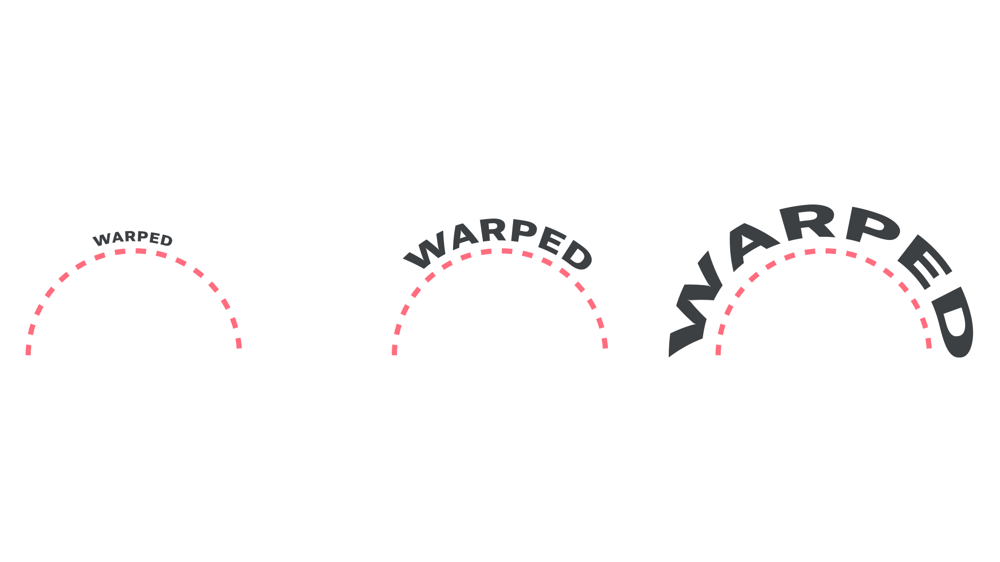

Most of the time when we set [type](/glossary/type), we do so on a straight line, but occasionally we need to manipulate the [baseline](/glossary/baseline) so that it follows a curve. And while this is generally rare, it’s something to consider when using type in circular interfaces, like those found on smartwatches.

<figure>

</figure>

First, it’s useful to understand that there are two fundamentally different methods to setting type on a curved path: Warping and wrapping.

The first method, warping, is where the actual geometry of the [glyphs](/glossary/glyph) is changed by the curve. The greater the font size, or the more intense the curve (the effect is the same), the more the [letterforms](/glossary/letterform) are distorted. This is particularly evident on the "E" and "D" glyphs in the illustrations below, where the stems get wider as the shape is further away from the transformation center:

<figure>

<figcaption>Warping. Circle path remains the same; font size changes. Typeface: <a href="https://fonts.google.com/specimen/Roboto+Flex?query=Roboto+Flex&vfonly=true">Roboto Flex</a>.</figcaption>

</figure>

<figure>

<figcaption>Warping. Circle path changes; font size remains the same. Typeface: <a href="https://fonts.google.com/specimen/Roboto+Flex?query=Roboto+Flex&vfonly=true">Roboto Flex</a>.</figcaption>

</figure>

Generally speaking, warping does not produce good results, unless a very specific aesthetic style is desired (perhaps for logo work), and is not recommended in most circumstances—especially for UI work.

The second method, wrapping, is where we set text along a path so that each glyph is rotated and placed accordingly, therefore maintaining the intrinsic geometry of the glyphs. Again, the greater the font size, or the more intense the curve (the effect is the same), the more obvious the baseline distortion becomes.

<figure>

<figcaption>Wrapping. Circle path remains the same; font size changes. Typeface: <a href="https://fonts.google.com/specimen/Roboto+Flex?query=Roboto+Flex&vfonly=true">Roboto Flex</a>.</figcaption>

</figure>

<figure>

<figcaption>Wrapping. Circle path changes; font size remains the same. Typeface: <a href="https://fonts.google.com/specimen/Roboto+Flex?query=Roboto+Flex&vfonly=true">Roboto Flex</a>.</figcaption>

</figure>

Despite this, when setting type around a full circle, it usually looks better to have the text occupy more of the circle. 

<figure>

<figcaption>The hypothetical logo on the left looks better, as it helps imply the whole circle. Typeface: <a href="https://fonts.google.com/specimen/Anybody">Anybody</a>.</figcaption>

</figure>

However, the wrapping or rotation-based option will potentially introduce noticeable visible changes to the spacing between [characters](/glossary/character). This is perhaps more noticeable with [condensed](/glossary/condensed_narrow_compressed) type, but then [wider](/glossary/wide_extended) type creates its own issues, as the rotation of each glyph becomes more obvious.

<figure>

<figcaption>Experimenting with the width axis in <a href="https://fonts.google.com/specimen/Anybody">Anybody</a>.</figcaption>

</figure>

With this in mind, it’s advisable to experiment with different widths and different [tracking](/glossary/tracking_letter_spacing) settings depending on the angle of the curvature and the size of the font. [Variable fonts](/glossary/variable_fonts) with a [width axis](/glossary/width_axis) can be particularly useful in this regard.

[All-caps](/glossary/all_caps) type can work better due to the uniform shapes and sizes of the letterforms, but sentence case type can be fine if the typeface has a large [x-height](/glossary/x_height) and relative open tracking, as with [Roboto](https://fonts.google.com/specimen/Roboto):

<figure>

</figure>

To an extent, [serifs](/glossary/serif) can help to minimize the distorted spaces between glyphs. With serifs, the inter-character spaces are irregularly shaped already, so adding the bending is less noticeable:

<figure>

<figcaption>With the sans serif, the triangular gaps become more consistent and obvious, and potentially more distracting. Typefaces: <a href="https://fonts.google.com/specimen/Roboto">Roboto</a> and <a href="https://fonts.google.com/specimen/Roboto+Slab">Roboto Slab</a>.</figcaption>

</figure>

So, to summarize:

1. Warping rarely produces good results. For UI design, use wrapping instead.
2. More characters, larger font sizes, and greater curvature angles will all exaggerate the reader’s perception of the curve, so combine with care.
3. The _rotation_ of each glyph is more noticeable with wider characters, but the _space between_ each glyph is more noticeable with narrower characters. Adjust font size and tracking accordingly to achieve the best balance.
4. If you have to use a typeface with a small x-height, try an all-caps setting.
5. Use serif typefaces to mask the more exaggerated spaces between characters.
