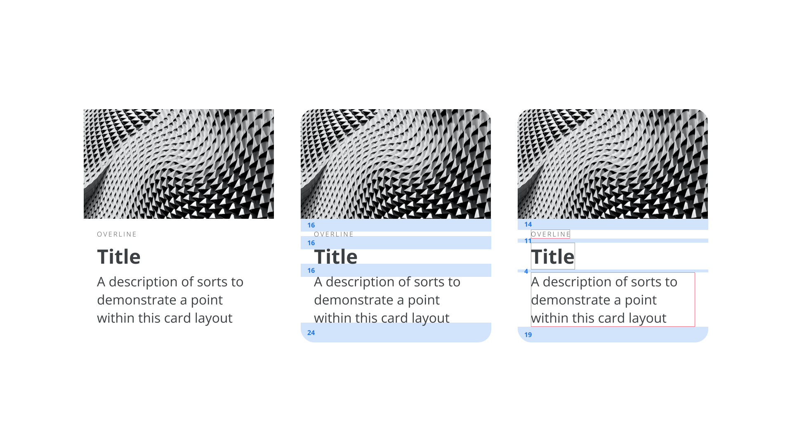

Digital designers will typically spend hours meticulously fine-tuning their components and pages to look pixel perfect with consistent padding, a beautiful and cohesive color system, and most importantly the [fonts](/glossary/font) we choose to display our content. But as we all know, designs and trends change—and our systems need to update to match these. A proper design system will scale easily with colors and spacing variables, but when it comes to switching out our fonts, all that hard work goes to waste and we need to start from scratch again. This all comes down to inconsistent vertical spacing from [typeface](/glossary/typeface) to typeface, and how the platforms we’re designing for render text.

## Let’s start with some history

In traditional typography, back when things were a bit more physical, typesetters had to space their text using blocks of metal. To make the text more readable, they would add pieces of lead in between lines to space them out more. These were added directly below any [letters](/glossary/letters), and this is why we have the term [“leading”](/glossary/line_height_leading) in modern typography applications. CSS, Microsoft Word, and Google Docs use the alternate terms [“line-height”](/glossary/line_height_leading) and “line-spacing” to mean the vertical distance between lines, including the leading.

Because physical blocks were used, there wasn’t much room for manipulation of the letters, and the blocks that were used to encase the letters would accommodate the maximum letter height for that typeface. With digital typography, type designers have a lot more freedom to place the letters anywhere they want, even straying outside of the virtual block that controls their vertical spacing.

<figure>

</figure>
<figcaption>Positioning of letters from different typefaces within their default bounding box heights. All of the examples are set to the same font size.</figcaption>

### So what’s the big deal?

What all of this means in practice is there are a lot of discrepancies between different fonts. The one rule nearly all fonts (in [Latin](/glossary/latin) type) follow is to have every [glyph](/glossary/glyph) sitting on the "[baseline](/glossary/baseline)." There are no rules about where the [cap-height](/glossary/cap_height), [x-height](/glossary/x_height) or [descenders](/glossary/ascenders_descenders) should be drawn in relation to the line-height, so you get inconsistencies that make vertical alignment tricky. This vertical alignment is necessary to create consistent, scalable designs, but aligning type perfectly can be time-consuming, especially when mixing typefaces.

<figure>

</figure>
<figcaption>An overview of various problems that arise from vertical alignment within digital typography.</figcaption>

## Rendering text on different platforms

To complicate matters further, different digital platforms render text in different ways when dealing with line-height. With the introduction of CSS1 in 1996, text was rendered centered within the total line-height. That is, "half-leading“ was added above and below the 100% line-height to add up to the total line-height.

<figure>

</figure>
<figcaption>The web renders text with half-leading above and below the 100% line-height for a font.</figcaption>

iOS platforms followed suit with the same method and neither the web nor iOS have changed the way they render text to this day. Android devices, however, mostly render a paragraph clipped to the default line-height for the first and last line. Total line-height will still be respected via the `lineSpacingMultiplier` property, so every line of text still has the correct spacing from baseline to baseline.

<figure>

</figure>

<figcaption>iOS and Android render text nodes slightly differently, causing confusion within design tools.</figcaption>

To add to this, web developers don’t (yet) have access to the inner metrics of a typeface when it’s loaded. This means they can’t know where the [glyphs](/glossary/glyph) are positioned, in order to align elements to any diacritics, cap-height, x-height, or default line-height. In theory, this shouldn’t be a problem for native platforms, as the files are pre-loaded within an application. In fact, both iOS and Android platforms have the ability to create padding or space according to the baseline of a font, but this is rarely used. On top of all of this, we must also remember that all devices, browsers, and platforms will render in slightly different ways across the board, and so no two implementations of a design are likely to be the same.

Within common design tools such as Sketch or Figma, text will be rendered in the same way as web and iOS. This is to help cover the majority of bases with text rendering, to enable consistent handover between design and engineering. Unfortunately, no design tools today yet show the default line-height clipping for a paragraph or line of text, so it’s more of a manual process to figure it out. Thankfully, Marcin Wichary created [this handy tool](https://aresluna.org/line-height-playground/) to visualize the differences in platform text rendering.

## So what can we do about all this?

### Manual spacing

To ensure consistent design across your applications, the most common method would be to just space everything manually. You can look into all of your components and designs, and ensure that any text node is spaced to the exact pixel. It removes all the guesswork out of the equation, but becomes a very tedious process. Misaligning spacing becomes inevitable with all the work needed, and there is no way to truly systemize your process. Finally, it becomes particularly tricky when you need to update your typeface to a new one and have to go through the whole process again.

<figure>

</figure>
<figcaption>Vertical rhythm by aligning to cap-height and baseline becomes a very manual, and non-systematic process.</figcaption>

### Equally spaced font files

One way to combat a lot of the issues with vertical spacing is to ensure you choose a typeface that has equal spacing above and below the [characters](/glossary/character). A lot of fonts won’t be spaced centrally within their default line height. And the larger the font size, the more this becomes obvious. Choosing one that is exactly centered within its default line height means it will always be centered, no matter the line height. This makes it much easier to create a vertical [rhythm](/glossary/rhythm) within your text.

Choosing such a font can be difficult, but luckily most design tools will show the bounding box of any text layer. Some fonts are obviously misaligned from the start, but others will need a little more investigation. Simply reduce the line-height of any text layer bit by bit until the bounding box matches your [glyph](/glossary/glyph) height. A general rule of thumb for a vertically centered font is to align to the cap-height and baseline. This will ensure your text looks centered to other elements within your designs. Read more about the idea of “equal” metrics in [this twitter thread by Roman Shamin](https://twitter.com/romanshamin_en/status/1562801657691672576).

<figure>

</figure>
<figcaption>An example of how letters can and can’t be aligned to the true center of a default line-height.</figcaption>

There are two main benefits to choosing a font like this: first, centering the text vertically to other objects, and second, ensuring a consistent space above and below a text node. It’s common to include text next to an icon or shape in plenty of components, and so no matter the line-height used, the text can always be easily aligned to the same center line. With equal spacing there is also a more reliable space between elements when changing font size. This makes vertical rhythm within a page or component—and aligning to a baseline grid—much more achievable.

<figure>

</figure>
<figcaption>The benefits of choosing a font that is equally centered to its line-height.</figcaption>

### Upcoming CSS feature, leading-trim

For the web, a CSS feature called [leading-trim](https://www.w3.org/TR/css-inline-3/#propdef-leading-trim) is currently in proposal that actually trims a text node to pre-defined properties. You'll be able to choose from cap-height, x-height, baseline, [descender](/glossary/ascenders_descenders), or default line-height to clip the top and bottom of the node to these values, much like you can on Android. This will help ensure consistent spacing and even introduce the ability for better baseline alignment within the web. For more information, please read [“Leading-Trim: The Future of Digital Typesetting”](https://medium.com/microsoft-design/leading-trim-the-future-of-digital-typesetting-d082d84b202) by Ethan Wang.

<figure>

</figure>
<figcaption>How leading-trim can cut a text node on the web, to allow for better cap-height and baseline positioning.</figcaption>

### Be specific with calculations

Finally, you could even calculate the clipping needed to apply to any text node using CSS variables. The ratio of cap-height or baseline to the bounding box will always be the same for a single font, despite the font size, so if you know the ratio, you can calculate how much you need to clip the node above and below. Nathan Curtis alludes to this idea and links to a CSS mixin in his article [“Space in Design Systems.”](https://medium.com/eightshapes-llc/space-in-design-systems-188bcbae0d62#:~:text=Solve%20Collisions%20like%20Line%20Height%20Systematically)

<figure>

</figure>
<figcaption>The ratio of cap-height and baseline to a line-height will always be the same no matter what text-size is used.</figcaption>

## Takeaways

There’s no denying it: Perfecting a vertical rhythm is by no means trivial, but by spending time on the details, scalability and a systematic type system will come. Use the tools and processes outlined within this article to help you create products and websites that have great vertical rhythm, and your customers will thank you for it.
