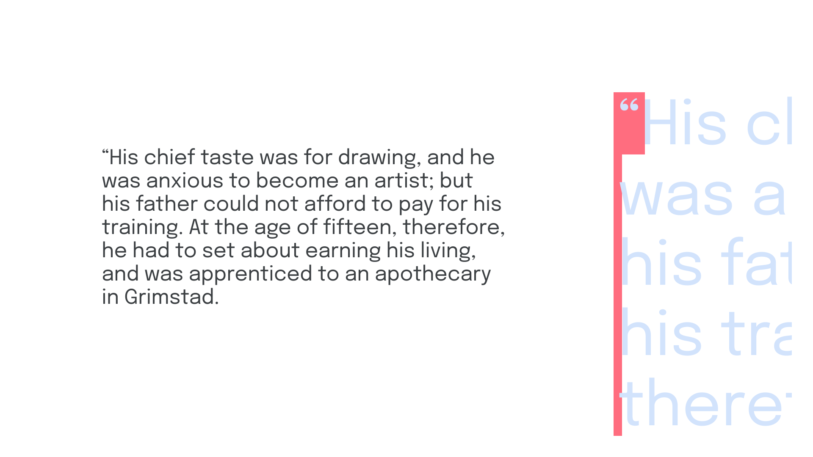
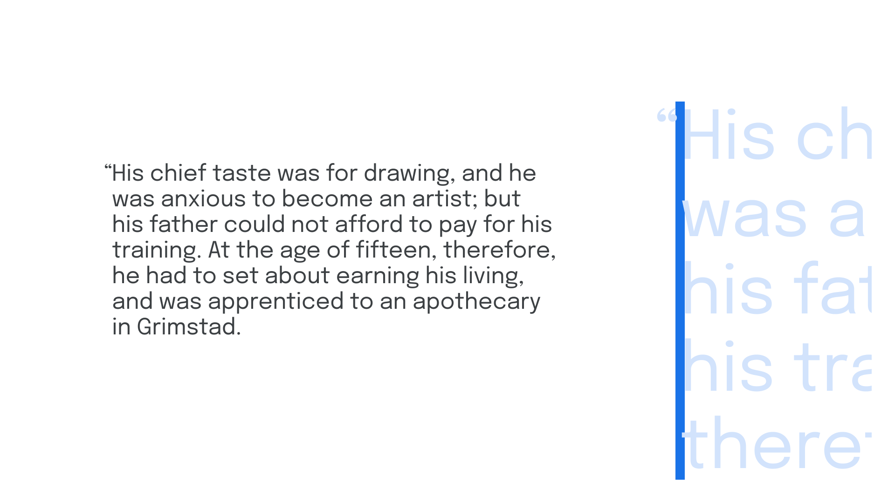
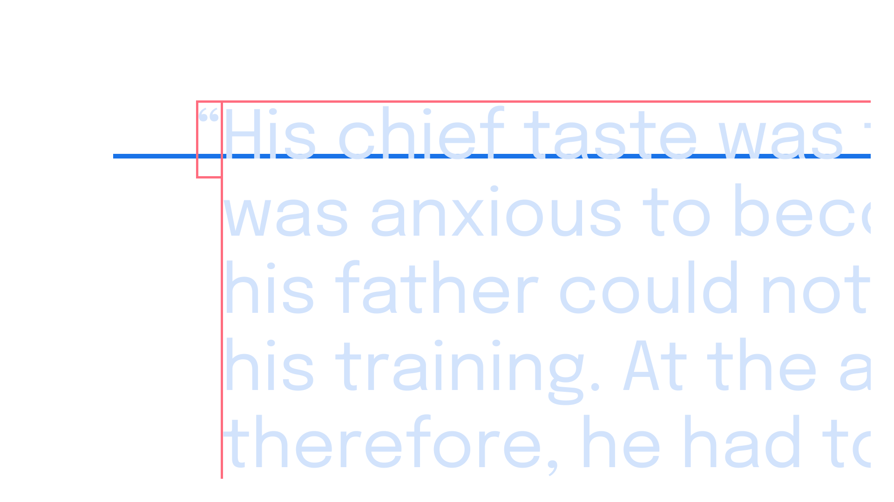
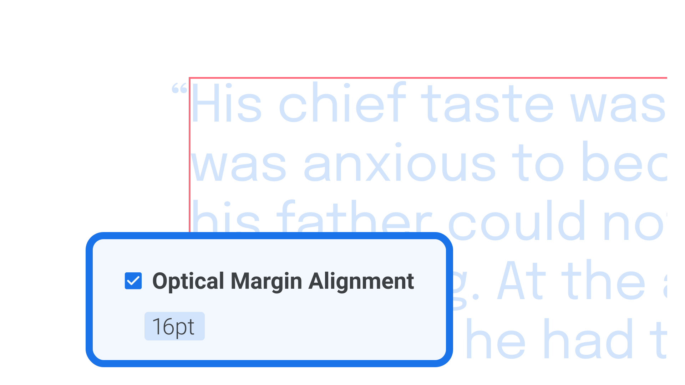
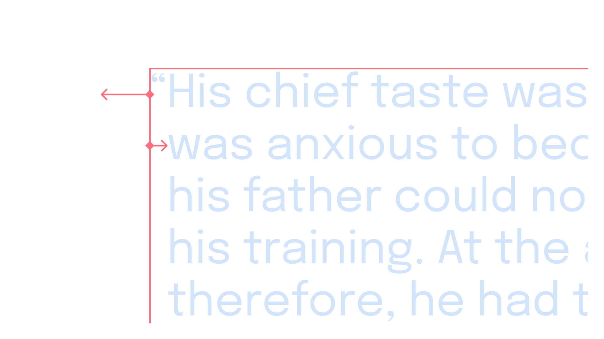

Because [punctuation](/lesson/exploring_punctuation) takes up a space but doesn’t usually *fill* that space (think of the whitespace created by a period, for example, versus an uppercase M), such marks can create optical indentations—and none more so than opening quotation marks, whether double or single.

<figure>



</figure>

With a little extra care, though, we can solve this undesirable visual effect; and it’s yet another example of breaking a few rules to create a much better reading experience.

The concept of [“hanging punctuation”](/glossary/hanging_punctuation) deals with moving punctuation marks outside of their designated space and into the (usually left) margin, so that the content itself is visually aligned along the (usually left) edge.

<figure>



</figure>

Although we often see this with opening quotation marks, the technique can be employed with any punctuation that creates an undesired visual indent, including bullet points in a list (although it’s worth noting that indenting lists might actually be desirable).

## Implementing hanging punctuation on the web

The default styling for ordered lists and unordered lists in all browsers is to hang the numerals or list item markers. However, to deal with all punctuation, we have to go a little further. Hanging punctuation is [currently supported in Safari](https://caniuse.com/css-hanging-punctuation), but not in other browsers. So, for a cross-platform approach, the treatment of a single glyph—much like [kerning on the web](/lesson/manual_kerning_is_rarely_required)—means wrapping our opening quotation mark in a `span` element and then writing custom adjustments in CSS:

```css
span.opening-mark {
  margin-left: -1rem;
}
```

## Implementing hanging punctuation in desktop design apps

Hanging punctuation is quite straightforward in graphic design software. The first option is to create a new text box containing only the opening quotation mark. Aligning that text box to our main text box is easier if our app of choice (e.g., Figma) supports automatic baseline alignment. Although it’s not an automated approach, it works:

<figure>


<figcaption>In design tools such as Figma, the baseline of two separate text frames can be easily aligned thanks to the automatic “snapping”.</figcaption>

</figure>

The second option, which will work even if our text re-flows, is to adjust our paragraph settings so that opening quotation marks are *automatically* moved outside of the containing text box. In software such as InDesign, checking “Optical Margin Alignment” under the Story settings should handle hanging punctuation automatically, although adjusting the point size will give it some further refinement.

<figure>



</figure>

If automatic settings aren’t available in our app of choice, there’s a third way—although it’s a bit of a hack: We’ll need to create a rule to indent the entire paragraph first, and then a negative indent for the first line that’s equal to the width of the typeface’s opening quotation glyph—and at that particular font size.

<figure>


<figcaption>Using just one text frame, the entire text is left-indented, and then the first line is negatively indented.</figcaption>

</figure>

When possible, though, try the automated route!
