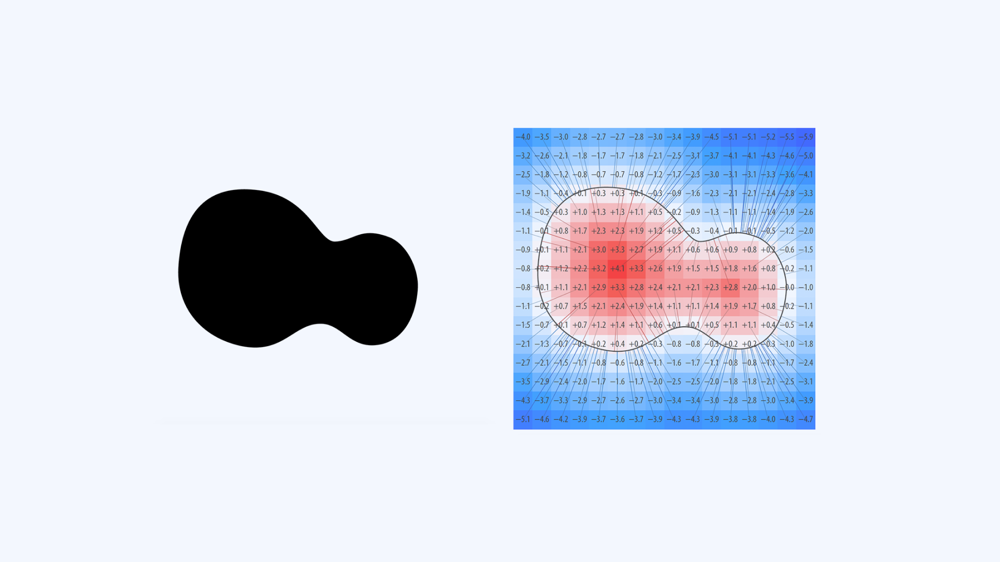

As we develop and experience more sophisticated augmented reality and virtual reality (AR/VR) applications, the introduction of more features and functions increases the complexity of information in front of the reader. Our existing typographic rules are not sufficient to address these new variables.

The careful consideration of [typography](/glossary/typography) in this new medium doesn’t end with dimensionality. How does [text](/glossary/text_copy) behave when we’re looking at it? Does it follow our head movements, or is it fixed somewhere in the 3D space? How does it behave when we’re looking at it from an angle? Does it have to be stationary, or should it move with our gaze? Should these behaviors be different if the user is moving? (This is discussed in detail in [“Spatial classification of typography in AR/VR.”](/lesson/spatial_classification_of_typography_in_ar_vr))

In AR/VR, texts are no longer experienced in a static form. Movement, rotation, and rendering factors (frame rate, resolution) create challenges for text display like perspective distortion, distance reading, distortion of letter shapes, etc. Some of these challenges are not new at all, but the three-dimensional medium changes the context and introduces new complexities. For example, learnings from highway signage can be applied to scenarios where we want to convey quick information to a user wearing AR glasses while walking on the road. In this case, directly translating the guidelines might not work well enough because there are limitations in text rendering, the brightness of displays, the contrast of letters and their background, and so on. This is where typography for AR/VR has to evolve and solve these novel challenges.

Working in a three-dimensional AR/VR space might entice you to go fully 3D by adding depth to your text. It might feel like the right thing to do, but it has severe consequences on its utility. However, two-dimensional or flat text is recommended when it comes to longer paragraphs and sentences over 3D text. (See the image below.)

<figure>

<figcaption>Comparison between flat, 2D text (left) vs 3D text with depth (right). Note how the profiles of letters in the 3D text are less distinguishable and appear to clash into one another.</figcaption>

</figure>

In fact, depth in text hinders both [readability](/glossary/readability) and [legibility](/glossary/legibility). It adds to the letter shapes, intervenes with the space between them, and, in certain situations, may make letters unrecognizable, requiring extra effort from the user to read the text. This problem is amplified if the user is looking at the text from an angle.

Text in AR/VR can use [variable fonts](/glossary/variable_fonts) to create responsive, spatial typography for a wide array of solutions. For example:

- The legibility of text outdoors can be improved by increasing the [weight](/glossary/weight_axis) or [grade](/glossary/grade_axis) [axis](/glossary/axis_in_variable_fonts) to create enough contrast with the background.
- Perspective distortion can corrected with the [width](/glossary/width_axis) axis.
- The space between letters and their width can be optimized for text  seen from an angle by defining a new axis for fitting (spacing). This can also make sure adjacent letters don’t overlap.

The number of challenges will increase exponentially with the complexity of the texts we view and interact with in AR/VR, and variable fonts can address some of these.

Here are some quick tips:

- Keep 3D text limited to headings, or strings of text.
- Use 2D text for sentences and paragraphs.
- If 3D text is absolutely necessary, adjust the letter spacing to improve legibility.

Ensure that the difference in color on the face of your text provides enough contrast against its depth to aid legibility. At the time of writing, typography in AR/VR applications is in the early stages of development, and it will take time to reach the level of typographic refinement we’re used to on the web. However, considering these new possibilities will help us prepare for what’s next in the evolution of wearable technology.

## Dynamic rendering

We’ve moved past the time when designers and typographers had full control over the medium in which people read. Today, we have limited control over how and where (device, platform, window size) the text is going to be read. In browsers and mobile applications, text often has to be rendered twice—once when the text is loaded, and again when there’s a change in parameters, such as layout.

In AR/VR, where the point of view (POV) is constantly moving, we have dynamic text rendering. The [glyphs](/glossary/glyph) in these cases are rendered continuously based on movement, and the size of the text is never the same from one frame to another. This necessitates the use of dynamic rendering of text with high-quality output on the fly to accommodate the changes in size and position of the text. (This applies to spatial applications, where text floats in free space as opposed to text sticking to the HUD [heads-up display]). In HUDs, the text remains in one place and there is no change in size or position, as discussed in [“Introducing AR/VR.”](/lesson/introducing_ar_vr)

These issues have conventionally been solved by using pre-rendered (bitmap) glyphs stored as texture maps for rendering text. Though this is a fast way of rendering letters, it causes blurring and other text-related issues once the size of the glyph increases beyond the size originally rendered. Similarly, [FreeType](https://freetype.org/freetype2/docs/index.html) is also becoming a popular alternative where rasterized images of fonts are generated from the vector data of TrueType fonts.

Applications like the game engine [Unity](https://unity.com/) have gone one step further and adopted a signed-distance-field-based (SDF) text rendering method: Every pixel indicates its distance from the closest boundary of a shape, which is then used to generate a smooth continuous render by nearest-neighbor interpolation. For example, let’s assume that the black shape in the image below on the left is our reference form. The visual representation of the distance field in a 16×16 grid will appear like the image on the right. Every value is the distance of that pixel to the closest edge point of our reference shape (marked with lines across the grid). These values can be used to reconstruct the same shape in different sizes. Even though it produces better results, this method is prone to rounding at the corners of text if the text size exceeds the size of the generated texture used to render it.

<figure>

<figcaption>Left: A 2D shape. Right: Signed values representing the distance from the closest edge point. Source: Chlumsky, V. Shape Decomposition for Multi-channel Distance Fields. Master’s thesis, Czech Technical University, 2015</figcaption>

</figure>

How can the text size increase while running an app? Imagine using a navigation app with AR overlays, or playing a first-person shooter game in VR, where there is signage in front of the player. As they move closer to it, the size of the text on the signage will increase to emulate real-life behavior. With every step the player takes towards the signage, the app has to generate (render) new frames of text to emulate that effect.

<figure>

<figcaption>The text on the left looks crisp when viewed at a distance, but it starts looking blurred and loses details on the right when the subject goes too close. Note: This is a simulated rendering to illustrate the concept of loss of detail.</figcaption>

</figure>

While designing a AR/VR  app or experience, the designer sets a standard optimum distance—e.g. one meter—from where the signage is supposed to be viewed, and then specifies the text size accordingly—e.g. 30pt. Based on that size, a text atlas (font texture) is then created. But if the subject gets closer than one meter, the letterforms will start appearing blurred and distorted. Assuming the subject is at a distance where the perceived text size is 70pt, at this stage the text is being generated using a 30pt text atlas—i.e., similar to enlarging a 30pt bitmap image to 70pt (like in the first image, above). Similarly, in the SDF-based method, once the subject walks closer to the text, it’s generated using an extrapolation of the generated texture, corners lose detail as they become rounded.

<figure>

<figcaption>The “n” on the left shows the base glyph; the “n” on the right has various interpolated instances of the glyph generated from the base glyph. After a certain range, the loss of detail becomes prominent around the corners.</figcaption>

</figure>

If we compare this to the rendering of text in current browsers, it’s a primitive method that’s on par with bitmap font rendering technology in the ’90s. In today’s world, text in browsers is rendered directly from the vector shapes in the OTF/ TTF font files.

This means extra care is required while designing AR/VR applications. The typefaces we select must be able to withstand these limitations. More of these are discussed in [“Type selection for AR/VR.”](/lesson/type_selection_for_ar_vr)

While both the hardware and software aspects of AR/VR implementation are advancing rapidly, type within them has a lot of catching up to do. For a long time, the need for extra processing power to render text properly has hampered progress. This pushes AR/VR designers to resort to the least CPU-intensive methods to render text, thereby degrading the quality of the text. It also keeps designers from considering rich text applications, thus limiting the potential of AR/VR environments.

Future wearables have the potential to replace smartphones and computers. Looking at current progress, it seems that the processing power required for high-quality text rendering may take a while; however, this shouldn’t hinder the progress of AR/VR. One way to help speed up the process is to design applications that take into account the typographic challenges of this medium. In parallel, we can promote the design of typefaces that are specifically developed to optimize the performance of existing rendering systems.  

Useful links:
- [The current state of the text in augmented reality](https://niteeshyadav.com/blog/the-current-state-of-the-text-in-augmented-reality-7507/)
- [Font assets Unity](https://docs.unity3d.com/2022.2/Documentation/Manual/class-Font.html)
- [TextMesh Pro Documentation (Method of text rendering in Unity)](http://digitalnativestudios.com/textmeshpro/docs/)
- [Text in Unity - Microsoft Mixed Reality](https://docs.microsoft.com/en-us/windows/mixed-reality/develop/unity/text-in-unity)
- [Text in Unreal Engine](https://docs.unrealengine.com/4.27/en-US/Basics/Actors/3DText/)
- [Playing around with distance field font rendering](https://lambdacube3d.wordpress.com/2014/11/12/playing-around-with-font-rendering/)
- [Techniques for rendering text with WebGL](https://css-tricks.com/techniques-for-rendering-text-with-webgl/)
- [Future of Typography in Augmented Reality](https://youtu.be/lFO5A8-FzlI?t=3554)
- [Breaking Boxes – Typography and Augmented Reality](https://www.aetherpoint.com/blogpost/breaking-boxes-typography-and-augmented-reality/)
- [Approaching Spatially Adaptive Type](https://www.aetherpoint.com/blogpost/approaching-spatially-adaptive-type/)
