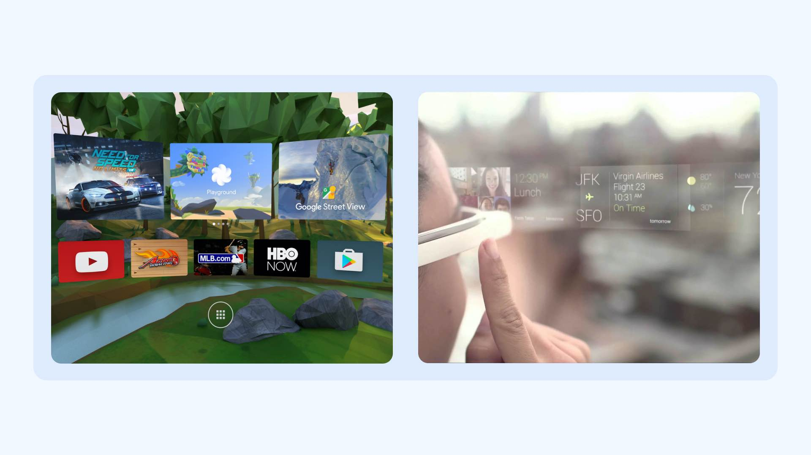

The world of [typography](/glossary/typography) is constantly evolving and adapting to technological advances. Within the realm of digital rendering, typography graduated from fuzzy letters on bulky CRT tubes to crystal-clear [text](/glossary/text_copy) on high-resolution screens. Similarly, the medium through which we consume the text has shrunk in form factor, from bulky desktops to handheld devices.

And now, the next transition is arriving, with the immersive worlds of augmented reality (AR) and virtual reality (VR), where digital experiences extend beyond a flat, two-dimensional world. Instead, we interact with text in the three-dimensional space around us. Augmented reality enhances our experience by adding digital layers on top of the real world. Virtual reality is about fully immersive, computer-generated digital experiences that may or may not be related to the real world.

<figure>

<figcaption>Left: Example of VR. Right: Example of AR.</figcaption>

</figure>

Text is an integral part of these experiences. During the initial years of AR/VR, creators did their best to use as little text as possible, due to the challenge of ensuring [readability](/glossary/readability) at the resolution and processing power of early devices. However, the complexity of information in immersive experiences is growing, and the need for text is rising with it.

## A new design space for text

How is text in AR/VR different to text in any other digital experience? In printed media, we have full control over the surfaces where our text is being read. On the web, we’ve learned to work within the constraints of responsive surfaces. Now, with AR/VR, we have to design text that is readable and legible in countless scenarios (see [“Spatial classification of typography in AR/VR”](/lesson/spatial_classification_of_typography_in_ar_vr)). One of the biggest challenges is unpredictable backgrounds: We might read the text using AR glasses while sitting in front of a blank wall, or in a busy cafe with people moving around. If the letterforms cannot stand out against the background, we won’t be able to read them.

As we traverse through these new mediums, we’re no longer just thinking about size (height and width) but also depth—where in the three-dimensional world does our text live? But that doesn't mean adding depth to our text solves our problems. Instead, it brings up numerous readability and [legibility](/glossary/legibility) issues (we discuss these in detail in the next article, [“Designing for AR/VR”](/lesson/designing_for_ar_vr)).

There are additional technical challenges, like halation (excess glow around the text), limited resolution, distortion, chromatic aberration, vibrating text, etc. The list of challenges doesn’t end here: If the reader is moving, the text is also moving; and then the text could be viewed at an angle. Learn more in our article, [“Technical challenges for typography in AR/VR.”](/lesson/technical_challenges_for_typography_in_ar_vr)

A series of studies conducted by [Gabbard et al](https://vtechworks.lib.vt.edu/bitstream/handle/10919/25504/pres%252E2006%252E15%252E1%252E16.pdf?sequence=1) and [Fiorentino et al](https://www.researchgate.net/publication/274013793_Legibility_in_Industrial_AR_Text_Style_Color_Coding_and_Illuminance) in an industrial context tested variables like text style (background of text), color coding, and illumination. Their findings suggest the use of white text in billboard style (a rectangular block behind the text) works well in a variety of conditions. They also showed the positive impact of using a thin outline around the type for better contrast. Another study revealed the relationship between type size and contrast threshold; the smaller text requires higher contrast between text and the background for acceptable readability.

While AR/VR might conjure ideas of video games and entertainment, devices are already being used in critical domains such as industrial maintenance, construction, military hardware, and medical applications. These are highly sensitive areas, where slight errors can be life-threatening. This shift towards text-rich interfaces makes it essential to focus on legibility and readability. For example, in an industrial setting, a small mistake in reading boiler pressure can lead to a catastrophe.

With time, some of AR/VR’s limitations will be resolved, but how text is experienced in these environments may well represent a shift far greater than the transition from printed books to desktop screens. Starting to think about these issues now will help us shape engaging, effective, and safe reading experiences in this new medium.

In AR/VR, the whole world is our design space. Therefore, a good understanding of the different ways in which we can set text can have a huge impact on the reading experience. This understanding starts with the reader’s head and its placement in space, which provides our frame of reference. Do we intend to keep the text visible all the time, or only when it’s required, depending on head movement? Is the text context-specific, with no relation to the space around the reader, like an important notification or warning? Or is it something that directly relates to the surroundings, like text highlighting the keys someone was searching for? Let’s explore each of these concepts in detail.

## Anchoring of Information

The placement of text in 3D space in reference to the reader’s head is crucial for determining how the text will be read, and for defining its behavior. Knowing this will help us choose the parameters to look for while selecting and setting type.

### Anchored to head

In this case, the information moves with the person’s head so it’s always in the reader’s view. It’s more intrusive and, in AR, this might create dangerous scenarios by limiting the visibility of the real world. This is recommended only for crucial information and for short texts.

<figure>

<figcaption>The virtual objects follow head movement and stay in view all the time.</figcaption>

</figure>

It’s not advisable to anchor long-running text (i.e., paragraphs) to the head. In most headsets, the ends of long lines will be harder to read due to distortion close to the edges of the lens, so users might face legibility issues. Our heads tend to move a few degrees at most times, even if we are not aware of this. When reading text anchored to the head, these slight head movements might potentially result in jitter, which is not a good reading experience. In AR/VR, to reduce jitter, UI elements may ease back into view when someone’s head moves past the UI.

### Anchored to space

In this case, virtual elements are anchored to real-world coordinates in 3D space around the subject. Therefore, the information stays at a particular position, and they see it only when they’re looking in that direction. Information anchored in space seems more immersive and realistic, and is similar to how we observe text in our physical surroundings.

<figure>

<figcaption>The virtual object stays in a specific position and doesn’t follow head movement.</figcaption>

</figure>

## Placement Zones

We can also decide on text placement based on its perceived distance from the user. Consider these three regions based on the distance and priority of information that can be displayed in each:

<figure>

<figcaption>The distances are approximations based on different studies and guidelines for AR/VR displays.</figcaption>

</figure>

### Heads-up display (HUD) region

This region is reserved for user interface (UI) elements that are anchored to the head and stay in their view no matter where someone’s looking (as shown by the first image). It can be used for showing essential information, such as time, or notifications, similar to the status bar in smartphones. However, this space should be used sparingly for important elements. It’s recommended not to place objects too close to the subject as it results in the [vergence-accommodation conflict](https://xinreality.com/wiki/Vergence-Accommodation_Conflict), which causes visual fatigue.

<figure>

<figcaption>The red area shows the HUD region that requires eye movement to see the information. The information placed outside the red region requires head movement.</figcaption>

</figure>

The placement in this region closer to the eyes enables a quick view of  essential info by shifting focus from the real world to the information in the HUD region. Moving through our depth of field, shifting focus with our eye muscles rather than moving our heads, is something we perform naturally in our physical surroundings.

### User interface/interaction (UI) region

This is the ideal region for texts to be placed for the most comfortable viewing experience. Here, virtual objects like browser windows can be anchored to either the head or space around the subject, based on their utility (ensuring of course that the text doesn't hinder their view, for example when driving with AR applications). This is the most interactive of all three regions, where people can expect to manipulate and play around with virtual objects.

### Environment (world) region

The final region houses all the elements anchored to space on objects, such as the surface of a building that are usually out of the subject’s control, or with limited potential for interaction, such as the surface of a building. Virtual signage or location markers that give people information about real-world objects are typical uses of text here. The augmented information in this region can extend to infinity, so it’s up to the designers to decide how far to extend the experience and the amount of information on display. Then, the density of this information can help determine the right typefaces and optimal typesetting parameters. For example, if the subject is wearing AR/VR glasses, they can see information from a few meters away to several blocks in front of them. The potential information density in such cases increases with distance, so this presents an interesting challenge for content creators.

We also need to remember that the person’s movement can potentially bring the text from the environment region into the interaction region. This will increase the complexity in the design, since multiple interaction scenarios need to be envisaged.

Useful links:

- [Preparing for the better typography in Augmented Reality](https://niteeshyadav.com/blog/preparing-for-the-better-typography-in-augmented-reality-6232/)
- [Understand display techniques in augmented reality](https://niteeshyadav.com/blog/understanding-display-techniques-in-augmented-reality-7485/)
- [Approaching Spatially Adaptive Type](https://www.aetherpoint.com/blogpost/approaching-spatially-adaptive-type/)
- [Variables that affect the experience in augmented reality](https://niteeshyadav.com/blog/variables-that-affect-the-experience-in-ar-8618/)
