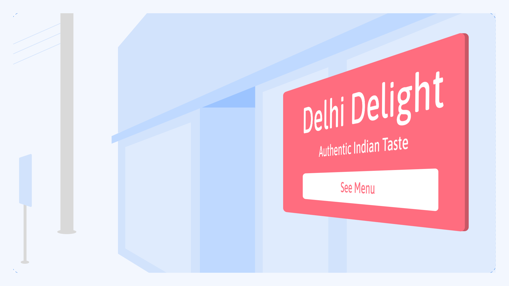
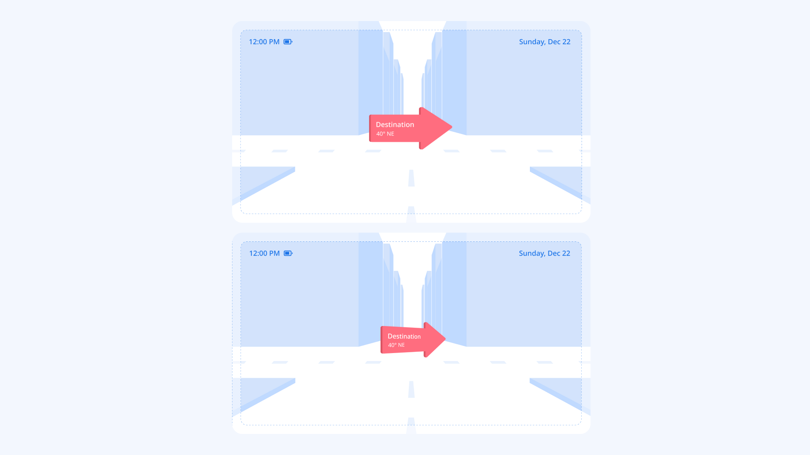

Let’s group some of the concepts we’ve discussed in previous articles from [this module](/module/using_type_in_ar_and_vr) into spatial classifications. This can help with considerations for choosing [typefaces](/glossary/typeface), [setting text](/glossary/typesetting), and even designing typefaces for different applications. This classification may also help with picking the most appropriate rendering methods (see [“Designing for AR/VR”](/lesson/designing_for_ar_vr)) for displaying text in AR/VR experiences.

For example, [text](/glossary/text_copy) belonging to the “Text in HUD” category remains fixed in size, so the standard textures of each size can be used without a loss in resolution as people move closer to the text. On the other hand, text in the “Sticky info text” category requires a higher resolution, since people have control over their distance from the text and can move toward or away from it. This classification can also help with exploring the application of [variable fonts](/glossary/variable_fonts) across different cases (again, for more, see [“Designing for AR/VR”](/lesson/designing_for_ar_vr)).

| Type of text: | Position: | Viewing angle: | Text state: | User’s state: | Examples: |
| --- | --- | --- | --- | --- | --- |
| “Text in HUD” | HUD region | Fixed | Stationary, moving | Still, moving | Time, notifications, text updates, music track name |
| “Text for long reading” | UI/interaction region | Fixed, variable | Stationary | Still | Descriptions, articles, long-form reading |
| “Sticky info text” | UI/interaction region | Variable | Stationary | Still | Info over real-world objects |
| “Signage text” | Environment region | Variable | Stationary | Still, moving | Signages, billboards |
| “Responsive text” | UI/interaction region, environment region | Variable | Stationary, moving | Still, moving | Navigation markers, responsive ads |
| “Ticker text” | HUD region, environment region | Fixed, variable | Moving | Still, moving | News, long-running info, ads |

## Text in HUD

In this case, text sticks to the field of the view and moves with head movement.

<figure>

</figure>

## Text for long reading

Text should, ideally, be placed in the UI region for a better reading experience within the range of five meters. This allows people to move text in order to optimize the distance based on their reading preferences.

<figure>

</figure>

## Sticky info text

Text that’s anchored to real-world objects (usually in a close range—up to a few meters away from the subject) has a fixed orientation. It may change position and direction based on how people interact with the real-world object the text is anchored to.

<figure>

</figure>

## Signage text

Similar to the sticky info text, this is anchored to real-world objects, but in this case the user can’t move or change the orientation of the object. The information is anchored to macro-level objects such as geo-location, buildings, and vehicles.

<figure>

</figure>

## Responsive text

This can be placed in both UI and environment regions where the text changes its orientation (perspective) based on peoples’ movements or specific programmed behaviors, as shown below.

<figure>

</figure>

## Ticker text

The term “ticker” comes from news tickers: an element with moving text that’s secondary to the main environment or task the user performs. This is a useful method to attract attention and show more information in a small area, such as notifications in HUD, or showing information in supermarkets.

<figure>

</figure>

Useful links:
- [Future of Typography in Augmented Reality](https://youtu.be/lFO5A8-FzlI?t=1636)
- [Typography Classification in Augmented Reality v1.1](https://niteeshyadav.com/blog/typography-classification-in-augmented-reality-v1-1-8760/)
