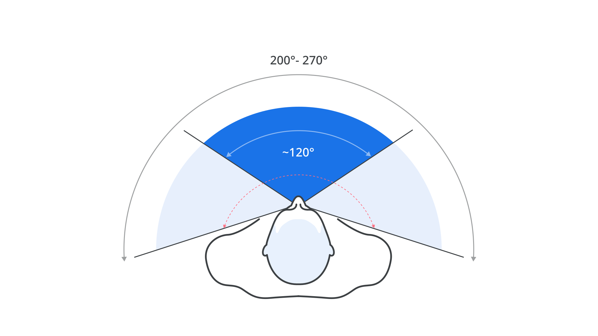
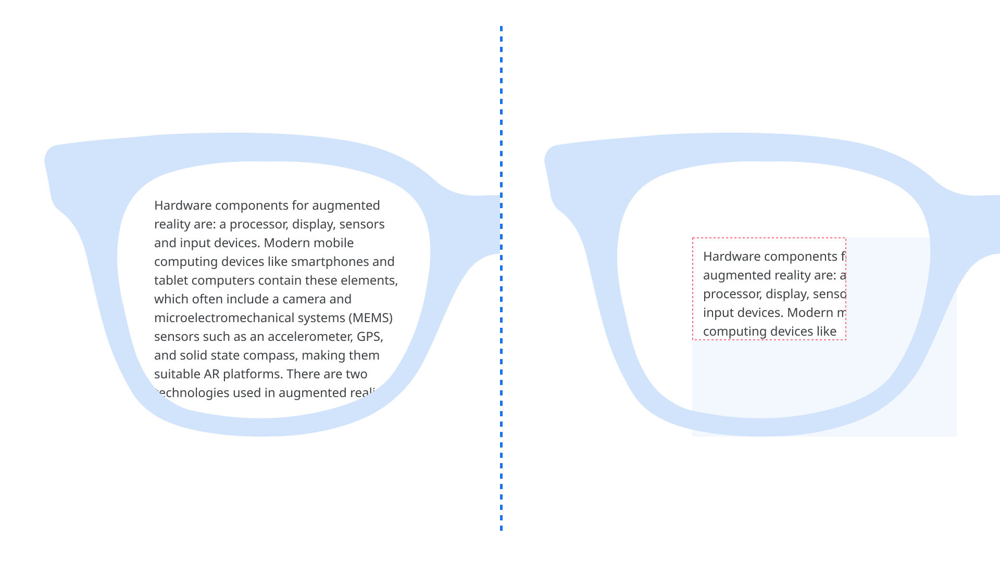
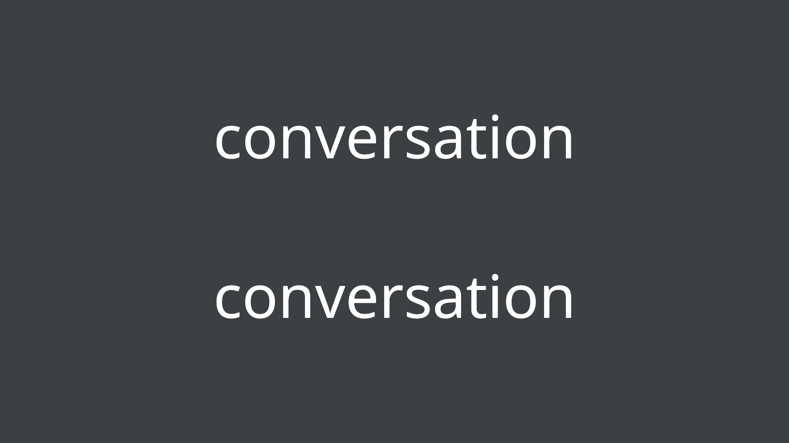
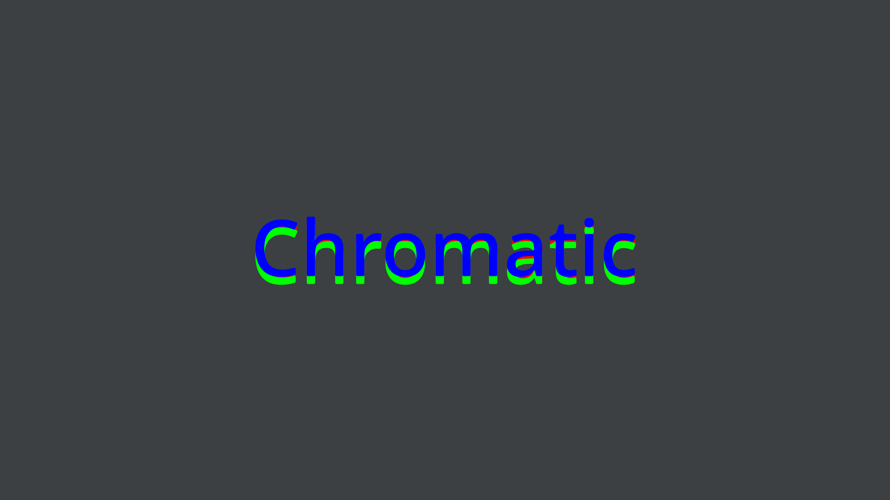
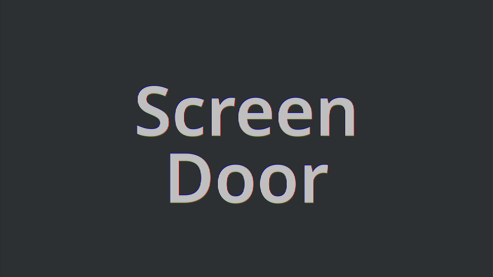

In [“Designing for AR/VR,”](/lesson/designing_for_ar_vr) we explored how the rendering of text in AR/VR applications still follows models from  the ’90s. The challenges for good [typography](/glossary/typography) don’t end there, so let’s discuss some of these further technical considerations. Understanding them can help in designing better experiences for AR/VR; it can also help type designers create typefaces specifically intended for AR/VR.

## Field of view (FoV)

FoV is the range of the observable world at a given point in time, measured in degrees. Humans have a FoV of approximately 120° when looking directly ahead and about 200°–270° with eye rotation. In AR, FoV is further distinguished into “overlay FoV” (FoV of the headset) and “peripheral FoV” (FoV of the human eye). The overlay FoV is where all computer-generated graphics are shown, whereas the peripheral FoV contains the natural, non-augmented section of the observed environment.

<figure>

<figcaption>Human FoV during straight gaze in front, approximately 120° (shown in blue) and extended FoV on head movement in the range of 200–270° (shown in light blue).</figcaption>

</figure>

From a typographic perspective, the FoV limits the width of the paragraphs we can display in order to provide a better experience.

At the time of writing, current AR/VR headsets have FoVs between 40° and 100°, which is relatively low compared to the human eye. This means objects closer to the eye appear cropped (see the image below). To see the full object, they either have to step back, or move their head around. Therefore, a wider FoV is preferred for better immersion.

<figure>

<figcaption>A comparison between the real FoV of human eyes on the left vs. the FoV present in AR/VR devices.</figcaption>

</figure>

## Brightness and contrast

It’s hard to produce sufficient brightness to achieve good contrast in see-through displays, especially outdoors where the ambient light is strong. Since OSTs ([optical see-through headsets](https://niteeshyadav.com/blog/understanding-display-techniques-in-augmented-reality-7485/)) allow the users to see the world directly, maximum brightness is required to compete with the brightness of the real world, and make the virtual objects blend in or stand out in the scene. The contrast levels directly affect the text and its readability.

## Resolution

The resolution of a display affects the level of details perceived by the human eye more than anything else. In AR/VR devices, the useful metric for resolution is pixels per degree (PPD). This is the number of pixels within 1° of vision in front of the eye. We can calculate the PPD by dividing the number of pixels in the horizontal display line by the horizontal FoV that’s provided by the optics of the display lens. In a display with 1280x800px, there are 640x800  pixels per eye; with a FoV of 90°, the PPD comes out at 7.1 (640/90). This is far too low compared to the resolution of the human eye, which is approximately 60 PPD.

Lower pixel density can cause blurring of text, pixelation, and the screen door effect: the visible fine lines between pixels on a display when seen up close (discussed below). A higher PPD results in sharper and more realistic images. But note that a higher pixel density in the display is not necessarily sufficient, because the pixels on the screen are magnified through lenses in the headset. Devices may have varying optics, which results in different pixel magnification—and that means different pixel densities presented to the eye.

## Refresh Rate

Another related component is refresh rate: the number of times per second a display grabs a new image from the GPU (graphics processing unit) and shows it to the viewer. The refresh rate influences how the display renders motion and is critical for text rendering in a scene where the text is not stationary. A higher refresh rate produces better text.

## Halation

Halation, also known as irradiation, is the spreading of light beyond its proper boundaries to form a fog around the edges of a rendered text. The excessive glow around the letters sometimes fills up small negative spaces in the text, resulting in [legibility](/glossary/legibility) issues. It also causes rounding at the corners of the text, which distorts the actual shape of the letterforms.

<figure>

<figcaption>A simulated example of halation (bottom) as compared to regular text (top).</figcaption>

</figure>

## Chromatic aberration

Chromatic aberration is caused by lens dispersion, with different colors of light traveling at different speeds while passing through a lens. As a result, the image can look blurred, or noticeable colored edges (red, green, blue, yellow, purple, magenta) can appear around objects, especially in high-contrast situations.

<figure>

<figcaption>A simulated example of chromatic aberration on text.</figcaption>

</figure>

When chromatic aberration occurs in VR, a viewer faces two issues: On one hand, the simple presence of this optical distortion can break the suspension of disbelief, as it serves as a constant reminder of the artificial nature of the virtual environment. On the other hand, it can lead to discomfort and headaches that hinder longer VR sessions.

## Screen door effect

This refers to the visible fine lines between pixels on a display, as if the user is looking through a screen door.

<figure>

<figcaption>A simulated example of the screen door effect on text.</figcaption>

</figure>

The display in headsets is made up of pixels that light up to render the text that we see. In between every pixel, there’s space that doesn’t light up and remains black—and it’s this space that produces the black mesh appearance in headsets, which in turn creates the screen door effect. It occurs not because of individual pixel size or density, but because of how large the spaces between the pixels are.

The term screen door effect was not coined with the advent of virtual reality. It was, and still is, a common issue with LCD and DLP projectors.

Useful links:
- [Factors influencing the reading experience in augmented reality](https://niteeshyadav.com/blog/factors-that-influence-the-reading-experience-in-ar-8677/)
- [Understand display techniques in augmented reality](https://niteeshyadav.com/blog/understanding-display-techniques-in-augmented-reality-7485/)
- [Why We Need New Typefaces for Augmented Reality](https://www.youtube.com/watch?v=WTFjjyV1mnk&t=2084s)
