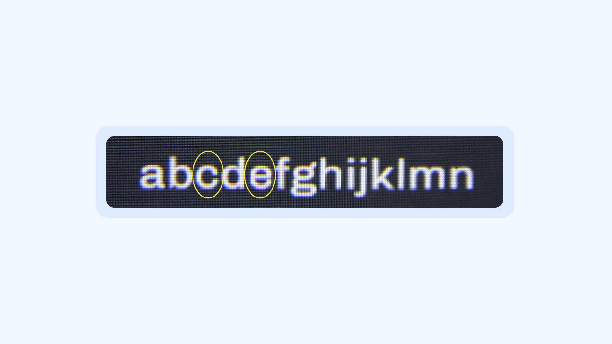
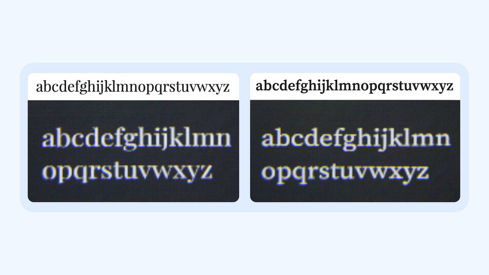
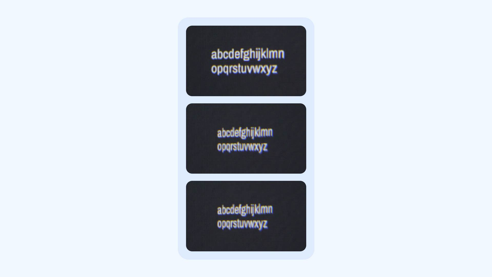
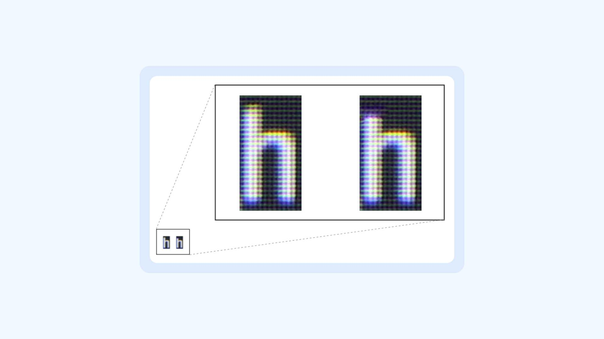
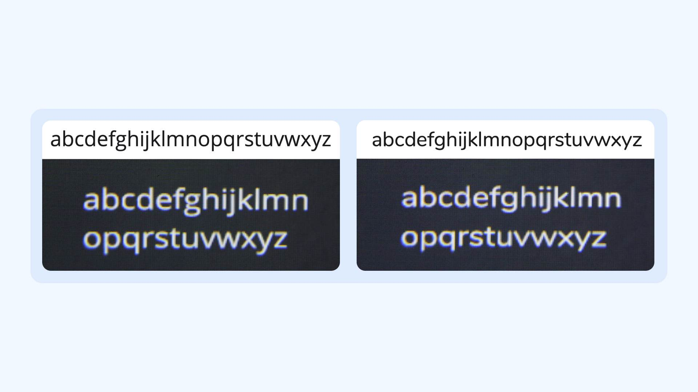

So far in [this series](/module/using_type_in_ar_and_vr), we’ve discussed various aspects of [typography](/glossary/typography) in AR/VR. Now let’s focus on considerations to keep in mind when selecting [Latin](/glossary/latin) [typefaces](/glossary/typeface) and [setting type](/glossary/typesetting) in AR/VR applications. This information can also feed into the design of new typefaces that are better suited for AR/VR.

## Counters

[Counters](/glossary/counter) are the enclosed or partially enclosed circular or curved negative spaces (white space) in [characters](/glossary/character) such as “c,” “d,” and “o.”
Apertures are the partially enclosed, somewhat rounded negative spaces in some characters such as “n,” “C,” “S,” the lower part of “e,” or the upper part of a double-storey “a;” essentially, the opening of the counter space.

<figure>

<figcaption>Small apertures appear as closed counters due to the rendering and glow/chromatic aberration resulting in misrecognition in shapes like “c” and “e.” Chivo regular 72 pt (in AR scene), magnified view.</figcaption>

</figure>

The counters in letters have a crucial role in the performance of text viewed at a distance. Typefaces with small counters and closed apertures perform low in [legibility](/glossary/legibility) tests, and in smaller sizes can appear unreadable.

- The phenomenon of irradiation and chromatic aberration around the outlines of the letters fills up the counters and small apertures, which can make letters like “c” and “e” appear as “o” (see image).
- Many typefaces popular in screen and print, such as Helvetica and Univers, can be difficult to read from a distance because of their small counters and closed apertures.
- A large [x-height](/glossary/x_height) has a direct impact on counter size, but wider letter shapes are a better way to control the counter size. It reduces perspective distortion and makes it easy to read text at different angles.

## Font weight

Font [weight](/glossary/weight) plays a crucial role when designing for devices with varying resolutions. Here, low-resolution headsets pose the greatest challenge, since letterforms tend to get distorted a lot. This happens because there are not enough pixels to reproduce essential details.

- Avoid thin and light weights, as they’re harder to render.
- Lighter weights are prone to flicker and vibrations. Slight head movements can amplify the flickering, making it hard for the user to read the text.
- In outdoor environments, lighter weights tend to blend with the surroundings, reducing legibility.
- Light type also suffers from rendering issues. [Overshoots](/glossary/overshoot) and other important details can be lost, especially in low-resolution screens and smaller sizes.
- In AR, the legibility of text depends on its ability to stand out against the background. Regular, medium, semibold, and bold weights are a better choice. However, this needs to be tested as these weights differ across typefaces.
- As you move to bolder weights, the counters and apertures start closing and reducing in size, which impacts legibility. For example, the reduction of the aperture in a “c” can make it appear like an “o.” So, there needs to be a balance between the weight of the strokes and the clarity of spaces within letters.
- Ultrabold and black weights should be avoided unless they’re used in bigger sizes or have been thoroughly tested.

## Stroke Contrast

High [contrast](/glossary/contrast) typefaces have [strokes](/glossary/stroke) that change in thickness significantly within a letter. (See the image on the left below). Low contrast typefaces usually appear to have strokes of a similar thickness throughout. However, this is not absolute; all letter shapes are optically corrected to appear the same size (see the image on the right below).

<figure>

<figcaption>Left: Playfair Display Regular at 72 pt seen through an AR headset, showing the loss in details in the thin strokes. On top is the actual design of Playfair Display Regular at 30 pt for comparison. Right: Source Serif Pro at 72 pt in AR, demonstrating the change of appearance of serifs from wedge serif to slab serif. On top is the actual design of Source Serif Pro Regular at 30 pt for comparison.</figcaption>

</figure>

The higher the contrast, the more pixels are required to render details properly. This in turn requires either the text to be larger in size, or the resolution of the headset to be higher.
Low-to-moderate contrast typefaces are ideal for a wide range of headsets. A common myth is that serif typefaces are not ideal for AR/VR. This isn’t true; only high-contrast serif typefaces suffer from legibility and distortion issues.

## Width

In AR, unlike conventional screens, the text is not always positioned squarely in front of the user. Text can be integrated in the environment around the user to make it more immersive, but this introduces the issue of perspective distortion.

Viewing text at an angle sometimes merges the adjacent strokes and affects the visibility of counters in [narrow](/glossary/condensed_narrow_compressed) typefaces, making it very hard to distinguish individual letters. Traffic signs present a similar example of information parsed at an acute angle. However, AR presents a more complicated challenge, since the text can be sentences or paragraphs instead of a few words or symbols.

<figure>

<figcaption>Archivo Narrow at 72pt (in AR scene), magnified view. (Top) 0°, straight in front of the viewer, (middle) 30°, in front of the viewer, (bottom) 50° in front of the viewer. The increased angle causes letters to merge into each other, and counter spaces become smaller.</figcaption>

</figure>

- Typefaces with wider letter shapes perform well in terms of legibility, as most of the text in AR/VR is placed at a distance, unlike conventional mediums.
- In condensed typefaces, letters become too narrow when viewed at an angle. This brings vertical strokes together and causes legibility issues. However, this can be offset by ample letter spacing. Serif typefaces—and well-designed sans serif typefaces—tend to have vertical strokes that are further apart. This aids legibility, especially when seen from an angle.
- Condensed typefaces perform poorly in distance viewing, too.
- Wider typefaces perform better in a variety of use cases. But, they occupy more space, and therefore fit a smaller number of characters per line.

## X-height

The x-height is the height of the lowercase letters (disregarding ascenders or descenders), typically exemplified by the letter “x”. The relationship of the x-height to the nominal body of the typeface defines the perceived type size. A typeface with a large x-height looks much bigger than a typeface with a small x-height at the same size. Learn more in our lesson, [“Exploring x-height & the em square.”](/lesson/exploring_x_height_the_em_square)

Typefaces with large x-heights render well in busy backgrounds because their larger counters aid legibility. Characters with three horizontal strokes, such as “a,” “e,” and “s” benefit from a higher x-height.

Although typefaces with large x-heights are more legible when viewed at a distance, an excessive x-height can lead to the misrecognition of letters. The x-height should be optimized to get the right balance between [ascenders](/glossary/ascenders_descenders) and the area of counters, keeping in mind the deterioration caused by rounding and irradiation.

- The impact of x-height diminishes with narrow character widths. Therefore, these two factors should be considered in tandem.
- In the case of letters with two horizontal strokes (o,z,b,d,p,q), a large x-height has less impact on the legibility.
- The use of a large x-height in some cases might lead to misrecognition of letters, if the x-height is too close to the ascender height (see image), which usually gets suppressed by rounding at the edges because of irradiation—thereby decreasing the legibility.
- Ascenders play a bigger role in letter recognition as compared to descenders.

<figure>

<figcaption>A lowercase “h” with a large x-height (left) sometimes loses its details after deterioration in AR and appears more like “n” on the right (magnified view).</figcaption>

</figure>

## Joints/Intersections

The thinning of strokes at joints is a standard practice in type design, to visually compensate for heavy spots at stroke junctions. In AR/VR headsets, the excessive glow of pixels (halation) distorts the shape of the letterforms, and this hampers legibility. Monolinear typefaces with very low stroke modulation suffer from distortion and excess glow at the joints.

While selecting the typefaces, be sure to perform thorough tests on the headsets paying particular attention to the joints of strokes.

- Check if the strokes become thinner at the joints (observe with bare eyes).
- See if they appear heavy at the junctions (on headsets).
- Observe the change in the shape of the letters (on headsets).
- Look for typefaces that compensate for heaviness in joints via stroke modulation or ink traps (or, AR/VR, light traps, since the text is rendered by light instead of ink.)

## Stroke Endings

Halation and chromatic aberration in AR/VR headsets spreads the light in all directions, causing the boundaries of the letters to disappear and give an impression of rounded edges. In some cases, the size of the letters is also affected, as rounded edges reduce the size perceived by the user.

This rounding effect significantly impacts legibility, readability, and aesthetic issues at a typographic level.

Typefaces with sturdy stroke endings tend to perform better over those with less well-defined stroke endings. Slab serifs perform well on low-resolution screens. Alternatively, rounded typefaces can also produce acceptable results.

- Sans-serif typefaces are affected the most by rounding due to the absence of a serif that reinforces the stroke endings.
- Characters such as “l” appear to float above the [baseline](/glossary/baseline), affecting the [rhythm](/glossary/rhythm), especially next to curved letters (such as “c,” “s,” and “o”). This is because halation weakens the tip of the stroke resting on the baseline, while round letters have more pixels near the baseline, and position them to lower with an overshoot. Such issues can be resolved by using typefaces that have slightly flared stroke endings.
- The shapes of terminals are also distorted and can appear to be smaller than the actual design because of the apparent rounding of shapes. For similar characters, such as “f” and “t,” or “i” and “j,” the rounding of distinguishing features creates confusion. This means that typefaces need to have details that allow such letters to be clearly distinguished when rendered in the headset.

<figure>

<figcaption>The images above show two typefaces, Open Sans (left) and Nunito (right), which have straight and round endings respectively, but render similarly in AR. Both Open Sans and Nunito Regular have 72 pt size in AR and 30pt in the reference string at the top.</figcaption>

</figure>

## Letter spacing

Compared to other mediums, [spacing](/glossary/tracking_letter_spacing) in AR/VR plays a critical role for legibility and readability. Tightly spaced letters cause significant legibility issues, as they crowd and interfere with each other, making it hard to recognise individual letters. Therefore, it becomes necessary to have generous spacing between letters to compensate for the merging of strokes in perspective view. The ideal spacing must take into consideration the perceived width of individual strokes and whole letterforms due to irradiation and chromatic aberration.

The spacing in AR/VR should balance internal and external spaces without compromising the reading speed. Therefore the weight and width of the typeface needs to be considered in combination with the optimal letter spacing for each text environment.
